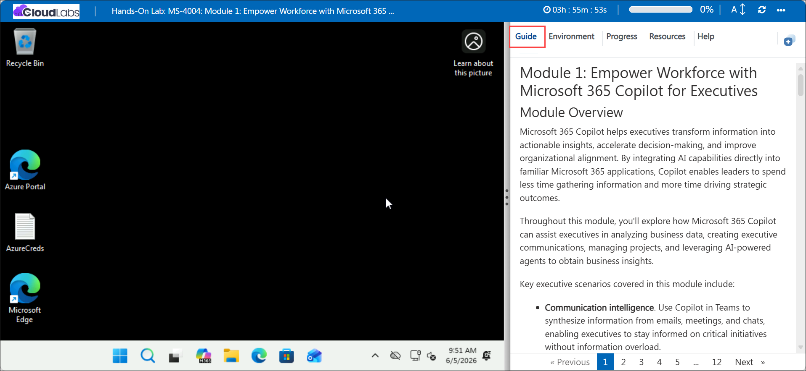
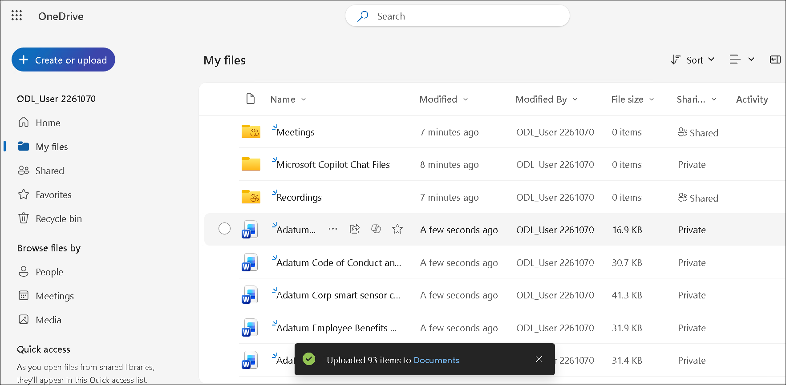

# Module 1: Empower Workforce with Microsoft 365 Copilot for Executives

## Lab Overview

Microsoft 365 Copilot helps executives transform information into actionable insights, accelerate decision-making, and improve organizational alignment. By integrating AI capabilities directly into familiar Microsoft 365 applications, Copilot enables leaders to spend less time gathering information and more time driving strategic outcomes.

Throughout this module, you'll explore how Microsoft 365 Copilot can assist executives in analyzing business data, creating executive communications, managing projects, and leveraging AI-powered agents to obtain business insights.

Key executive scenarios covered in this module include:

- **Communication intelligence**. Use Copilot in Teams to synthesize information from emails, meetings, and chats, enabling executives to stay informed on critical initiatives without information overload.

- **Strategic reporting**. Use Copilot in Word to transform business data into executive-ready reports, summaries, and recommendations.

- **Financial analysis and forecasting**. Use Copilot in Excel to analyze budget forecasts, identify trends, evaluate risks, and generate what-if scenarios.

- **Project planning and oversight**. Use Copilot in Planner to build and manage strategic project plans while maintaining visibility into milestones, dependencies, and progress.

- **Business insights agents**. Create and configure custom Copilot agents that provide on-demand intelligence using organizational knowledge sources.

## Copilot Prompting

One of the primary keys to effectively using Copilot is the quality of your prompts. A well-structured prompt contains four key elements:

- **Goal**. Clearly state what you want Copilot to accomplish.

  Example:

  **Generate a concise executive summary of project status updates.**

- **Context**. Provide background information so Copilot understands the business scenario.

  Example:

  **Prepare the summary for a leadership review meeting regarding Project Nexus.**

- **Sources**. Specify where Copilot should gather information.

  Example:

  **Use emails, Teams chats, and meeting notes from the past 30 days.**

- **Expectations**. Describe the desired format, tone, and level of detail.

  Example:

  **Present the results as an executive briefing with key decisions, risks, milestones, and action items.**

Using these four elements consistently helps produce clear, relevant, and actionable responses.

## Getting Started with the lab

We've prepared a seamless environment for you to explore and learn about **Module 1: Empower Workforce with Microsoft 365 Copilot for Executives**. Let's begin by making the most of this experience!

## Accessing Your Lab Environment
 
Once the lab environment is ready, the virtual machine displayed on the left will be your primary workspace for completing the exercises, while the **Guide** on the right side provides step-by-step instructions for each task.



## Exploring Your Lab Resources
 
To get a better understanding of your lab resources and credentials, navigate to the **Environment** tab.
 


## Utilizing the Split Window Feature
 
For convenience, you can open the lab guide in a separate window by selecting the **Split Window** button from the Top right corner.


## Managing Your Virtual Machine
 
Feel free to **Start, Stop, or Restart (2)** your virtual machine as needed from the **Resources (1)** tab. Your experience is in your hands!


## Lab Setup

In this module, we'll create prompts for Microsoft 365 Copilot that reference files. First, let’s upload all required files to OneDrive to ensure they're accessible throughout the lab.

### Uploading Files to OneDrive

Follow the steps below to upload all files needed to **OneDrive**:

1. In the LabVM, open the **Microsoft Edge** browser from the from Desktop.

    

1. In the address bar, enter the following URL to navigate to Microsoft 365:

    ```
    https://www.microsoft365.com
    ```
1. Enter the following credentials to sign in to Microsoft 365:

    - **Email/Username**: **<inject key="AzureAdUserEmail"></inject>**

    - **Password**: **<inject key="AzureAdUserPassword"></inject>**

1. If prompted to **Stay signed in**, select **Don't show this again** and then **Yes**.

1. In the Microsoft 365 portal, click on the **App launcher  (1)** button and select **OneDrive (2)**.

    

1. In **OneDrive**, in the top-left corner, select **+ Create or upload (1)** > **Files upload (2)**.

    

1. In **File Explorer**, navigate to **`C:\AllFiles` (1)** location and select all the files **(2)** from the folder and click **Open (3)**.

    

1. When the upload is complete, you should see **Uploaded 93 items to My files** in the bottom center of the screen.

    

1. Leave **Edge** open and move on to the next task.

## Referencing Files in Copilot

When using Copilot, you may find that some files aren’t immediately available in the suggestions. This occurs because certain Copilot experiences only reference files from the **Most Recently Used (MRU)** list, while others let you browse **OneDrive** directly. To ensure a file appears in the **MRU** list, simply open it in the relevant Microsoft 365 app, and it will be added automatically.

> **`Important:`** Microsoft 365 Copilot can only work with files saved to **OneDrive**. Files stored locally on your PC will need to be moved to **OneDrive** for Copilot to access them.

## Support Contact
 
The **CloudLabs support** team is available 24/7, 365 days a year, via email and live chat to ensure seamless assistance at any time. We offer dedicated support channels tailored specifically for both learners and instructors, ensuring that all your needs are promptly and efficiently addressed.
 
Learner Support Contacts:
 
- Email Support: [cloudlabs-support@spektrasystems.com](mailto:cloudlabs-support@spektrasystems.com)
- Live Chat Support: https://cloudlabs.ai/labs-support
 
Click **Next** from the bottom right corner to embark on your Lab journey!

  

