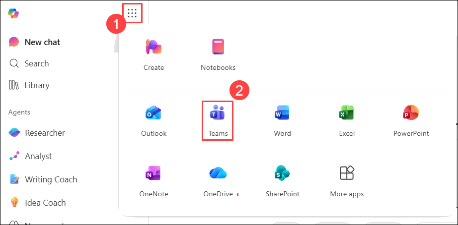
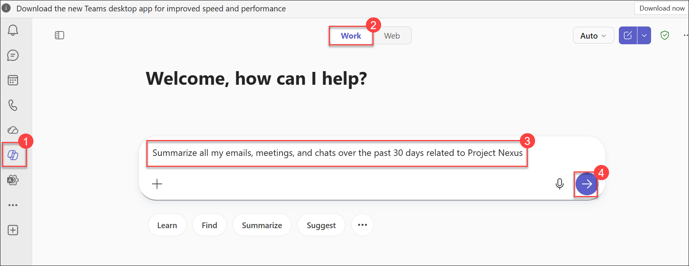
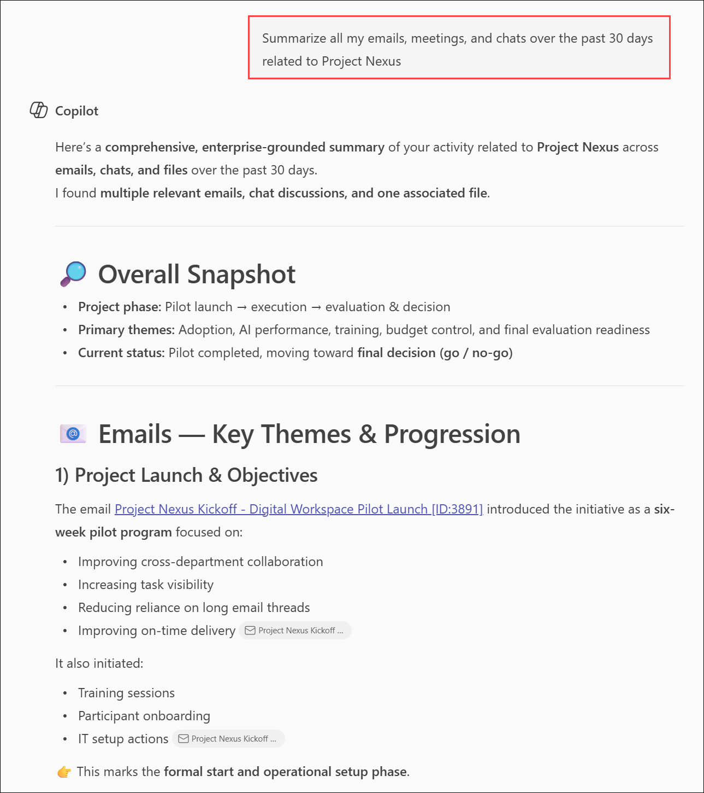
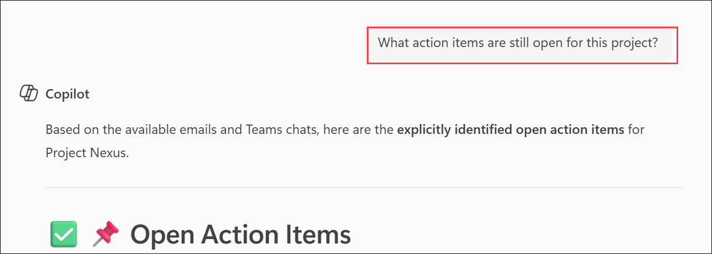

# Exercise 1: Synthesize communication insights across Microsoft Team

## Scenario

You are managing a significant project and need a comprehensive understanding of all communications related to that initiative over the last 30 days. Rather than manually reviewing emails, meeting notes, and chat conversations, you will use Microsoft 365 Copilot Chat in Teams to gather, summarize, and analyze the information. You will then use Copilot to identify action items and draft a stakeholder announcement based on the project's recent activity.

## Lab Overview

In this hands-on lab, you will use Microsoft 365 Copilot Chat within Microsoft Teams to analyze and synthesize project-related communications across your Microsoft 365 environment. You will learn how Copilot can aggregate information from emails, meetings, and chats to provide concise summaries, identify action items, and generate stakeholder communications. This exercise demonstrates how executives and business leaders can leverage Copilot to reduce information overload, improve situational awareness, and accelerate decision-making through AI-powered insights.

## Task 1: Generate a Project Communication Summary

In this task, you will use Microsoft 365 Copilot Chat in Teams to summarize communications related to a project or topic of your choice.

1. Open **Microsoft Edge** and navigate to **https://www.microsoft365.com**.

2. Sign in using your Microsoft 365 credentials.

    - **Email/Username**: **<inject key="AzureAdUserEmail"></inject>**

    - **Password**: **<inject key="AzureAdUserPassword"></inject>**

3. In the left navigation pane, select **App launcher**.

4. From the **App launcher (1)** menu, select **Teams (2)**.

   

5. In **Teams for the web**, select **Copilot (1)** from the left navigation pane and switch it to **Work (2)**.

   

   > **Note:** Selecting Copilot opens the Microsoft 365 Copilot Chat experience within Teams.

6. In the **Copilot Chat** prompt box, enter the following prompt:

   ```text
   Summarize all my emails, meetings, and chats over the past 30 days related to Project Nexus
   ```
  >**Note:** For this lab, a sample project named Project Nexus has been preconfigured with related Teams conversations and group chat discussions. Use Project Nexus as the topic when submitting prompts throughout this exercise to ensure Copilot can retrieve and summarize the available project communications.

7. Submit the prompt and review the generated summary.

    

8. Examine the summary and identify information such as:

   - Key decisions made
   - Progress updates and milestones
   - Outstanding challenges and risks
   - Emerging trends and opportunities

9. Observe the suggested follow-up prompts that appear above the Copilot prompt box.

### Expected Outcome

Copilot generates a consolidated summary of communications related to the selected topic by analyzing relevant emails, meetings, and chat conversations from the past 30 days.

## Task 2: Identify Open Action Items

In this task, you will use Copilot Chat to identify pending tasks and responsibilities associated with the selected project.

1. Review the suggested prompts displayed by Copilot after the initial summary.

2. If a suggested prompt related to action items appears, select it.

   **Example:**

   ```text
   What action items are still open for this project?
   ```
   
   
3. If no suitable suggestion is available, enter a prompt similar to the following:

   ```text
   List all open action items related to Project Nexus
   ```

4. Submit the prompt.

5. Review the response and identify:

   - Pending deliverables
   - Assigned owners
   - Upcoming deadlines
   - Outstanding follow-up activities

6. Observe how Copilot updates its suggested prompts based on the latest response.

### Expected Outcome

Copilot identifies open action items and provides additional context that helps track project progress and accountability.

## Task 3: Draft a Stakeholder Announcement

In this task, you will use Copilot Chat to create a project status announcement based on the communications and insights gathered.

1. In the Copilot Chat window, enter a prompt similar to the following:

   ```text
   Draft an announcement to stakeholders summarizing the recent activity and progress related to Project Nexus
   ```  
2. Submit the prompt.

3. Review the generated announcement.

4. Verify that the announcement includes:

   - Project achievements and milestones
   - Important updates
   - Current priorities
   - Upcoming activities or deadlines

5. Make any necessary edits to align the announcement with your organization's communication standards.

### Expected Outcome

Copilot generates a professional stakeholder announcement based on the project's recent communications and activities without requiring you to switch to another Microsoft 365 application.

## Knowledge Check

After completing this exercise, consider the following questions:

- How did Copilot reduce the effort required to gather information from multiple communication sources?
- What types of action items was Copilot able to identify?
- How did the suggested follow-up prompts evolve as the conversation progressed?
- How could this capability help executives and project managers make more informed decisions?

## Summary

In this exercise, you used Microsoft 365 Copilot Chat in Teams to synthesize communications related to Project Nexus from emails, meetings, and chat conversations. You generated a project summary, identified open action items and project risks, and created a stakeholder announcement highlighting key updates and milestones. The exercise demonstrated how Copilot can help project managers and business leaders quickly access important information, improve collaboration, and make informed decisions without manually reviewing multiple communication sources.

## You have successfully completed the module. Click on Next >> to proceed with the next exercise.

