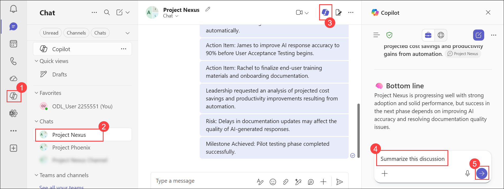

# Exercise 1: Synthesize communication insights across Microsoft Team

## Scenario

As an executive, you need to stay informed about ongoing project discussions without spending time reviewing every message. The **Project Nexus** group chat contains several days of project-related conversations. Using Copilot in Teams, you will generate summaries, identify key decisions and open items, and locate specific messages through Copilot's built-in citations.

## Lab Overview

In this hands-on lab, you will use Microsoft 365 Copilot in Teams to analyze project-related chat conversations and quickly extract meaningful insights. You will generate summaries, identify decisions, action items, risks, and milestones, and use citations to trace information back to the original messages. This approach enables leaders and stakeholders to stay informed about project progress without manually reviewing lengthy chat histories.


## Task 4: Use Copilot in a Teams Chat Session to Summarize a Project Discussion

In this task, you will use Microsoft 365 Copilot within a Teams chat conversation to quickly understand project discussions and identify key information without manually reviewing lengthy chat histories. You will use Copilot's built-in starter prompts to summarize discussions, identify decisions and action items, and analyze contributions from specific participants. You will also explore Copilot's citation capabilities, which allow you to navigate directly to the source messages within the chat.

1. In **Teams for the web**, select **Chat (1)** from the left navigation pane.

2. Open the **Project Nexus (2)** group chat.

   > **Note:** A sample **Project Nexus** group chat containing project-related discussions has been preconfigured for this lab.

3. Select the **Copilot (3)** icon in the upper-right corner of the chat window.

4. In the **Copilot** pane, review the starter prompts displayed by Copilot.

   Examples may include:

   - **Summarize this discussion**
   - **What are open items?**
   - **What decisions were made?**

5. Select **See more** to view additional starter prompts.

6. Enter the below prompt and submit a starter prompt that interests you, such as:

   ```text
   Summarize this discussion
   ```
   
   
7. Review the response generated by Copilot.

    

8. Notice that Copilot includes citation references for key statements and highlights.

9. Select one of the citation references.

10. Observe how Teams automatically navigates to the corresponding message within the chat conversation.

11. Repeat the previous step for several citations to explore how Copilot traces information back to its original source.

### Expected Outcome

Copilot generates a summary of the selected discussion and provides citations that enable you to quickly navigate to the source messages within the chat.

## Task 4.1 Explore Specific Project Information

1. In the Copilot pane, enter a follow-up prompt that requests more details about the project.

   Examples:

   ```text
   What are the key milestones mentioned in this project?
   ```

   ```text
   What risks or challenges were identified for Project Nexus?
   ```

   ```text
   What action items are associated with Project Nexus?
   ```

2. Submit the prompt.

3. Review the response generated by Copilot.

4. Notice that Copilot includes citation references for the information it summarizes.

5. Select one of the citation references.

6. Observe how Teams navigates directly to the source message containing the referenced information.

7. Review additional citations to understand how Copilot traces project details back to the original messages.

### Expected Outcome

Copilot provides deeper insights into the Project Nexus chat, such as milestones, risks, decisions, and action items, while enabling you to quickly access the original source messages through citations.

## Knowledge Check

After completing this task, consider the following questions:

- How did Copilot help you understand lengthy chat discussions more efficiently?
- What benefits do citation links provide when reviewing summaries?
- How can participant-specific prompts help leaders understand stakeholder contributions?
- In what situations would chat summarization be most valuable?

## Summary

In this task, you used Microsoft 365 Copilot in Teams to analyze and summarize discussions within the Project Nexus group chat. You generated conversation summaries, identified key decisions, milestones, risks, and action items, and explored project details using follow-up prompts. You also used Copilot citations to navigate directly to the original chat messages, enabling quick verification of information and helping stakeholders stay informed without manually reviewing lengthy chat conversations.

