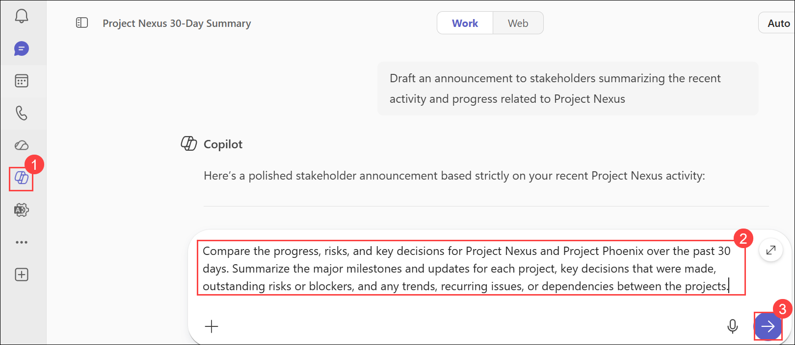

# Exercise 1: Synthesize communication insights across Microsoft Team

## Task 5: Use Copilot Chat in Teams to Collect Cross-Project Insights

In this task, you will use Microsoft 365 Copilot Chat in Teams to compare information across multiple projects. Copilot can analyze communications from different chats, summarize progress, identify risks and dependencies, and help executives prepare for leadership reviews and cross-team coordination activities.

You will compare information from the **Project Nexus** and **Project Phoenix** group chats to identify project status, milestones, blockers, and trends.

### Scenario

As an executive, you are responsible for overseeing multiple strategic initiatives. Rather than manually reviewing each project's communications, you want Copilot to analyze information from both projects and provide a consolidated view of progress, risks, decisions, and dependencies.

For this exercise, you will use the preconfigured **Project Nexus** and **Project Phoenix** group chats.

## Task 5.1: Compare Multiple Projects

### Steps

1. In **Teams for the web**, select **Copilot** from the navigation pane to open **Copilot Chat**.

2. In the prompt box, enter the following prompt:

   ```text
   Compare the progress, risks, and key decisions for Project Nexus and Project Phoenix over the past 30 days. Summarize the major milestones and updates for each project, key decisions that were made, outstanding risks or blockers, and any trends, recurring issues, or dependencies between the projects.
   ```
   
   
3. Submit the prompt.

4. Review the response generated by Copilot.

5. Identify information such as:

   - Major milestones achieved
   - Key decisions made
   - Outstanding risks and blockers
   - Action items
   - Common themes across projects

6. Review the follow-up prompts suggested by Copilot.

7. Select a suggested prompt or enter your own follow-up prompt to investigate a specific area.

### Suggested Follow-Up Prompts

```text
Which project currently has the highest risk?
```

```text
What action items remain open across both projects?
```

```text
What dependencies could affect the success of both projects?
```

```text
Summarize the key achievements across Project Nexus and Project Phoenix.
```

### Expected Outcome

Copilot generates a consolidated comparison of Project Nexus and Project Phoenix, highlighting project progress, milestones, decisions, risks, and dependencies.

## Task 5.2: Generate a Side-by-Side Comparison Table

### Steps

1. In the Copilot Chat window, enter the following prompt:

   ```text
   Create a side-by-side comparison table for Project Nexus and Project Phoenix that includes project status, milestones, key decisions, action items, risks, blockers, and next steps.
   ```

2. Submit the prompt.

3. Review the generated comparison table.

4. Examine how Copilot organizes project information into categories suitable for leadership reviews and status meetings.

### Expected Outcome

Copilot generates a structured comparison table that can be used for executive briefings, project reviews, and cross-team coordination meetings.

## Task 5.3: Draft a Project Status Email

### Steps

1. Select one of the projects for follow-up communication.

2. In the Copilot Chat window, enter one of the following prompts.

   For **Project Nexus**:

   ```text
   Draft an email to the Project Nexus team that summarizes current progress, open action items, unresolved risks, and next steps.
   ```

   For **Project Phoenix**:

   ```text
   Draft an email to the Project Phoenix team that summarizes current progress, open action items, unresolved risks, and next steps.
   ```

3. Submit the prompt.

4. Review the email draft generated by Copilot.

5. Verify that the email includes:

   - Recent project achievements
   - Outstanding action items
   - Known risks and blockers
   - Required next steps

6. You do not need to send the email. Simply review the generated content.

### Expected Outcome

Copilot generates a professional project status email that can be copied into Outlook and shared with the project team.

## Knowledge Check

After completing this task, consider the following questions:

- How did Copilot help identify similarities and differences between projects?
- What recurring risks or blockers appeared across the projects?
- How could the comparison table assist during executive reviews?
- How might Copilot reduce the time required to prepare project status updates?

## Key Takeaways

By completing this task, you learned how to:

- Compare multiple projects using Microsoft 365 Copilot Chat.
- Identify project milestones, risks, blockers, and dependencies.
- Generate executive-ready comparison summaries.
- Create side-by-side project comparison tables.
- Draft project status emails directly from Copilot Chat.
- Use AI-powered insights to support strategic decision-making and cross-team coordination.
