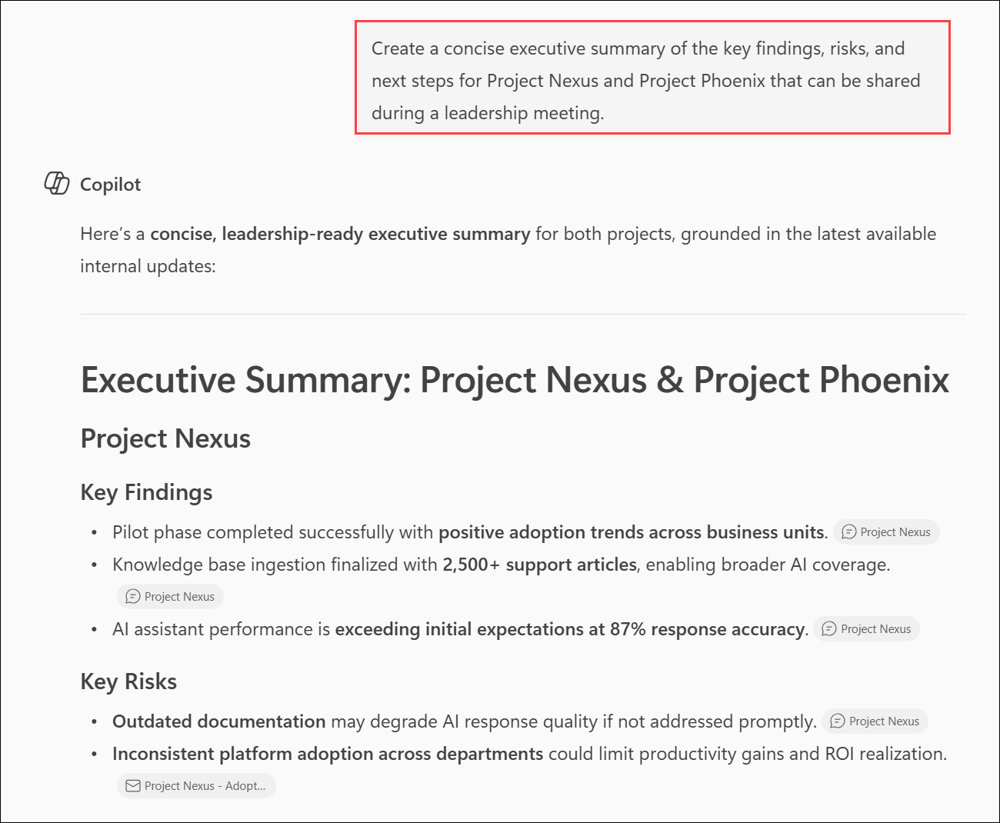
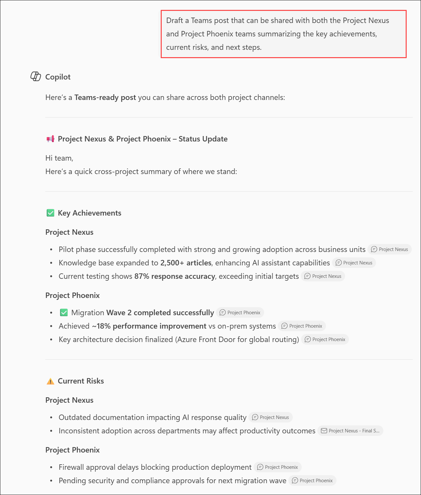

# Exercise 1: Synthesize communication insights across Microsoft Team

## Scenario

As an executive overseeing multiple initiatives, you need to communicate project progress, risks, and priorities to different audiences. Leadership teams typically require concise executive summaries, while project teams benefit from shorter updates focused on key takeaways and next steps.

Using insights gathered from **Project Nexus** and **Project Phoenix**, you will use Copilot to create audience-specific communications.

## Lab Overview

In this hands-on lab, you will use Microsoft 365 Copilot in Teams to transform project information into audience-specific communications. You will generate executive summaries, create presentation-ready content, draft stakeholder announcements, and adapt project insights for different business scenarios. These capabilities help leaders communicate project status, risks, and priorities more effectively while reducing the time required to prepare updates and briefings. 


## Task 6: Use Copilot in Teams to Prepare an Executive Summary

In this task, you will use Microsoft 365 Copilot in Teams to transform project analysis into executive-ready communications. After comparing information across Project Nexus and Project Phoenix, you will ask Copilot to create an executive summary, reformat the content for presentation slides, and generate a Teams post for project stakeholders.

This capability helps leaders quickly convert detailed project insights into communication formats appropriate for different audiences while maintaining consistency in messaging.

## Task 6.1: Generate an Executive Summary

In this task, you will use Copilot Chat to create an executive summary that highlights key findings, risks, recommendations, and next steps for Project Nexus and Project Phoenix.

1. In **Teams for the web**, open **Copilot Chat**.

2. In the prompt box, enter the following prompt:

   ```text
   Create a concise executive summary of the key findings, risks, and next steps for Project Nexus and Project Phoenix that can be shared during a leadership meeting.
   ```

4. Review the response generated by Copilot.

    

5. Verify that the summary includes sections similar to:

   - Overview
   - Key Highlights
   - Risks and Challenges
   - Recommendations
   - Next Steps

6. If the response is not organized into clear sections, enter the following prompt:

   ```text
   Reformat the executive summary using the sections Overview, Highlights, Risks, Recommendations, and Next Steps.
   ```

### Expected Outcome

Copilot generates a concise executive summary that highlights the current state of both projects and provides information suitable for leadership reviews.

## Task 6.2: Create Slide-Ready Content

In this task, you will use Copilot Chat to transform the executive summary into concise, presentation-ready bullet points suitable for leadership briefings.

1. In the Copilot Chat window, enter the following prompt:

   ```text
   Reformat this executive summary into concise bullet points suitable for a presentation slide deck.
   ```

2. Submit the prompt.

3. Review the response.

4. Verify that the content is organized into concise bullet points that can be easily incorporated into presentation slides.

### Expected Outcome

Copilot converts the executive summary into a presentation-friendly format suitable for leadership briefings and project review meetings.

## Task 6.3: Draft a Teams Announcement

In this task, you will use Copilot Chat to create a Teams announcement that communicates project achievements, risks, priorities, and next steps to stakeholders.

1. In the Copilot Chat window, enter the following prompt:

   ```text
   Draft a Teams post that can be shared with both the Project Nexus and Project Phoenix teams summarizing the key achievements, current risks, and next steps.
   ```

2. Submit the prompt.

3. Review the generated Teams post.

    

4. Verify that the post includes:

   - Major accomplishments
   - Current priorities
   - Outstanding risks
   - Upcoming actions

5. Review the tone of the message and note how it differs from the executive summary generated earlier.

### Expected Outcome

Copilot generates a concise Teams post that communicates project updates in a format appropriate for project teams and stakeholders.

## Task 6.4: Explore Additional Content Transformations

In this task, you will use Copilot Chat to adapt project insights into different communication formats such as leadership briefings, executive talking points, and business review updates.

1. Review any suggested prompts displayed by Copilot.

2. Select one of the suggested prompts or enter your own follow-up prompt.

   ### Suggested Follow-Up Prompts

   ```text
   Create a one-page leadership briefing based on these project updates.
   ```

   ```text
   Summarize the top three risks that leadership should monitor.
   ```

   ```text
   Create talking points for an executive review meeting.
   ```

   ```text
   Identify opportunities for collaboration between Project Nexus and Project Phoenix.
   ```

   ```text
   Generate a status update suitable for a quarterly business review.
   ```

3. Review the response and observe how Copilot adapts the same information for different communication scenarios.

### Expected Outcome

Copilot transforms project insights into various communication formats tailored to different audiences and business needs.

## Knowledge Check

After completing this task, consider the following questions:

- How did Copilot adapt the same information for executives and project teams?
- Which communication format would be most useful for leadership meetings?
- How could these generated summaries reduce the time spent preparing status updates?
- What benefits do audience-specific communications provide?


## Summary

In this task, you used Microsoft 365 Copilot in Teams to transform project insights into audience-specific communications. You created executive summaries, presentation-ready content, stakeholder announcements, and other communication formats tailored to different business needs. This exercise demonstrated how Copilot can help leaders efficiently communicate project status, risks, priorities, and recommendations while maintaining consistent messaging across audiences.

## You have successfully completed the module. Click on Next >> to proceed with the next exercise.

