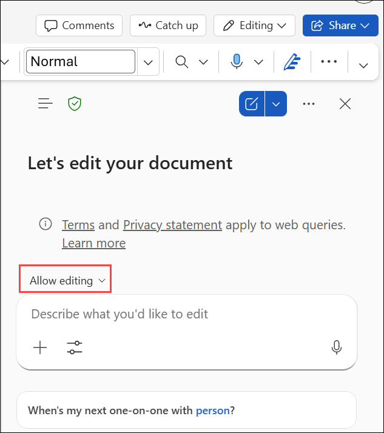
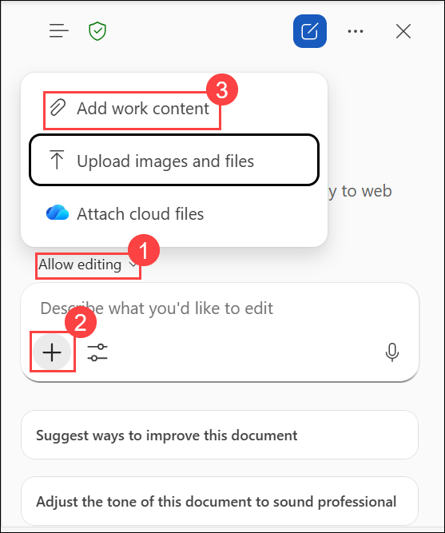
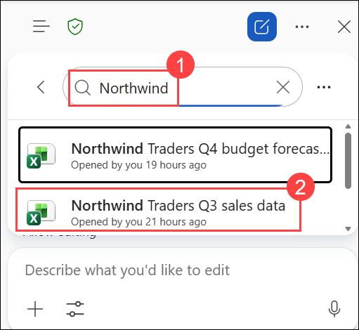
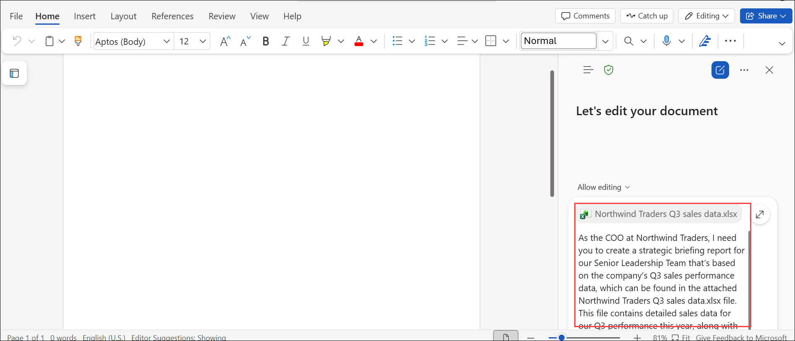
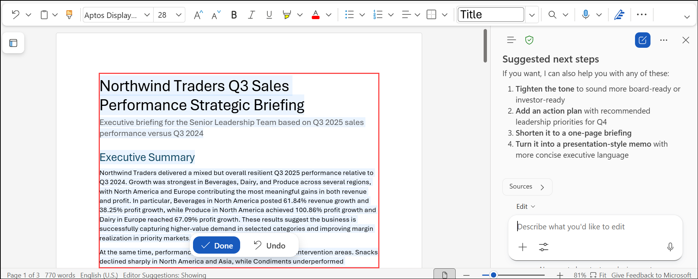
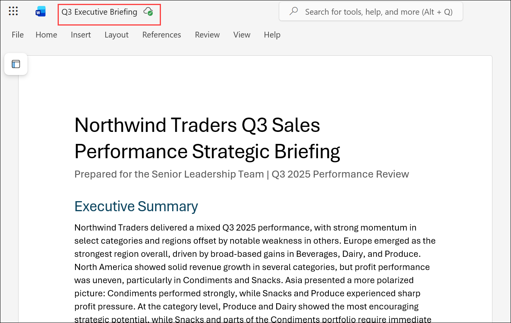

# Exercise 2: Drive business outcomes using Microsoft 365 Copilot

## Scenario

As the Chief Operating Officer (COO) of Northwind Traders, you are responsible for presenting quarterly business performance updates to the Senior Leadership Team. To prepare for an upcoming executive review meeting, you need to create a professional briefing report that summarizes Q3 sales performance, highlights growth opportunities, identifies potential risks, and recommends strategic actions for Q4.

Using Copilot in Word, you will create and enhance an executive briefing report based on the Northwind Traders Q3 sales data workbook.

## Lab Overview

In this hands-on lab, you will use Microsoft 365 Copilot in Word to transform sales data into executive-ready business insights and strategic recommendations. You will create a professional briefing report, analyze revenue and profit trends, generate data visualizations, and prepare leadership discussion materials. These capabilities help business leaders make informed decisions and effectively communicate organizational performance.


## Task 1: Use Copilot in Word to Create an Executive Briefing Report

In this task, you will use Microsoft 365 Copilot in Word to transform sales data into an executive briefing report. Using a sales dataset provided in an Excel workbook, you will ask Copilot to analyze business performance, identify key trends, generate strategic recommendations, create data visualizations, and prepare executive discussion points.

This exercise demonstrates how Copilot can help business leaders quickly convert raw business data into executive-ready content that supports strategic decision-making.

## Task 1.1: Create an Executive Briefing Report

In this task, you will use Copilot in Word to analyze Q3 sales data and generate an executive briefing report that highlights business performance, trends, opportunities, and risks.

1. In Microsoft Edge browser, navigate to the **Microsoft 365** home page, select **App launcher (1)** in the navigation pane, and then select **Word (2)** from the **Apps** menu.

     

3. In **Word for the web**, create a new blank document.

   

3. From the document, select **Copilot** icon located at the bottom-right corner of the screen to open the Copilot pane. 

    
   
5. In the Copilot pane, verify that **Allow editing (1)** is enabled.
   
   > **Note:** If **Allow editing** is enabled, Copilot automatically insert the generated content directly into the document.

6. In the Copilot prompt field, select **+ (2)** and then select **Add work content (3)**.

   
   
7. Search for and attach the following file:

   ```text
   Northwind Traders Q3 sales data.xlsx
   ```

   

   > **Note:** If the file is not displayed in the suggested files list, select Attach cloud files, browse to OneDrive, and attach Northwind Traders Q3 sales data.xlsx.
   
8. Enter the following prompt:

   ```text
   As the COO at Northwind Traders, I need you to create a strategic briefing report for our Senior Leadership Team that's based on the company's Q3 sales performance data, which can be found in the attached Northwind Traders Q3 sales data.xlsx file. This file contains detailed sales data for our Q3 performance this year, along with year-over-year growth percentages for Q3 revenue and profit by category and region. Please create a professional executive briefing report in Word that summarizes Q3 sales trends and highlights emerging opportunities and potential risks. The format of the report should include an executive summary, a bulleted list of key insights (including top-performing categories and regions, areas with declining performance, and emerging opportunities), and a clear year-over-year analysis (including charts) of revenue and profit growth by category and region.
   ```
   
   
9. Submit the prompt.

10. Review the generated report and select Done.

    

### Expected Outcome

Copilot generates a professional executive briefing report that summarizes Q3 business performance using the attached sales data.

## Task 1.2: Add Strategic Recommendations

In this task, you will use Copilot to add strategic recommendations that include growth opportunities, risk mitigation strategies, and initiatives for Q4.

1. In the Copilot pane, enter the following prompt:

   ```text
   Add a Q4 Strategic Recommendations section that includes suggested initiatives, risk mitigation strategies, and growth acceleration opportunities for next quarter.
   ```

3. Submit the prompt.

4. Review the recommendations generated by Copilot.

### Expected Outcome

The report now includes actionable recommendations designed to improve business performance during Q4.

## Task 1.3: Create a Revenue Comparison Chart

In this task, you will use Copilot to create a chart that visualizes Q3 revenue performance across regions and product categories.

1. In the Copilot pane, enter the following prompt:

   ```text
   Create a chart comparing Q3 revenue by region and category.
   ```

2. Submit the prompt.

3. Review the generated chart.

### Expected Outcome

The report includes a visual representation of revenue performance across regions and product categories.

## Task 1.4: Save the Executive Briefing Report

In this task, you will save the completed executive briefing report to OneDrive for future reference and use in later exercises.

1. Save the document using the following filename:

   ```text
   Q3 Executive Briefing.docx
   ```

   

3. Save the file to your OneDrive.

   > **Note:** This document will be used as a knowledge source in a later exercise.

### Expected Outcome

The completed executive briefing report is saved and ready for future use.

## Task 1.5: Prepare for Executive Review Questions

In this task, you will use Copilot to generate potential executive review questions and recommended responses to help prepare for leadership discussions.

1. In the Copilot pane, enter the following prompt:

   ```text
   Based on this report, generate 10 strategic questions that the Senior Leadership Team may ask during an executive review meeting. For each question, provide a recommended response.
   ```

2. Submit the prompt.

3. Review the generated questions and responses.

4. Select **Copy response**.

5. Create a **new blank Word** document.

6. Paste the copied content into the new document.

7. Save the document using an appropriate filename, such as:

   ```text
   Executive Meeting Preparation.docx
   ```

8. Save the file to your OneDrive.

### Expected Outcome

A separate preparation document is created containing anticipated leadership questions and suggested responses.

## Knowledge Check

After completing this task, consider the following questions:

- How did Copilot transform raw business data into executive insights?
- Which recommendations would provide the greatest impact in Q4?
- How did the generated charts improve the report?
- How could executive preparation materials improve meeting readiness?


## Summary

In this task, you used Microsoft 365 Copilot in Word to transform Q3 sales data into an executive briefing report. You analyzed business performance, generated strategic recommendations, created revenue visualizations, and prepared leadership discussion materials. The completed documents provide valuable insights that can help senior leaders evaluate performance, identify opportunities, and make informed decisions for the upcoming quarter.
