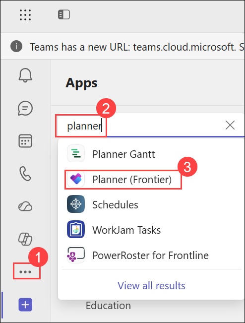
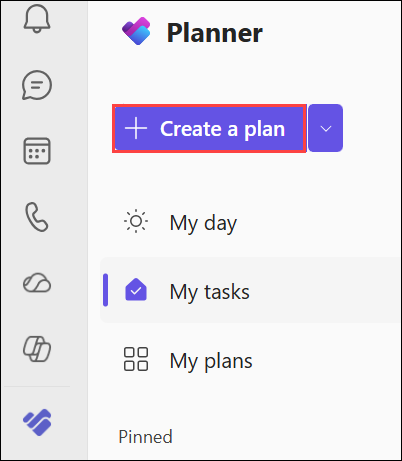
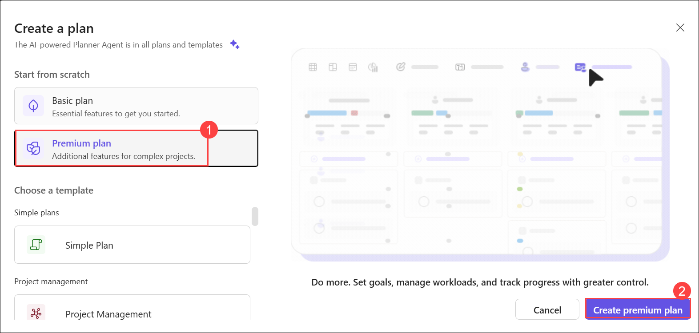
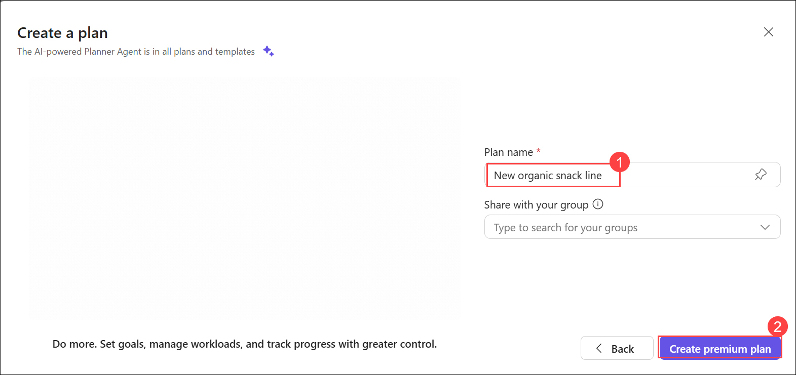
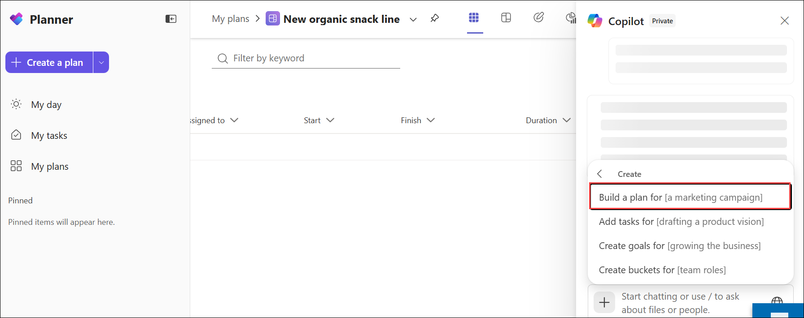
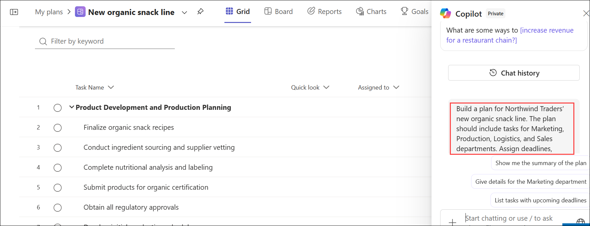

# Exercise 2: Drive business outcomes using Microsoft 365 Copilot

## Task 3: Use the Copilot in Planner to Create a New Project Plan

In this task, you will use the Copilot in Microsoft Planner to create and manage a project plan for a new product launch. The Copilot can generate tasks, milestones, dependencies, goals, timelines, and stakeholder updates based on a simple business description.

This exercise demonstrates how executives can use AI-powered project management capabilities to coordinate complex initiatives, monitor progress, and improve collaboration across multiple departments.

### Scenario

Northwind Traders is preparing to launch a new line of organic snacks. The initiative requires coordination between Marketing, Production, Logistics, and Sales teams. As the executive sponsor, you need to ensure that the project is properly planned, key milestones are identified, dependencies are managed, and stakeholders remain informed throughout the project lifecycle.

Using the Copilot in Planner, you will create a project plan, review goals and timelines, and explore AI-generated project management capabilities.

## Task 3.1: Create a New Premium Plan

### Steps

1. Open **Microsoft 365** in your browser.

2. Select **Apps**, and then select **Teams**.

3. In Teams, select **View more apps** (**...**) from the navigation pane.

   

4. Search for and open **Planner**.

5. In Planner, select **+ Create a plan**.

   

6. In the **Create new** window, select **Premium plan (1)** and **Create premium plan (2)**

   

   > **Note:** Premium plans provide advanced features such as timelines, goals, and AI-powered project management capabilities.

8. In the **Create a plan** window, enter the following name:

   ```text
   New organic snack line
   ```

9. Leave **Share with your group** blank.

   
   
10. Select **Create premium plan**.

   >**Note**: Creating a Premium plan may take up to **10–15 minutes** depending on service availability and tenant performance. If the plan doesn't appear immediately after selecting **Create**, wait for a few minutes and refresh the Planner page before proceeding to the next step.

### Expected Outcome

A new Premium Planner plan is created and ready for AI-assisted project planning.

## Task 3.2: Generate a Project Plan Using the Copilot

### Steps

1. In the **New organic snack line** plan, select the **Chat with your Copilot** icon located in the lower-right corner.

2. In the Copilot pane, select **Create**.

3. After the text **Build a plan for** appears in the prompt field, enter the following prompt:

   ```text
   Northwind Traders' new organic snack line. The plan should include tasks for Marketing, Production, Logistics, and Sales departments. Assign deadlines, owners, and dependencies.
   ```
   

   
   
4. Submit the prompt.

5. Review the generated project plan.

6. Observe the tasks, owners, dependencies, milestones, and project structure created by the agent.

### Expected Outcome

The Copilot generates a comprehensive project plan that includes tasks, assignments, dependencies, and timelines.

## Task 3.3: Review the Project Board

### Steps

1. After the plan is generated, select **Go to Board**.

2. Review the board view.

3. Examine the project buckets or workstreams created by the agent.

4. Verify that tasks have been organized into logical project areas.

5. Note whether the Copilot created additional departments or workstreams beyond those specified in the prompt.

6. If desired, add or modify tasks within the board.

### Expected Outcome

The project board provides a visual representation of project tasks and workstreams.

## Task 3.4: Review Project Goals

### Steps

1. Select **Go to Goals**.

2. Review the goals generated by the Copilot.

3. Examine how the goals align with the project objectives.

4. Modify or add goals if necessary.

### Expected Outcome

Project goals are created and aligned with the overall product launch strategy.

## Task 3.5: Generate Stakeholder Updates

### Steps

1. Return to the Copilot pane.

2. Enter the following prompt:

   ```text
   Can you generate automated progress updates for project stakeholders?
   ```

3. Review the response.

4. Observe the suggested prompts displayed by the Copilot.

5. Select one or more suggested prompts to explore additional project management capabilities.

### Suggested Follow-Up Prompts

```text
Summarize the current project status.
```

```text
Identify high-risk tasks and dependencies.
```

```text
What tasks are currently on the critical path?
```

```text
Generate a stakeholder update for this project.
```

```text
What milestones should leadership monitor?
```

### Expected Outcome

The Copilot provides project status summaries and stakeholder communication recommendations.

## Task 3.6: Generate a Project Timeline

### Steps

1. In the Copilot pane, enter the following prompt:

   ```text
   Create a visual timeline for this project that can be shared with senior leadership.
   ```

2. Submit the prompt.

3. Review the generated timeline.

4. If a suggested prompt appears to download or export the timeline, select it.

5. If no suggested prompt appears, enter the following prompt:

   ```text
   Provide a downloadable version of the project timeline.
   ```

6. Review the results.

   > **Note:** Timeline export functionality may vary depending on the version of Planner available in your tenant. Some environments may provide an image preview or downloadable file, while others may only provide a textual representation of the timeline.

7. If a downloadable timeline is available, save the file to your OneDrive.

### Expected Outcome

A project timeline is generated that can be used to communicate project milestones and schedules to leadership stakeholders.

## Knowledge Check

After completing this task, consider the following questions:

- How did the Copilot simplify project planning?
- What tasks or dependencies were automatically identified by the agent?
- How could AI-generated stakeholder updates improve project communication?
- What value does the project timeline provide during executive reviews?
- How could AI-powered project management improve cross-functional collaboration?

## Key Takeaways

By completing this task, you learned how to:

- Create Premium plans in Microsoft Planner.
- Use the Copilot to generate project plans.
- Create tasks, dependencies, goals, and timelines using natural language prompts.
- Generate stakeholder updates and project summaries.
- Visualize project schedules and milestones.
- Use AI-powered project management tools to improve visibility and coordination across business initiatives.
