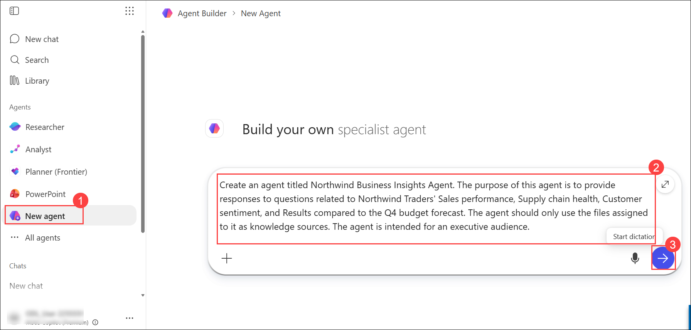
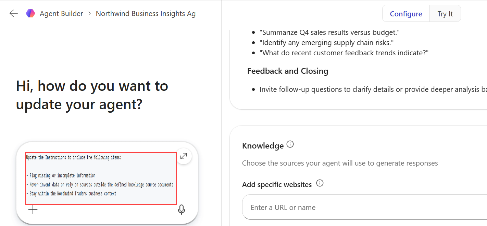

# Exercise 2: Drive business outcomes using Microsoft 365 Copilot

## Task 4: Create a Northwind Business Insights Agent

In this task, you will use the Microsoft 365 Copilot Agent Builder experience to create a custom agent that provides business insights for Northwind Traders. The agent will use approved business documents as its knowledge sources and help executives analyze sales performance, supply chain health, customer sentiment, and forecast-related results.

This exercise demonstrates how business users can create purpose-built Copilot agents without programming skills by using natural language instructions and organizational knowledge sources.

### Scenario

Northwind Traders' leadership team requires timely access to business insights related to sales performance, operational health, customer sentiment, and budget forecasts. Rather than manually reviewing reports, executives want a dedicated Copilot agent that can answer questions using approved business documents and provide consistent, data-driven responses.

Using Microsoft 365 Copilot Agent Builder, you will create and configure a **Northwind Business Insights Agent** that uses business reports and forecast data as knowledge sources.

> **Note:** This exercise uses the simplified Agent Builder experience available within Microsoft 365 Copilot. No coding or development experience is required.

## Task 4.1: Create the Agent

### Steps

1. Open a new browser tab and navigate to **Microsoft 365**.

2. In the navigation pane, select **New agent**.

   
   
3. In the prompt box, enter the following prompt:

   ```text
   Create an agent titled Northwind Business Insights Agent. The purpose of this agent is to provide responses to questions related to Northwind Traders' Sales performance, Supply chain health, Customer sentiment, and Results compared to the Q4 budget forecast. The agent should only use the files assigned to it as knowledge sources. The agent is intended for an executive audience.
   ```

4. Select **Send**.

5. Wait for Copilot to generate the agent.

   > **Note:** Agent creation may take a minute or two to complete.

6. Verify that the **Northwind Business Insights Agent** appears in the Agent Preview pane.

### Expected Outcome

Copilot creates a new agent and generates an initial description, instructions, and configuration based on the prompt.

## Task 4.2: Review the Generated Configuration

### Steps

1. Select the **Configure** tab.

2. Review the following sections:

   - Name
   - Description
   - Instructions

3. Examine the instructions generated by Copilot.

4. Observe how Copilot converted the high-level business requirements into detailed agent instructions.

### Expected Outcome

The agent contains a generated instruction set aligned to the business scenario and intended audience.

## Task 4.3: Update the Agent Instructions

### Steps

1. Navigate to the **Agent builder** section.

2. Enter the following prompt:

   ```text
   Update the Instructions to include the following items:
   
   - Flag missing or incomplete information
   - Never invent data or rely on sources outside the defined knowledge source documents
   - Stay within the Northwind Traders business context
   ```
   
   
3. Submit the prompt.

4. Review Copilot's response.

5. Return to the **Configure** tab.

6. Verify that the new instructions were added to the instruction set.

### Expected Outcome

The agent instructions are updated to improve reliability, transparency, and data governance.

## Task 4.4: Enhance the Agent Instructions

### Steps

1. Return to the **Agent builder** section.

2. Enter a prompt asking Copilot to recommend additional instructions that could improve the agent.

   Example:

   ```text
   Review the current instructions and recommend additional guidance that would improve the quality, accuracy, and usefulness of this executive business insights agent.
   ```

3. Review Copilot's recommendations.

4. If satisfied with the recommendations, ask Copilot to add them to the instruction set.

   Example:

   ```text
   Add all of the recommended instructions to the agent.
   ```

5. After Copilot confirms the update, return to the **Configure** tab.

6. Review the updated instruction set.

### Expected Outcome

The agent contains a more comprehensive instruction set tailored to executive business reporting scenarios.

## Task 4.5: Configure Knowledge Sources

### Steps

1. On the **Configure** tab, scroll to the **Knowledge** section.

2. Verify that the **Search all websites** option is disabled.

   > **Note:** The agent should only use the approved knowledge sources uploaded during this exercise.

3. If the option is enabled, disable it.

4. Select **Upload from device**.

5. Upload the following files:

   - **Q3 Executive Briefing.docx**
   - **Northwind Traders Q4 budget forecast.xlsx**

6. Wait for both files to upload successfully.

### Expected Outcome

The uploaded business documents become the primary knowledge sources for the agent.

## Task 4.6: Generate Suggested Prompts

### Steps

1. Return to the **Agent builder** section.

2. Enter the following prompt:

   ```text
   Generate three suggested prompts for this agent.
   ```

3. Review the prompts generated by Copilot.

4. Note that each prompt includes:

   - A title
   - A prompt message

### Expected Outcome

Copilot generates starter prompts designed for executive users.

## Task 4.7: Add Custom Suggested Prompts

### Steps

1. Select the **Configure** tab.

2. Scroll to the **Suggested prompts** section.

3. Review the prompts generated by Copilot.

4. Select **Add a suggested prompt**.

5. Add two or three of the following prompts.

| Title | Message |
|---------|---------|
| Top risks | What are the top risks to meeting our Q4 revenue forecast? |
| Customer sentiment trends | Summarize customer sentiment trends from the latest reports. |
| Budget vs. Sales | Compare actual sales performance to the Q4 budget forecast. |
| Bottlenecks | Identify supply chain bottlenecks that could affect Q4 delivery timelines. |
| Top performing product categories | Highlight the top-performing product categories based on recent sales data. |
| Emerging market trends | What emerging market trends should we watch for in the next quarter? |

### Expected Outcome

The agent includes both AI-generated and manually created starter prompts.


## Task 4.8: Test the Agent

### Steps

1. Test several of the suggested prompts.

2. Verify that the responses are based on the uploaded knowledge sources.

3. Confirm that the agent:

   - References information from the uploaded documents.
   - Remains within the Northwind Traders business context.
   - Avoids generating unsupported information.

### Expected Outcome

The agent successfully answers questions using information contained within the approved business documents.

## Task 4.9: Create and Access the Agent

### Steps

1. Select **Create**.

2. Wait for the agent creation process to complete.

3. When the confirmation dialog appears, select **Go to agent**.

4. Review the completed agent.

   > **Note:** The agent is private by default and is only accessible to you. In production environments, agents can be shared with other users when appropriate.

### Expected Outcome

The Northwind Business Insights Agent is created and ready to provide executive business insights based on approved organizational data.

## Knowledge Check

After completing this task, consider the following questions:

- How did Copilot simplify the process of creating an intelligent business agent?
- What benefits do knowledge sources provide when answering business questions?
- Why is it important to restrict the agent to approved data sources?
- How can suggested prompts improve the user experience?
- How could this agent help executives make faster decisions?

## Key Takeaways

By completing this task, you learned how to:

- Create a custom Copilot agent using natural language.
- Configure agent instructions without coding.
- Improve agent behavior through iterative instruction updates.
- Restrict agent responses to approved knowledge sources.
- Create executive-focused starter prompts.
- Build a business insights solution that supports data-driven decision-making.
