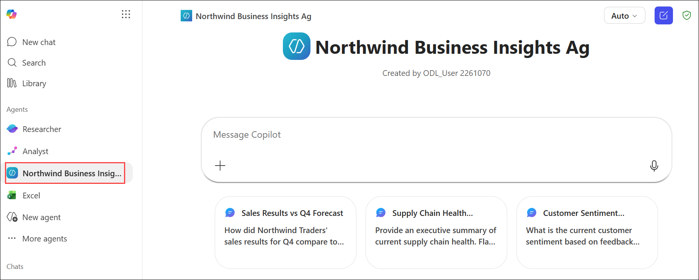
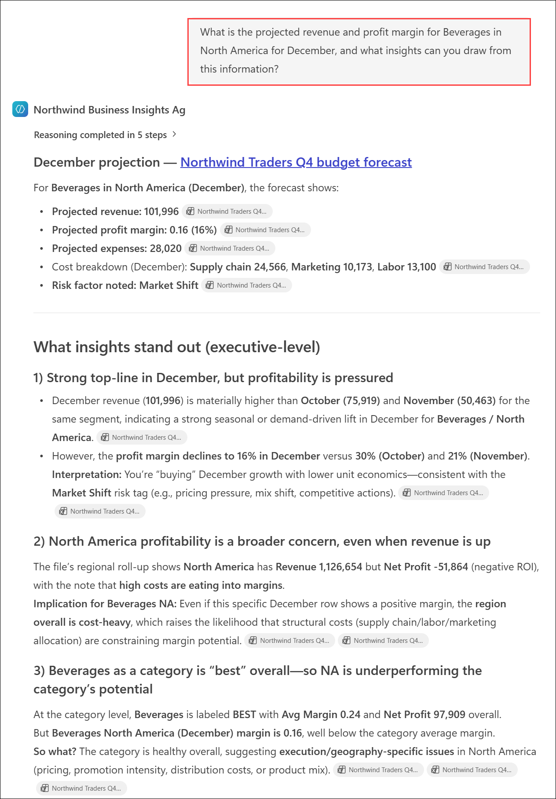

# Exercise 2: Drive business outcomes using Microsoft 365 Copilot

## Scenario

As a member of Northwind Traders' executive leadership team, you need timely answers to questions related to sales performance, budget forecasts, operational risks, and business trends. Rather than manually reviewing reports and spreadsheets, you will use the Northwind Business Insights Agent to retrieve insights from the approved knowledge sources.

During this exercise, you will test the agent's ability to answer questions based on:

- Q3 Sales Performance
- Q4 Budget Forecasts
- Risk Analysis
- Cross-document Business Insights

## Lab Overview

In this hands-on lab, you will use the Northwind Business Insights Agent to answer executive-level questions related to sales performance, budget forecasts, business risks, and growth opportunities. You will evaluate the agent’s ability to retrieve information from approved knowledge sources, perform cross-document analysis, and generate actionable business recommendations. These capabilities help leaders access timely insights and make informed strategic decisions.

## Task 5: Use the Northwind Business Insights Agent to Answer Executive Questions

In this task, you will interact with the Northwind Business Insights Agent that you created in the previous task. Using executive-level business questions, you will validate that the agent can accurately retrieve information from its assigned knowledge sources and provide meaningful business insights.

This exercise demonstrates how a custom Copilot agent can help executives quickly analyze business performance, evaluate forecasts, identify risks, and support data-driven decision-making.

## Task 5.1: Open the Northwind Business Insights Agent

In this task, you will access the Northwind Business Insights Agent and review its suggested prompts before beginning business analysis.

1. On **Microsoft 365** page, Verify that the **Northwind Business Insights Agent** is open.

   > **Note:** If the agent is no longer open, navigate to **Microsoft 365**, locate the **Northwind Business Insights Agent**, and open it.

   

2. Review the suggested prompts displayed by the agent.

3. Confirm that the agent is ready to accept questions.

### Expected Outcome

The Northwind Business Insights Agent is available and ready to answer business-related questions using the configured knowledge sources.

## Task 5.2: Analyze Q4 Budget Forecast Data

In this task, you will use the agent to analyze Q4 forecast data, identify projected risks, and generate business recommendations based on forecasted performance.

1. Submit the following question:

   ```text
   What is the projected revenue and profit margin for Beverages in North America for December, and what insights can you draw from this information?
   ```

2. Review the response generated by the agent.

   

3. Verify that the response includes:

   - Revenue projections
   - Profit margin information
   - Business insights and recommendations

4. Submit the following question:

   ```text
   Provide a list of the top three product categories and regions that have the highest projected risk factor in Q4. How can Northwind Traders mitigate these risks?
   ```

5. Review the response.

6. Verify that the response includes:

   - Risk rankings
   - Risk descriptions
   - Recommended mitigation strategies
   - Executive action items

### Expected Outcome

The agent provides forecast-based insights and identifies business risks along with actionable recommendations.

## Task 5.3: Analyze Q3 Sales Performance

In this task, you will use the agent to review historical Q3 sales data and gain insights into revenue, profit, and performance trends.

1. Submit the following question:

   ```text
   What was the total revenue and profit for Snacks in North America in Q3? Provide a breakdown by month and overall totals.
   ```

2. Review the response.

3. Verify that the response includes:

   - Monthly revenue figures
   - Monthly profit figures
   - Total revenue
   - Total profit

4. Submit the following question:

   ```text
   How did profit margins for Dairy in Asia change from July through September? What might explain this change?
   ```

5. Review the response.

6. Verify that the response includes:

   - Month-by-month margin changes
   - Trend analysis
   - Possible business explanations

### Expected Outcome

The agent successfully analyzes historical sales data and provides contextual business insights.

## Task 5.4: Analyze Information Across Multiple Knowledge Sources

In this task, you will use the agent to combine information from multiple business documents and generate consolidated insights and recommendations.

1. Submit the following question:

   ```text
   How do the projected profit margins for Q4 compare to actual margins in Q3 for Condiments in North America? Provide key insight analysis.
   ```

2. Review the response.

3. Verify that the response combines information from both:

   - Q3 Executive Briefing
   - Q4 Budget Forecast

4. Submit the following question:

   ```text
   What what-if scenarios should executives be most concerned about, given recent sales and forecasted risks?
   ```

5. Review the response.

6. Verify that the response includes:

   - Forecast risks
   - Scenario analysis
   - Potential business impacts
   - Recommendations for leadership

### Expected Outcome

The agent combines information from multiple knowledge sources and generates consolidated business insights.

## Task 5.5: Explore Additional Business Questions

In this task, you will ask custom business questions to uncover additional insights related to profitability, growth opportunities, risks, and operational performance.

1. Submit one or more custom questions of your own.

   ### Sample Questions

   ```text
   Which product categories are expected to contribute the most profit in Q4?
   ```

   ```text
   What risks pose the greatest threat to achieving our revenue targets?
   ```

   ```text
   What operational improvements could have the greatest impact on profitability?
   ```

   ```text
   Which regions appear to have the strongest growth opportunities?
   ```

   ```text
   What trends should leadership monitor during the next quarter?
   ```

2. Review the responses generated by the agent.

3. Verify that the responses:

   - Use information from the uploaded knowledge sources.
   - Stay within the Northwind Traders business context.
   - Provide actionable recommendations where appropriate.

### Expected Outcome

The agent successfully answers executive-level business questions using the approved business documents.

## Task 5.6: Validate Agent Responses

In this task, you will evaluate the agent's responses to ensure they are accurate, relevant, and based on approved knowledge sources.

1. Review several responses generated during this exercise.

2. Confirm that the agent:

   - References information from the uploaded knowledge sources.
   - Avoids using unsupported information.
   - Identifies missing information when necessary.
   - Provides relevant business recommendations.

3. Evaluate whether the responses would be useful for executive decision-making.

### Expected Outcome

The agent consistently delivers accurate, relevant, and business-focused insights.

## Knowledge Check

After completing this task, consider the following questions:

- How effectively did the agent use the uploaded knowledge sources?
- Were the recommendations actionable and relevant?
- How did cross-document analysis improve the quality of responses?
- What additional knowledge sources could further improve the agent?
- How could this agent support executive decision-making on an ongoing basis?

## Summary

In this task, you used the Northwind Business Insights Agent to answer executive-level business questions using approved organizational data. You analyzed forecast and sales performance, reviewed risks and growth opportunities, and combined information from multiple knowledge sources to generate actionable insights. The exercise demonstrated how custom Copilot agents can support faster decision-making and provide leaders with reliable, data-driven business recommendations.
