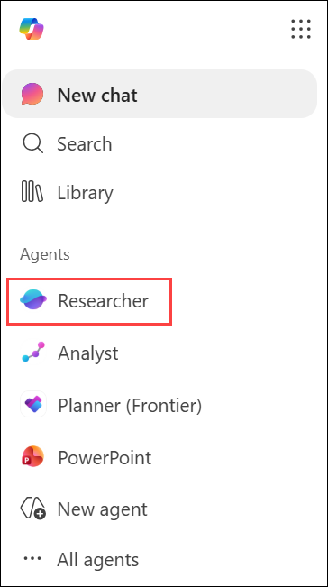
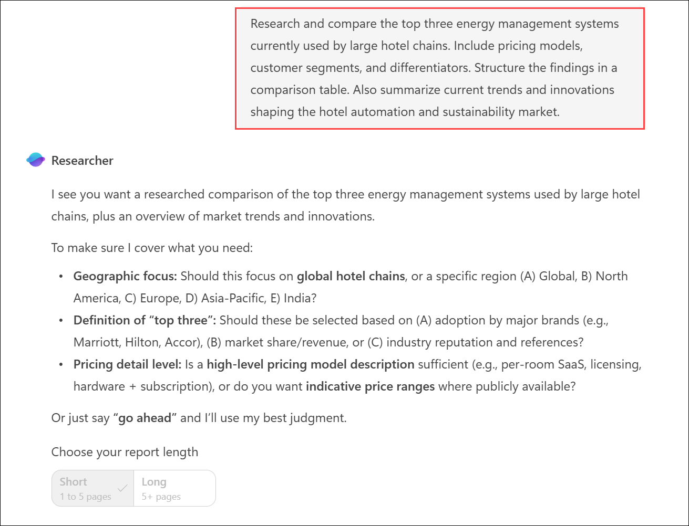
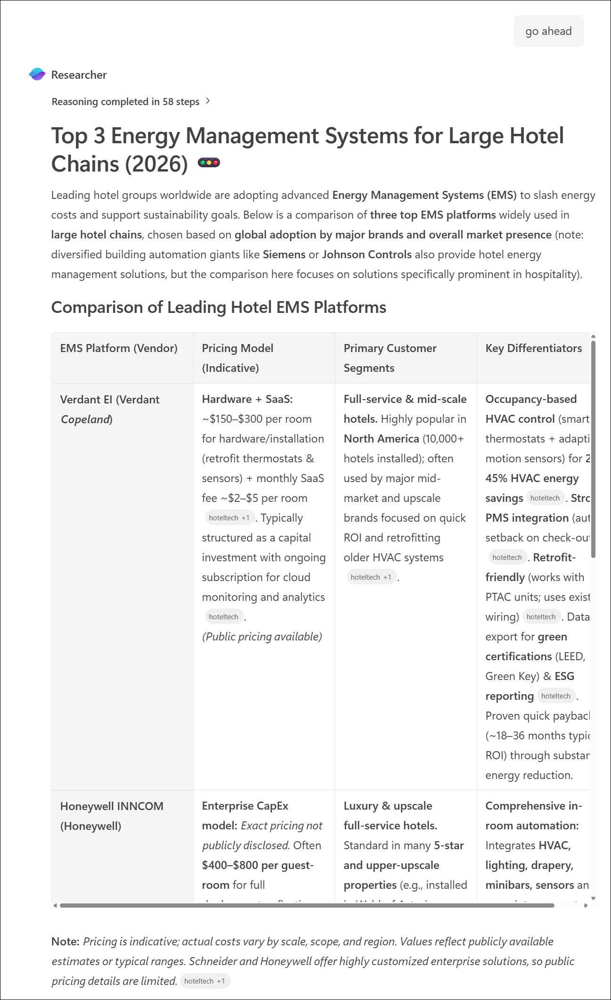
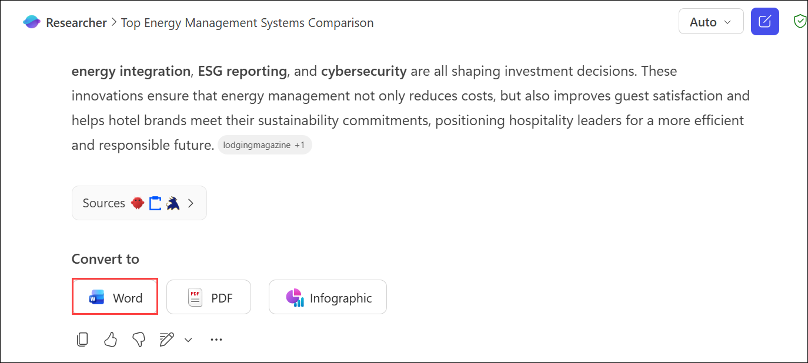
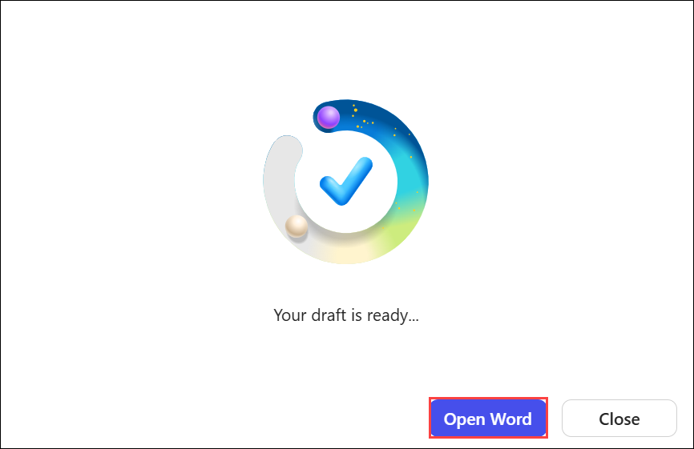
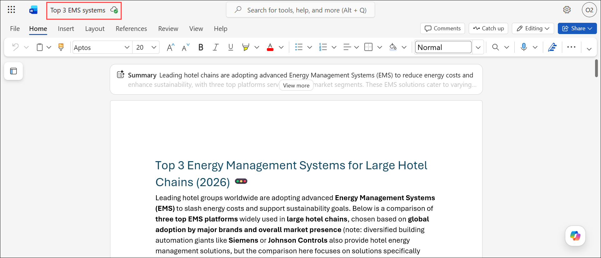
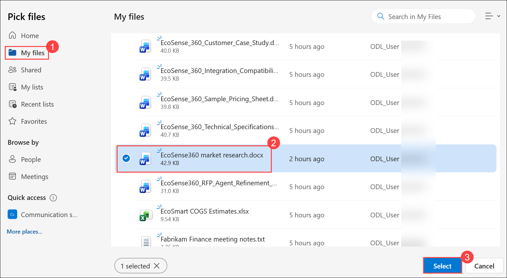
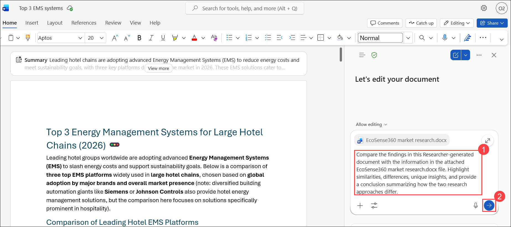
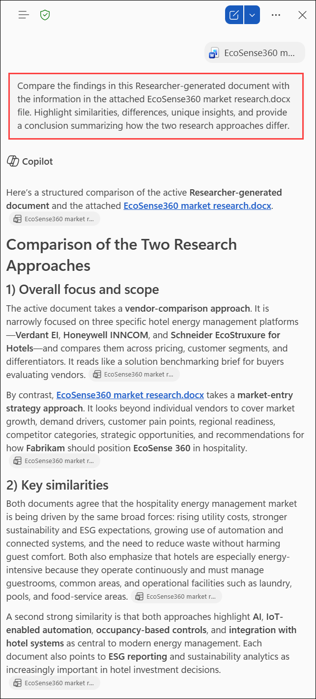

# Exercise 1, Task 1: Use the Researcher agent to analyze your competitors and identify industry trends

## Scenario

Fabrikam’s Sales leadership identified the hospitality industry as a key growth opportunity for EcoSense 360, the company’s smart energy management solution. Before the Sales team dives into broader market research, leadership requested that you provide a structured, data-driven analysis of the competitive landscape and industry trends—information that can be referenced in strategy discussions and sales planning.

To accomplish this goal, you turn to Microsoft 365 Copilot’s Researcher agent, which is designed for in-depth, repeatable business analysis. You plan to use the Researcher agent to identify leading hotel energy management systems, compare their features and pricing models, and summarize key differentiators. The goal is to create a solid foundation of verified, structured intelligence that can inform subsequent market research, proposal development, and sales strategy.

By starting with the Researcher agent, you ensure that you have accurate, repeatable insights about the competitive environment before exploring broader market trends with Copilot Chat.

## Lab Overview

In this hands-on lab, you will use Microsoft 365 Copilot Researcher to analyze leading hotel energy management systems and identify key industry trends. You will generate a structured competitive analysis report, review market insights, and compare Researcher findings with existing EcoSense360 research. The resulting analysis will provide valuable intelligence to support sales planning, proposal development, and strategic decision-making.

## Task 1: Use the Researcher agent to analyze your competitors and identify industry trends

In this task, you will use Microsoft 365 Copilot Researcher to analyze leading hotel energy management systems and identify key industry trends. You will compare the Researcher-generated findings with existing EcoSense360 market research to uncover insights that support sales and market planning.

1. In your Microsoft Edge browser, sign in to the **Microsoft 365** using the URL below: 

    ```
    https://www.microsoft365.com
    ```

1. In Microsoft 365, select **Researcher** from the navigation pane.

    

1. By selecting Research agent, please provide the below prompt. If the agent is asking more questions, select the report length by clicking Short or Long based on your requirement, and then provide **Go ahead**:

    **Prompt:**
    ```
    Research and compare the top three energy management systems currently used by large hotel chains. Include pricing models, customer segments, and differentiators. Structure the findings in a comparison table. Also summarize current trends and innovations shaping the hotel automation and sustainability market.
    ```

     

     
   
    >**Note:** `Since it typically takes Researcher at least 5-10 minutes to complete its analysis, proceed to Task 2. You can work on Task 2 while Researcher conducts its business analysis. Once you complete Task 2, return here and continue with this task.`

3. With Task 2 complete, switch back to the Microsoft Edge browser tab containing the Researcher agent. Once Researcher finishes gathering its insights, select the **Convert to Word** button (which might appear as **Open in Word** depending on your version), which directs Researcher to present its findings in a Word document. Review the information compiled by Researcher. 

    

    

4. You plan to use this document in Task 3 when you create a sales proposal, so make note of the file name that appears above the Word menu bar. If Copilot assigned a generic file name, such as **Document 1**, select the document name and rename the file to something more appropriate, such as **Top 3 EMS systems**. 

   

5. In the Copilot pane in Microsoft Word, verify the **Allow editing** icon appears in the prompt field next to the plus (+) sign.

1. Select **Add (1)**, and then choose **Attach cloud files (2)**.

   

1. In **My files (1)**, select **EcoSense360 market research.docx (2)**, and then click **Select (3)**.

   

6. In the prompt field, provide the below prompt. 

    ```
    Compare the findings in this Researcher-generated document with the information in the attached EcoSense360 market research.docx file. Highlight similarities, differences, unique insights, and provide a conclusion summarizing how the two research approaches differ.
    ```

    

7. Review the results of this comparison, especially the **Conclusion**, which should summarize the differences between the two types of research.

   

## Summary

In this task, you used Microsoft 365 Copilot Researcher to perform a competitive analysis of hotel energy management systems and explore current industry trends. You converted the research into a Word document and compared the findings with existing EcoSense360 market research using Copilot. The comparison highlighted key similarities, differences, and unique insights, providing a well-rounded understanding of the market landscape to support future sales and business strategy decisions.

## You have successfully completed the task. Click on Next >> to proceed with the next exercise.

