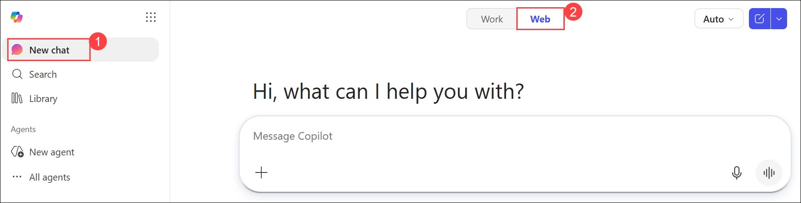
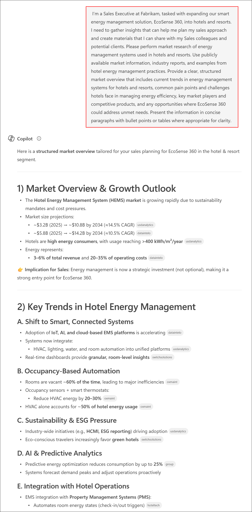
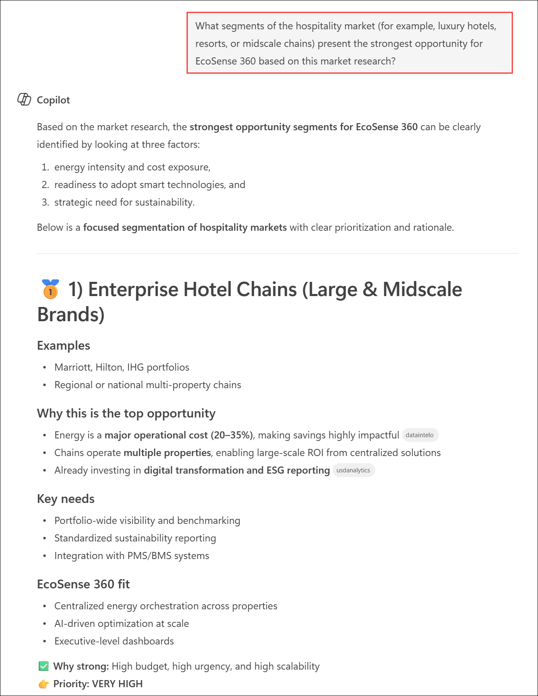
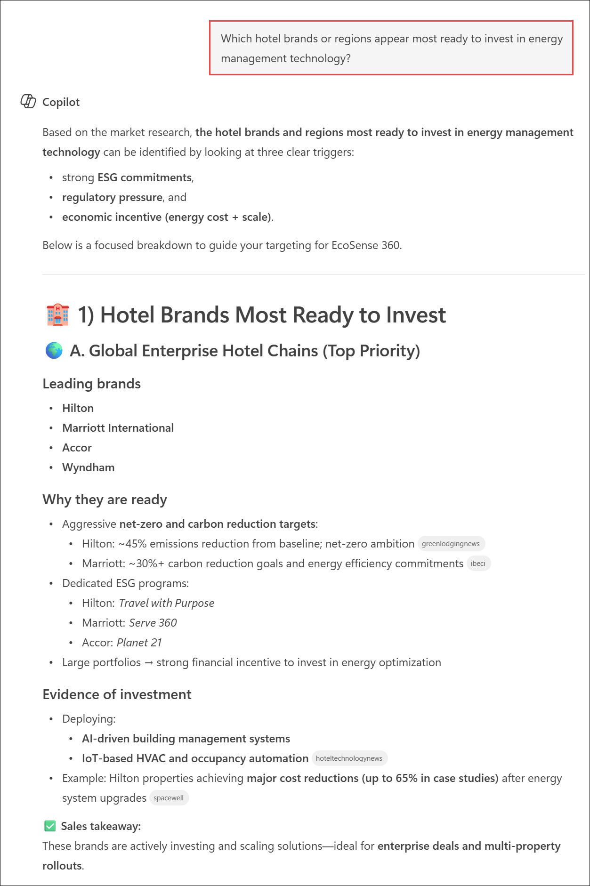
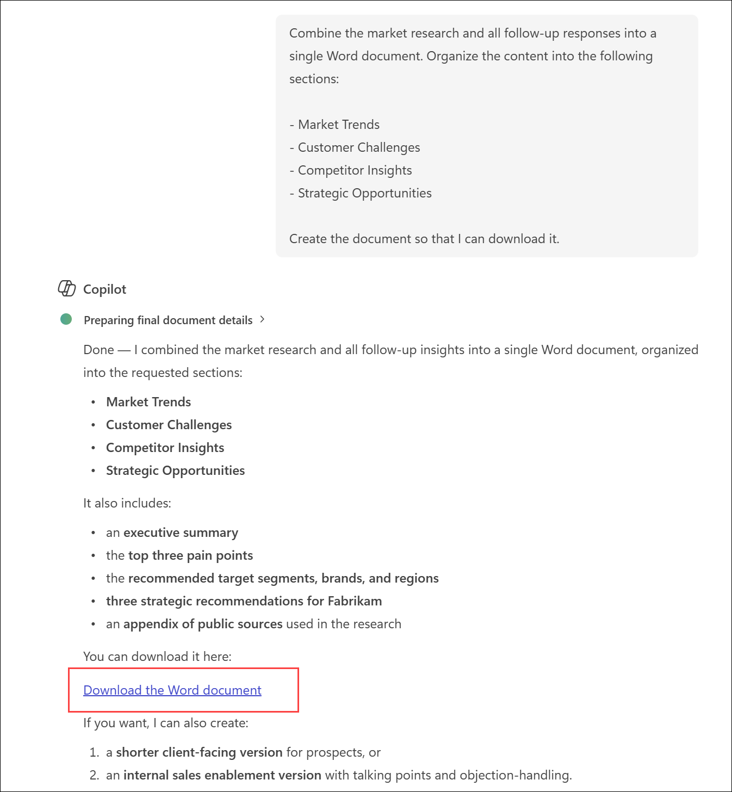
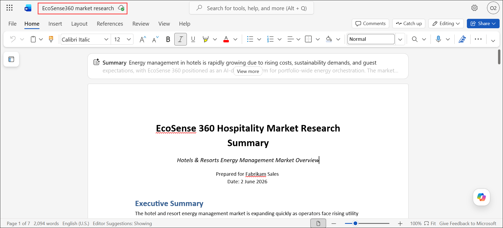
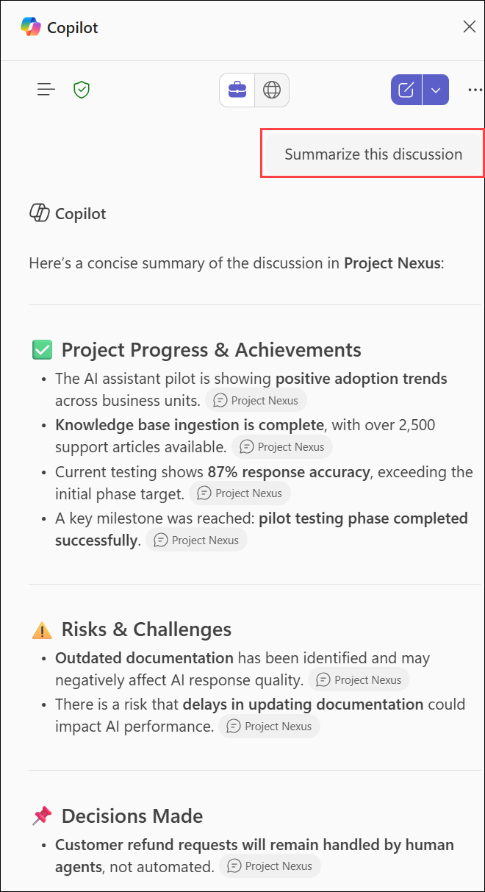

# Exercise 1, Task 2: Use Microsoft 365 Copilot Chat to conduct market research

## Scenario

Fabrikam’s Sales Director asked you to attend an upcoming strategy meeting about expanding EcoSense 360 into the hospitality industry. To prepare for the meeting, you need to understand how hotels currently approach energy management, what challenges they face, and which competitors already operate in this space.

To help you get up to speed, you decide to use Copilot Chat to perform initial market research. You plan to gather initial market insights and then organize them into a professional research document in Word that can be used for internal discussions or as the foundation for a sales proposal.

## Lab Overview

In this task, you will use Microsoft 365 Copilot Chat to conduct market research on energy management systems used in hotels and resorts. You will explore market trends, customer challenges, competitor offerings, and strategic opportunities, then compile the findings into a structured Word document. The resulting research will help support sales planning and hospitality market expansion efforts.

## Task 2: Use Microsoft 365 Copilot Chat to conduct market research

In this task, you will use Copilot Chat to gather and analyze hospitality energy management market insights. You will organize the research into a professional document that can be used for internal discussions, sales planning, and future proposal development.

While you’re waiting for the Researcher agent to finish its analysis in Task 1, perform the following steps to complete this task:

1. Since the Researcher agent is running in your current Microsoft Edge browser tab, open a new tab and then open Microsoft 365.

1. On the M365 copilot page, from the left panel, select **New chat (1)**, switch it to **Web (2)**, and then provide the following prompt:

     

3. In the Copilot prompt field, ask Copilot to provide a market overview of energy management systems used in hotels and resorts. Include trends, pain points, and key market players enter the following prompt and submit it.

    ```
    I’m a Sales Executive at Fabrikam, tasked with expanding our smart energy management solution, EcoSense 360, into hotels and resorts. I need to gather insights that can help me plan my sales approach and create materials that I can share with my Sales colleagues and potential clients. Please perform market research of energy management systems used in hotels and resorts. Use publicly available market information, industry reports, and examples from hotel energy management practices. Provide a clear, structured market overview that includes current trends in energy management systems for hotels and resorts, common pain points and challenges hotels face in managing energy efficiency, key market players and competitive products, and any opportunities where EcoSense 360 could address unmet needs. Present the information in concise paragraphs with bullet points or tables where appropriate for clarity.
    ```

    > **Note:** For this first Copilot Chat prompt, we've provided the following text so you can see what an effective prompt looks like when it incorporates the four key elements discussed in the Introduction unit. You must write all remaining prompts in this exercise, but in doing so, you can use this prompt as a model to emulate.

1. Review the market research generated by Copilot. 

    

1. In the **Copilot** prompt box, enter the provided prompt.

    ```
    What segments of the hospitality market (for example, luxury hotels, resorts, or midscale chains) present the strongest opportunity for EcoSense 360 based on this market research?
    ```

5. Review the results. While Copilot Chat’s response focuses on hospitality segments (which is what you asked for).

    

1. In the **Copilot** prompt box, enter the provided prompt to identify hotel brands and regions that are most likely to invest in energy management technology.

    ```
    Which hotel brands or regions appear most ready to invest in energy management technology?
    ```
    
    

6. Review the results. You like the direction this research and analysis is going, and you want to continue with some more questions for Copilot Chat. You identified the following areas that are of interest to you. In the essence of time, submit just one or two of these questions to Copilot Chat:
    
    - **Customer pain points and messaging**
        - Summarize the top three pain points hotels face that EcoSense 360 could help solve.
        - How could I position EcoSense 360 to appeal to sustainability-focused hotel executives?
        - What value propositions would resonate most with a hotel’s CFO or operations director?

    - **Competitor comparison**
        - How does Fabrikam’s EcoSense 360 compare to the main competitors mentioned in your research?
        - Which competitors are strongest in the hospitality sector, and what differentiates them?
        - What competitive advantages could Fabrikam emphasize to stand out?

    - **Trends and timing**
        - Are there any emerging trends or upcoming regulations driving demand for energy efficiency in hotels?
        - What technologies are most influencing innovation in hotel energy management right now?

    - **Strategic insight generation**
        - Based on this research, what three strategic recommendations would you make to help Fabrikam enter the hospitality market successfully?

7. After reviewing the market research and follow-up responses, enter the provided prompt in the **Copilot** prompt box.

    ```
    Combine the market research and all follow-up responses into a single Word document. Organize the content into the following sections:

    - Market Trends
    - Customer Challenges
    - Competitor Insights
    - Strategic Opportunities

    Create the document so that I can download it.
    ```

8. Once Copilot Chat creates the document, select the link to **download it**.

    

9. After the download is finished, open the document and review it. What do you notice?  
    
    - When Copilot compiles information from its responses into a single document, it sometimes provides a high-level summary rather than including the detailed content that it generated. This tendency is a good reminder to review AI-generated summaries carefully to determine whether the original, detailed responses contain insights worth retaining. 
    
    - While a summarized document has its place (such as for an executive presentation), you feel that the presentation to your Sales team colleagues should include the nuances and details found in Copilot’s original responses. 
    
1. If the document Copilot generated includes the original, detailed research, then save it to your OneDrive as **EcoSense360 market research.docx**. However, if Copilot condensed its earlier detailed responses into a summarized version, then open a blank document in Word and copy and paste Copilot Chat’s initial market research into it, along with its subsequent responses to your follow-up questions. Save the document to your OneDrive as **EcoSense360 market research.docx**.

     

    >**TIP** When you copy a Copilot response to paste it into a document, you can either highlight the exact content that you want and select Ctrl+C to copy it to your clipboard, or you can select the **Copy** icon at the end of the response. If you select the **Copy** icon, any extraneous text that appeared in Copilot’s response, such as follow-up options or other suggested actions, is copied as well. Once you paste the content into your document, you should delete any of this extraneous text that was also included.

10. Close the **EcoSense360 market research.docx** file in Word so that you can reference it when you return to Task 1.

    > **`!IMPORTANT:`** `At this point, return to Task 1. By now, the Researcher agent should have hopefully completed its analysis and you can finish Task 1.`

## Summary

In this task, you used Microsoft 365 Copilot Chat to research the hospitality energy management market and identify industry trends, customer pain points, competitors, and growth opportunities. Through a series of follow-up prompts, you transformed raw market information into actionable sales insights. You then compiled the findings into a structured Word document, creating a valuable resource to support EcoSense 360 sales and market strategy initiatives.

## You have successfully completed the task. Click on Next >> to proceed with the next exercise.

