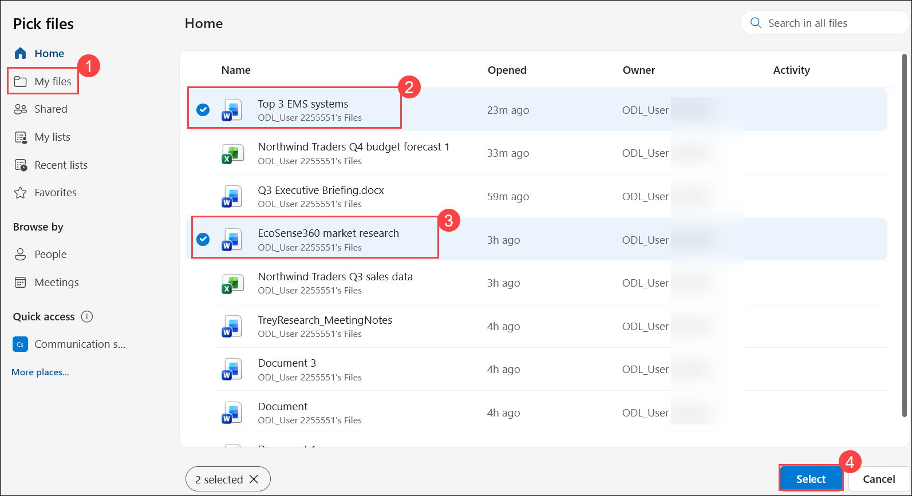
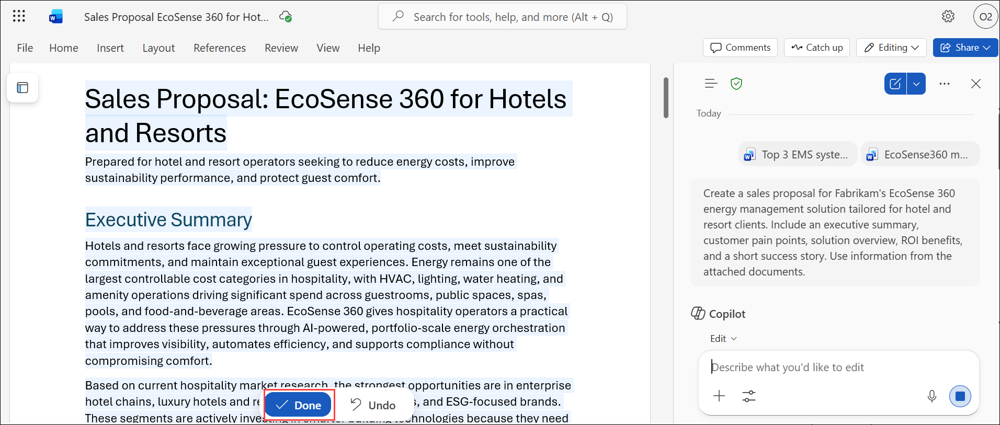
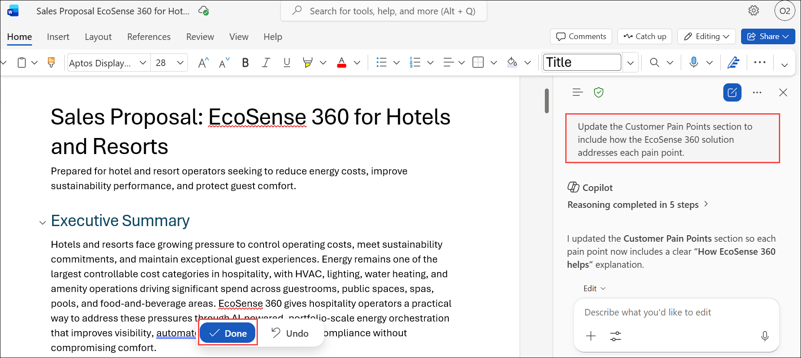
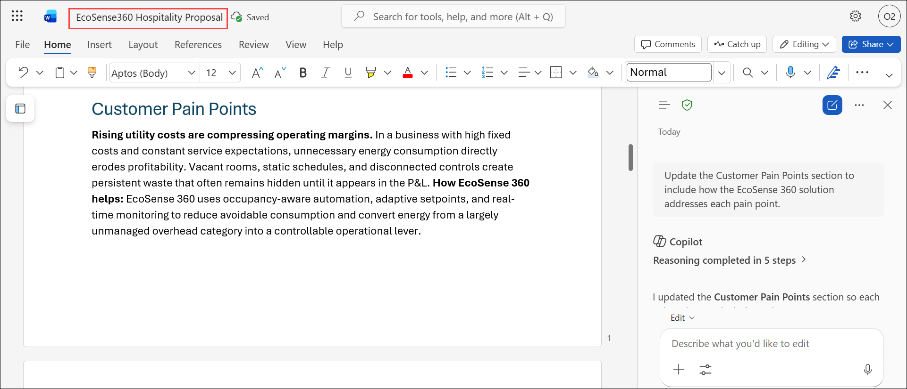

# Exercise 1, Task 3: Use Copilot in Word to create a sales proposal

## Scenario

Now that you built a strong understanding of the market and competition, Fabrikam’s regional Sales director asks you to prepare a client-ready proposal that can be used in upcoming sales meetings with hotel groups. The proposal should clearly articulate EcoSense 360’s value, highlight customer benefits, and demonstrate the potential return on investment (ROI).

You want to use Copilot in Word to transform your research findings into a professional, persuasive sales proposal. You want it to be visually clean, executive-friendly, and tailored to hotel decision makers.

## Lab Overview

In this hands-on lab, you will use Copilot in Word to transform research findings into a professional sales proposal for hotel and resort clients. You will refine the proposal by addressing customer pain points, highlighting EcoSense 360 benefits, tailoring the content for executive audiences, and adding ROI-focused insights. The final document will serve as a client-ready proposal to support hospitality sales engagements.


## Task 3: Use Copilot in Word to create a sales proposal

In this task, you will use Copilot in Word to create and enhance a sales proposal using previously generated research documents. You will refine the content to better address customer challenges, communicate business value, and present ROI benefits for hotel decision makers.

1. In your Microsoft Edge browser, go to the **Microsoft 365** home page, select **App launcher (1)** in the navigation pane, and then select **Word (2)** from the **Apps** menu.

     

2. In **Word for the web**, create a blank document.

3. From the document, select **Copilot** icon located at the bottom-right corner of the screen to open the Copilot pane. In the Copilot pane, verify the **Allow editing** icon appears in the prompt field next to the plus (+) sign.

     

1. Select **Add (1)**, and then choose **Attach cloud files (2)**.

     

1. In **My files (1)**, select **Top 3 EMS systems (2)** and **EcoSense360 market research (3)**, and then click **Select (4)**.

     

4. In the prompt field that appears in the Copilot pane, provide the following prompt **(1)** and select **Send (2)** 

    ```
    Create a sales proposal for Fabrikam's EcoSense 360 energy management solution tailored for hotel and resort clients. Include an executive summary, customer pain points, solution overview, ROI benefits, and a short success story. Use information from the attached documents.
    ```

     

1. Review the proposal generated by Copilot. Notice that while the proposal includes a section on customer pain points, it does not explain how **EcoSense 360** addresses those challenges. After reviewing the content, select **Done**.

     

1. In the Copilot prompt field, ask Copilot to **update the Customer Pain Points section to include how the EcoSense 360 solution addresses each pain point**.

    

6. Review the results. While you feel the proposal provides a good foundation, you feel that it’s missing a couple of key items that might concern executives. Ask Copilot

    ```
    Rewrite this proposal for a C-suite audience focused on operational efficiency and sustainability. Also add a summary table showing estimated ROI for hotels of different sizes.
    ```

7. Review the results. The one thing that you might need to manually change is in the pain points section (which might be retitled to something else, such as Key Operational Challenges). If Copilot includes a bullet for how EcoSense 360 addresses each pain point, ensure the EcoSense 360 impact bullet is indented below its parent pain point bullet. That way, the bulleted list clearly draws attention to the EcoSense 360 solution for each pain point, as opposed to having what appears to be just a continuous string of bullets. For example:  
    <br/>If your current version appears something like this:
    - **High Energy Cost:** Hotels are facing rising energy expenses…
    - **EcoSense 360 Impact:** AI-driven optimization…
    - **HVAC Inefficiency:** Outdated or disconnected climate controls…
    - **EcoSense 360 Impact:** Integrated system connects with…  

    Then indent each **EcoSense 360 Impact** bullet like this:

    - **High Energy Cost:** Hotels are facing rising energy expenses…
        - **EcoSense 360 Impact:** AI-driven optimization…
    - **HVAC Inefficiency:** Outdated or disconnected climate controls…
        - **EcoSense 360 Impact:** Integrated system connects with…  

8. Save the final version of your document as **EcoSense360 Hospitality Proposal.docx**.

    

## Summary

In this exercise, you used Copilot in Word to transform research findings into a customer-ready sales proposal for hotel and resort clients. You refined the proposal by connecting customer challenges to EcoSense 360 capabilities, improving executive-level messaging, and adding ROI insights. The completed document provides a compelling business case that can be used to support sales conversations and hospitality market expansion efforts.
