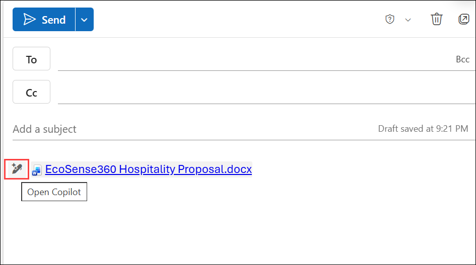
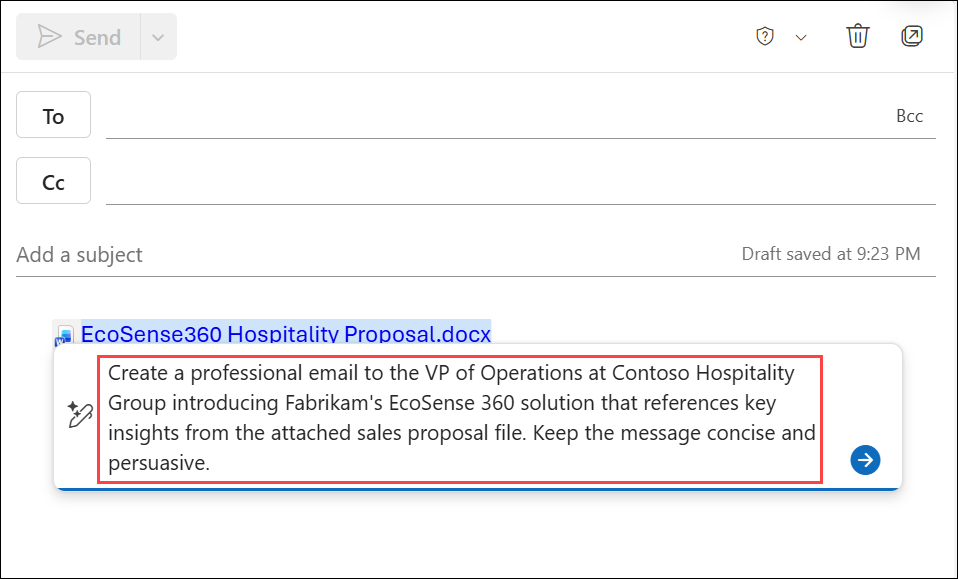
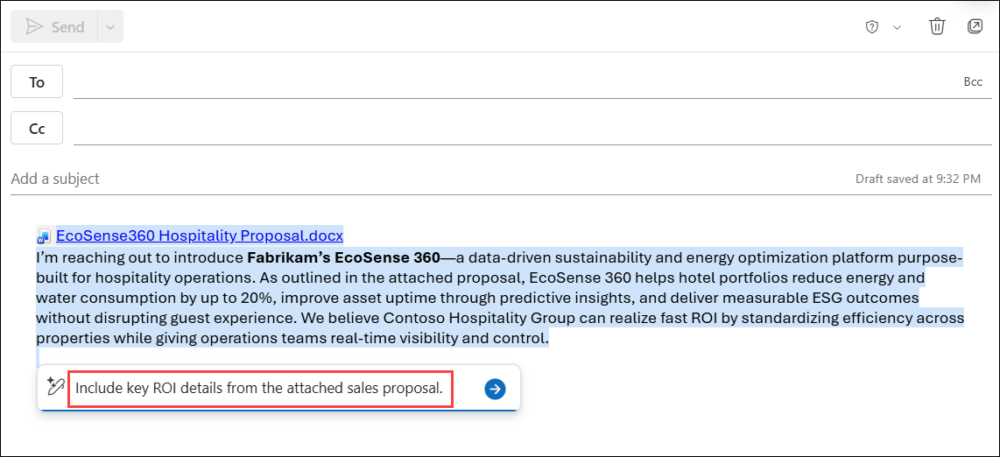
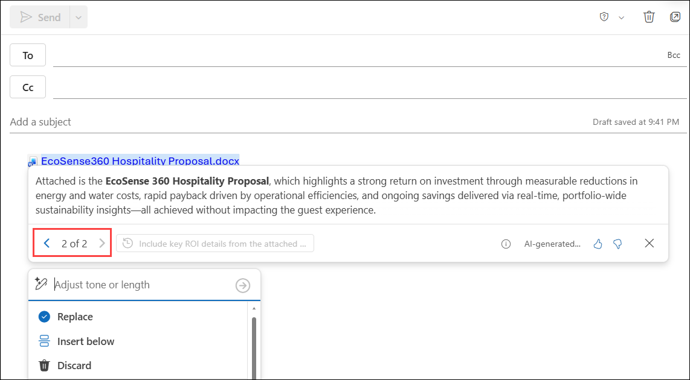
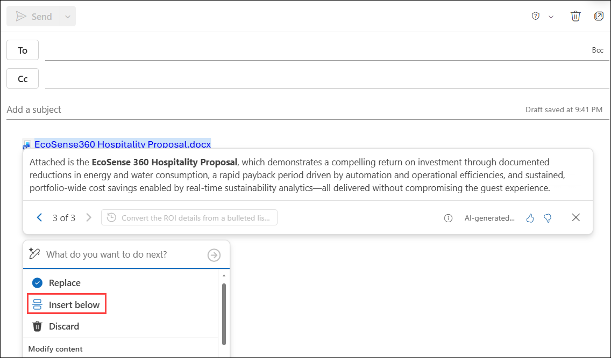
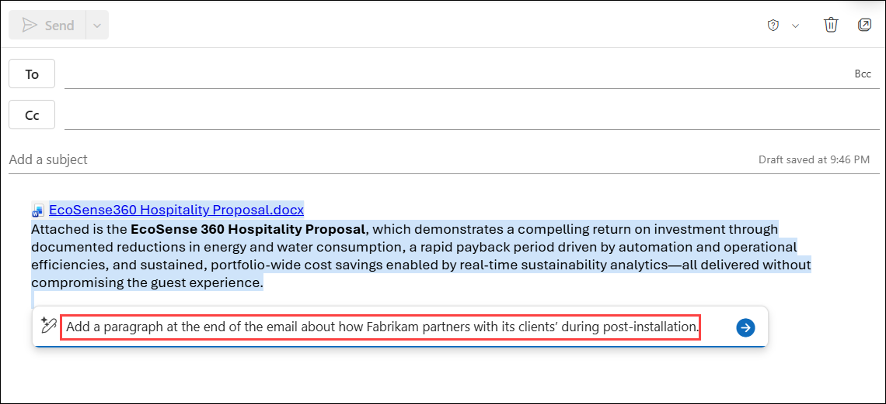
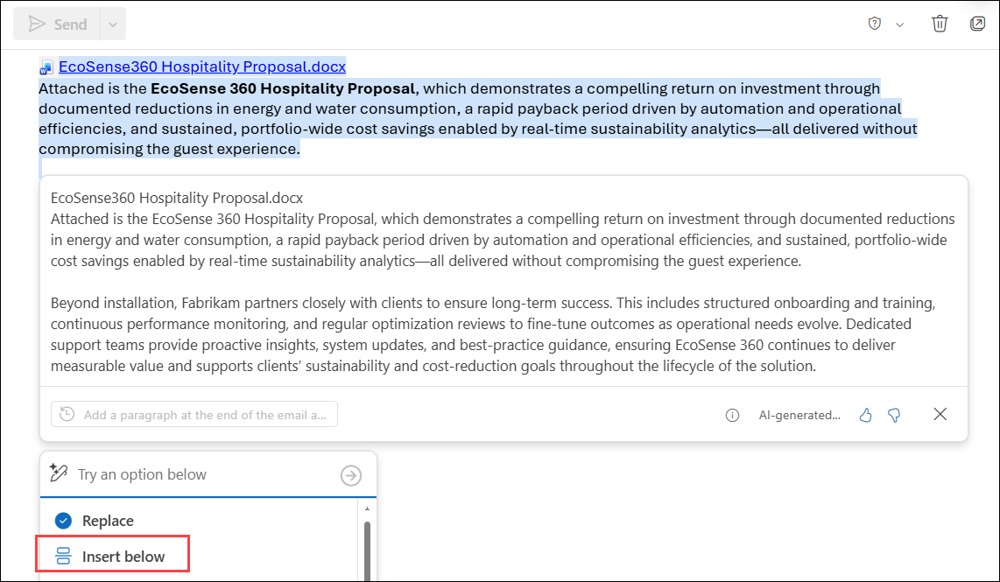
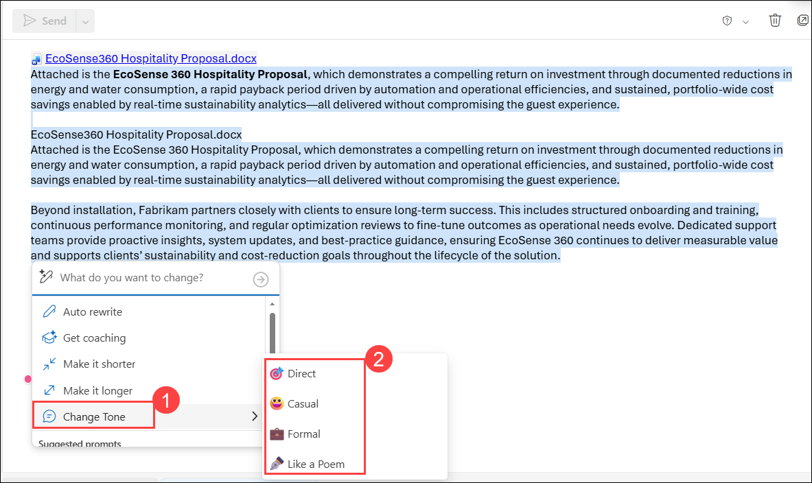
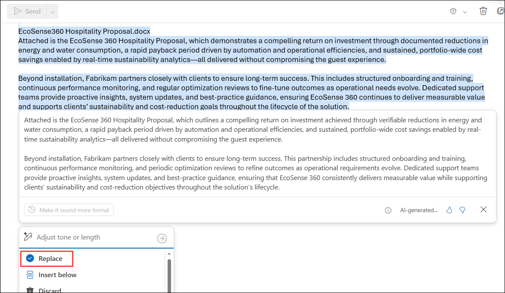

# Exercise 1, Task 4: Use Copilot in Outlook to personalize your outreach

## Scenario

At this point, you used Microsoft 365 Copilot to help complete your market research and create a sales proposal. You’re now ready to start building relationships. Your first target is the Contoso Hospitality Group, a major hotel chain known for its sustainability initiatives. You identified their VP of Operations as the key decision-maker and want to send a personalized email introducing Fabrikam’s EcoSense 360 solution.

You want to use Copilot in Outlook to craft a professional, persuasive message that references key industry challenges and positions Fabrikam as the ideal partner to help Contoso reduce energy costs and enhance operational efficiency.

## Lab Overview

In this hands-on lab, you will use Copilot in Outlook to create and refine a personalized outreach email for a prospective hospitality customer. You will leverage insights from a sales proposal to craft persuasive messaging, incorporate ROI benefits, add post-installation partnership details, and adjust the email tone to suit the target audience. The final email will be designed to support relationship building and sales engagement efforts.

## Task 4: Use Copilot in Outlook to personalize your outreach

In this task, you will use Copilot in Outlook to draft, refine, and personalize a sales outreach email using content from an existing proposal. You will enhance the message with ROI insights, partnership details, and tone adjustments to create a compelling communication for hotel decision makers.

1. In Microsoft Edge browser, navigate to the **Microsoft 365** home page, select **App launcher** in the navigation pane, and then select **Outlook**.

2. In **Outlook on the web**, create a **new email**. Select **Attach (1)**, and then choose **OneDrive (2)** to browse and then attach the **EcoSense360 Hospitality Proposal.docx** file that you created in the prior task.

     

3. In the body of the message, select the **Open Copilot** (pencil) icon that appears next to the attached file.

     

4. The Copilot window that appears contains a prompt field and a menu of edit options below it. In the prompt field, enter the provided prompt.

    ```
    Create a professional email to the VP of Operations at Contoso Hospitality Group introducing Fabrikam's EcoSense 360 solution that references key insights from the attached sales proposal file. Keep the message concise and persuasive.
    ```

     

5. Review the results. if more details are needed. In the Copilot window that appears below the message, enter the provided prompt..

    ```
    Include key ROI details from the attached sales proposal.
    ```

     

6. Review the updated email. Notice how Copilot generated a new version of the email, which is draft 2 (2 of 2). You can select the back arrow to go to draft 1 of 2, which was the original version of the email that Copilot generated. To continue working with the latest draft, select the forward arrow to return to draft 2 of 2.

     

    >**Note:** For each request that you make, Copilot generates a new draft of the email. You can optionally navigate to a prior draft and keep it, or you can ask Copilot to modify that draft (rather than the last draft). By default, you typically make each new request while viewing the last draft.

7. To improve readability, ask Copilot to present the ROI statistics in a bulleted list. If the ROI statistics are already displayed as a bulleted list, ask Copilot to convert them to paragraph form.

8. Review the results (which is now draft 3 of 3). Once satisfied with the draft, In the Copilot menu, select the **Insert below** option to add it to the email.

     

    > **TIP:** If you preferred one of the earlier drafts, you could select the forward or backward arrows to go to the preferred draft. Ensure the draft you want to use is displayed when you select the **Insert below** option.

9. Review the results. Copilot should have inserted the draft into the actual body of the email. Now, once you use Copilot to draft the initial email, you can still use it to modify the email even after inserting the draft.

    - When modifying an actual email message, you must highlight the portion of the email that you want changed, whether it be a sentence, paragraph, or the entire email.

    - Or if you want Copilot to add more text to the email, you must position the cursor where you want Copilot to insert the text.

10. Select the **Open Copilot** icon. In the Copilot window that appears, ask Copilot. 

    ```
    Add a paragraph at the end of the email about how Fabrikam partners with its clients during post-installation.
    ```

     

11. Review the results. Note how Copilot displayed this content in the email and highlighted just this text. Only this highlighted content applies to the Copilot window that appears below it. You can continue to make more changes to this highlighted content just as you did with the initial email draft, or you can accept it as is. Review the generated paragraph, and then select **Insert below**.

     

13. Review the email, select all content, and then select the **Open Copilot** icon.

14. In the Copilot menu, scroll down and select **Change Tone (1)** and then select the tone that you want from the menu that’s displayed **(2)**.

    

15. Review the results of the modified email that appears in the draft window. If desired, select a different tone and review the updated draft.

16. Review the results. Ask Copilot to make the tone friendly and confident while remaining professional.

17. Review the results. Use the draft navigation arrows to compare the available drafts. Once the preferred draft is displayed, select the **Replace** option to replace the highlighted content in the email with this selected draft version.

    

18. Note how Copilot replaced the original version of the email with this modified version. Now that the email is finished, feel free to send it to your personal email address. If you do, verify you received the email and it contains the attached document.


## Summary

In this exercise, you used Copilot in Outlook to create a professional outreach email introducing EcoSense 360 to a hospitality customer. You refined the email by incorporating proposal-based insights, highlighting ROI benefits, adding post-installation support messaging, and adjusting the tone to improve engagement. The completed email provides a personalized and persuasive communication that can help initiate meaningful sales conversations.

## You have successfully completed the task. Click on Next >> to proceed with the next exercise.

