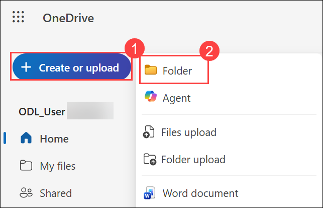
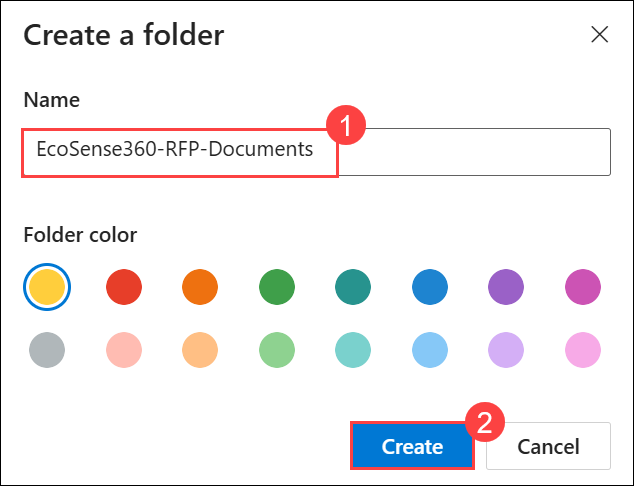
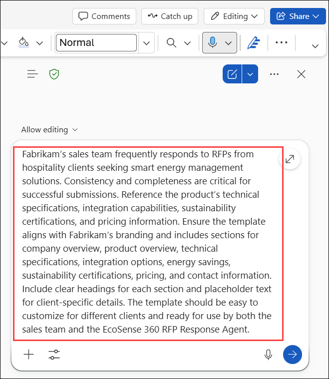
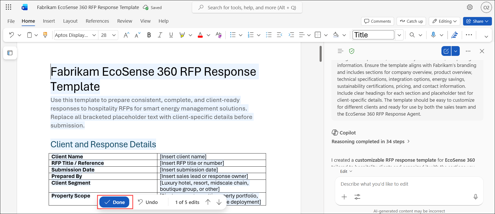
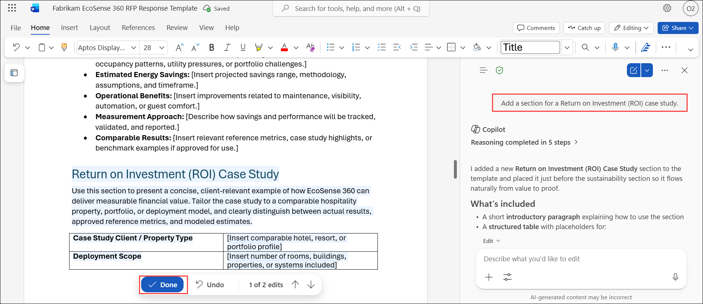
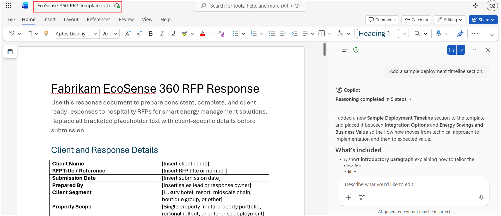

# Exercise 2, Task 1: Use Copilot in Word to generate a standard RFP response template

## Scenario

Before you begin building the EcoSense 360 Request for Proposal (RFP) Response Agent, it’s essential to have a standard RFP response template in place. This template can serve as the foundation for both manual responses and for the agent’s automated answers, ensuring consistency and professionalism across all submissions.

Your goal in this task is to use Copilot in Word to generate a customizable RFP response template for EcoSense 360, targeted at hotels and resorts. By creating the template first, you provide the agent with a structured document it can reference when responding to client inquiries. This approach allows you to test the agent’s capabilities using realistic, branded content and ensures that every automated response aligns with Fabrikam’s standards.

To create this template, you plan to define its purpose, specify required sections (such as company overview, technical specifications, integration options, sustainability highlights, and pricing), and format it for easy customization. Once the template is ready, you plan to use it as a knowledge source when building and testing your EcoSense 360 RFP Response Agent in Copilot Studio.

## Lab Overview

In this hands-on lab, you will use Copilot in Word to create a standardized RFP response template for EcoSense 360 that can be used by both sales teams and an AI-powered RFP Response Agent. You will define key proposal sections, enhance the template with ROI and deployment planning content, and prepare it as a reusable knowledge source. The completed template will help ensure consistent, professional, and scalable responses to customer RFPs.

## Task 1: Use Copilot in Word to generate a standard RFP response template

In this task, you will use Copilot in Word to generate and refine a customizable RFP response template for hospitality customers. You will add essential business and technical sections, then save the document as a reusable template for future sales engagements and agent-based responses.

1. Navigate to OneDrive, click on **+ Create or upload (1)** and then select **Folder (2)**.

    

1. In the **Create a folder** dialog, enter **EcoSense360-RFP-Documents (1)** as the folder name, and then select **Create (2)**. This folder will be used to store the RFP template and supporting documents that will serve as knowledge sources for the EcoSense 360 RFP Response agent.

    

2. Navigate to the **Microsoft 365** home page, select **App launcher** in the navigation pane, and then select **Word** from the **App launcher** menu.

3. In **Word for the web**, create a blank document.

4. On the word document, select **Copilot** icon located at the bottom-right corner of the screen to open the Copilot pane. In the Copilot pane, verify the **Allow editing** icon appears in the prompt field next to the plus (+) sign.

5. In the prompt field that appears in the Copilot pane, ask Copilot to create a standard RFP response template.

   ```
   Fabrikam’s sales team frequently responds to RFPs from hospitality clients seeking smart energy management solutions. Consistency and completeness are critical for successful submissions. Reference the product’s technical specifications, integration capabilities, sustainability certifications, and pricing information. Ensure the template aligns with Fabrikam’s branding and includes sections for company overview, product overview, technical specifications, integration options, energy savings, sustainability certifications, pricing, and contact information. Include clear headings for each section and placeholder text for client-specific details. The template should be easy to customize for different clients and ready for use by both the sales team and the EcoSense 360 RFP Response Agent.
   ```

    

1. After reviewing the generated template, select **Done**, and then enter the provided prompt to add a **Return on Investment (ROI) case study** section.

    

   ```
   Add a section for a Return on Investment (ROI) case study.
   ```

1. Review the updated template. To include a sample deployment timeline, select **Done**, and then enter the provided prompt in the **Copilot** prompt box.

    

   ```
   Add a sample deployment timeline section.
   ```

8. Review the results. At this point, you can make any final changes to the template that you want. For example:

    - For this exercise, remove any reference to the term “Template.” While this is a template document, you don’t want customers to see this term in the official response they receive from Fabrikam.

    - Review all placeholders to make sure they’re clear. Update any that might cause confusion.

    - Make any other changes that you want, such as adjusting section headings or content.

    If you need Copilot’s help at this point, request your changes in the Copilot pane.

9. Once you’ve finished making changes, save the document as a **Word template (.dotx)** named **EcoSense_360_RFP_Template.dotx** (don’t save it as a .docx file). Save the template file in the **EcoSense360-RFP-Documents** folder that you created in your OneDrive at the start of this task. Doing so makes it available to the EcoSense 360 RFP Response agent that you create in Task 3.

    

## Summary

In this exercise, you used Copilot in Word to create a comprehensive RFP response template for EcoSense 360. You enhanced the template by adding ROI case study and deployment timeline sections, refined the content for customer-facing use, and prepared it as a reusable Word template. The completed template serves as a standardized foundation for both manual RFP responses and automated responses generated by the EcoSense 360 RFP Response Agent.

## You have successfully completed the task. Click on Next >> to proceed with the next exercise.

