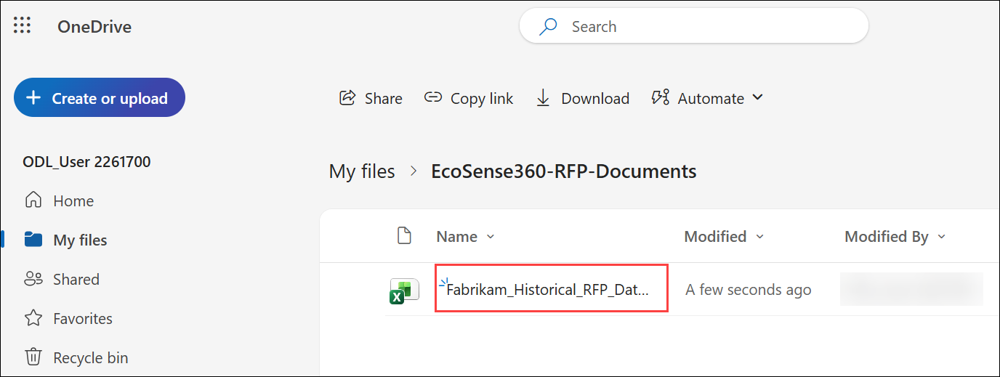
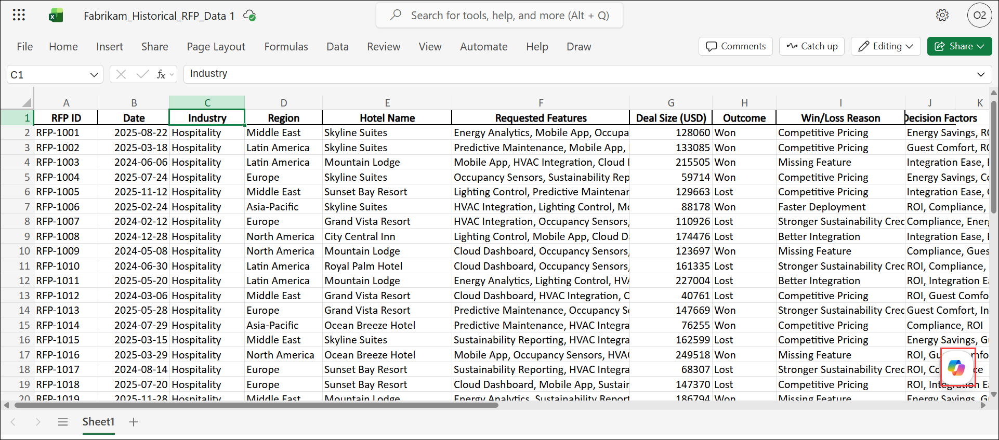
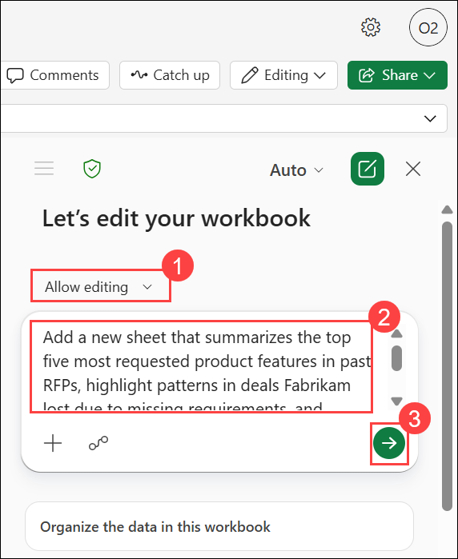
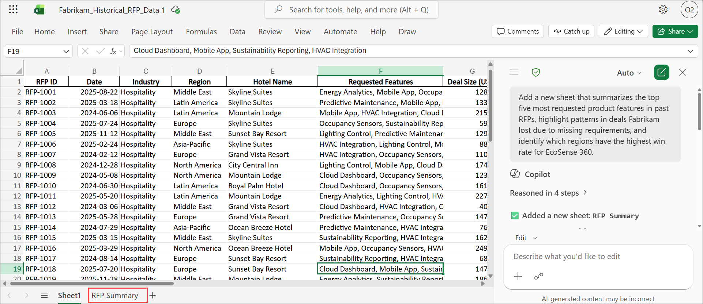

# Exercise 2, Task 2: Use Copilot in Excel to analyze historical RFP data

## Scenario

Before you can finalize what your EcoSense 360 RFP Response Agent should know, you need data to guide your priorities when responding to RFPs. Fabrikam’s Sales Operations team maintains a record of past RFP submissions, including details on requested features, deal size, and won/loss outcomes.

Using Copilot in Excel, you plan to analyze this historical RFP data to uncover patterns, such as:

- What are the top requested features?
- Which requirements are most important to hotel clients?
- Where has Fabrikam lost deals in the past?

These insights can help ensure that the EcoSense 360 RFP Response Agent focuses on the topics that matter most to prospective customers and avoids common pitfalls in future RFPs.

## Lab Overview

In this hands-on lab, you will use Copilot in Excel to analyze historical RFP data and identify patterns that can improve future proposal responses. You will uncover trends in customer requirements, deal outcomes, and regional performance, then generate visualizations that highlight key business insights. These findings will help prioritize the knowledge and recommendations provided by the EcoSense 360 RFP Response Agent.

## Task 2: Use Copilot in Excel to analyze historical RFP data

In this task, you will use Copilot in Excel to analyze historical RFP submissions and generate actionable insights. You will create summaries and visualizations that reveal customer priorities, win/loss trends, and regional performance patterns.

1. Uploade the **Fabrikam_Historical_RFP_Data.xlsx** file to the **EcoSense360-RFP-Documents** folder that you created in your OneDrive in the prior task. Doing so makes it available to the EcoSense 360 RFP Response agent that you plan to create in Task 3.

1. Navigate to **OneDrive**, locate the **Fabrikam_Historical_RFP_Data.xlsx** file in the **EcoSense360-RFP-Documents** folder, and then open the file in **Excel for the web**.

    

5. From the Excel workbook, select the **Copilot** icon located at the bottom-right corner of the screen to open the Copilot pane. In the Copilot pane, leave the response mode selector set to **Auto**. Then verify the **Allow editing (1)** icon appears in the prompt field next to the plus (+) sign. 

    

1. To identify insights that can guide the EcoSense 360 RFP Response Agent’s content priorities, enter the provided prompt in the **Copilot** prompt box.

   ```
   Add a new sheet that summarizes the top five most requested product features in past RFPs, highlight patterns in deals Fabrikam lost due to missing requirements, and identify which regions have the highest win rate for EcoSense 360.
   ```

    

    

1. Review the generated insights. To create visual summaries of key RFP insights. Ask Copilot to generate the following visualizations of key RFP insights, each of which should be added to a new sheet:

    - Create a bar chart showing the top five most requested features in past RFPs.

    - Generate a stacked column chart of win/loss outcomes by requested feature.

    - Make a bar chart of the frequency of key decision factors in won deals.

    - Show a pie chart of win rates by region.

    - Create a pivot table and heatmap comparing average deal size for won vs. lost RFPs.

      > **Note:** During testing, Copilot in Excel usually generated the first few visuals before running into an internal issue where it couldn’t generate the remaining requests. Due to time constraints with this training, proceed to the next task if you experience this issue. Don’t wait and try again later. Remember, Copilot is still a work in progress, so sometimes these types of issues occur.

## Summary

In this exercise, you used Copilot in Excel to analyze historical RFP data and identify the factors that influence proposal success. You generated summaries of requested features, deal outcomes, and regional performance, while creating visualizations to highlight key trends and opportunities. These insights provide valuable guidance for improving future RFP responses and enhancing the effectiveness of the EcoSense 360 RFP Response Agent.

## You have successfully completed the task. Click on Next >> to proceed with the next exercise.

