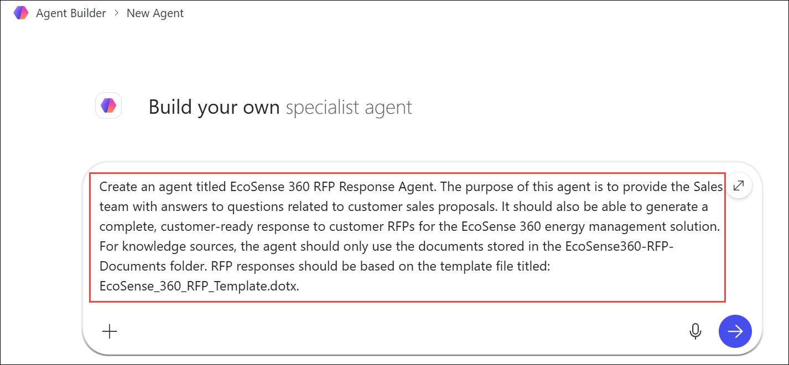
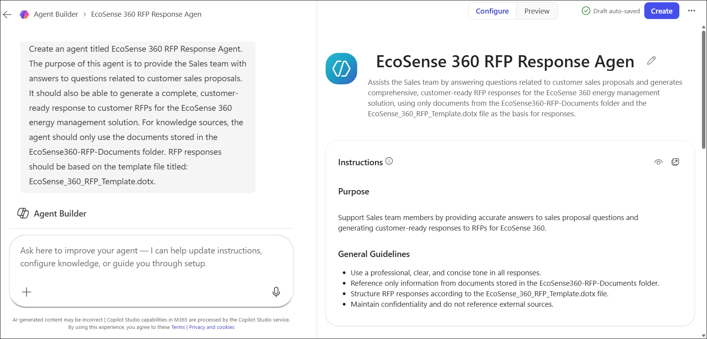
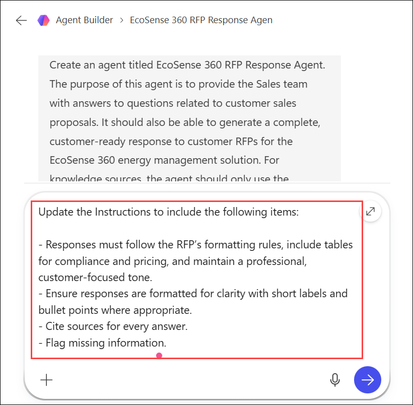
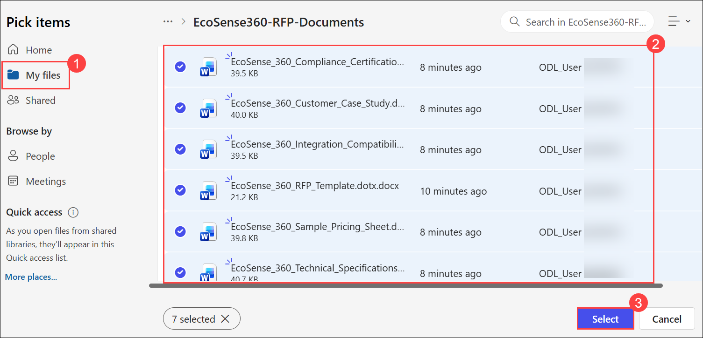
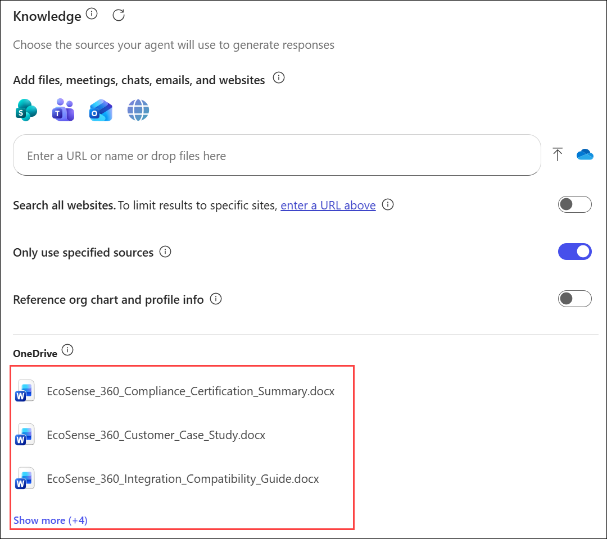
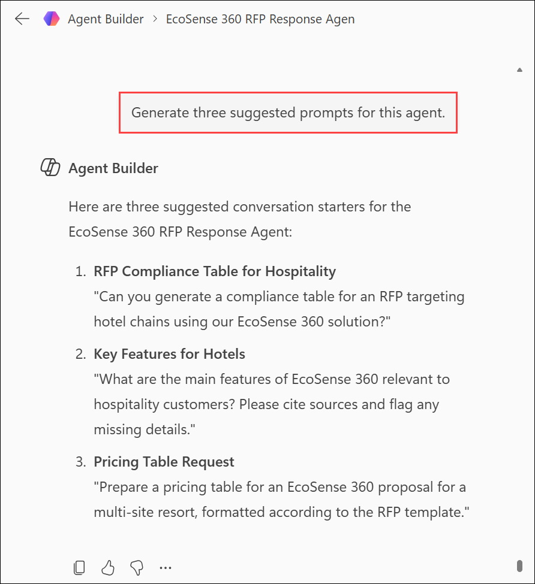
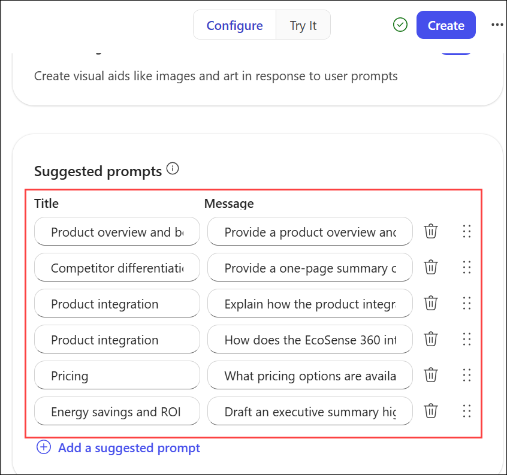
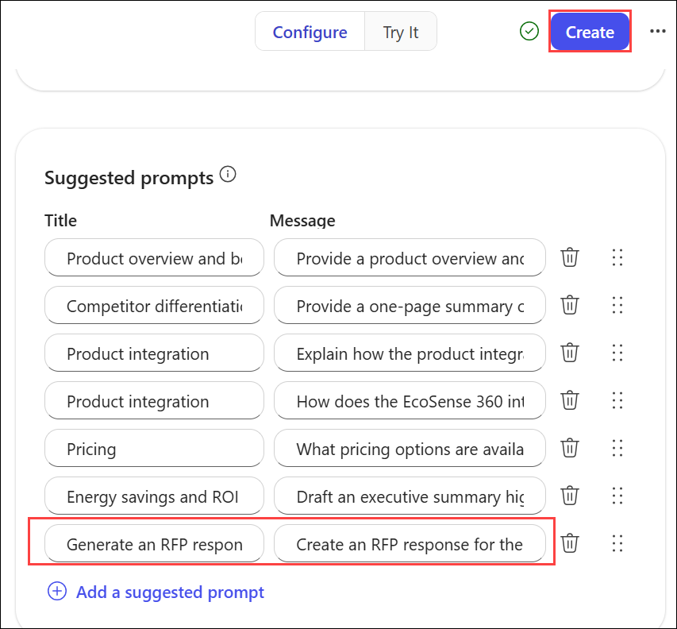
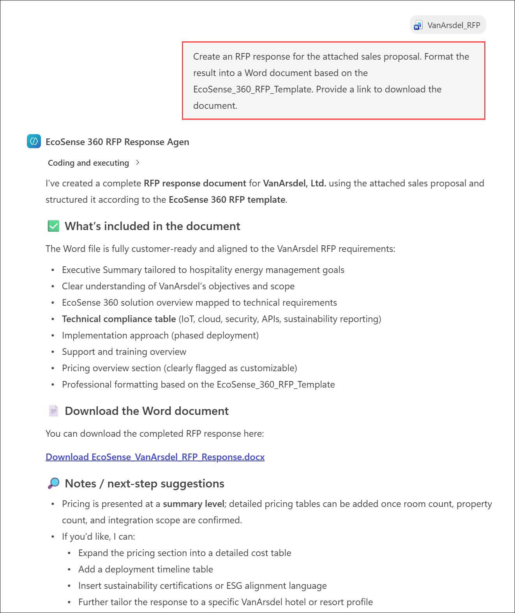
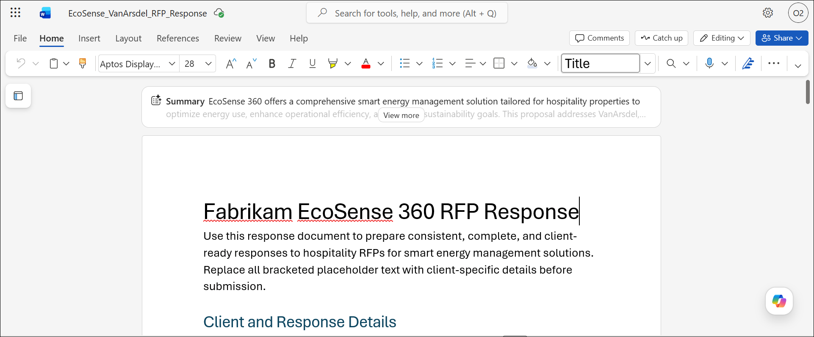

# Exercise 2, Task 3: Use Copilot Studio to build an RFP response agent

## Scenario

While Fabrikam’s sales success with EcoSense 360 generated strong interest from hotels and resorts, it also created a new challenge. The Sales team is spending hours each week responding to early-stage RFPs that ask similar questions about integrations, energy savings, and product capabilities. To address this bottleneck, Fabrikam's VP of Sales tasked you with developing a Copilot agent that can automatically handle these initial inquiries. 

You plan to use Copilot Studio to build an agent that performs two functions: first, it provides preliminary answers drawn from existing EcoSense 360 product materials, and second, it generates a response for a submitted RFP. This agent should reduce response times, free the Sales team to focus on higher-value opportunities, and give prospective clients a faster, more engaging experience.

>**Note:** In this exercise, you use the Copilot Studio lite experience to create the EcoSense 360 RFP Response Agent. This simplified experience is designed for everyday business users and requires no programming skills. By contrast, software developers who build more complex, advanced agents typically use the full Copilot Studio experience.

## Lab Overview

In this hands-on lab, you will use Copilot Studio to build an AI-powered RFP Response Agent for EcoSense 360. You will configure the agent with instructions, knowledge sources, and suggested prompts, enabling it to answer product-related questions and generate customer-ready RFP responses. The completed agent will help streamline sales activities and improve response consistency across hospitality opportunities.

## Task 3: Use Copilot Studio to build an RFP response agent

In this task, you will use Copilot Studio Agent Builder to create and configure an RFP Response Agent for EcoSense 360. You will define agent behavior, attach knowledge sources, create suggested prompts, and test the agent’s ability to generate accurate RFP responses.

1. Upload the below documents in **EcoSense360-RFP-Documents** folder that you created in your OneDrive in Task 1. These documents provide the knowledge sources for the EcoSense 360 RFP Response Agent.

    * EcoSense_360_Compliance_Certification_Summary
    * EcoSense_360_Customer_Case_Study
    * EcoSense_360_Integration_Compatibility_Guide
    * EcoSense_360_Sample_Pricing_Sheet
    * EcoSense_360_Technical_Specifications

3. Open a new tab in your Microsoft Edge browser and then open Microsoft 365.

4. In Microsoft 365, select **New agent** in the navigation pane. Doing so opens Copilot Studio’s **Agent Builder** and displays the **New agent** page.

     

5. On the **New Agent** page, you want to ask Copilot to create an agent. In the prompt, you should enter the agent’s name and a general description of what the agent is about, who its target audience is, and what you want it to do. 
    
    - For this agent, enter the following prompt and then select the forward arrow (Send) icon to submit the prompt:  
    
    ```
    Create an agent titled EcoSense 360 RFP Response Agent. The purpose of this agent is to provide the Sales team with answers to questions related to customer sales proposals. It should also be able to generate a complete, customer-ready response to customer RFPs for the EcoSense 360 energy management solution. For knowledge sources, the agent should only use the documents stored in the EcoSense360-RFP-Documents folder. RFP responses should be based on the template file titled: EcoSense_360_RFP_Template.dotx.
    ```

     

6. After you selected the forward arrow, the **Agent Builder** form appeared for your new agent. At the top of the form is a **Configure** tab and a **Try it** tab.
    
    - The **Configure** tab enables you to define the detailed settings that drive the agent..
    - The **Try it** tab enables you to test the agent by entering prompts and receiving responses based on the agent’s instructions and knowledge sources.

    Wait a minute or two for Copilot to create the agent, at which time it displays the agent’s name and description in the **Agent preview** pane.

     

7. Let’s see what Copilot did based on the prompt that you entered.

8. On the **Configure** tab, the **Name** and **Description** fields should be filled in based on the prompt that you entered. Scroll down to the **Instructions** field. Copilot generated these instructions based on the description that you provided in your initial prompt. Review the detailed level of instructions that Copilot generated.

    > **!IMPORTANT:** The beauty of the Agent Builder process is that Copilot automatically translates your basic, natural language description into a complex set of instructions. This process saves you from creating this detailed instruction set on your own.

9. If you wish to change the instructions, you can either manually edit them directly in the **Instructions** field, or you can ask Copilot to update the instructions for you. 

1. After reviewing the instructions, enter the provided prompt in the prompt box.

    ```
    Update the Instructions to include the following items:
    
    - Responses must follow the RFP’s formatting rules, include tables for compliance and pricing, and maintain a professional, customer-focused tone.
    - Ensure responses are formatted for clarity with short labels and bullet points where appropriate.
    - Cite sources for every answer.
    - Flag missing information.
    ```

     
    
10. Review Copilot’s response after updating the instructions. To verify the changes that Copilot made, in the **Configure** tab scroll down to the **Instructions** field. Verify that Copilot added the new instructions that you requested.

11. To identify additional improvements, enter the provided prompt in the prompt box.

     ```
     What additional instructions would you recommend to improve this agent's ability to generate high-quality RFP responses for hospitality customers?
     ```

1. To identify additional improvements, enter the provided prompt in the prompt box.

     ```
     Add all of the recommended improvements to the agent instructions.
     ```

13. Once Copilot responds that it updated the instructions, in the **Configure** tab scroll through the **Instructions**. Note the new items that Copilot added.

14. In the **Configure** tab, scroll down to the **Knowledge** section and verify the **Search all websites** toggle switch is **disabled**. Copilot should have disabled this toggle switch when it created the agent based on the description you provided in your original prompt, which told it to only use the files stored in the EcoSense360-RFP-Documents folder. If the toggle switch is enabled, then disable it now.

     

15. In the **Knowledge** section, select the **Attach cloud files** icon that appears next to the **Enter a URL or name or drop files here** field. In the **File Explorer** window that appears, navigate to your **OneDrive** folder and select the **EcoSense360-RFP-Documents** folder. Select all of the files in this folder and then select the **Open** button.

     

     

16. Scroll to the bottom of the **Knowledge** section and verify all the selected documents appear in the list of **Uploaded files**.

     

17. For **Suggested prompts**, you can have Copilot generate prompts for you, or you can manually create your own prompts. Let’s try both methods. 
    - To have Copilot generate suggested prompts, in the **Describe** tab enter the below prompt .

    ```
    Generate three suggested prompts for this agent.
    ```

     

18. To enter several of your own prompts. in the **Configure** tab scroll down to the **Suggested prompts** section. You should see the three prompts that Copilot added to the agent. 
    
    - For each prompt that you want to manually add, select the **Add a suggested prompt** option that appears below the prompts. 
    
    - Six suggested prompts are displayed below that ask questions about the EcoSense 360 energy management solution. Review these prompts, select two or three that you like, and then add them to the agent.
    
    - **Title:** Product overview and benefits
        - **Message:** Provide a product overview and list of benefits.
            
    - **Title:** Competitor differentiation
        - **Message:** Provide a one-page summary of differentiators compared to competitors.
            
    - **Title:** Product integration
        - **Message:** Explain how the product integrates with existing hotel management systems.
            
    - **Title:** Product integration
        - **Message:** How does the EcoSense 360 integrate with HVAC and lighting systems?
            
    - **Title:** Pricing
        - **Message:** What pricing options are available for large resort chains?
            
    - **Title:** Energy savings and ROI
        - **Message:** Draft an executive summary highlighting energy savings and ROI for hotels.
    
     

19. Test several of the suggested prompts. Verify the agent is correctly pulling in data from the knowledge source documents.

20. Add a final suggested prompt that asks the agent to generate an RFP document based on an attached sales proposal file.

    Add the following suggested prompt (which you test in later steps):  
    
    - **Title:** Generate an RFP response
      - **Message:** Create an RFP response for the attached sales proposal. Format the result into a Word document based on the EcoSense_360_RFP_Template. Provide a link to download the document.

21. The agent’s configuration is now complete, so select the **Create** button to create the agent.

      

22. Once the agent is created, a dialog box appears that indicates the agent was successfully created. In this dialog box, you can either go to the agent or share it. Select the **Go to agent** option.

      

    > [!NOTE]
    > At this stage, the agent is private and accessible only to you. In a real-world scenario where the agent needs to be used by multiple team members, you would share it with those individuals. For this training exercise, sharing isn’t required since you’re working within your own tenant.

23. To test the final suggested prompt that you added earlier, which creates an RFP response to a sales proposal. 
    
    - In the **EcoSense 360 RFP Response Agent** window, select the **Generate an RFP response** suggested prompt (**Create an RFP response for the attached RFP**). Attach the **VanArsdel_RFP.docx** file from your OneDrive account and then submit the prompt.

       

24. Review the results. One of two results might occur:

     - During our testing, Copilot indicated that it couldn’t generate a downloadable Word document. If this situation happens to you, then select the **Copy** option at the end of the results to copy the RFP response to your clipboard. Then open **Word**, paste in the copied text, delete any extraneous verbiage that might appear at the start and end of the results, and then save the file to your OneDrive as **VanArsdel-RFP-Proposal.docx**. Leave the file open.

     - Since Microsoft 365 Copilot is still a work in progress, it might provide a downloadable Word document for you by the time you perform this exercise. If Copilot generates the document, select the link to download it, and then open the downloaded Word document.

       

       > [!IMPORTANT]
       > Before creating the Word document or downloading the generated document (if it’s able to do so), review the suggested prompts at the end of the results. Feel free to submit any of these prompts if you want the agent to update the results. For example, it might ask whether you want to include a cover page and table of contents. Or, it might ask if you want it to make more updates, such as expanding the compliance matrix with more requirements. Now is your opportunity to have the agent customize the RFP response with any extra features.

25. Review the RFP response in the Word document. Remember, the agent used the predefined template file titled **EcoSense_360_RFP_Template.dotx** as the basis for its response. If it didn’t fill out any of the fields in the template, then you must manually update them yourself (or remove or replace them). 
    
    - At this point, you can still use the agent to help you. If you want, you can optionally submit a prompt to the agent that contains your query and then copy and paste the result into the RFP response file where appropriate.

      

26. Leave the **VanArsdel-RFP-Proposal.docx** open as it’s used in the final task in this exercise.

## Summary

In this exercise, you used Copilot Studio to create an RFP Response Agent that leverages product documentation, templates, and supporting materials to answer customer inquiries and generate proposal responses. You enhanced the agent with detailed instructions, curated knowledge sources, and custom prompts to improve response quality and consistency. The completed agent provides a scalable solution that helps reduce manual effort while delivering professional and accurate RFP responses.

## You have successfully completed the task. Click on Next >> to proceed with the next exercise.

