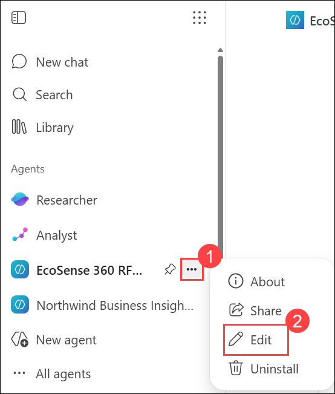
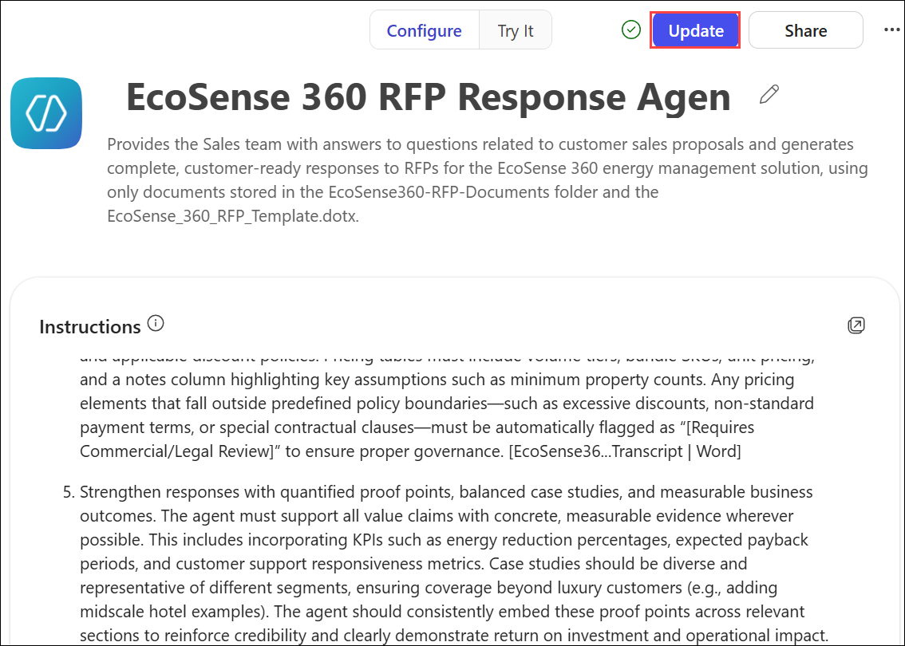
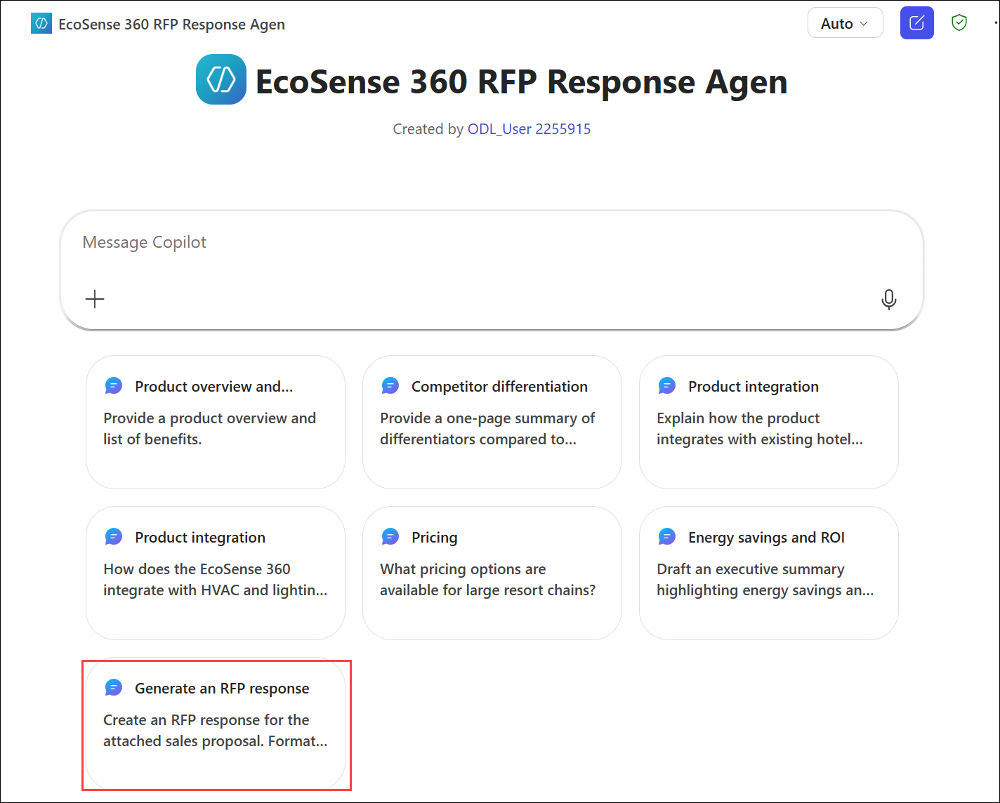
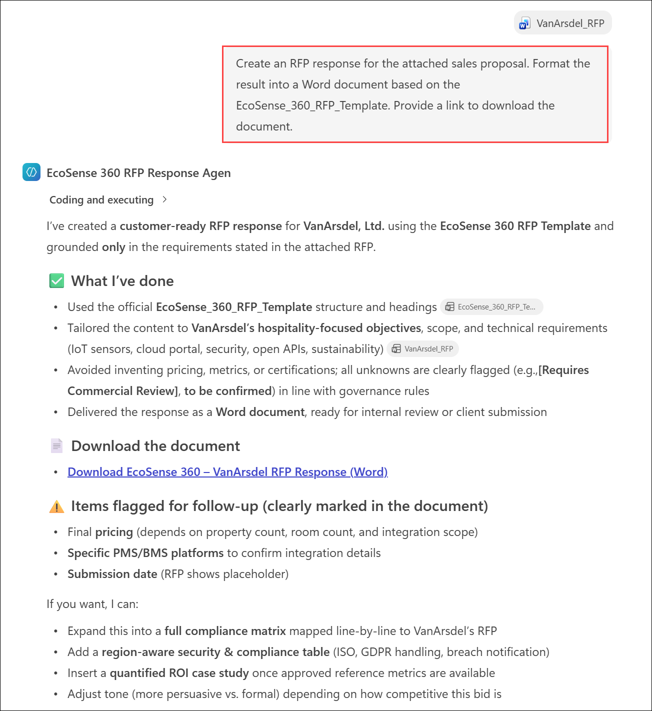

# Exercise 2, Task 5: Use Copilot Studio to update the instructions for the RFP response agent

## Scenario

In the previous task, you used Copilot in Teams to analyze the transcript from a cross-functional meeting involving colleagues from Sales, Product Management, and Engineering. The discussion focused on identifying actionable enhancements to the EcoSense 360 RFP Response Agent, with the goal of improving the quality and effectiveness of its RFP responses to increase proposal win rates. Copilot then synthesized the top five recommended improvements, which you captured for reference.

You’re now ready to use Copilot Studio to update the agent’s instructions, ensuring these new recommendations are incorporated to further strengthen the agent’s capabilities. Once you apply the update to the agent’s instructions, you plan to test the revised agent by having it generate a new response to the VanArsdel RFP. In doing so, you can compare this new response to the original RFP response that was generated in Task 3 to determine whether the agent applied the updated instructions.

## Lab Overview

In this hands-on lab, you will use Copilot Studio to enhance the EcoSense 360 RFP Response Agent by incorporating recommendations gathered from stakeholder feedback. You will update the agent’s instructions, test the revised behavior, and evaluate how the changes improve the quality and completeness of generated RFP responses. This process helps ensure the agent continues to evolve and better supports sales success.

## Task 5: Use Copilot Studio to update the instructions for the RFP response agent

In this task, you will update the EcoSense 360 RFP Response Agent with new instructions derived from meeting feedback. You will then test the updated agent and compare its latest RFP response against a previous version to assess the impact of the improvements.

1. In Microsoft Edge browser, select a new tab and open Microsoft 365.

2. In the Microsoft 365 navigation pane, under the **Agents** section, select the **ellipsis (...) (1)** icon that appears to the right of the **EcoSense 360 RFP Response Agent**. In the menu that appears, select **Edit (2)**.

    

   >**TIP:** The **Agents** section in the navigation pane only displays the most recently used agents. Since space is limited in the navigation pane, you might not see all your agents in this list. In the real world, if you need to access or edit an agent that doesn’t appear in this list of agents, then select **All agents** in the navigation pane. The **Agent Store** window that appears displays all your agents. If you want to use an agent, then select it in the **Your agents** section. If you want to edit it, then select the ellipsis icon that appears next to the agent, and then select **Edit** from the drop-down menu.

3. In the **EcoSense 360 RFP Response Agent**, Copilot Studio should display the **Configure** tab for the agent. In the **Configure** tab, scroll down to the **Instructions** field. 

4. At the end of the prior task, you copied to your clipboard the instructions that Copilot in Teams generated for the top five improvements that would make the biggest effect on improving the agent. Place your cursor at the end of the current instructions and paste in the copied instructions.

5. Scroll back up through the instructions to where the new instructions begin. If extraneous text was pasted in at the start of the new instructions (such as “Agent Instructions (EcoSense 360 RFP Response Agent)," then delete this extraneous line of text.

6. Select the **Update** button that appears at the top of the form.

    

7. In the **Your agent was updated successfully** dialog box that appears, select the **Go to agent** button. The agent is now ready to apply these top five improvements the next time it’s used.

8. With the updated instructions now in place, to test them out. On the **EcoSense 360 RFP Response Agent** window, select the **Generate an RFP response** suggested prompt (**Create an RFP response for the attached RFP**). Attach the **VanArsdel_RFP.docx** file from your OneDrive account and then submit the prompt.

    

9. Review the results. You don’t need to copy the results into a Word document. You can just view the response online that the agent generated.

    

10. At the end of Task 3, you were instructed to leave the **VanArsdel-RFP-Proposal.docx** open for use in this task. If you inadvertently closed the doc, then open it now. Compare the contents of the **VanArsdel-RFP-Proposal.docx** with the RFP response the agent just generated based on the updated instruction set. You should see the new content in this latest response that was generated based on the updated instructions to the agent. While everyone’s updated instructions might be different, here’s a sample of some things from the latest RFP response that we noticed during our testing based on the updated instructions that we applied:

    - The Executive Summary mentioned certifications that were supported.
    
    - The new response listed supported PMS vendors when it described platform interoperability. It also specified APIs (REST and GraphQL), authentication methods, event patterns, and rate-limit guidance.
    
    - Each RFP requirement was mapped to the corresponding control or certification with citation lines (for example, ISO 27001 Annex A, and SOC 2 Type II).
    
    - It added a dedicated Sustainability & ESG section, a compliance matrix that tied RFP asks to evidence, and SLA tables with clearly stated service levels and response times.
    
    - The currency was stated (USD by default) in every pricing section. It also included tax treatment, implementation effort ranges, optional services, discount policy, and any minimums (such as property count).
    
    - It presented volume tiers and bundle SKUs using consistent tables.
    
    - It also included a notes column for assumptions that materially affect price.
    
    - Deviations from policy were tagged as “Requires Commercial and Legal Review.”

## Summary

In this exercise, you used Copilot Studio to refine the EcoSense 360 RFP Response Agent by incorporating stakeholder-driven recommendations into its instruction set. You tested the updated agent by generating a new RFP response and comparing it with an earlier version to evaluate the enhancements. The updated agent demonstrated improved response quality, stronger compliance and technical coverage, and more detailed customer-facing content, helping increase the effectiveness of future RFP submissions.