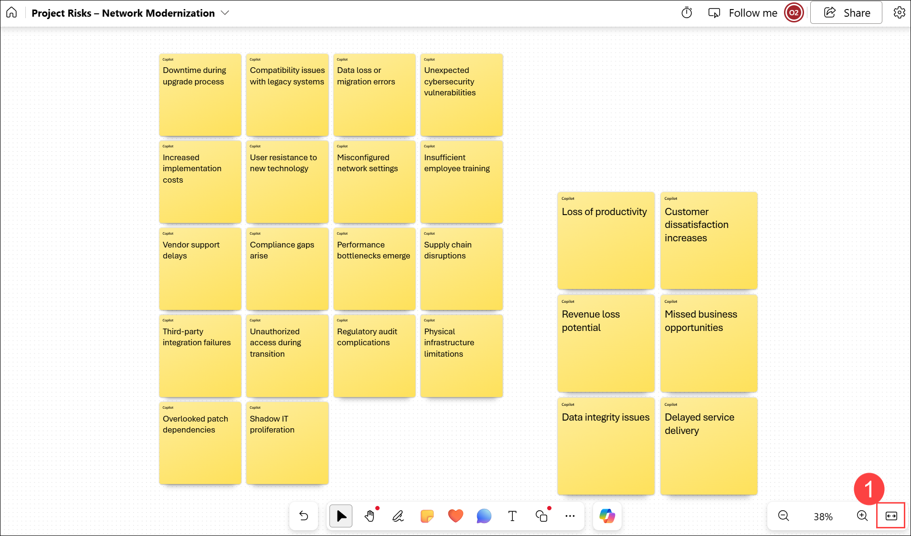
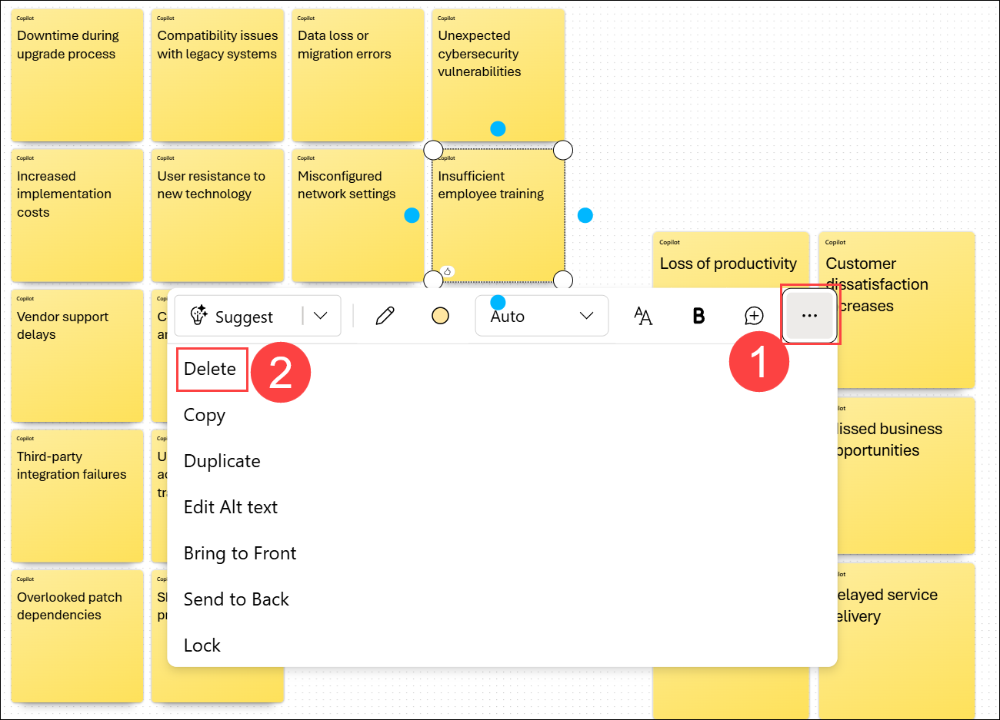
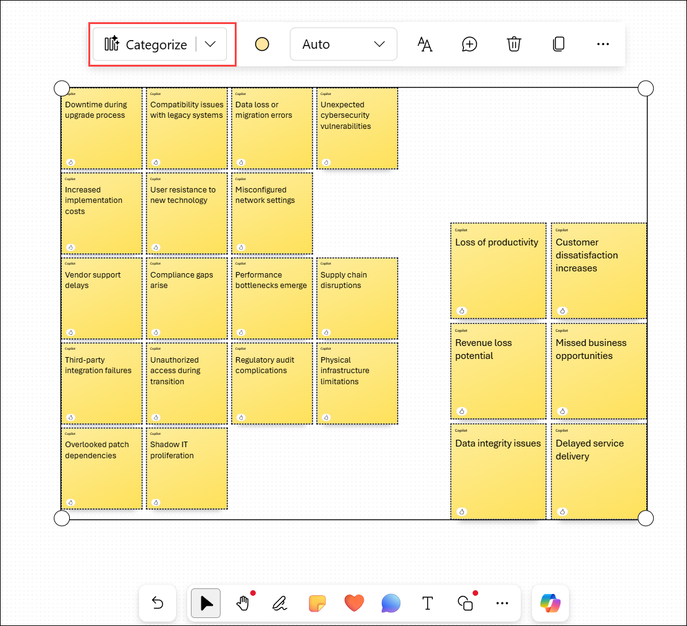
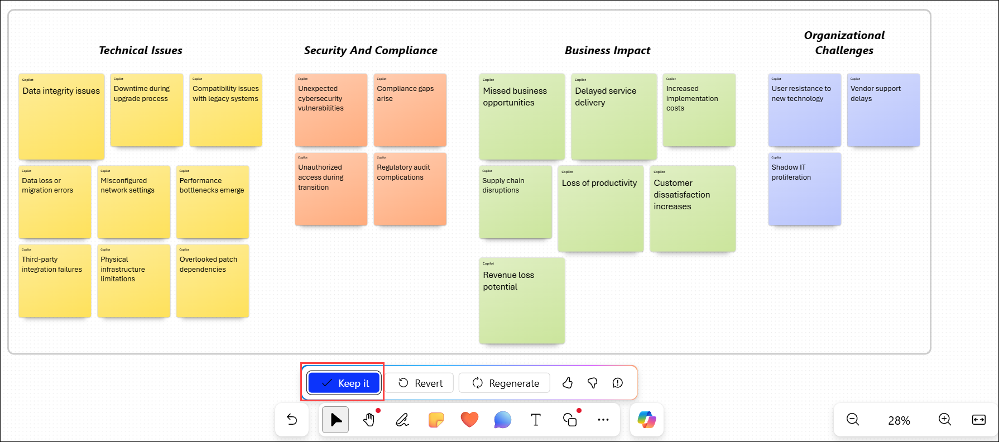
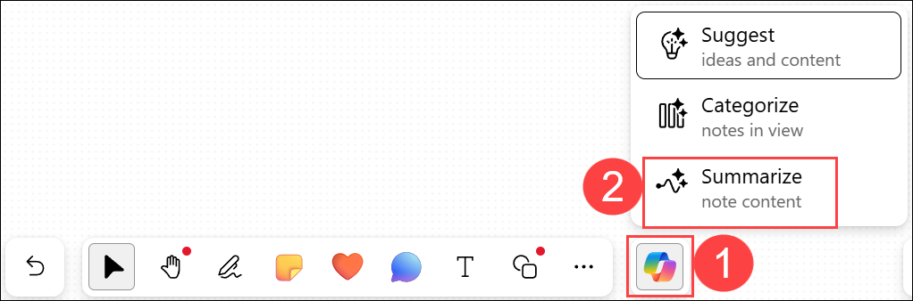

# Exercise 1 - Task 2: Use Copilot in Whiteboard to identify potential risks

## Estimated duration: 54 minutes

As the project moves into the planning phase, your IT team needs to identify potential risks that might affect schedule, budget, security, or operations. You’re responsible for facilitating a collaborative brainstorming session to capture and categorize all risks associated with the project. To achieve this goal, you plan to use Copilot in Microsoft Whiteboard to document these risks and group them into categories. Doing so can aid the IT team in developing mitigation strategies. Copilot in Whiteboard should base this list of risks on the project framework summary Word document that you created in Task 1 for the Network Modernization and Security Upgrade project.

Think of this exercise as basically an AI-assisted sticky-note exercise. Have you ever participated in a brainstorming session before that involved sticky notes? Meeting attendees write ideas on sticky notes and then stick them to a whiteboard or to a wall. From there, the meeting facilitator rearranges the notes by organizing them into various categories, removes duplicate ideas, edits ideas for clarification, and so on. When you finish the session, you end up with stacks of ideas, organized into categories.

Well, that's really what this exercise is - just a virtualized sticky-note exercise, all with the help of Copilot in Whiteboard. However, instead of having a room full of people brainstorming ideas and writing them on sticky notes, Copilot takes their place. Watch as Copilot generates a list of ideas, writes each one on a graphical sticky note, and attaches each note to your Whiteboard canvas. As the meeting facilitator, you can then edit and delete any of the notes. And then with your final list of notes in place, Copilot can organize them into various categories. Doing so aids future documentation and helps ensure that none of the notes are overlooked when creating the project plan.

1. In the **Microsoft 365 Copilot Chat** window, select the **Apps (1)** icon in the navigation pane. In the **Apps** menu that appears, select **More apps (2)**. 

   

1. Under the top section of apps in the **Apps** window, select **All apps→ (1)**. In the **All apps** window, scroll down and select **Whiteboard**.

   

   
   
1.  In **Whiteboard for the web**, click on **+ New Whiteboard** to start a new Whiteboard session.

      

      >**NOTE:** If prompted for login, click on the already signed account.

      > **NOTE:** Click on **Later** if there is any pop-up.

1. The **Board name** for this session defaults to **Whiteboard (1)**. Select this field and change the **Board name** to **Project Risks – Network Modernization (2)** and then click on **✓ (3)** to save the name.

   

4.  Select the **Copilot** icon next to the menu bar at the bottom of the page and then select **Suggest** from the menu that appears.

      

5.  In the **Suggest content with Copilot** window, ask **Copilot** within Whiteboard with the below prompt.
      ```
      Suggest a list of possible risks to upgrading a company’s corporate network infrastructure to improve performance, enhance cybersecurity, and support hybrid work.
      ```
6.  By default, Copilot in Whiteboard generates ideas in groups of six. In the **Suggest content with Copilot** window that appears, note the first six ideas that it generated. Copilot gives you two options here - you can either attach the ideas to your whiteboard if you're satisfied with the suggestions, or you can have Copilot generate more suggestions. Notice how the **Insert (6)** button indicates the number of ideas that Copilot generated - in this case, six. While six suggestions are a good starting point, you want to dig deeper into the potential risks, so select the **Generate more** button. Note how Copilot generated another six ideas, so the **Insert (12)** button now displays 12. 
Generate at least **18 risks**, if not more, and then insert them on to your Whiteboard canvas.

      

1. Notice how Copilot attaches the suggested ideas to your whiteboard in the form of yellow sticky notes. 

      

1. As with a real-world brainstorming session involving actual sticky notes, you can edit a particular note, delete it, lock it from future removal, and so on. 

1. In **Microsoft Whiteboard**, these activities are supported through standard whiteboarding functionality. If you haven't used Whiteboard before, try selecting (double-click) a specific note, and then in the menu bar that appears above it, you can select the **Edit text** (pencil) icon or any of the other options. Selecting the ellipsis icon at the end of the menu bar displays a menu of more options, such as deleting the note. Again, the idea behind Microsoft Whiteboard is to mimic real-world sticky-note exercises. Feel free to edit any note as you wish.

8.  In looking at the risks, you notice that there are few, if any associated with network downtime. Select the **Copilot** icon at the bottom of the page and then select **Suggest** from the menu.

9.  In the **Suggest content with Copilot** window that appears, ask Copilot with the below prompt
      ```
      Suggest any risks associated with system downtime.
      ```
10. Insert the six risk mitigation ideas associated with system downtime. Note how the block of six notes is highlighted with a line around the block. This block of notes is known as a note grid. You can move or resize a note grid just like any other element on your whiteboard. As you resize a note grid, the sizes of all the sticky notes inside it adjust accordingly. If the block of six notes overlays on top of one of the existing blocks of notes, select one of the outside lines around the note grid and drag the entire block of six notes to the side so that it doesn't overlay any of the previous notes. If you run out of space on the screen and part of the block falls off the screen, select the **Fit to Screen (1)** icon on the bottom-right corner of the page to display all the notes on the screen (the **Fit to screen** icon appears when a block is partially off the screen). You might need to select the icon more than once to fit the content onto the screen.

      

11. After making one last review of your Whiteboard, you identified a note that you want to remove. Select a note that you no longer want, and then in the icon tray that appears, select the ellipsis icon and then select the **Delete** option.

      

12. At this point, you should be done editing the notes. You now want Copilot to organize them by category. When you categorize notes, Copilot determines the names of the categories and organizes the notes accordingly.

      > **NOTE:**  When you choose the option to categorize your notes, Whiteboard automatically selects the sticky notes that are currently in view on the canvas. In doing so, it displays the selected notes within a border. Notes outside the current viewport aren’t included within this border, so if you proceed immediately, those notes that are outside the border aren’t categorized.

13.  There are two ways to expand the selection so that all notes are included within the border:

        - **Show more notes on the screen**. When you select the Copilot option to categorize notes, Copilot grabs everything that’s in view and places them within the border. To avoid the situation where Copilot doesn’t include all the notes within the border, zoom out or pan until all the notes you want are visible.
    
        - **Select everything explicitly using a keyboard command**. Press **Ctrl+A** to select all objects on the canvas, including sticky notes that aren’t in view. Select one of the edges of the border and drag the entire selection of notes into the view on the canvas so that you can see all the notes.
      
1. For the purpose of this task, press **Ctrl+A** to select all the sticky notes on the whiteboard. With all notes selected, choose **Categorize** from the menu and review the results.

   

1. Copilot analyzes the notes, groups them into categories, and assigns a different color to each category for easier identification.

1. Notice the action bar that appears below the categorized notes. It provides the following options:

   - **Keep it**: Saves the categories generated by Copilot.
   - **Revert**: Returns the whiteboard to the original set of yellow sticky notes.
   - **Regenerate**: Generates a new categorization of the selected notes.

      > **NOTE:** You can select Regenerate as many times as needed until you're satisfied with the results. Each regeneration may rename categories, move notes between categories, or increase or decrease the number of categories.

1. When you're satisfied with the categorization, select **Keep it**.

   

1. To generate a summary of the brainstorming session, select the **Copilot** icon and then choose **Summarize**.

   

22.  You now want to save this summarization to a Word document so that you can include it as a resource in the PowerPoint presentation you create in the next task. In the **Summary** window that Copilot creates in your Whiteboard, highlight the text and then copy it to your clipboard **(Ctrl+C)**. 

1. Open a blank **Word** document from M365 portal apps section, paste in the Summary notes, and then save the file to your **OneDrive**. When you’re done, return to your Whiteboard.

## You have successfully completed the exercise. Click on Next >> to proceed with the next exercise.

