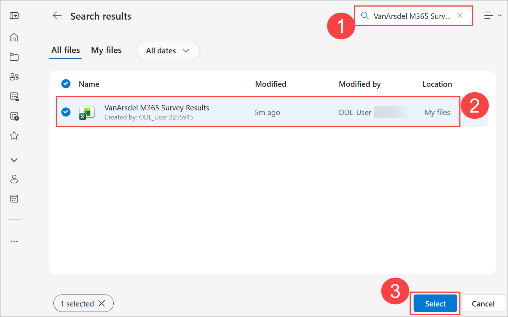

# Exercise 2 - Task 5: Use the Analyst agent to analyze survey results

## Estimated duration: 36 minutes

The survey results are in, so you must now brief the leadership team on adoption progress, user sentiment, and recommended next steps. To do so, you must analyze the survey data and produce a summary highlighting what’s working and where users need help.

By using the Analyst agent in Microsoft 365 Copilot, you plan to uncover trends, visualize adoption metrics, and generate a concise summary report. Your goal is to analyze the survey data to produce three charts, a five-bullet executive summary, and a short list of recommended IT actions to improve adoption.

  > **NOTE:**  To support the scenario used throughout this exercise, we created a spreadsheet containing employee survey responses to eight questions generated by the Surveys agent during our testing. The spreadsheet contains 500 fictitious employee responses for use in this training exercise.

1. In the **Microsoft 365 Copilot Chat** window, select the **Apps (1)** icon in the navigation pane. In the **Apps** menu that appears, select **Onedrive (2)**. 

   

1.  Search and select the following excel file that is present in Onedrive, **VanArsdel M365 Survey Results.xlsx**.

    

2.  Open the **VanArsdel M365 Survey Results.xlsx** spreadsheet and review the results. You might have to expand each column width to see the full extent of the answers. Close the spreadsheet once you’re done. 

3.  Return to Copilot Chat. In the Microsoft 365 navigation pane, select the **Analyst** agent.

    

4.  In the **Analyst** agent, click on **+ (1)** then select **Attach Cloud Files (2)**. on the popup wizard search and select the **VanArsdel M365 Survey Results.xlsx** spreadsheet.

    

1. On the popup wizard search **(1)** and select **(2)** the **VanArsdel M365 Survey Results.xlsx** spreadsheet then click on **Select (3)**.

    

5.  Ask the **Analyst** agent to analyze the attached employee survey results and provide the following feedback:

    ```
    - A five-bullet executive summary (top three positives, top two concerns)

    - Three charts: Adoption rate by department, Ease-of-use score distribution, Top blockers frequency

    - A prioritized list of five recommended IT actions (quick wins first)

    - Any statistically significant patterns (if present)

    ```

6.  Review the results. If the Analyst agent offers any suggested prompts, feel free to select and submit them if they interest you.

    

7.  Then provide the following prompt to Copilot.
    ```
    Are there any correlations that can be drawn from the data.
    ```
8. Review the response. If the Analyst agent offers any suggested prompts related to the correlations that it found, feel free to select and submit them if they interest you.

    

9. Since you’re one of the leaders from the IT department, you’re curious as to the responses from members of the IT department, ask the Analyst agent with the prompt.

    ```
    Filter the data to show responses from only the IT department.
    ```
10. Review the response. If the Analyst agent offers any suggested prompts related to the IT responses, feel free to select and submit them if they interest you.

    

1. Finally, ask the Analyst agent to produce a one-page executive summary report for download, along with a polished executive slide deck that contains all these insights and charts for leadership review.

12.  If the Analyst agent offers any suggested prompts related to these downloads, feel free to select and submit them if you wish.


13.  Download the summary report and the slide deck and review each document.

      

## Summary

In this lab, you explored how Microsoft 365 Copilot can support IT professionals across the entire lifecycle of project planning, communication, adoption, and analysis. You used Copilot to streamline project management activities, identify and assess risks, create executive-ready presentations, and improve stakeholder communication.

You also leveraged Microsoft 365 Copilot capabilities to drive technology adoption by researching upcoming Microsoft 365 features, creating user communications and best-practice guidance, designing feedback surveys, and analyzing adoption data to generate actionable insights. Through these exercises, you experienced how AI-assisted workflows can help IT teams improve productivity, enhance collaboration, accelerate decision-making, and deliver more effective outcomes with less manual effort.

## You have successfully completed the module. Click on Next >> to proceed with the next exercise.

