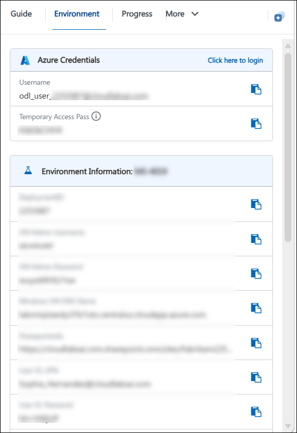
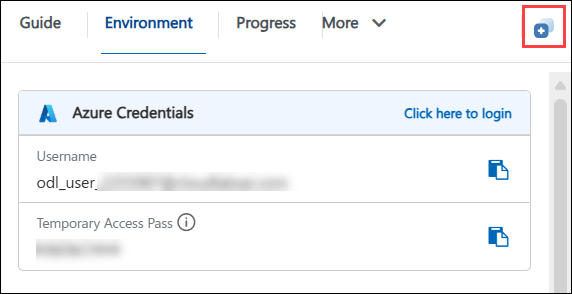
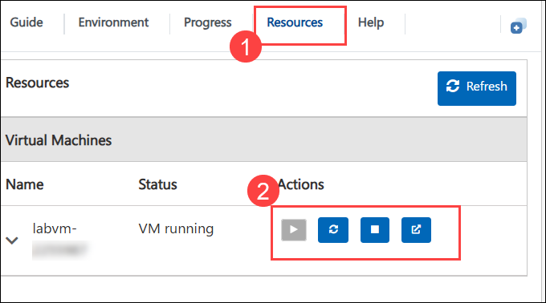
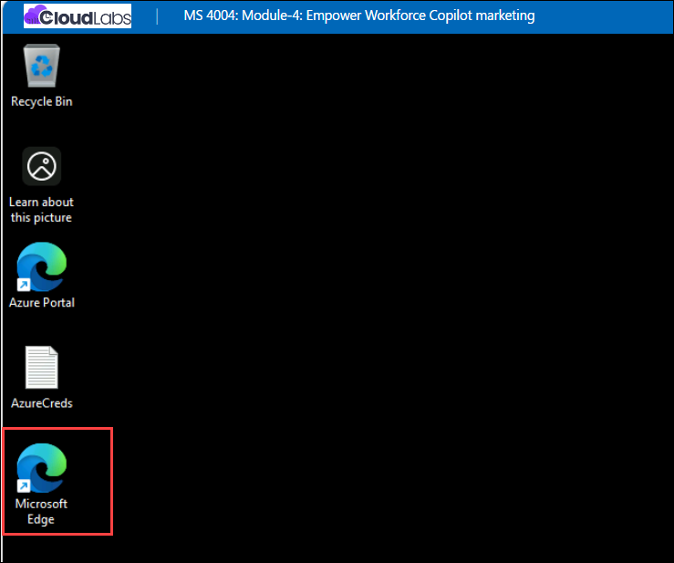
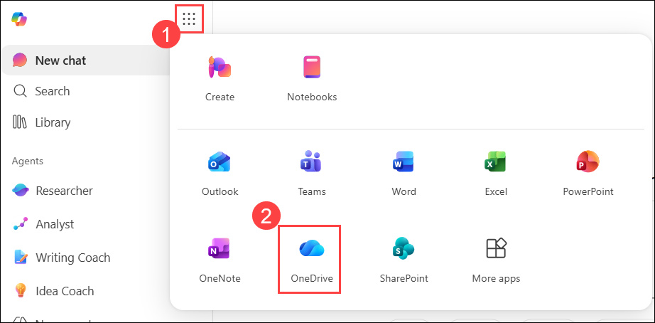
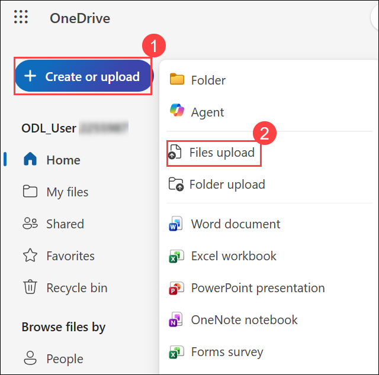

# Module 04: Empower workforce with Microsoft 365 Copilot for Marketing

### Overall Estimated Duration: 4 Hours

## Module Overview

Microsoft 365 Copilot can help Marketing professionals in numerous ways. For example, they can generate content for their campaigns, improve productivity, provide insights into their campaigns, collaborate more effectively, and more. Copilot can suggest relevant hashtags, images, and even write social media posts for you. Similarly, if you’re creating a blog post, Copilot can suggest topics, provide research material, and even help you write the post.

Copilot can also help Marketing professionals save time by automating repetitive tasks such as formatting, adding charts and graphs, and even proofreading documents. Additionally, Copilot can provide analytics on how your social media posts are performing, which posts are getting the most engagement, and what time of day is best to post. Copilot can also help you collaborate more effectively with your team by helping you assign tasks, set deadlines, and even provide reminders.

This module equips Marketing professionals with the skills and knowledge necessary to use Microsoft 365 Copilot to streamline their workflow and enhance their productivity. Your adeptness in communicating seamlessly with Copilot and extracting precise responses is paramount for:

- **Generating content**. Copilot can help Marketing professionals generate content for their campaigns. For example, if you’re creating a social media post, Copilot can suggest relevant hashtags, images, and even write the post for you. Similarly, if you’re creating a blog post, Copilot can suggest topics, provide research material, and even help you write the post.

- **Improving productivity**. Copilot can help Marketing professionals save time by automating repetitive tasks. For example, if you’re creating a report, Copilot can help you with formatting, adding charts and graphs, and even proofreading the document.

- **Providing insights**. Copilot can help Marketing professionals gain insights into their campaigns. For example, if you’re running a social media campaign, Copilot can provide analytics on how your posts are performing, which posts are getting the most engagement, and the time of day in which it’s best to post.

- **Collaboration**. Copilot can help Marketing professionals collaborate more effectively. For example, if you’re working on a project with a team, Copilot can help you assign tasks, set deadlines, and even provide reminders.

### Copilot prompting

One of the primary keys to effectively using Copilot is the quality of your Copilot prompts. A good Copilot prompt is built around the following four key elements that make your request clear, actionable, and tailored for the best results:

- **Goal**. Clearly state what you want Copilot to do. For example: “Generate three to five bullet points summarizing the latest project updates.”

- **Context**. Provide background information so Copilot understands why you need this request and who or what is involved. For example: “Prepare these bullet points for a meeting with Client X about their ‘Phase 3+’ brand campaign.”

- **Sources**. Specify where Copilot should look for information (documents, emails, Teams chats, and so on). For example: “Focus on emails and Teams chats since June.”

- **Expectations**. Define how you want the response delivered—tone, style, or level of detail. For example: “Use simple language so I can get up to speed quickly” or “Explain it as if I were a pirate.”


Keep these four elements front and center as you practice creating prompts—they’re the foundation for getting clear, accurate, and useful results from Copilot. Implementing these elements as you write prompts in these exercises can build real-world skills, so writing effective prompts becomes second nature.

## Prerequisites

To get the most out of this module, you should have:

- A basic understanding of Microsoft 365 applications like Word, Excel, and Loop.
- Familiarity with marketing concepts and workflows.

## Getting Started with the lab

We've prepared a seamless environment for you to explore and learn about **Module 04 - Empower workforce with Microsoft 365 Copilot for Marketing**. Let's begin by making the most of this experience!

## Accessing Your Lab Environment
 
Once the lab environment is ready, the virtual machine displayed on the left will be your primary workspace for completing the exercises, while the **Guide** on the right side provides step-by-step instructions for each task.

## Exploring Your Lab Resources
 
To get a better understanding of your lab resources and credentials, navigate to the **Environment** tab.
 


## Utilizing the Split Window Feature
 
For convenience, you can open the lab guide in a separate window by selecting the **Split Window** button from the Top right corner.



## Managing Your Virtual Machine
 
Feel free to **Start, Stop, or Restart (2)** your virtual machine as needed from the **Resources (1)** tab. Your experience is in your hands!



## Lab Setup

In this module, we'll create prompts for Microsoft 365 Copilot that reference files. First, let’s upload all required files to OneDrive to ensure they're accessible throughout the lab.

### Uploading Files to OneDrive

Follow the steps below to upload all files needed to **OneDrive**:

1. In the LabVM, open the **Microsoft Edge** browser from the from Desktop.

    

1. In the address bar, enter the following URL to navigate to Microsoft 365:

    ```
    https://www.microsoft365.com
    ```
1. Enter the following credentials to sign in to Microsoft 365 and click on **Sign in**.

    - **Email/Username**: **<inject key="AzureAdUserEmail"></inject>**

    - **Password**: **<inject key="AzureAdUserPassword"></inject>**

1. If prompted to **Stay signed in**, select **Don't show this again** and then **Yes**.

1. In the Microsoft 365 portal, click on the **App launcher  (1)**button and select **OneDrive (2)**.

    

1. In **OneDrive**, in the top-left corner, select **+ Create or upload (1)** > **Files upload (2)**.

    

1. In **File Explorer**, navigate to **`C:\AllFiles`**location and select all the files from the folder and click **Open**.

1. When the upload is complete, you should see **Uploaded 92 items to My files** in the bottom center of the screen.

1. Leave **Edge** open and move on to the next task.

### Referencing Files in Copilot

When using Copilot, you may find that some files aren’t immediately available in the suggestions. This occurs because certain Copilot experiences only reference files from the **Most Recently Used (MRU)** list, while others let you browse **OneDrive** directly. To ensure a file appears in the **MRU** list, simply open it in the relevant Microsoft 365 app, and it will be added automatically.

> **`Important:`** Microsoft 365 Copilot can only work with files saved to **OneDrive**. Files stored locally on your PC will need to be moved to **OneDrive** for Copilot to access them.

## Support Contact
 
The **CloudLabs support** team is available 24/7, 365 days a year, via email and live chat to ensure seamless assistance at any time. We offer dedicated support channels tailored specifically for both learners and instructors, ensuring that all your needs are promptly and efficiently addressed.
 
Learner Support Contacts:
 
- Email Support: [cloudlabs-support@spektrasystems.com](mailto:cloudlabs-support@spektrasystems.com)
- Live Chat Support: https://cloudlabs.ai/labs-support
 
Click **Next** from the bottom right corner to embark on your Lab journey!

  


