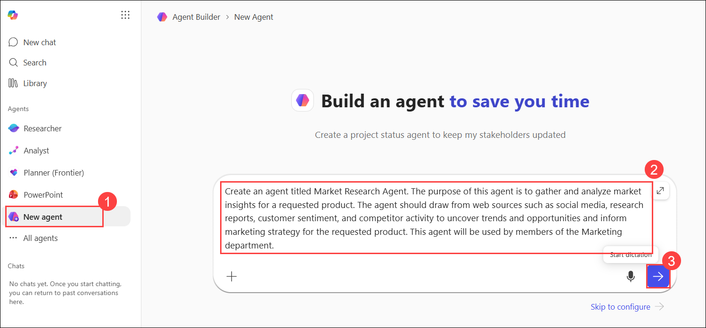
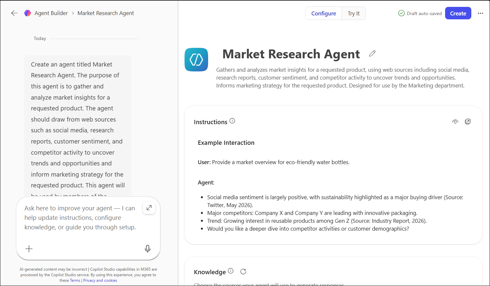
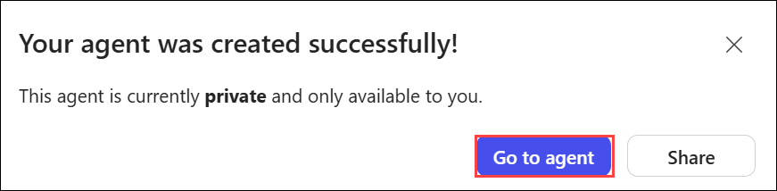

# Exercise 1, Task 1: Use Copilot Studio to create a Market Research Agent

## Overview

Relecloud is preparing to launch WorkSmart 360 in the commercial office market. Relecloud’s Marketing department must understand the competitive landscape, customer preferences, and emerging trends to inform the campaign. Your first step is to build a Market Research Agent that can aggregate this information from web sources, social media, and research reports.

This agent should be product agnostic. Relecloud recently implemented Microsoft 365 Copilot, so you plan to use it for researching WorkSmart 360. But moving forward, the Marketing team plans to use it for any number of the company’s products.

> **Note:** In this exercise, you use the Copilot Studio Lite experience to create the Market Research Agent. This simplified experience is designed for everyday business users and requires no programming skills. By contrast, software developers who build more complex, advanced agents typically use the full Copilot Studio experience.

Perform the following steps to complete this task:

1.  In Microsoft Edge browser, sign in to the **Microsoft 365** using the URL below: 

    ```
    https://www.microsoft365.com
    ```

2.  In Microsoft 365, select **New agent** in the navigation pane. Doing so opens Copilot Studio’s **Agent Builder** and displays the **New agent** page.

3.  On the **New Agent (1)** page, you want to ask Copilot to create an agent. In the prompt, you should enter the agent’s name and a general description of what the agent is about, who its target audience is, and what you want it to do. 

    For this agent, enter the following prompt **(2)** and then select the forward **arrow (Send) icon (3)** to submit the prompt:  
    
    ```
    Create an agent titled Market Research Agent. The purpose of this agent is to gather and analyze market insights for a requested product. The agent should draw from web sources such as social media, research reports, customer sentiment, and competitor activity to uncover trends and opportunities and inform marketing strategy for the requested product. This agent will be used by members of the Marketing department.
    ```
    

4.  After you select the forward arrow, the **Agent Builder** form opens on the right side for your new agent. At the top of the form is a **Configure** tab and a **Try it** tab.

    - The **Configure** tab enables you to define the detailed settings that drive the agent.

    - The **Try it** tab enables you to test the agent by entering prompts and receiving responses based on the agent’s instructions and knowledge sources.

    Wait a minute or two for Copilot to create the agent, at which time it displays the agent’s name and description in the **Agent preview** pane.

    

6.  On the **Configure** tab, the **Name** and **Description** fields should be filled in based on the prompt that you entered. Scroll down to the **Instructions** field. Copilot generated these instructions based on the description that you provided in your initial prompt. Review the detailed level of instructions that Copilot generated.

    > **Important:** The beauty of the Agent Builder process is that Copilot automatically translates your basic, natural language description into a complex set of instructions. This process saves you from creating this detailed instruction set on your own.

7.  If you wish to change the instructions, you can either manually edit them directly in the **Instructions** field or you can ask Copilot to update the instructions for you.  

1. In the **Left pane**, enter the provided prompt to identify additional instructions that could improve the agent.

    ```
    What additional instructions would you recommend to improve this agent?
    ```

1. Review Copilot’s recommendations. To add the suggested improvements to the agent instructions, enter the provided prompt in the **Left pane**.

    ```
    Add all of the recommended instructions to the agent.
    ```

9.  Once Copilot responds that it updated the instructions, in the **Configure** tab and scroll through the **Instructions**. Note the new items that Copilot added.

10. In the **Configure** tab, scroll down to the **Knowledge** section and verify the **Search all websites** toggle switch is enabled. Copilot should have enabled this toggle switch when it created the agent based on the description you provided in your original prompt (that is, “…**drawing from web sources such as** …”). If the toggle switch isn’t enabled, then do so now.

11.  For **Suggested prompts**, you can have Copilot generate prompts for you, or you can manually create your own prompts. Let’s try both methods.  

1. In the **Left pane**, enter the provided prompt to generate suggested prompts for the agent.

    ```
    Generate three suggested prompts for this agent. Include a title and message for each prompt.
    ```

12. To enter several of your own prompts. in the **Configure** tab scroll down to the **Suggested prompts** section. You should see the three prompts that Copilot added to the agent.  

1. For each prompt that you want to manually add, select the **Add a suggested prompt** option that appears below the prompts.  

    Six suggested prompts are displayed below that are related to popular market research actions. Add the first prompt (**Market insights report**) as that prompt is used in the next task. Then review the remaining prompts, select two or three other ones that you like, and then add them to the agent as well.
    
    - **Title:** Market insights report 
            
        > **Note:** This prompt is used in the next task; ensure that you add this prompt.
        
        - **Message:** Generate a downloadable market insights summary report in Microsoft Word that includes top trends, audience behaviors, competitive developments, and recommended marketing actions for {Product Category}. Include cultural shifts, content consumption patterns, and influencer roles. Recommend how these insights can shape messaging and channel strategy.

    - **Title:** Social media analysis
        
        - **Message:** Analyze recent social media conversations about {Product Name}. Summarize overall sentiment, key themes, and top pain points. Highlight any emerging trends or cultural signals that could influence marketing strategy.

    - **Title:** Competitor positioning
            
        - **Message:** Provide a competitor scan for {Product Category}. Identify major competitors’ positioning, recent product announcements, pricing changes, and marketing campaigns. Summarize implications for our product and suggest counter‑strategies.

    - **Title:** Industry research synthesis
            
        - **Message:** Review publicly available industry reports and whitepapers on {Product Category}. Summarize market drivers, inhibitors, and forecast trends. Highlight strategic opportunities and risks for our product.

    - **Title:** Launch campaign ideas
            
        - **Message:** Based on current market sentiment and competitor activity, propose three actionable recommendations for a launch campaign for {Product Name}. Include rationale, expected impact, and priority ranking (P1–P3).

    - **Title:** Market landscape brief
            
        - **Message:** Create a downloadable executive‑ready market landscape brief for {Product Category}. Include audience sentiment, competitor positioning, emerging trends, and actionable recommendations for marketing strategy. Structure the output with headings and bullet points for clarity.
    
13. Test several of the suggested prompts. Verify the agent is correctly pulling in data from the knowledge source documents.

14. The agent’s configuration is now complete, so select the **Create** button from the top to create the agent.

    

15. Once the agent is created, a dialog box appears that indicates the agent was successfully created. In this dialog box, you can either go to the agent or share it. Select the **Go to agent** option.

     

    > **[!NOTE]**
    > At this stage, the agent is private and accessible only to you. In a real-world scenario where the agent needs to be used by multiple team members, you would share it with those individuals. For this training exercise, sharing isn’t required since you’re working within your own tenant.

## Summary

In this task, you used the Copilot Studio experience to create a Market Research Agent. You provided a natural language description of the agent’s purpose and capabilities, and Copilot automatically generated detailed instructions for the agent based on that description. You then reviewed and improved those instructions with the help of Copilot. Finally, you configured the agent’s knowledge sources and starter prompts before creating the agent.


## You have successfully completed the task. Click on Next >> to proceed with the next exercise.

