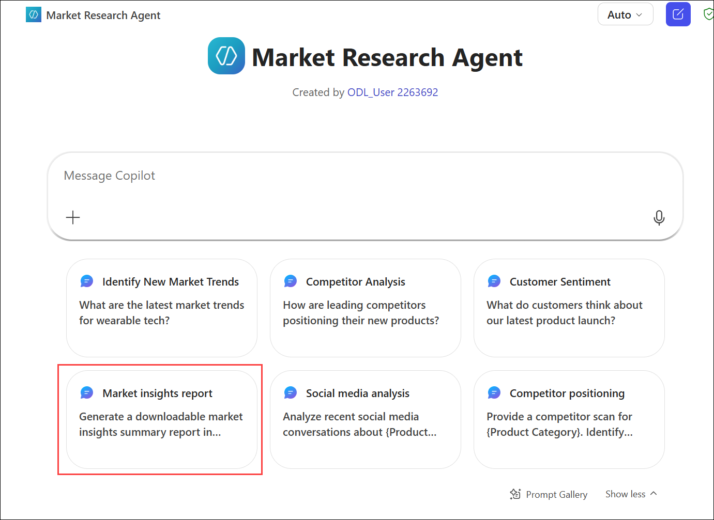
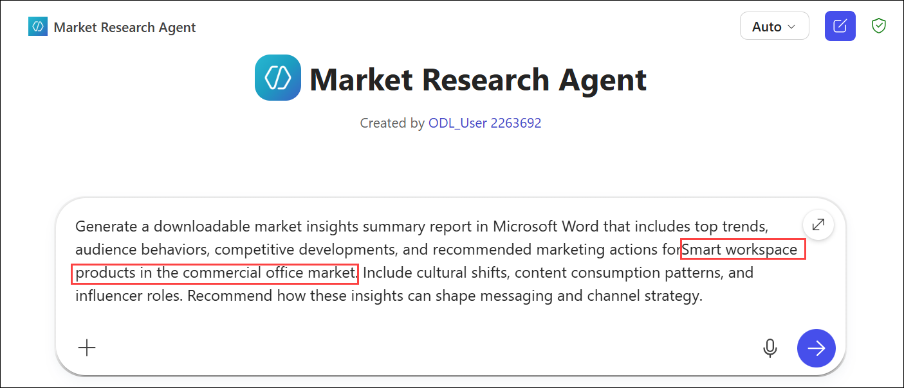
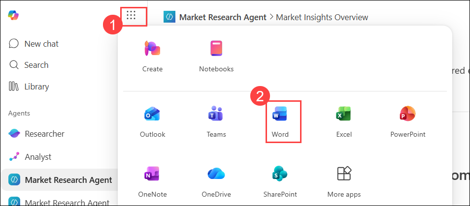
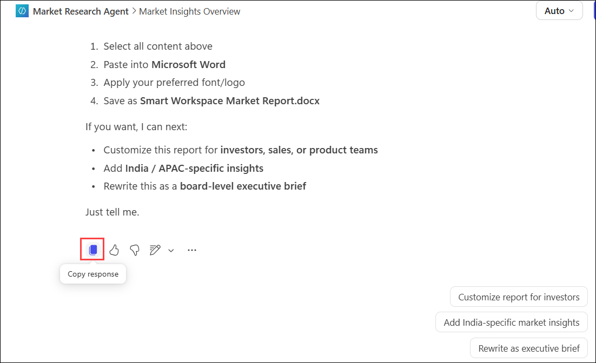

# Exercise 1, Task 2: Use the Market Research Agent to synthesize market intelligence

## Scenario

Relecloud is gearing up to launch its flagship solution, WorkSmart 360, designed for the commercial office market. This all-in-one platform optimizes workspace efficiency by monitoring space utilization, dynamically adjusting lighting and temperature, and delivering actionable analytics. In a crowded and competitive market, the challenge is to craft a campaign that not only showcases the platform’s comprehensive capabilities but also positions Relecloud as the leader in smart workplace innovation.

In this task, you continue in your role as a Senior Marketing Strategist for Relecloud. Now that you have created the Market Research Agent in Microsoft 365 Copilot, you want to use it to collect and synthesize comprehensive market insights for smart workspace products in the commercial office market. Once you gather and synthesize this market intelligence, you then plan to use Copilot’s prebuilt Analyst agent to interpret the data and generate strategic Marketing recommendations in Task 3.

## Task 2: Use the Market Research Agent to synthesize market intelligence

1. In your Microsoft Edge browser, you should have a tab open from the prior task that displays the **Market Research Agent**. If not, open Microsoft 365 and select the **Market Research Agent** to open it.

2. In the **Market Research Agent**, the first three suggested prompts appear. Select the prompt titled **Market insights report** if it appears; otherwise, select the **Show more** option that appears below the three prompts and then select the **Market insights report** from the full list of prompts. Doing so displays the prompt message in the prompt field.

    

3. In the prompt message, replace **{Product Category}** with **Smart workspace products in the commercial office market**, and then submit the prompt.

   

4. Review the report. 

5. Scroll to the end of the report, where the agent should display several suggested prompts. These prompts typically suggest more content that can be added to the report to enhance it even further. Select one of the prompts that interests you or enter your own custom prompt.

6. Review the results. Verify that the content you requested appears in the report. Also note the updated list of suggested prompts. Continue updating the report using any of the suggested prompts (or enter your own custom prompts) until you’re satisfied with the report.

7. Once you feel the report is complete, you should copy and paste the content of the report into a Word document and save it as **Market Insights Report – Smart Workspaces.docx** to your OneDrive so that you can access it in the next task. 

    You can follow the steps below to open the report in Word and save it to OneDrive:

    - From the **App launcher (1)**, select **Word (2)**.

      

    - Click on **Create blank document**. If prompted to sign in, sign in with your lab credentials. 

    - Select the **Copy response** icon that appears below your final report update. Then paste it in the blank Word document. 

      
    
    - Click on **File > Create a copy > Create a copy online**. Give the name as **Market Insights Report – Smart Workspaces** and save it to your OneDrive.

## Summary

In this task, you used the Market Research Agent that you created in Task 1 to gather and synthesize market intelligence for smart workspace products in the commercial office market. You entered a series of prompts to iteratively enhance the report until you were satisfied with it. Finally, you copied and pasted the report into a Word document and saved it to OneDrive so that you can access it in the next task.

## You have successfully completed the task. Click on Next >> to proceed with the next exercise.

