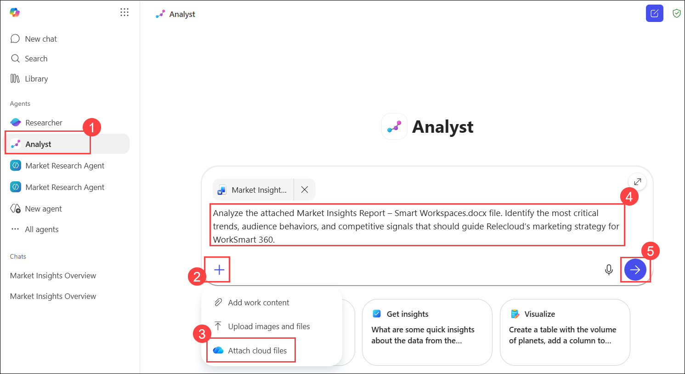
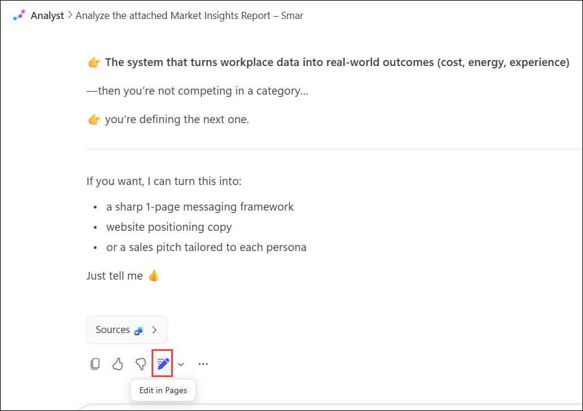

# Exercise 1, Task 3: Use Copilot’s Analyst agent to generate strategic recommendations

## Scenario

In the previous phase, you used the Market Research Agent to collect and synthesize comprehensive insights on the smart workspace products market. You saved this information in a report titled **Market Insights Report – Smart Workspaces.docx**. The data in this report included trends, audience behaviors, cultural shifts, competitive developments, and recommended actions. Now, it’s time to move from insight to strategy.

In this task, you plan to use Copilot’s Analyst agent to interpret the findings in the **Market Insights Report – Smart Workspaces.docx** file and translate them into strategic marketing recommendations that can guide real-world decision-making. To accomplish this goal, you plan to use the Analyst agent to:

- **Analyze the report’s insights**. Create a Word document that identifies the most critical trends, audience behaviors, and competitive signals.

- **Prioritize opportunities**. Determine which insights have the highest potential impact on messaging, positioning, and channel strategy. Save this analysis to a PDF file.

- **Develop actionable recommendations**. Create a strategic playbook PowerPoint presentation that includes:
    - Messaging pillars aligned with cultural and behavioral shifts.
    - Channel mix and content formats optimized for audience consumption patterns.
    - Influencer and partnership strategies to amplify reach and credibility.
    - Risk considerations and mitigation tactics.

## Lab Overview

In this hands-on lab, you will use Copilot’s Analyst agent to transform market research findings into strategic marketing recommendations. You will analyze market trends, audience behaviors, and competitive insights, prioritize business opportunities, and create executive-ready deliverables. These capabilities help marketing teams convert research into actionable strategies that support product positioning and campaign planning.

## Task 3: Use Copilot’s Analyst agent to generate strategic recommendations

In this task, you will use the Analyst agent to interpret the Market Insights Report and generate strategic recommendations for messaging, positioning, channel strategy, and market opportunities.

1. Open Microsoft 365 in a new browser tab using the URL below. 

    ```
    https://www.microsoft365.com
    ```

1. In the list of agents in the navigation pane, select **Analyst (1)**.

2. In the **Analyst** agent’s prompt field, attach the **Market Insights Report – Smart Workspaces.docx** file that you saved to your OneDrive in the prior task by clicking on the **+ (2)** icon below the prompt field and selecting **Attach cloud files (3)**. Then select the file from your OneDrive and click **Open** to attach it to the prompt.

3. For your first deliverable, we will ask the agent to analyze the report and identify the most critical insights, and analyze the report and identify the most critical trends, audience behaviors, and competitive signals that should guide Relecloud’s marketing strategy for WorkSmart 360. In the prompt field, enter the following prompt (4) and then submit the prompt by selecting the **Send (arrow) (5)** icon.:

    ```
    Analyze the attached Market Insights Report – Smart Workspaces.docx file. Identify the most critical trends, audience behaviors, and competitive signals that should guide Relecloud’s marketing strategy for WorkSmart 360.
    ```

    

4. Review the response. You want to eventually save this content to a Word document, so select the **Edit in Pages** icon that appears at the end of the response.

    

5. When you select the **Edit in Pages** icon, Copilot displays two panes—one that displays the **Analyst** agent and your current chat, and another that displays the **Pages** form and the content that was copied from your chat. 

1. Review the content in the **Pages** form. Delete any extraneous text that was copied and pasted with the results (see the start and end of the content). Feel free to make any changes to the headings or any other content on the form.

6. In the **Analyst** chat pane, ask it to create a visual summary (infographic) of these priorities.

    ```
    Create a visual summary (infographic) of these priorities.
    ```

7. Once the agent finishes generating the graphic, select the **Add to page (+)** icon that appears at the end of the agent’s response. Scroll to the bottom of the **Pages** form and verify the graphic was inserted. Delete any extraneous text that was copied and pasted with the graphic (see the start and end of the response containing the graphic).

8. You’re now ready to save this Pages content to a Word document. On the **Pages** pane, select the **Create** button that appears at the top of the pane. In the menu that appears, select **Document**. This option instructs the agent to generate a draft of the content for Microsoft Word.

9. Once the agent finishes generating the draft, select the **Open Word** button that appears. Doing so opens a new browser tab that contains a document in **Word for the web**. The content from the **Pages** form should appear in the Word document. Save the document to your OneDrive as **Smart Workspace Market Insights.docx**.

    

10. Select the browser tab containing the **Analyst** agent. For the second deliverable, you want the agent to prioritize opportunities. Since you want to store this deliverable in a PDF file that doesn’t include the content in the current Pages form, select the **Close (X)** icon in the upper corner of the Pages form to close it.

11. Ask the Analyst agent to determine which insights have the highest potential impact on messaging, positioning, and channel strategy. 

    ```
    Based on the analysis you just completed, determine which insights have the highest potential impact on messaging, positioning, and channel strategy for Relecloud’s WorkSmart 360 product.
    ```
    
12. Review the results. You want to eventually save this content to a PDF document, so select the **Edit in Pages** icon that appears at the end of the content.

13. Review the content on the **Pages** form. Delete any extraneous text that was copied and pasted with the results (see the start and end of the content). Feel free to make any changes to the headings or any other content on the form. 
    
14. Since visuals are always helpful when explaining content, ask the agent to turn this ranked analysis into a visual impact matrix (Messaging vs. Positioning vs. Channel). 
    
    ```
    Turn this ranked analysis into a visual impact matrix (Messaging vs. Positioning vs. Channel).
    ```

15. Once the agent finishes generating the graphic, select the **Add to page (+)** icon that appears at the end of the agent’s response. Scroll to the bottom of the Pages form and verify the graphic was inserted. Delete any extraneous text that was copied and pasted with the graphic (see the start and end of the response containing the graphic).

16. You’re now ready to save this Pages content to a PDF file. Select the **Create** button and then select **PDF** from the menu.

17. Once the agent finishes generating the PDF, it opens a new browser tab that contains the PDF. Click on **Print** button to save the document as PDF. Save the PDF to your OneDrive as **Smart Workspace opportunities.pdf**.

18. For the final deliverable, you want the agent to create a PowerPoint presentation that contains actionable marketing recommendations. Select the **Close (X)** icon in the upper corner of the Pages form to close it.

1. In the **Analyst** agent prompt box, enter the provided prompt.

    ```
    Provide actionable marketing recommendations for the smart workspace market that include:

    - Messaging pillars aligned with cultural and behavioral shifts.
    - Channel mix and content formats optimized for audience consumption patterns.
    - Influencer and partnership strategies to amplify reach and credibility.
    - Risk considerations and mitigation tactics.
    ```

20. Review the results. Give another prompt asking the agent to turn these recommendations into a strategic playbook PowerPoint presentation.

    ```
    Turn these recommendations into a strategic playbook PowerPoint presentation and give it the name as Smart Workspace marketing recommendations.pptx.
    ```

1. Once the PPT is created, click on it to download the file, which will save it in your OneDrive

## Summary

In this task, you used Copilot’s Analyst agent to interpret the insights in the Market Insights Report – Smart Workspaces.docx file and translate them into strategic marketing recommendations. You created three deliverables: a Word document that identified the most critical trends, audience behaviors, and competitive signals; a PDF file that prioritized which insights had the highest potential impact on messaging, positioning, and channel strategy; and a PowerPoint presentation that included actionable recommendations for messaging pillars, channel mix, influencer strategies, and risk mitigation tactics.

## You have successfully completed the task. Click on Next >> to proceed with the next exercise.

