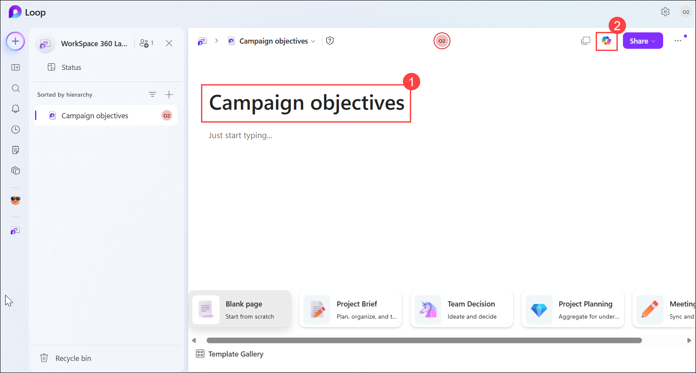
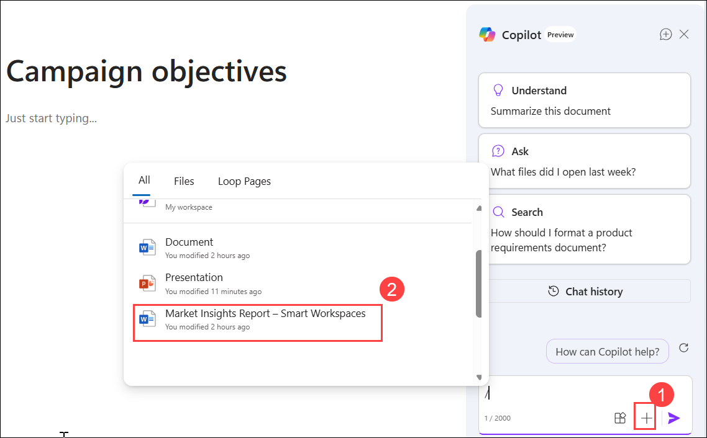
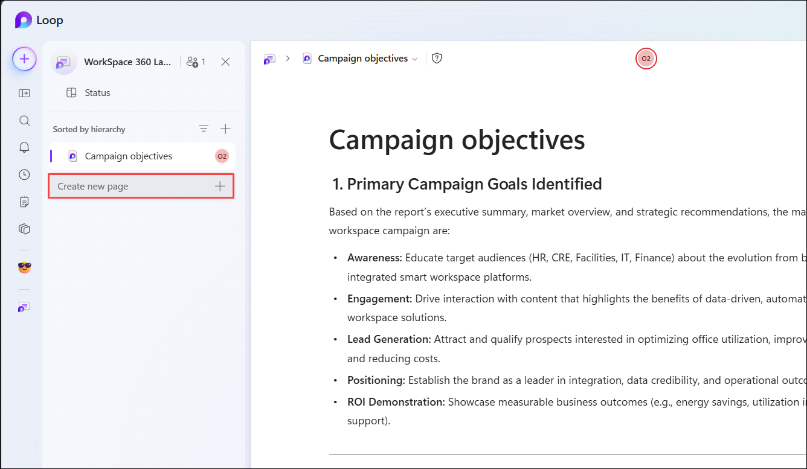
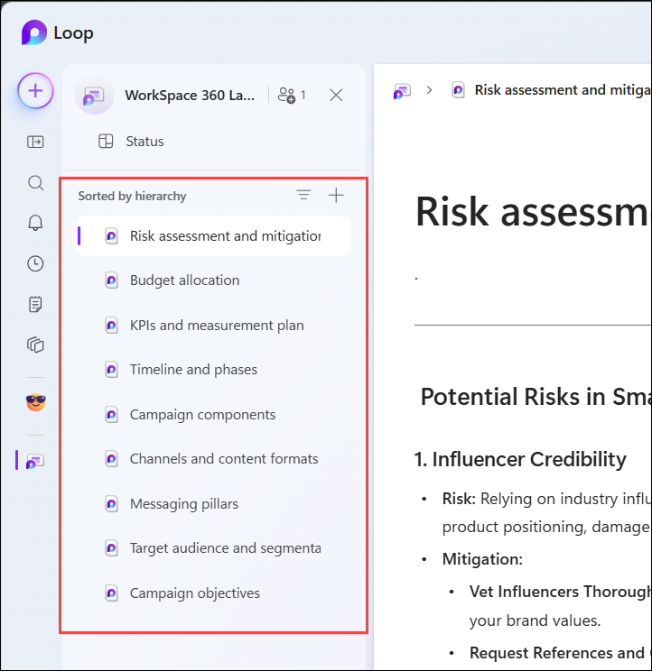

# Exercise 1, Task 4: Use Copilot in Loop to create a launch campaign plan

## Scenario

Now that you have completed your marketing research and analysis, you’re ready to launch Relecloud’s WorkSpace 360 smart workplace solution in the commercial office market. To do so, you must begin by creating a fully integrated launch campaign plan that brings the marketing strategies to life and drives measurable results.

Your campaign must:

- Apply the insights from the **Smart Workspace Market Insights.docx** report.

- Align with Relecloud’s business objectives: increase brand awareness, generate qualified leads, and position the product as a leader in smart, sustainable workspaces.

- Be multi-channel, data-driven, and actionable.

As you considered this task, you weren’t sure whether Microsoft Loop or Planner would be the best app for this project. After doing some research, you learned that Loop would work best for structuring the campaign plan, brainstorming messaging, and outlining KPIs. Planner, on the other hand, was more appropriate for converting the phases and deliverables into tasks with owners and due dates once the plan was approved. So for this task, you plan to use Copilot in Loop to create the Workspace 360 launch campaign plan.

## Lab Overview

In this hands-on lab, you will use Microsoft Copilot in Loop to create a comprehensive launch campaign plan for Relecloud's WorkSmart 360 solution. You will organize campaign objectives, audience segments, messaging, channels, timelines, KPIs, budgets, and risk mitigation strategies into a collaborative workspace. These capabilities help marketing teams transform research and strategy into an actionable campaign plan.

## Task 4: Use Copilot in Loop to create a launch campaign plan

In this task, you will use Copilot in Loop to build a structured launch campaign plan based on market research insights. You will create and populate multiple campaign planning sections, including objectives, audience targeting, messaging, channels, KPIs, budgets, and risk management.

1. In your Microsoft Edge browser, go to the **Microsoft 365** home page, click on the **App launcher** icon in the upper left corner, select **More apps**, and select **Loop** from the list of apps to open it in a new browser tab.

2. In **Loop for the web**, click on **+** and select **New workspace**. Name the workspace **WorkSmart 360 launch campaign** and click on **Create**.

3. You plan to create the following pages under this Loop workspace (in this order):
    - Campaign objectives
    - Target audience and segmentation
    - Messaging pillars
    - Channels and content formats
    - Campaign components
    - Timeline and phases
    - KPIs and measurement plan
    - Budget allocation
    - Risk assessment and mitigation

    To begin, change the current title of the first page from **Untitled** to **Campaign objectives (1)**.

4. Open the **Copilot (2)** pane for this page.

    

1. Click on the + icon in the Copilot pane and attach the **Market Insights Report – Smart Workspaces.docx** file that you created in Task 2. 

    

5. Ask Copilot to review the attached **Market Insights Report – Smart Workspaces.docx** file using the following prompt:

    ```
    Review the attached Market Insights Report – Smart Workspaces.docx and identify the primary goals for this campaign (e.g., awareness, engagement, lead generation). Translate these goals into SMART objectives (Specific, Measurable, Achievable, Relevant, Time-bound). For example, “Increase LinkedIn engagement by 30% in 90 days.”
    ``` 

6. Review the results and then select the **Copy** icon that appears below the content. Paste the copied results into your Loop page. Delete any extraneous text that was copied and pasted along with the results (see the start and end of the content).

1. Click on the **Create new page** button at the bottom of the left navigation pane to create a new page for the next section of the campaign plan. 

    

    We will be creating the following pages in the Loop workspace for each section of the campaign plan:

    - Target audience and segmentation
    - Messaging pillars
    - Channels and content formats
    - Campaign components
    - Timeline and phases
    - KPIs and measurement plan
    - Budget allocation
    - Risk assessment and mitigation

1. For each page, perform the following steps:

    - Open the Copilot pane.
    - Attach the Smart Workspace Market Insights.docx file.
    - Enter a prompt that matches the page title. (Share below for each page))
    - Submit the prompt.
    - Copy the generated content.
    - Paste the content into the page.
    - Remove any extra text if necessary.

1. Below are example prompts that you can use for each page. Feel free to customize the prompts as you see fit.

    | Page                             | Prompt                                                                                    |
    | -------------------------------- | ----------------------------------------------------------------------------------------- |
    | Target audience and segmentation | Use insights from the report to define key personas (for example, Facilities Managers, HR Directors, Gen Z professionals, and so on). Then segment by industry, company size, and decision-making role. |
    | Messaging pillars                | Develop 3–4 core messages based on cultural shifts and audience pain points, such as “Smart, Sustainable, Human-Centric Workspaces.” Include value propositions and proof points (AI personalization, eco-friendly design, well-being integration).|
    | Channels and content formats     | Map channels to audience behaviors. For example, “LinkedIn: Thought leadership & ROI education,” “TikTok/Instagram: Influencer-led short-form demos,” and “YouTube: Deep-dive product explainers.” Define content types, such as video reels, carousel posts, blog articles, and email nurture sequences.                       |
    | Campaign components              | Create a unifying theme and tagline, such as “Work Smarter. Live Greener.” List required assets, such as videos, infographics, and landing pages. Identify influencer categories, such as tech experts and workplace wellness advocates.            |
    | Timeline and phases              | Build a timeline that includes the following phases: Phase 1 (Awareness): Influencer videos + LinkedIn thought leadership; Phase 2 (Consideration): ROI-focused micro-learning content; Phase 3 (Conversion): Email campaigns + retargeting ads. Assign start and end dates and responsible roles to each phase.          |
    | KPIs and measurement plan        | For each phase in the timeline, define KPIs and a measurement plan. Phase 1 (Awareness): Impressions, engagement rate; Phase 2 (Consideration): Click-through rate, time on page; Phase 3 (Conversion): Leads generated, cost per acquisition. Include recommended tracking tools, such as Google Analytics and LinkedIn Insights.|
    | Budget allocation                | Estimate the spend per channel and asset. Prioritize high-impact channels based on insights, such as video-first and influencer-driven.                                  |
    | Risk assessment and mitigation   | Identify potential risks, such as influencer credibility and budget overruns. Suggest mitigation strategies, such as vet influencers and set a contingency budget.                             |

1. After the content is generated for each page, you should have these sections filled out in your Loop workspace:

    

## Summary

In this task, you used Copilot in Loop to create a structured launch campaign plan for Relecloud’s WorkSpace 360 smart workplace solution. You created multiple pages in a Loop workspace for each section of the campaign plan and entered prompts to generate content for each section based on the insights from the Market Insights Report. You then copied and pasted the generated content into the respective pages in Loop, creating a comprehensive campaign plan that is ready for review and execution.

## You have successfully completed the task. Click on Next >> to proceed with the next exercise.

