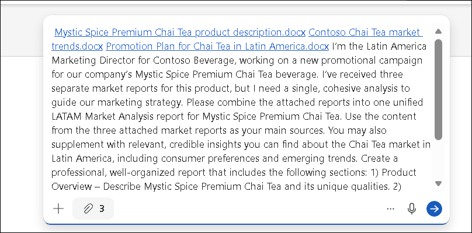
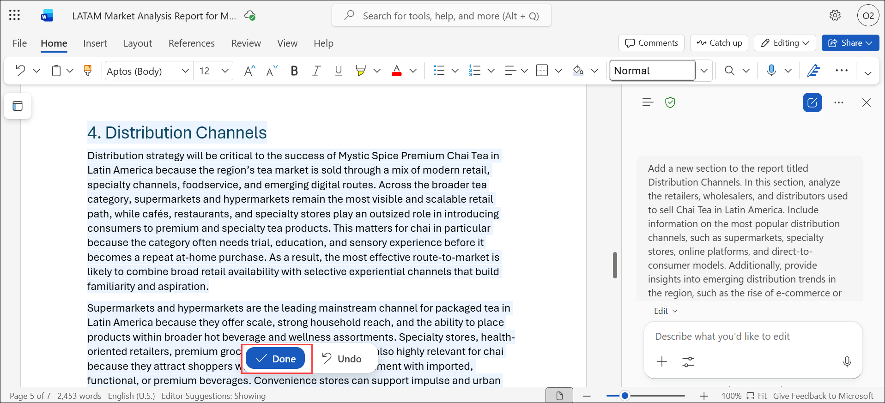

# Exercise 2, Task 1: Use Copilot in Word to consolidate multiple market reports

## Scenario

Contoso's Latin America (LATAM) product manager provided you with three market reports involving the company's Mystic Spice Premium Chai Tea beverage. However, you’re finding it difficult to analyze the information, since you’re constantly jumping back and forth between documents.

You decide to use Copilot in Word to combine the reports into a single LATAM Market Analysis report for Mystic Spice Premium Chai Tea. Once Copilot creates this report, you want to review it and possibly update it with other information that Copilot can find on the Chai Tea market in Latin America.

## Using Copilot in Word

Copilot in Word can behave in two different ways, depending on whether **Edit with Copilot** is enabled. Understanding this distinction is important because it affects whether Copilot can automatically apply changes to your document or just provide suggestions for you to use.

When **Edit with Copilot** is enabled, Copilot acts as an in-document author and editor. You can ask Copilot to create a document from scratch, rewrite sections, add summaries, or refine language—and it can apply those changes directly to the document, typically with your confirmation. In this experience, Copilot behaves like a collaborative writing partner that can both generate and revise content without requiring manual copy and paste. This is commonly the experience when prompting Copilot from within a Word document, such as using the drafting prompt above a blank document or the prompt field in the Copilot pane.

When **Edit with Copilot** is disabled, Copilot behaves more like Copilot Chat. It can still research topics, summarize information, and draft text, but it doesn’t automatically modify the document. Instead, responses appear in the Copilot pane, and you decide what—if anything—gets added to the document. This approach is useful when you want Copilot to act as a research assistant or idea generator while maintaining full control over what content is inserted.

This task uses the **Edit with Copilot** functionality.

## Lab Overview

In this hands-on lab, you will use Microsoft 365 Copilot in Word to consolidate multiple market research documents into a unified business report. You will enrich the report with additional market insights, competitive analysis, and distribution channel strategies to create a comprehensive marketing reference for regional planning.

## Task 1: Use Copilot in Word to consolidate multiple market reports

In this task, you will use Copilot in Word to combine multiple market reports into a single LATAM Market Analysis report, enhance it with competitor and distribution channel insights, and create a professional document to support marketing strategy decisions.

1. In your Microsoft Edge browser, sign in to the **Microsoft 365** home page using the URL below:

    ```
    https://www.microsoft365.com
    ```

1. Select **App launcher** in the navigation pane, and then select **Word** from the **Apps** menu.

4.  In **Word for the web**, click on Create a blank document. 

5. On the **Describe what you'd like to draft with Copilot** option, select the **+** icon to **Add content**. Add the three documents as content sources. 

    - **Mystic Spice Premium Chai Tea product description.docx**
    - **Contoso Chai Tea market trends.docx**
    - **Promotion Plan for Chai Tea in Latin America.docx**

7.  Ask Copilot to combine the attached files to create a single report that describes the product, analyzes the market trend for it, and includes a promotion plan for Latin America. To do so, submit the following prompt:

    ```
    I’m the Latin America Marketing Director for Contoso Beverage, working on a new promotional campaign for our company’s Mystic Spice Premium Chai Tea beverage. I’ve received three separate market reports for this product, but I need a single, cohesive analysis to guide our marketing strategy. Please combine the attached reports into one unified LATAM Market Analysis report for Mystic Spice Premium Chai Tea. Use the content from the three attached market reports as your main sources. You may also supplement with relevant, credible insights you can find about the Chai Tea market in Latin America, including consumer preferences and emerging trends. Create a professional, well-organized report that includes the following sections: 1) Product Overview – Describe Mystic Spice Premium Chai Tea and its unique qualities. 2) Market Analysis – Summarize key insights and trends for the Chai Tea market in Latin America. 3) Promotion Plan – Recommend strategies or promotional ideas tailored to the region. Format the report with clear headings, concise paragraphs, and a brief executive summary at the beginning.
    ```

    

    > **Note:** For this first prompt, we’ve provided the text so you can see what an effective prompt looks like when it incorporates the four key elements discussed in the Introduction unit. You must write all remaining prompts in this exercise, but in doing so, you can use this prompt as a model to emulate.

1. Review the **LATAM Market Analysis** report. To prepare for adding a competitor analysis section, place the cursor at the end of the report.

9. Ask Copilot to add a section to the report titled Competitive Analysis with the following details in the prompt:

    ```
    Please add a new section to the report titled Competitive Analysis. In this section, analyze the current competition in the Latin American Chai Tea market. This section should compare key players in the industry, such as established brands and emerging startups. 
    ```

1. Review the **Competitive Analysis** section. To include additional competitor details, enter the provided prompt in the **Copilot** prompt box.

    ```
    Update the Competitive Analysis section to include the following information for each competitor: market share, product offerings, pricing strategies, distribution channels, and any key differentiators. Additionally, include any relevant trends or shifts in consumer preferences that could impact the competitive landscape.
    ``` 

1. Review the report. To add a **Distribution Channels** section, place the cursor at the location where the new section should appear. Enter the provided prompt in the **Copilot** prompt box.

    ```
    Add a new section to the report titled Distribution Channels. In this section, analyze the retailers, wholesalers, and distributors used to sell Chai Tea in Latin America. Include information on the most popular distribution channels, such as supermarkets, specialty stores, online platforms, and direct-to-consumer models. Additionally, provide insights into emerging distribution trends in the region, such as the rise of e-commerce or subscription services.
    ``` 

13.  Review the new Distribution Channel section. If you want to make any manual changes, you can do so now. Also, review Copilot’s suggested prompts at the end of the Copilot pane. Feel free to implement any of Copilot’s suggestions if you want. 

1. Click on **Done** in the Word document to save the changes that Copilot made to the document.

    

1. After reviewing the report, save the document to **OneDrive** as **LATAM Market Analysis report**, and then close the document.

## Summary

In this task, you used Copilot in Word to consolidate information from three separate market reports into a single, cohesive LATAM Market Analysis report for Mystic Spice Premium Chai Tea. You then reviewed the report and asked Copilot to add new sections and update existing sections to ensure the report included all the necessary information to guide your marketing strategy. 

## You have successfully completed the task. Click on Next >> to proceed with the next exercise.

