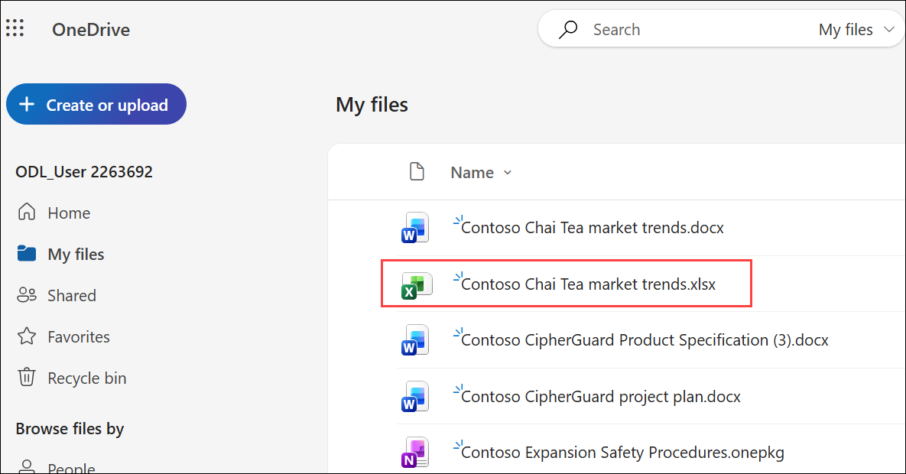
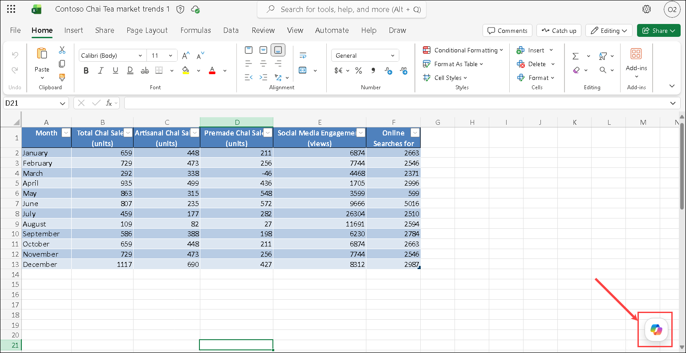

# Exercise 2, Task 2: Use Copilot in Excel to analyze a marketing spreadsheet

## Scenario

One of Contoso’s marketing analysts provided you with a monthly performance tracking spreadsheet that shows monthly sales and marketing activity across the LATAM regions for Contoso's Chai Tea product in the past year. You want to use Copilot in Excel to analyze this data and identify key trends, uncover correlations between marketing engagement and sales performance, and determine which factors might be driving product success in different months.

## Using Copilot in Excel

Excel provides two ways to use Copilot: standard Copilot prompts for asking questions and getting insights about the data in the workbook, and **Edit with Copilot** in the Copilot pane for making direct, in-place changes to worksheets, tables, and formulas. 

- You should use Copilot’s standard prompts in Excel for quick questions, simple summaries, or one-off insights about the data you’re already viewing. 
- You should use **Edit with Copilot** when you want Copilot to work directly with the worksheet—such as cleaning data, adding formulas, restructuring tables, or making iterative, in-place changes. 

**Edit with Copilot** is designed for hands-on data work, so it understands the structure of the sheet and can apply changes directly, rather than just describing what you could do. In summary, use chat style Copilot for thinking and generating ideas; use **Edit with Copilot** for hands-on editing inside the file. **Edit with Copilot** proposes specific changes (formulas, columns, cleanup steps) and, once you confirm, it applies those changes directly to the worksheet rather than expecting the user to explicitly apply them through copy and paste.

This task uses the **Edit with Copilot** functionality.

In addition, Copilot for Excel provides a response control selector that lets you choose which AI model Copilot uses to work with your workbook. You can leave this set to **Auto** (the default option) and let Copilot select a model for you, or choose a specific model when you want to influence how Copilot approaches the task.

If you’ve used Copilot Chat, you know that it also includes a response control selector. However, its options are different from the Excel selector. In Copilot Chat, the selector controls how deeply Copilot reasons about your request. In Excel, the selector controls which AI model performs the work. Although these selectors might appear to be similar, they control different aspects of Copilot and aren't the same setting.

This task uses the default **Auto** selector mode.

## Lab Overview

In this hands-on lab, you will use Microsoft 365 Copilot in Excel to analyze marketing performance data for Contoso’s Chai Tea product. You will identify sales trends, uncover relationships between marketing activities and sales outcomes, visualize data patterns, detect anomalies, and generate insights that support data-driven marketing decisions.

## Task 2: Use Copilot in Excel to analyze a marketing spreadsheet

In this task, you will use Copilot in Excel to explore marketing and sales data, identify top-performing periods, analyze correlations between engagement metrics and sales, create visualizations and sparklines, and generate formulas that enhance future analysis.

1. In the Microsoft 365 portal, click on the **App launcher (1)** button and select **OneDrive (2)**.

    

1. In **OneDrive for the web**, select the **MyFiles** from left menu, and then select the **Contoso Chai Tea market trends.xlsx** spreadsheet.

    

4. Once the file is opened, click on the Copilot icon in the bottom right corner of the screen to open the Copilot pane.

    

5. In the Copilot pane, ask Copilot to show a visual representation of the data insights from this spreadsheet. Ask it to add the visual representation to a new sheet. It might take a minute or two for Copilot to generate this visual. Use the following prompt:

    ```
    Analyze the data in this spreadsheet and create a visual representation of the key insights. Add this visual to a new sheet in this workbook.
    ```

6. Review the results. At the end of the Copilot pane, if Copilot offers any suggested prompts to add more visualizations, feel free to submit any of them if they interest you.

7. Select **Sheet 1** to return to the dataset. In looking at the data in the spreadsheet, you notice there are some spikes and anomalies in the data. Rather than just reporting numbers, you want to look for connections between marketing activities (like social media campaigns or search trends) and sales outcomes. To do so, ask Copilot to identify the top three sales months for Total Chai Sales and flag any other months with anomalies or data quality issues. Also, ask it to analyze what possibly influenced those sales and anomalies by looking at the other data in the spreadsheet during those months. Use the following prompt:

    ```
    Analyze the data in this spreadsheet to identify the top three sales months for Total Chai Sales. Flag any other months that show anomalies or potential data quality issues. For the top sales months and any anomalous months, analyze the other data in the spreadsheet (such as Social Media Engagement and Online Searches for Chai) during those months to identify possible factors that influenced those sales outcomes or anomalies.
    ```

8. Review Copilot’s response in the new sheet that it created. When you’re done, return to **Sheet 1**.

9. You now want to see if there’s any connection between sales and marketing signals. Ask Copilot to analyze correlations between Social Media Engagement (views), Online Searches for Chai, and Total Chai Sales. Summarize the strongest relationships and any lag effects you detect. Use the following prompt:

    ```
    Analyze the correlations between Social Media Engagement (views), Online Searches for Chai, and Total Chai Sales in this spreadsheet. Summarize any strong relationships you find, such as whether increases in social media engagement or online searches are associated with higher sales. Also, look for any lag effects, such as whether spikes in social media engagement or online searches precede increases in sales by a month or more.
    ```

10. Review Copilot’s response in the new sheet that it created. When you’re done, return to **Sheet 1**.

11. In Excel, a **sparkline** is a tiny, simple chart that fits inside a single cell. It visually shows the trend of a data series across months, such as sales, engagement, or searches. Because sparklines represent data trends for a row or column, they’re great for quickly spotting patterns, spikes, or dips without taking up much space. 

1. For this spreadsheet, you want to see which months had spikes or dips in Social Media Engagement, Online Searches, and Total Chai Sales. Doing so enables you to quickly spot if the months with the most activity on social media are also the months when sales were highest.

1. Before Copilot, a marketing professional could manually create a sparkline to this spreadsheet by performing the following steps **(don’t perform these steps; this is just for comparison purposes)**:
    
    1. **Select the cells for a metric:**
              1. For example, select the range of cells for “Total Chai Sales” (January to December).

    2. **Insert a Sparkline:**
              
        1. Go to the “Insert” tab in Excel.
        2. Choose “Line Sparkline.”
        3. In the dialog, set the data range (for example, B2:B13 for Total Chai Sales).
        4. Set the location range to a cell next to your data (for example, C2).

1. However, you want to see how Copilot can automate this process. To do so, ask Copilot to add sparklines to show the monthly trend between Total Chai Sales, Social Media Engagement, and Online Searches. Use the following prompt:

    ```
    Add sparklines to this spreadsheet to visually represent the monthly trends for Total Chai Sales, Social Media Engagement, and Online Searches for Chai. Place the sparklines in new columns next to each respective metric so that I can easily compare the trends across these three key indicators.
    ```

12. Review the results. In our testing, Copilot added the sparklines to the Correlation Analysis sheet that it created earlier. Visually compare each sparkline to see if its spikes occur in the same months. When you're done, return to **Sheet 1**.

13. You now want Copilot to analyze your data and suggest a possible formula or calculation that could be useful for your dataset. Doing so is especially helpful in the context of columns that require formulas to provide more insights or automate calculations. Ask Copilot to analyze the data and suggest ways to automate or enhance future work with formulas to make the data analysis faster and more efficient. 

        Use the following prompt:

        ```
        Analyze the data in this spreadsheet and suggest a useful formula or calculation that could enhance our analysis or automate future work. This could be a formula to calculate month-over-month growth, an average engagement rate, a forecast for future sales based on current trends, or any other calculation that would provide valuable insights or make it easier to analyze the data in the future. If you suggest a formula, also add it to the appropriate column in the spreadsheet.
        ```

14. Review Copilot’s response in the new sheet that it created. Feel free to submit any of Copilot's suggested prompts to improve its analysis of this spreadsheet. 

## Summary

In this task, you used Copilot in Excel to analyze a marketing performance tracking spreadsheet for Contoso’s Chai Tea product. You asked Copilot to create visual representations of the data, identify key trends and correlations between marketing activities and sales outcomes, add sparklines to show monthly trends, and suggest useful formulas to enhance your analysis. Through this process, you experienced how Copilot can help you quickly uncover insights from your data and automate analysis tasks in Excel.

## You have successfully completed the task. Click on Next >> to proceed with the next exercise.

