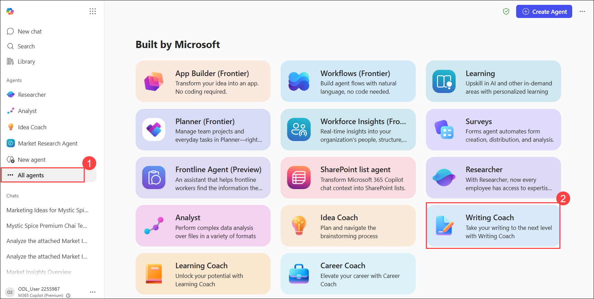

# Exercise 2, Task 4: Use Copilot’s Writing Coach agent to draft promotional campaign announcements

## Scenario

In the prior task, you selected a campaign idea for Mystic Spice Premium Chai Tea. You then had the Idea Coach agent help expand on this idea with suggestions for key messages, taglines, and promotional activities, which you saved in the **Mystic Spice Premium Chai Tea campaign concepts** document.

It’s now time to bring your campaign to life! Your goal is to create a short, engaging promotional announcement for a digital ad or social media post announcing the campaign launch. The announcement should be based in part on the campaign concepts captured in the **Mystic Spice Premium Chai Tea campaign concepts** document.

You plan to use Copilot’s Writing Coach agent to draft this promotional announcement. It should capture the public’s attention, reflect the campaign’s theme and concepts, and encourage audience participation. You want to keep the tone warm, inviting, and aligned with Mystic Spice’s comforting identity. Ensure the message is concise and optimized for digital platforms.

## Lab Overview

In this hands-on lab, you will use Microsoft 365 Copilot’s Writing Coach agent to create and refine marketing content for a product launch campaign. You will generate promotional messages, improve tone and engagement, develop audience-focused campaign variations, and create social media content concepts with captions, visual design guidance, and animation recommendations.

## Task 4: Use Copilot’s Writing Coach agent to draft promotional campaign announcements

In this task, you will use the Writing Coach agent to create promotional content for the Mystic Spice Premium Chai Tea campaign. You will refine messaging, adapt content for different campaign themes, develop a social media carousel concept, and generate supporting creative guidance for marketing and design teams.

1. Navigate back to the browser tab where you have Microsoft 365 Copilot open and under the **Agents** section, select **All agents (1)**.

1.  In the **Agent Store**, under the **Built by Microsoft** section, select **See more**. In the expanded list of **Built by Microsoft**, select **Writing Coach (2)**.

     

1. Click on **Add** to add the Writing Coach agent to your list of agents. 

2.  In the **Writing Coach** agent, attach the **Mystic Spice Premium Chai Tea campaign concepts** file that you created in the previous task and stored in your OneDrive. Ask the Writing Coach agent to draft a short promotional message for a social media post or an online banner ad. The message should be based in part on the concepts outlined in the attached document.

    Use the following prompt:

    ```
    Review the attached Mystic Spice Premium Chai Tea campaign concepts document. Based on the concepts outlined in the document, draft a short promotional message for a social media post or an online banner ad. The message should be based in part on the concepts outlined in the attached document.
    ```

3.  Review the promotional message. Ask the Writing Coach to for suggestions on how to improve it for tone, clarity, and engagement level.

    You can use the following prompt:

    ```
    How can I improve the tone, clarity, and engagement level?
    ```

4.  Review the suggested edits and the improved version provided by the agent. Tell the agent you like this improved version, but then ask how it can make the message more emotionally resonant or better aligned with the brand voice.

    Use the following prompt:

    ```
    I like this revised version. How can I make it more emotionally resonant or better aligned with the brand voice?
    ```

5.  Review the suggested edits and the improved version provided by the agent. Tell the agent you like this revised, emotionally resonant version, and then ask it to create three distinct versions of this message - luxury-focused, wellness-focused, and cultural storytelling.

    Use the following prompt:

    ```
    I like this revised, emotionally resonant version. Can you create three distinct versions of this message - luxury-focused, wellness-focused, and cultural storytelling?
    ```

6.  Review the results. Now ask the agent to create a carousel concept with these three themes for social media. A carousel concept refers to a social media format that' commonly used on platforms like Instagram, Facebook, and LinkedIn. Within a carousel concept, multiple images or cards are grouped into a single post that users can swipe through horizontally.

    Use the following prompt:

    ```
    Create a carousel concept with these three themes for social media? A carousel concept refers to a social media format that' commonly used on platforms like Instagram, Facebook, and LinkedIn. Within a carousel concept, multiple images or cards are grouped into a single post that users can swipe through horizontally.
    ```

7.  Review the results. While they look good, ask the agent to write full captions for each slide and optimize the captions for Instagram and Facebook.

    Use the following prompt:

    ```
    These look good. Write full captions for each slide and optimize the captions for Instagram and Facebook.
    ```

8.  Review the results. Ask the agent to design the visual layout ideas for each slide, including color palette, imagery, and typography suggestions.

    Use the following prompt:

    ```
    Design the visual layout ideas for each slide, including color palette, imagery, and typography suggestions.
    ```

9.  Review the results. Finally, ask the agent to suggest animation ideas for a dynamic carousel experience.

    Use the following prompt:

    ```
    Suggest animation ideas for a dynamic carousel experience.
    ```

1. Point to be noted here is that the agent will not actually create the carousel or the animations for you, but it will provide you with detailed descriptions of what these should look like, which you can then share with your design team to bring to life.

## Summary

In this task, you used the Writing Coach agent to draft and refine promotional messages for the Mystic Spice Premium Chai Tea campaign. You started with a basic message and iteratively improved it with the agent's suggestions, making it more emotionally resonant and aligned with the brand voice. You then expanded the message into three distinct themes and developed a carousel concept for social media, complete with captions, visual layout ideas, and animation suggestions. This process demonstrates how Copilot can assist in creating engaging marketing content that resonates with the target audience.

### 🎉 You have successfully completed the Module!
