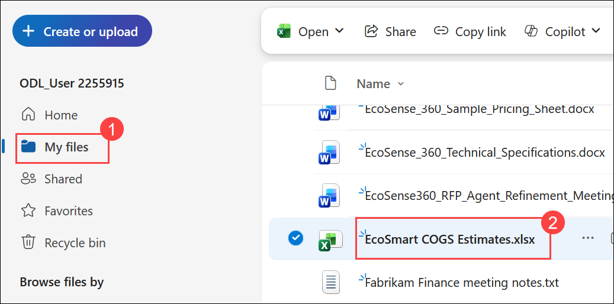
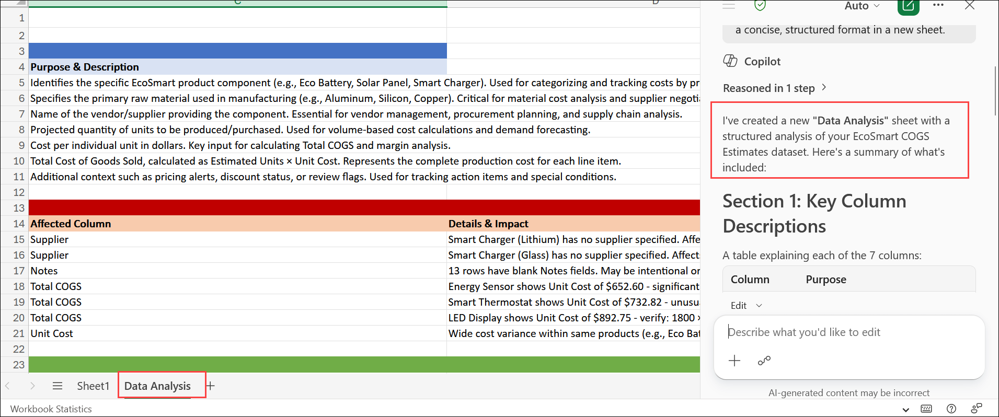
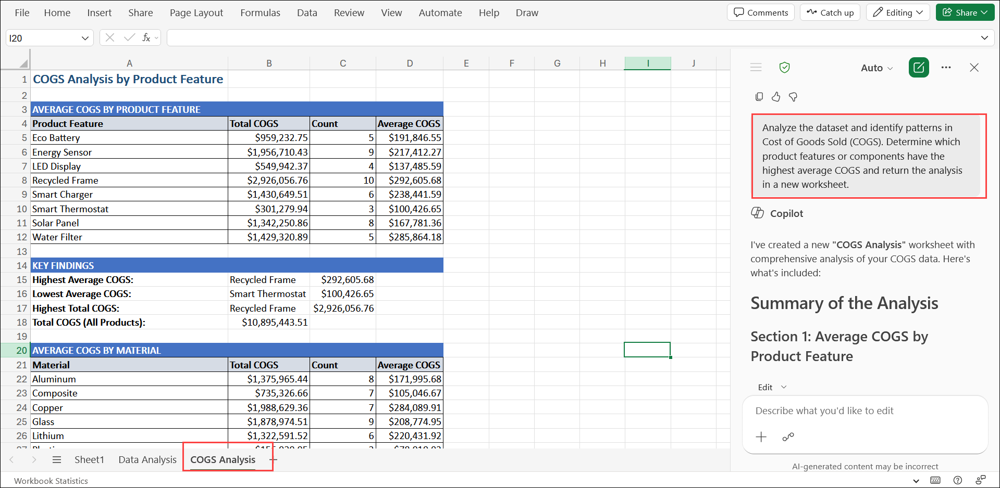
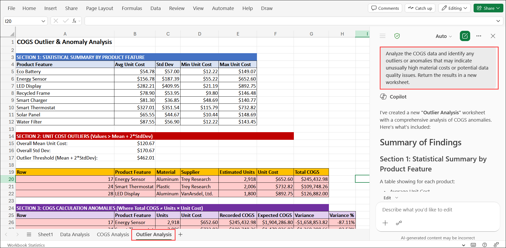
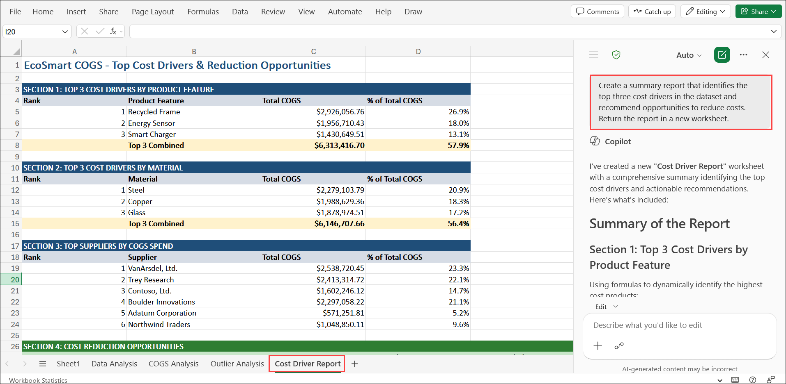
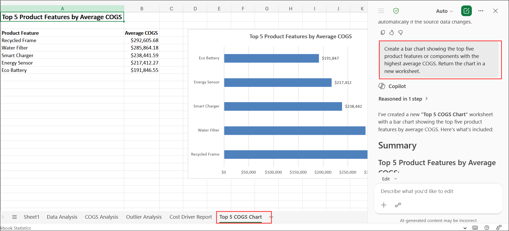

# Exercise 1, Task 1: Use Copilot in Excel to analyze new product line COGS

The Finance team is finalizing Cost of Goods Sold (COGS) estimates for Fabrikam's new EcoSmart product line. As the team's lead financial analyst, you're tasked with verifying the latest COGS data provided by the Operations team and ensuring leadership can easily review the most relevant numbers. Leadership wants to understand which product features or materials are driving higher production costs so they can evaluate where to optimize suppliers or production processes.

To accomplish these goals, you plan to use Microsoft Copilot in Excel to go beyond sorting and filtering. You want to analyze patterns in the COGS data, identify top cost drivers, and generate a summary of insights that can be shared with the Operations team.

This task reflects how financial analysts actually work, focusing on both insights and data manipulation. It shows how Copilot can analyze data contextually, uncover relationships or anomalies, and produce a management-ready summary in minutes.

## Using Copilot in Excel

Excel provides two ways to use Copilot: standard Copilot prompts for asking questions and getting insights about the data in the workbook, and **Edit with Copilot** in the Copilot pane for making direct, in-place changes to worksheets, tables, and formulas.

- You should use Copilot's **standard prompts** in Excel for quick questions, simple summaries, or one-off insights about the data you're already viewing. When using the Copilot pane, if you enter a prompt without selecting **Edit with Copilot**, Copilot responds in a chat-style mode that generates suggestions or content separately, rather than making direct, in-place changes to the workbook.

- You should use **Edit with Copilot** when you want Copilot to work directly with the worksheet-such as cleaning data, adding formulas, restructuring tables, or making iterative, in-place changes. **Edit with Copilot** is designed for hands-on data work, so it understands the structure of the sheet and can apply changes directly, rather than just describing what you could do.

In summary, use chat-style Copilot for thinking and generating ideas; use **Edit with Copilot** for hands-on editing inside the file. **Edit with Copilot** proposes specific changes (formulas, columns, cleanup steps) and, once you confirm, it applies those changes directly to the worksheet rather than expecting the user to explicitly apply them through copy and paste.

This task uses the **Edit with Copilot** functionality.

In addition, Copilot for Excel provides a **response control selector** that lets you choose which AI model Copilot uses to work with your workbook. You can leave this set to **Auto** (the default option) and let Copilot select a model for you, or choose a specific model when you want to influence how Copilot approaches the task.

If you've used Copilot Chat, you know that it also includes a response control selector. However, its options are different from the Excel selector. In Copilot Chat, the selector controls how deeply Copilot reasons about your request. In Excel, the selector controls which AI model performs the work. Although these selectors might appear to be similar, they control different aspects of Copilot and aren't the same setting.

This task uses the default **Auto** selector mode.

## Steps

1. Select the following link to download the [**EcoSmart COGS Estimates.xlsx**](https://go.microsoft.com/fwlink/?linkid=2347616) file. Store the file in your **OneDrive** account for use by Copilot in your tenant.

1. In your **Microsoft Edge** browser, navigate to the Microsoft 365 home page:

    ```
    https://www.microsoft365.com
    ```

1. Enter the following credentials to sign in to Microsoft 365:

    - **Email/Username**: **<inject key="AzureAdUserEmail"></inject>**

    - **Password**: **<inject key="AzureAdUserPassword"></inject>**

1. In the Microsoft 365 portal, click on the **App launcher (1)** button and select **OneDrive (2)**.

    

1. In **OneDrive for the web**, select the **MyFiles (1)** from left menu, navigate to your **EcoSmart COGS Estimates**, and then select the **EcoSmart COGS Estimates.xlsx (2)** spreadsheet.

    

1. Select **Copilot** to open the Copilot pane. Leave the response mode selector set to **Auto**. Then verify the **Allow editing** icon appears in the prompt field above to the plus **input** section.

    

    

1. In the Copilot pane, submit the following prompt to analyze the dataset:

    > **`Note:`** For this first prompt, the text has been provided so you can see what an effective prompt looks like when it incorporates the four key elements discussed in the Introduction unit - **Goal**, **Context**, **Sources**, and **Expectations**. You must write all remaining prompts in this exercise, but you can use this prompt as a model to emulate.

    ```
    I'm a financial analyst for Fabrikam. I was asked to analyze the EcoSmart COGS Estimates spreadsheet for Fabrikam's new EcoSmart product line. Can you please review the dataset in this spreadsheet and provide two things in a new sheet: (1) a clear description of each key column and its purpose, and (2) a list of any missing or inconsistent data points that could affect accuracy. Present your findings in a concise, structured format in a new sheet.
    ```

    

1. Review the results in the new sheet, then select **Sheet1** to return to the dataset.

    

1. Your next task is to identify cost trends. In the Copilot pane, enter a prompt that asks Copilot to find patterns in the data and summarize which product features or components have the highest average COGS. Ask it to return the results in a new sheet.

    ```
    Analyze the dataset and identify patterns in Cost of Goods Sold (COGS). Determine which product features or components have the highest average COGS and return the analysis in a new worksheet.
    ```

    

1. Review the results in the new sheet containing the COGS pattern analysis. Stay in this sheet for the next request. Enter a prompt asking Copilot to look for any **outliers or anomalies** in the COGS data that could indicate data errors or unusually high material costs. Ask it to return the results in a new sheet.

    ```
    Analyze the COGS data and identify any outliers or anomalies that may indicate unusually high material costs or potential data quality issues. Return the results in a new worksheet.
    ```

    

1. Review the results in the new sheet containing the outlier analysis, then select **Sheet1** to return to the dataset. Enter a prompt asking Copilot to generate a brief **summary report** of the top three cost drivers and any opportunities to reduce costs. Ask it to return the results in a new sheet.

    ```
    Create a summary report that identifies the top three cost drivers in the dataset and recommend opportunities to reduce costs. Return the report in a new worksheet.
    ```

    

1. Review the results in the new sheet containing the cost driver summary, then select **Sheet1** to return to the dataset.

1. Finally, enter a prompt asking Copilot to create a **bar chart** that shows the top five product features by average COGS. Ask it to return the results in a new sheet.

    ```
    Create a bar chart showing the top five product features or components with the highest average COGS. Return the chart in a new worksheet.
    ```

    

1. Review the chart generated by Copilot. You plan to reference these findings in a future meeting with your Finance Manager to discuss next steps.

You have now completed **Task 1**. Click **Next** to proceed to the next task.

## Summary

In this task, you used **Copilot in Excel** with the **Edit with Copilot** functionality to analyze Fabrikam's EcoSmart COGS data. You:

- Reviewed and described the dataset structure, including identifying any missing or inconsistent data points.
- Identified cost patterns and the product features or components with the highest average COGS.
- Detected outliers and anomalies that could indicate data errors or unusually high material costs.
- Generated a cost driver summary report highlighting the top three cost drivers and reduction opportunities.
- Created a bar chart visualizing the top five product features by average COGS.

These insights are now ready to be shared with the Operations team and discussed with leadership in an upcoming Finance review meeting.

## Support Contact

The **CloudLabs support** team is available 24/7, 365 days a year, via email and live chat to ensure seamless assistance at any time. We offer dedicated support channels tailored specifically for both learners and instructors, ensuring that all your needs are promptly and efficiently addressed.

Learner Support Contacts:

- Email Support: [cloudlabs-support@spektrasystems.com](mailto:cloudlabs-support@spektrasystems.com)
- Live Chat Support: https://cloudlabs.ai/labs-support

Click **Next** from the bottom right corner to proceed to the next task!

