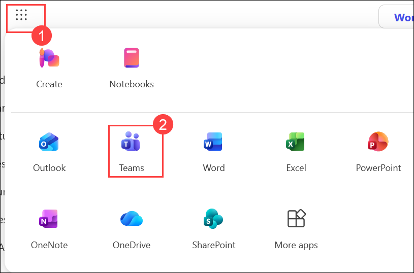
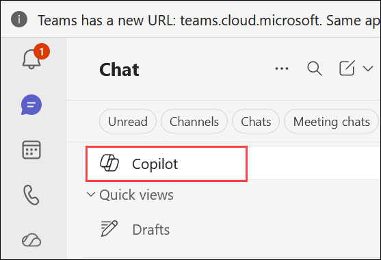
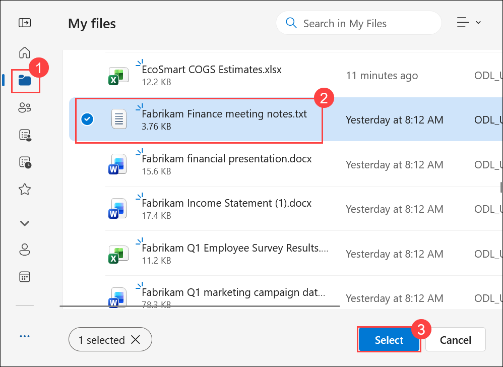
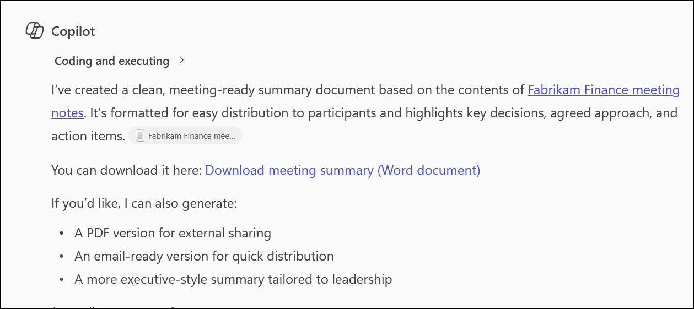
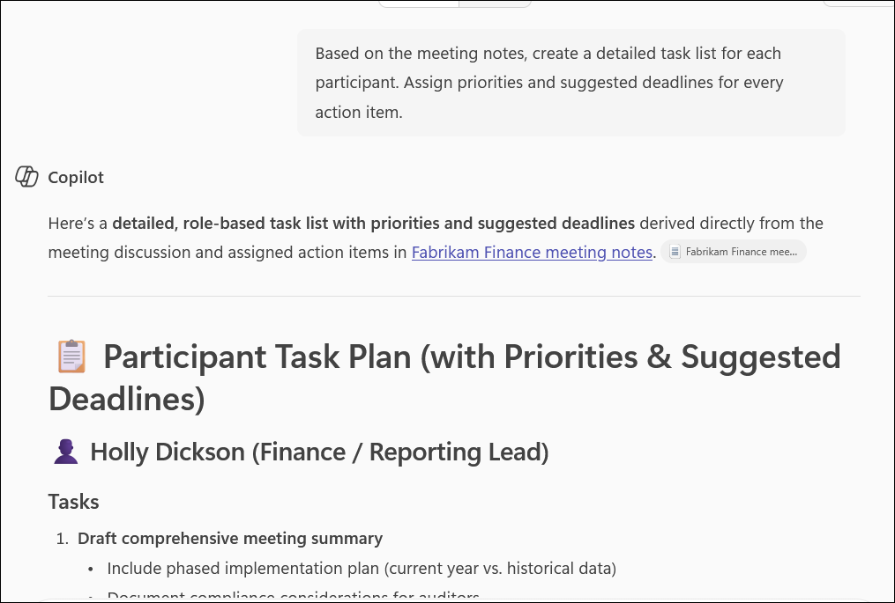
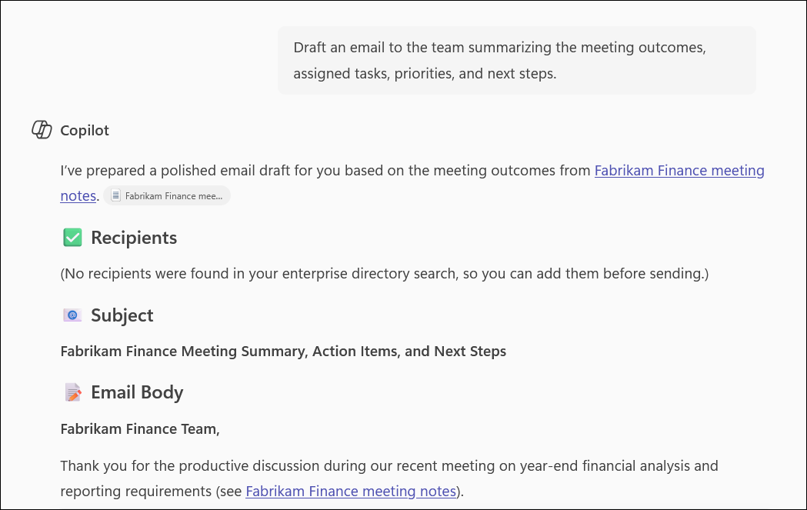
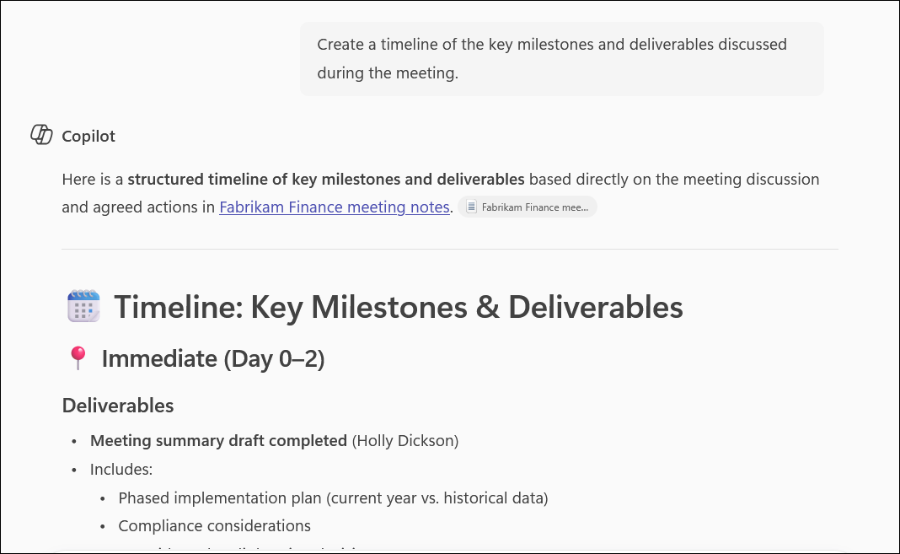
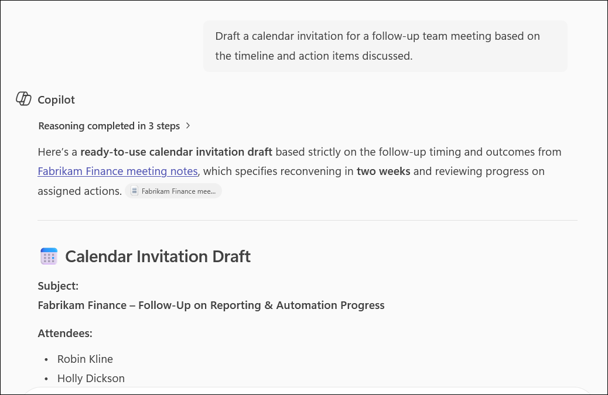
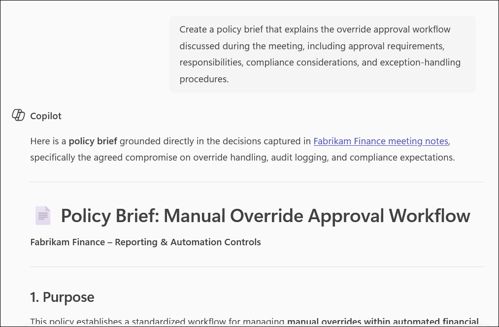

# Exercise 1, Task 2: Use Copilot in Teams to summarize meeting notes

## Scenario

In your role as a Financial Analyst for Fabrikam, you joined a meeting with Robin Kline, Fabrikam's Finance Manager, and other members of the Finance department, including Amari Rivera, Quincy Brooks, Miguel Reyes, and Eric Solomon. The purpose of the meeting was to discuss the upcoming year-end financial analysis and reporting requirement. The discussion covered how new data fields and automation might affect financial reporting timelines and formats.

You didn't have time to take detailed notes, so you turn to Copilot for help. In this task, you plan to use Copilot in Teams to summarize the meeting notes. This summary can help you quickly extract key takeaways and action items, which can then be shared with your manager and used to align future financial reporting processes.

> **`Note:`** Since this course uses a bring-your-own-subscription (BYOS) model, it doesn't include a simulated lab or demo environment for Fabrikam. Therefore, there's no Microsoft 365 tenant to access. To replicate the experience of a real Teams meeting in a simple, accessible format, meeting notes are provided in a text (.txt) file. In a corporate environment, these conversations would typically be stored in Teams, but for this exercise, the text file allows learners to upload and use the content with Copilot Chat without needing access to a live Teams channel. The format preserves sender names, timestamps, and message content so you can practice summarizing and extracting key information just as you would with actual Teams chat messages.

## Lab Overview

In this hands-on lab, you will use Microsoft 365 Copilot in Teams to transform meeting notes into actionable business outputs. You will generate summaries, identify decisions and action items, create participant-specific task lists, draft communications, build timelines, and produce policy guidance. These capabilities help finance teams improve collaboration, accountability, and follow-up execution.

## Task 2: Use Copilot in Teams to summarize meeting notes

In this task, you will use Copilot in Teams to analyze meeting notes, extract key decisions and action items, assign responsibilities, and generate follow-up deliverables such as emails, timelines, meeting invites, and policy documentation.

1. In your **Microsoft Edge** browser, navigate to the Microsoft 365 home page:

    ```
    https://www.microsoft365.com
    ```

1. Enter the following credentials to sign in to Microsoft 365:

    - **Email/Username**: **<inject key="AzureAdUserEmail"></inject>**

    - **Password**: **<inject key="AzureAdUserPassword"></inject>**

1. In the Microsoft 365 portal, click on the **App launcher (1)** button and select **Teams (2)**.

    

1. In **Teams for the web**, select **Copilot** in the left navigation pane.

    

1. In Copilot Chat, select **Add (1)**, and then choose **Attach cloud files (2)** to browse and attach a file from OneDrive.

   

1. In **My files (1)**, select **Fabrikam Finance meeting notes.txt (2)**, and then click **Select (3)**.

   

1. Once the files are uploaded, provide the following prompt and then click on **Send**:

    ```
    Summarize the key decisions, updates, and action items in the attached meeting notes.
    ```

1. Review the summary to ensure it includes decisions, next steps, and responsibilities. Then ask Copilot to generate a downloadable file of the summary for distribution to the meeting participants. Download the document that Copilot generates.

    ```
    Create a meeting summary that includes key decisions, action items, next steps, and assigned responsibilities. Generate the summary as a downloadable document
    ```

    

1. After reviewing the next steps in the report summary, enter a prompt asking Copilot to generate a detailed **task list for each participant** based on the action items in the notes. Ask Copilot to assign deadlines or priorities to each task - for example, *"high priority for compliance checks"*.

    ```
    Based on the meeting notes, create a detailed task list for each participant. Assign priorities and suggested deadlines for every action item.
    ```

    

1. Once Copilot generates the task list for each meeting participant, ask it to **draft an email to the team** that includes these tasks. In a real-world scenario, you would copy and paste the draft into Outlook to send it. For this exercise, review the draft and then proceed to the next step.

    ```
    Draft an email to the team summarizing the meeting outcomes, assigned tasks, priorities, and next steps.
    ```

    

1. Ask Copilot to generate a **timeline of key milestones** discussed in the meeting.

    ```
    Create a timeline of the key milestones and deliverables discussed during the meeting.
    ```

    

1. As a follow-up to the timeline, ask Copilot to **draft a calendar invite** for the team to reconvene.

    ```
    Draft a calendar invitation for a follow-up team meeting based on the timeline and action items discussed.
    ```

    > **`Note:`** In testing, Copilot may produce one of two results - it may offer several date options for the team's next meeting, or it may display a draft invitation message and ask you to provide a date. If you experience the latter, you would normally respond with a preferred date, but you don't need to do that for this exercise. In a real-world scenario, you would use the Copilot option to send the meeting request. Since this exercise involves a fictitious company, proceed to the next step.

    

1. Finally, after reviewing the meeting notes, ask Copilot to **draft a short policy brief** explaining the override approval workflow that was discussed during the meeting. You plan to use this brief as an authoritative guide when handling exceptions, overrides, or compliance-related tasks. This ensures that all team members follow the same process, reducing ambiguity and risk.

    ```
    Create a policy brief that explains the override approval workflow discussed during the meeting, including approval requirements, responsibilities, compliance considerations, and exception-handling procedures.
    ```

    

1. Review the policy brief generated by Copilot. You have now completed **Task 2**.

## Summary

In this task, you used **Copilot in Microsoft Teams** to process and act on the Fabrikam Finance department meeting notes. You:

- Summarized key decisions, updates, and action items from the meeting notes.
- Generated a downloadable summary document for distribution to participants.
- Created a prioritized task list for each meeting participant with deadlines.
- Drafted a team email embedding the assigned tasks.
- Generated a timeline of key milestones discussed during the meeting.
- Drafted a calendar invite for the team to reconvene.
- Produced a policy brief outlining the override approval workflow for compliance guidance.

These outputs demonstrate how Copilot in Teams can transform unstructured meeting notes into actionable, shareable deliverables - saving time and improving team alignment.

## You have successfully completed the task. Click on Next >> to proceed with the next exercise.

