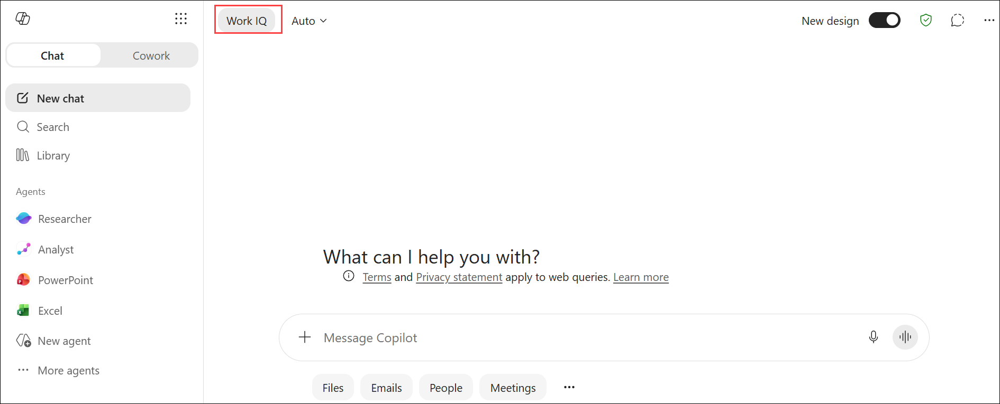
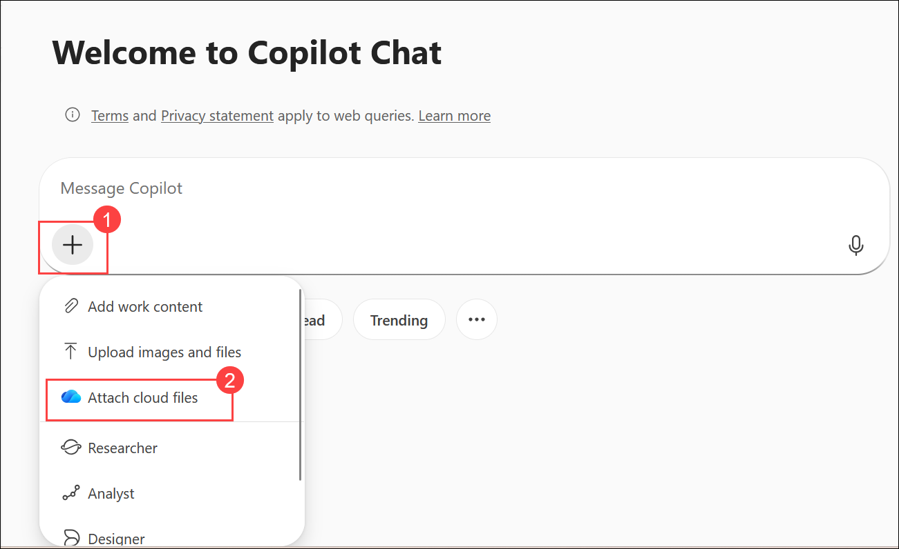
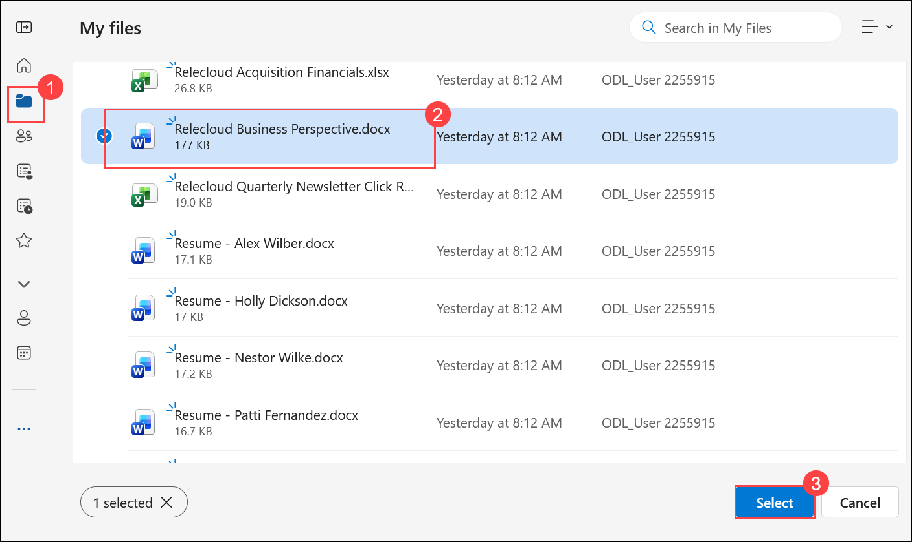
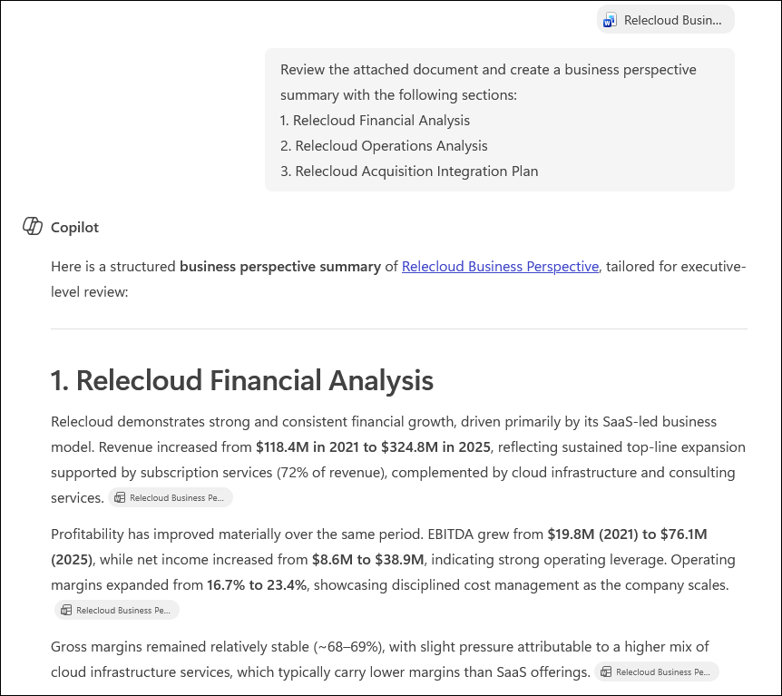
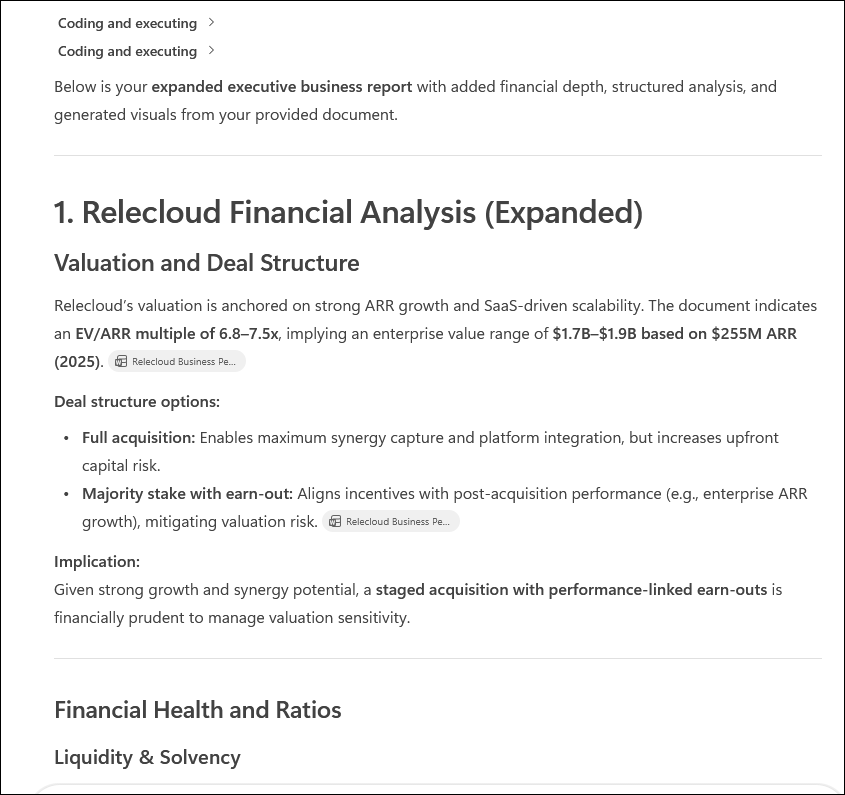
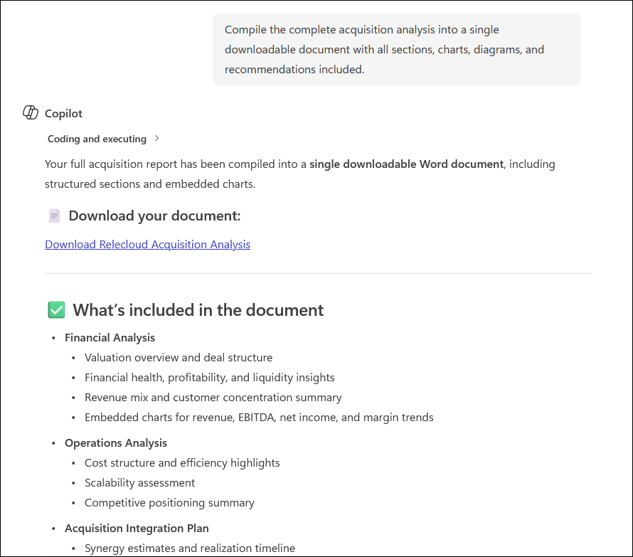

# Exercise 1, Task 3: Use Copilot Chat to analyze a potential acquisition

## Scenario

Fabrikam's executive team is evaluating the potential acquisition of Relecloud, Ltd. Robin Kline, Fabrikam's Finance Manager, sent you a detailed business perspective for Relecloud. It provides an overview of the company's market position and industry analysis, financial performance, customer and sales insights, operations and capabilities, intellectual property, product roadmap, risks and challenges, and future outlook.

Robin tasked you with analyzing and summarizing the document into three concise areas:

- **Relecloud's financial data**. Summarize the key financial figures and trends.

- **Operations analysis of Relecloud**. Highlight efficiency, scalability, and organizational structure.

- **Integration plan for the acquisition**. Identify main steps and dependencies for merging Relecloud into Fabrikam's structure.

This task demonstrates how Copilot Chat can extract, categorize, and structure complex financial information into actionable summaries, helping analysts prepare polished insights faster. It also shows how detailed prompts can provide much more satisfactory results than less detailed, high-level prompts.

## Using Copilot Chat

In Copilot Chat on the web, the **response mode selector** lets you control how much time and reasoning Copilot uses when answering your prompt. You can leave it set to **Auto** (the default option) so Copilot balances speed and depth for you, or choose a faster or more in-depth response style depending on the task.

When Copilot Chat opens in **Work** mode, the response mode selector isn't shown. In **Work** mode, Copilot is optimized for secure, work-context queries, so it automatically manages response depth for you. When you switch to **Web** mode, the response mode selector appears, allowing you to choose between faster responses or deeper reasoning. Once the selector is enabled, it remains visible as you switch between **Work** and **Web** modes.

As you saw in the earlier task that used Copilot in Excel, it also includes a response control selector. However, its options are different from the Chat selector. In Copilot Chat, the selector controls how deeply Copilot reasons about your request. In Excel, the selector controls which AI model performs the work. Although these selectors may look similar, they control different aspects of Copilot and aren't the same setting.

## Lab Overview

In this hands-on lab, you will use Microsoft 365 Copilot Chat to analyze a potential acquisition and transform complex business information into actionable insights. You will evaluate financial performance, operational capabilities, and integration considerations while generating structured reports and visual summaries. These capabilities help finance professionals accelerate due diligence and support strategic acquisition decisions.

## Task 3: Use Copilot Chat to analyze a potential acquisition

In this task, you will use Copilot Chat to analyze Relecloud's business perspective, generate financial and operational insights, and create an acquisition integration plan for Fabrikam.

1. In your **Microsoft Edge** browser, navigate to the Microsoft 365 home page:

    ```
    https://www.microsoft365.com
    ```

1. Enter the following credentials to sign in to Microsoft 365:

    - **Email/Username**: **<inject key="AzureAdUserEmail"></inject>**

    - **Password**: **<inject key="AzureAdUserPassword"></inject>**

1. In Copilot Chat, select the **Work** option.

    > **`Note:`** Since this task involves reviewing a file uploaded to OneDrive and generating insights from that internal document, select the **Work** option. The **Web** option doesn't apply here, since it searches external sources like public websites and blogs.

    

    > **Note:** If Microsoft 365 Copilot displays the **New design** experience, **Work IQ** replaces the **Work** and **Web** tabs. For this exercise, ensure **Work IQ** is turned **on** to use **Work**. If you prefer the classic interface, turn off the **New design** toggle to restore the **Work** and **Web** tabs.

    

1. In Copilot Chat, select **Add (1)**, and then choose **Attach cloud files (2)** to browse and attach a file from OneDrive.

   

1. In **My files (1)**, select **Relecloud Business Perspective.docx (2)**, and then click **Select (3)**.

   

1. Based on Robin Kline's request, enter a prompt asking Copilot to review the attached document and create a business perspective summary that contains the following three sections:

    - Relecloud's financial data
    - Operations analysis of Relecloud
    - Integration plan for the acquisition

    ```
    Review the attached document and create a business perspective summary with the following sections:
    1. Relecloud Financial Analysis
    2. Relecloud Operations Analysis
    3. Relecloud Acquisition Integration Plan
    ```

    

1. Review the results. Note that Copilot's summary is a good start, but it may not include the level of detail necessary for a comprehensive acquisition analysis. The previous prompt asked for a summary with three sections but didn't specify the details to include in each section. When those decisions are left to Copilot, results may not always meet expectations.

    In the next step, you'll submit a more detailed prompt to produce a richer, more structured report.

1. Ask Copilot to create an **expanded version** of the previous report. Tell it to include all the information from the previous summary, and also add the following details to each section:

    ```
    Expand the previous report and include the following:

    Financial Analysis:
    - Valuation and deal structure, including valuation multiples and deal structure implications
    - Financial health and ratios, including liquidity, solvency, profitability trends, gross-to-net retention by cohort, regional ARR dynamics, and cash flow analysis
    - Revenue and customer concentration, including revenue breakdown, customer concentration risk, customer concentration by sector/vertical, and churn and retention drivers
    - Include charts showing revenue, EBITDA, net income, gross margin, and operating margin trends

    Operations Analysis:
    - Cost structure and efficiency, including COGS, operating expenses, efficiency metrics, and scalability assessment
    - Competitive positioning, including SWOT analysis and peer benchmarking
    - Include a SWOT matrix and a scalability assessment diagram

    Integration Planning:
    - Synergy and integration modeling, including synergy realization, integration risks, and a post-merger integration plan
    - Leadership and organizational review, including management track record and organizational structure
    - Include a Gantt chart showing the post-merger integration timeline and milestones
    ```

    

1. Review the expanded results. Note the difference between the first summary report - based on a high-level prompt - and this second report - based on a much more detailed request. This comparison highlights the importance of crafting detailed prompts that incorporate all four key elements: **Goal**, **Context**, **Sources**, and **Expectations**.

1. Feel free to select any of Copilot's suggested follow-up prompts if you want to refine or expand the summary further. When you're ready, ask Copilot to **compile this information into a single downloadable document**. Download the file once it's generated and save it to your **OneDrive** account.

    ```
    Compile the complete acquisition analysis into a single downloadable document with all sections, charts, diagrams, and recommendations included.
    ```

    

1. You have now completed **Task 3**.

## Summary

In this task, you used **Copilot Chat** in Work mode to analyze the Relecloud Business Perspective document on behalf of Fabrikam's Finance Manager. You:

- Generated an initial three-section acquisition summary covering financial data, operations analysis, and an integration plan.
- Observed how a high-level prompt produces a useful but limited result.
- Submitted a detailed follow-up prompt specifying exact subsections and visuals for each area of the report.
- Compared the two outputs to understand how prompt quality directly affects the depth and usefulness of Copilot's response.
- Compiled the final expanded report into a downloadable document saved to OneDrive.

This task demonstrates that the more precise and structured your prompt - incorporating Goal, Context, Sources, and Expectations - the more actionable and comprehensive Copilot's output will be.

## You have successfully completed the task. Click on Next >> to proceed with the next exercise.

