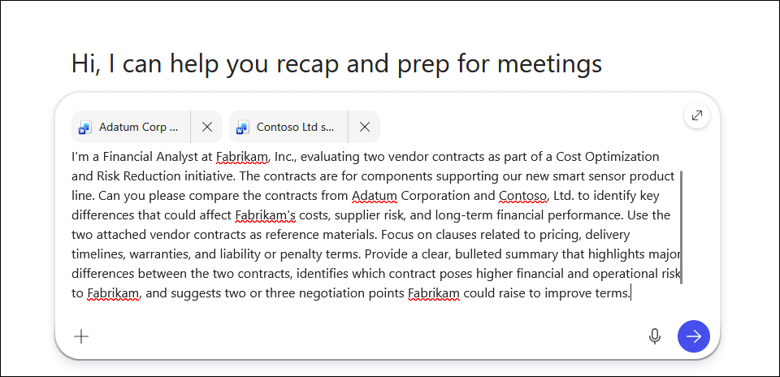
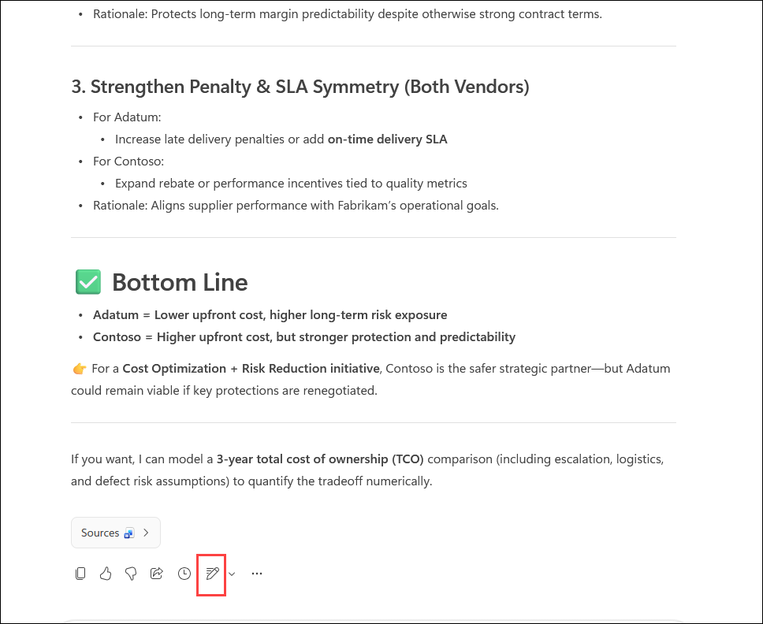
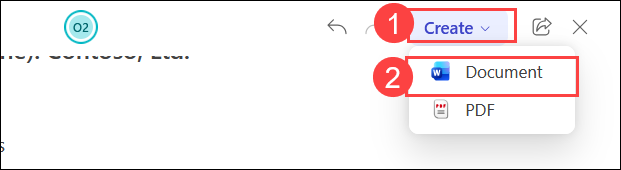
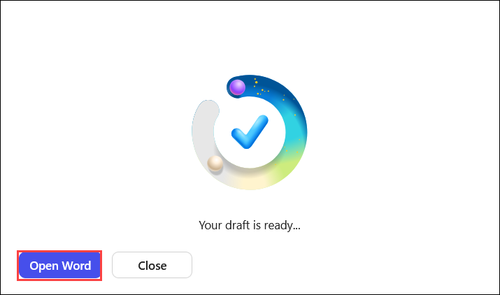
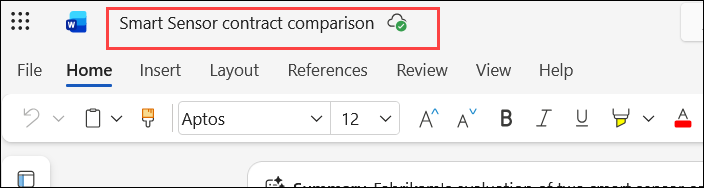
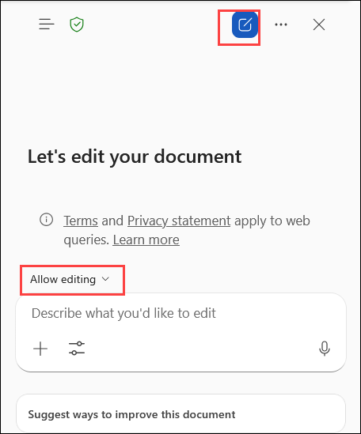
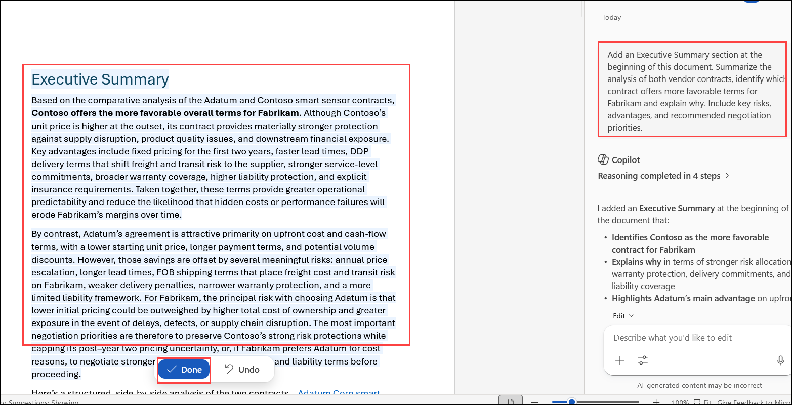
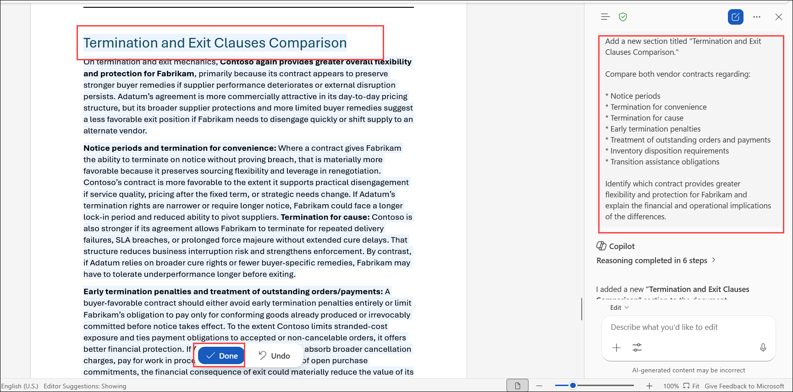

# Exercise 2, Task 1: Use Microsoft 365 Copilot Chat to evaluate vendor contracts

Fabrikam's Finance Manager shared two vendor contracts with you - one from **Adatum Corporation** and another from **Contoso, Ltd.** Each contract contains clauses related to pricing, delivery schedules, warranty terms, and penalties for nonperformance. You need to understand how these contracts differ and which poses greater financial or operational risk to Fabrikam. You plan to use Microsoft 365 Copilot Chat to compare both contracts side by side and identify key differences, highlight risk areas, and summarize potential negotiation points - all of which you plan to store in a Word document for later use.

## Using Copilot Chat

In Copilot Chat on the web, the **response mode selector** lets you control how much time and reasoning Copilot uses when answering your prompt. You can leave it set to **Auto** (the default option) so Copilot balances speed and depth for you, or choose a faster or more in-depth response style depending on the task.

When Copilot Chat opens in **Work** mode, the response mode selector isn't shown. In **Work** mode, Copilot is optimized for secure, work-context queries, so it automatically manages response depth for you. When you switch to **Web** mode, the response mode selector appears, allowing you to choose between faster responses or deeper reasoning. Once the selector is enabled, it remains visible as you switch between **Work** and **Web** modes.

If you've used **Copilot in Excel**, you know that it also includes a response control selector. However, its options are different from the Chat selector. In Copilot Chat, the selector controls how deeply Copilot reasons about your request. In Excel, the selector controls which AI model performs the work. Although these selectors may look similar, they control different aspects of Copilot and aren't the same setting.

This task uses the default **Auto** selector mode.

## Lab Overview

In this hands-on lab, you will use Microsoft 365 Copilot Chat and Copilot in Word to analyze and compare vendor contracts. You will identify key differences, assess financial and operational risks, generate negotiation recommendations, and create a structured contract comparison document. These capabilities help Finance professionals evaluate supplier agreements and make informed procurement decisions.

## Task 1: Use Microsoft 365 Copilot Chat to evaluate vendor contracts

In this task, you will use Copilot Chat and Copilot in Word to compare vendor contracts, identify risks and opportunities, and create a detailed contract comparison document for Finance leadership.

1. In your **Microsoft Edge** browser, navigate to the Microsoft 365 home page:

    ```
    https://www.microsoft365.com
    ```

1. Enter the following credentials to sign in to Microsoft 365:

    - **Email/Username**: **<inject key="AzureAdUserEmail"></inject>**

    - **Password**: **<inject key="AzureAdUserPassword"></inject>**

1. In Copilot Chat, select the **Work** option.

    > **`Note:`** Since this task involves reviewing a file uploaded to OneDrive and generating insights from that internal document, select the **Work** option. The **Web** option doesn't apply here, since it searches external sources like public websites and blogs.

    

    > **Note:** If Microsoft 365 Copilot displays the **New design** experience, **Work IQ** replaces the **Work** and **Web** tabs. For this exercise, ensure **Work IQ** is turned **on** to use **Work**. If you prefer the classic interface, turn off the **New design** toggle to restore the **Work** and **Web** tabs.

    

1. In Copilot Chat, select **Add (1)**, and then choose **Attach cloud files (2)** to browse and attach a file from OneDrive.

   

1. In **My files**, select  **Adatum Corp smart sensor contract.docx** and **Contoso Ltd smart sensor contract.docx** , and then click **Select**.

1. With both files attached, submit the following prompt to compare the two contracts:

    > **`Note:`** For this first prompt, the text has been provided so you can see what an effective prompt looks like when it incorporates the four key elements discussed in the Introduction unit - **Goal**, **Context**, **Sources**, and **Expectations**. You must write all remaining prompts in this exercise, but you can use this prompt as a model to emulate.

    ```
    I'm a Financial Analyst at Fabrikam, Inc., evaluating two vendor contracts as part of a Cost Optimization and Risk Reduction initiative. The contracts are for components supporting our new smart sensor product line. Can you please compare the contracts from Adatum Corporation and Contoso, Ltd. to identify key differences that could affect Fabrikam's costs, supplier risk, and long-term financial performance. Use the two attached vendor contracts as reference materials. Focus on clauses related to pricing, delivery timelines, warranties, and liability or penalty terms. Provide a clear, bulleted summary that highlights major differences between the two contracts, identifies which contract poses higher financial and operational risk to Fabrikam, and suggests two or three negotiation points Fabrikam could raise to improve terms.
    ```

    

1. Review the comparison generated by Copilot. At the end of the response, select the **Edit in Pages** icon.

    

1. When editing in **Pages**, note how Copilot displays the Copilot chat pane alongside the Pages form. In the **Pages** form, select the **Create (1)** button and then select **Document (2)** in the drop-down menu.

    

1. In the dialog box that appears, select **Open Word** to open the document in **Word for the web**.

    

1. In **Word for the web**, Copilot copies its entire response into the document, including any extraneous chat content that appeared at the beginning and end of the chat. Delete any extraneous text that was pasted in. Then select the file name above the menu bar and rename the file to:

    ```
    Smart Sensor contract comparison
    ```

    Leave the document open - you will add additional content to it in the remaining steps.

    

1. Select **Copilot** to open the Copilot pane. Leave the response mode selector set to **Auto**. Then verify the **Allow editing** icon appears in the prompt field above to the plus **input** section.

    

1. Before adding an Executive Summary, place your cursor on a blank line **above the first section** of the document - this is where the new section will appear. Then enter a prompt asking Copilot to add an **Executive Summary** section that provides a summarized analysis of the two vendor contracts. The section should indicate which contract has more favorable terms for Fabrikam and why, and where Fabrikam should focus its negotiation efforts.

    ```
    Add an Executive Summary section at the beginning of this document. Summarize the analysis of both vendor contracts, identify which contract offers more favorable terms for Fabrikam and explain why. Include key risks, advantages, and recommended negotiation priorities.
    ```

    

1. Review the Executive Summary section Copilot added. While this is a good starting point, consider that real-world contract analysis often covers additional areas. The following topics are commonly reviewed by financial analysts when evaluating supplier contracts:

    - **Termination and exit clauses** - notice periods, early termination conditions, penalties, and handling of outstanding obligations such as inventory and payments upon termination.

    - **Volume flexibility and scalability** - provisions for adjusting order volumes without penalty, price breaks or discounts at higher volumes, and options to change minimum order quantities as demand shifts.

    - **Change management and amendments** - how contract amendments and specification changes are handled, and whether a formal process exists for managing technology or regulatory changes.

    - **Supplier performance and monitoring** - KPIs or SLAs defined within the contract, remedies for consistent underperformance, and processes for regular performance reviews or audits.

    - **Compliance and regulatory requirements** - whether the contract mandates compliance with specific industry standards or regulations, and whether audit rights are included to verify compliance.

    - **Dispute resolution** - mechanisms in place for resolving disputes, such as arbitration, mediation, or jurisdiction clauses.

    - **Financial health and stability of the supplier** - clauses requiring the supplier to maintain certain financial ratios or insurance levels, and what happens if the supplier is acquired or experiences significant financial distress.

    Select **one topic** from the list above that interests you. Place your cursor in the document where you want the new section to appear, then ask Copilot to add a section comparing both contracts specifically on that topic.

    ```
    Add a new section titled "Termination and Exit Clauses Comparison."

    Compare both vendor contracts regarding:

    * Notice periods
    * Termination for convenience
    * Termination for cause
    * Early termination penalties
    * Treatment of outstanding orders and payments
    * Inventory disposition requirements
    * Transition assistance obligations

    Identify which contract provides greater flexibility and protection for Fabrikam and explain the financial and operational implications of the differences.

    ```

    > **`Note:`** Focusing on a single topic at a time often yields more thorough and precise results than submitting multiple requests in one prompt.

    

1. Review the new section Copilot added. Now select a **second topic** from the list above. Place your cursor where you want the new section to appear, then ask Copilot to add another section comparing both contracts on this second topic.

1. Review the new section Copilot added. You will use this document as the basis for a PowerPoint presentation in the next task. Feel free to make any additional enhancements before proceeding - for example, adding a third topic comparison from the list above, or exploring any of Copilot's suggested follow-up prompts in the Copilot pane.

1. You have now completed **Task 1**.

## Summary

In this task, you used **Microsoft 365 Copilot Chat** and **Copilot in Word** to evaluate two vendor contracts on behalf of Fabrikam's Finance team. You:

- Compared the Adatum Corporation and Contoso, Ltd. contracts across pricing, delivery timelines, warranties, and liability terms.
- Identified which contract poses higher financial and operational risk to Fabrikam, along with key negotiation points.
- Exported Copilot's analysis to a Word document titled **Smart Sensor contract comparison**.
- Added an Executive Summary section highlighting favorable terms and negotiation focus areas.
- Enriched the document with additional contract analysis sections covering topics such as termination clauses, volume flexibility, supplier performance, and more.

This document will serve as the foundation for the executive presentation you will create in the next task.

## You have successfully completed the task. Click on Next >> to proceed with the next exercise.

