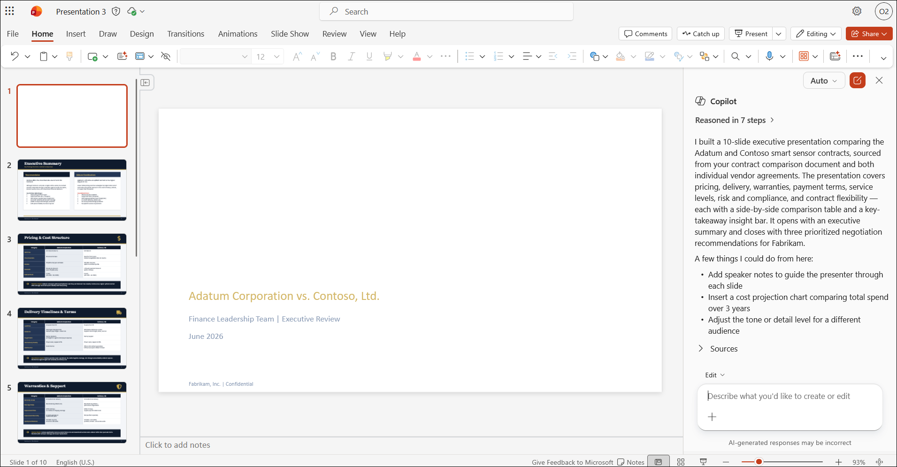
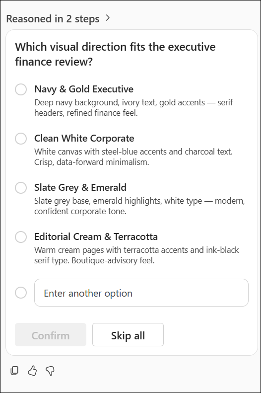
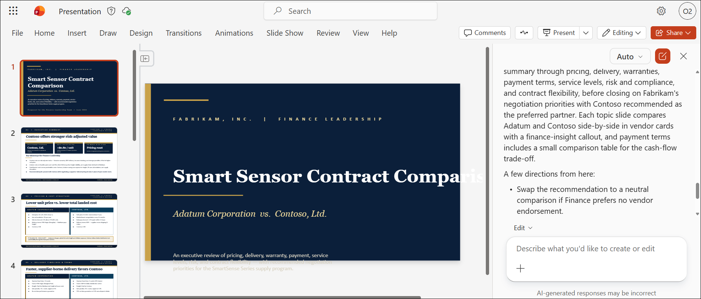
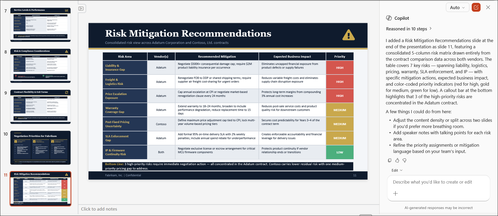
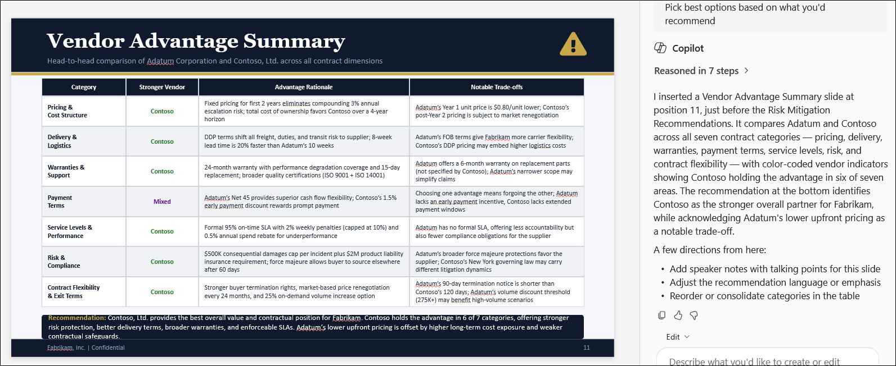
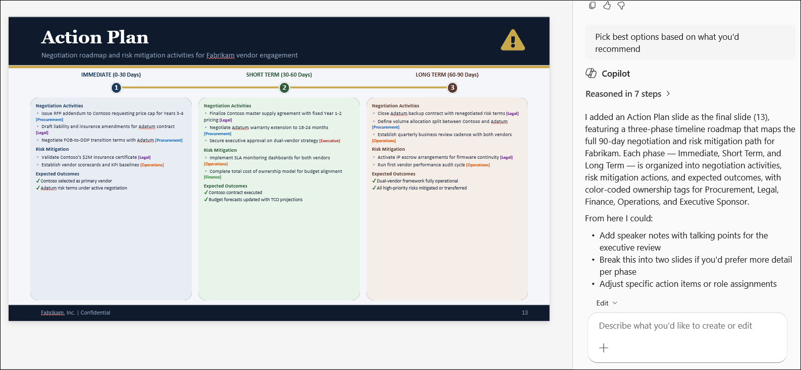
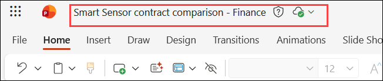

# Exercise 2, Task 2: Use Copilot in PowerPoint to create an executive presentation

Your next task is to share the information captured in the **Smart Sensor contract comparison** document in tomorrow's Finance leadership meeting. Visual clarity and brevity are key. You plan to use Copilot in PowerPoint to generate a presentation that summarizes your key takeaways and includes recommendations for mitigating the identified risks. Ensure the deck is concise and visually engaging.

## Using Copilot in PowerPoint

PowerPoint provides two ways to use Copilot: standard Copilot prompts for quickly generating slide content or summaries, and **Edit with Copilot** in the Copilot pane for making direct, in-place edits to slides, layouts, and presentation structure.

- You should use Copilot's **standard prompts** in PowerPoint when you want to draft slides quickly, summarize content, or generate speaker notes without changing the structure of the deck. When using the Copilot pane, if you enter a prompt without selecting **Edit with Copilot**, Copilot responds in a chat-style mode that generates suggestions or content separately, rather than making direct, in-place changes to the presentation.

- You should use **Edit with Copilot** when you want Copilot to work directly in the presentation-such as reorganizing slides, refining slide text, improving layouts, or making iterative edits across multiple slides. **Edit with Copilot** is optimized for in-place presentation work, so it understands slide structure and can apply changes directly to the deck, rather than just suggesting content in a separate response.

In summary, use chat-style Copilot for thinking and generating ideas; use **Edit with Copilot** for hands-on editing inside the file. Copilot typically previews slide or layout changes and, once you confirm, it applies those changes directly to the slide deck rather than expecting the user to explicitly apply them through copy and paste.

This task uses the **Edit with Copilot** functionality.

## Steps

1. In your **Microsoft Edge** browser, navigate to the Microsoft 365 home page:

    ```
    https://www.microsoft365.com
    ```

1. Enter the following credentials to sign in to Microsoft 365:

    - **Email/Username**: **<inject key="AzureAdUserEmail"></inject>**

    - **Password**: **<inject key="AzureAdUserPassword"></inject>**

1. In the Microsoft 365 portal, click on the **App launcher (1)** button and select **PowerPoint (2)**.

    

1. In **PowerPoint for the web**, click on  **create a blank presentation**.

    

1. Select **Copilot** at the right bottom of the page and tap to open the Copilot pane.

    

1. In the Copilot prompt field, enter a prompt asking Copilot to create a slide presentation based on the attached **Smart Sensor contract comparison** file. Remember to address the four key elements of an effective prompt - **Goal**, **Context**, **Sources**, and **Expectations**. Your prompt should include the following requirements:

    - The presentation is targeted at the **Finance leadership team**
    - Include a **separate slide for each key finding topic area**, such as Pricing, Delivery Timelines and Terms, Warranties and Support, and so on
    - Each slide should **compare Adatum Corporation and Contoso, Ltd.** for the selected topic area
    - Use **visuals** to keep the presentation engaging
    - Use **bullet points** on slides for clarity

    ```
    Create a professional PowerPoint presentation based on the attached "Smart Sensor Contract Comparison" document.

    Goal:
    Prepare an executive-level presentation for the Finance Leadership Team that evaluates and compares the vendor contracts from Adatum Corporation and Contoso, Ltd.

    Context:
    The presentation should help finance leaders understand the key contractual differences, financial implications, risks, and negotiation opportunities associated with each vendor.

    Source:
    Use the attached Smart Sensor Contract Comparison document as the primary source.

    Expectations:

    * Create a professional presentation suitable for executive review.
    * Include an Executive Summary slide.
    * Create a separate slide for each key topic area, including:

      * Pricing and Cost Structure
      * Delivery Timelines and Terms
      * Warranties and Support
      * Payment Terms
      * Service Levels and Performance Commitments
      * Risk and Compliance Considerations
      * Contract Flexibility and Change Management
    * On each topic slide, compare Adatum Corporation and Contoso, Ltd. side-by-side.
    * Use concise bullet points rather than paragraphs.
    * Include charts, icons, SmartArt, tables, or other visuals to improve engagement and readability.
    * Highlight key advantages, risks, and financial impacts.
    * Include a final Recommendations slide summarizing negotiation priorities for Fabrikam.
    * Use a consistent professional design appropriate for senior finance executives.

    ```

    

1. If Copilot asks a series of questions related to the presentation, select the answers you want it to apply and then select **Confirm**. It may ask a second series of questions, including a request to select a slide template.

    > **`Note:`** If you don't select a template, Copilot presents text on plain white slides. Select the answers you want applied, or select **Skip all** to let Copilot use its best judgment.

    

1. Wait for Copilot to generate the slides - this may take several minutes.

    > **`Note:`** During testing, Copilot sometimes generated slides automatically with no further confirmation needed. Other times, it provided an outline in the Copilot chat pane and suggested options for how to proceed. If you experience the latter, tell Copilot to **proceed with the outline**.

    

1. Review the slides that Copilot generated. You want to add a **Risk Mitigation** slide, which isn't currently in the presentation. Review the slides and identify where this topic best fits. In the slide pane on the left, select the location where you want Copilot to insert the new slide. Then enter a prompt asking Copilot to add a slide containing the top recommendations for mitigating risks. Ask that the slide include **visual emphasis**, such as callouts or highlights, for critical points.

    ```
    Add a new slide titled "Risk Mitigation Recommendations."

    Based on the contract comparison, identify the top contractual, financial, operational, and compliance risks associated with both vendors.

    Include:

    * Key risk areas
    * Recommended mitigation actions
    * Expected business impact
    * Priority level (High, Medium, Low)

    Use strong visual emphasis such as callouts, icons, highlights, or color-coded indicators to draw attention to the most critical risks and recommendations.
    ```

    

    > **`Note:`** Copilot may ask another series of questions - including a request to reselect a slide template - even though you specified one earlier. It may take several minutes to generate the new slide. If Copilot provides an outline rather than adding the slide directly, tell it to **add the planned slide to the presentation**.

1. Review the risk mitigation slide that Copilot added. Next, you want to add a **Vendor Advantage Summary** slide at the end of the deck. Place your cursor after the last slide in the deck, then ask Copilot to add a Vendor Advantage Summary slide that indicates which vendor offers better terms for each topic covered in the presentation.

    ```
    Add a slide titled "Vendor Advantage Summary."

    Create a summary table that compares Adatum Corporation and Contoso, Ltd. across every topic covered in the presentation.

    For each category, indicate:

    * Which vendor offers the stronger terms
    * Why that vendor has the advantage
    * Any notable trade-offs

    Conclude with an overall recommendation identifying which vendor provides the best overall value and contractual position for Fabrikam.
    ```

    

1. Review the Vendor Advantage Summary slide. Finally, you want Copilot to add an **Action Plan** slide as the last slide in the deck. Place your cursor after the final slide, then ask Copilot to add an Action Plan slide that identifies the next steps for negotiations and risk mitigation. Ask that the slide include a **timeline** and **responsible roles**.

    ```
    Add a slide titled "Action Plan."

    Based on the contract comparison and identified risks, create a structured action plan for Fabrikam.

    Include:

    Recommended negotiation activities
    Risk mitigation actions
    Responsible roles (Finance, Procurement, Legal, Operations, Executive Sponsor)
    Expected outcomes
    A timeline covering Immediate (0–30 days), Short Term (30–60 days), and Long Term (60–90 days) activities

    Present the information using a timeline graphic, roadmap, or SmartArt visual and include clear ownership for each action item.
    ```

    

    > **`Note:`** During testing, Copilot sometimes omitted the timeline from the Action Plan slide. If that happens, ask Copilot to create a separate **Next Steps timeline** slide. Once generated, you can leave it as a standalone slide or manually copy the timeline into the original Action Plan slide.

1. Review the action plan slide. Once you're satisfied with the presentation, save the file to your **OneDrive** account using the following file name:

    ```
    Smart Sensor contract comparison - Finance
    ```

    

1. You have now completed **Task 2**.

## Summary

In this task, you used **Copilot in PowerPoint** with the **Edit with Copilot** functionality to transform the Smart Sensor contract comparison document into an executive presentation for Fabrikam's Finance leadership team. You:

- Generated a multi-slide presentation comparing Adatum Corporation and Contoso, Ltd. across key contract topic areas.
- Added a **Risk Mitigation** slide with visual emphasis on critical points.
- Added a **Vendor Advantage Summary** slide identifying which vendor offers better terms per topic.
- Added an **Action Plan** slide outlining next steps for negotiations and risk mitigation, including a timeline and responsible roles.
- Saved the final presentation to OneDrive as **Smart Sensor contract comparison - Finance**.

This presentation is now ready to be delivered to Fabrikam's Finance leadership team in tomorrow's meeting.

## Support Contact

The **CloudLabs support** team is available 24/7, 365 days a year, via email and live chat to ensure seamless assistance at any time. We offer dedicated support channels tailored specifically for both learners and instructors, ensuring that all your needs are promptly and efficiently addressed.

Learner Support Contacts:

- Email Support: [cloudlabs-support@spektrasystems.com](mailto:cloudlabs-support@spektrasystems.com)
- Live Chat Support: https://cloudlabs.ai/labs-support

Click **Next** from the bottom right corner to proceed to the next task!

