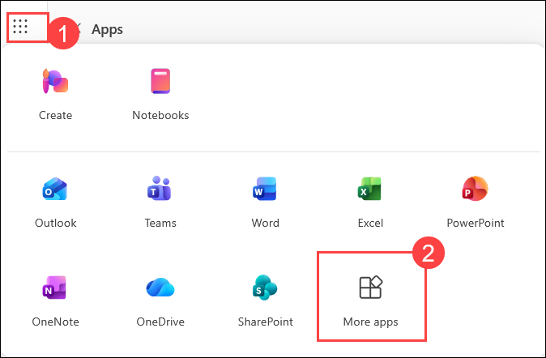
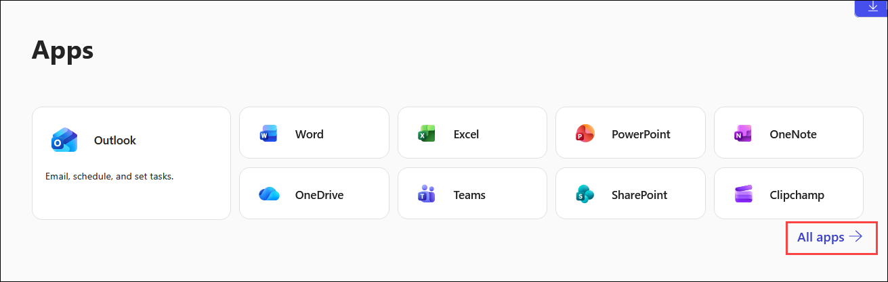
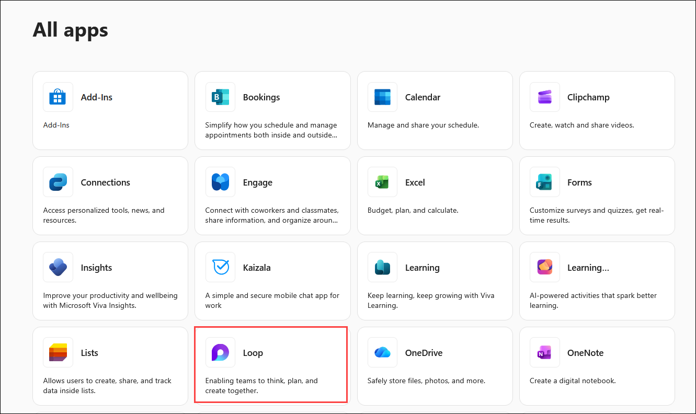
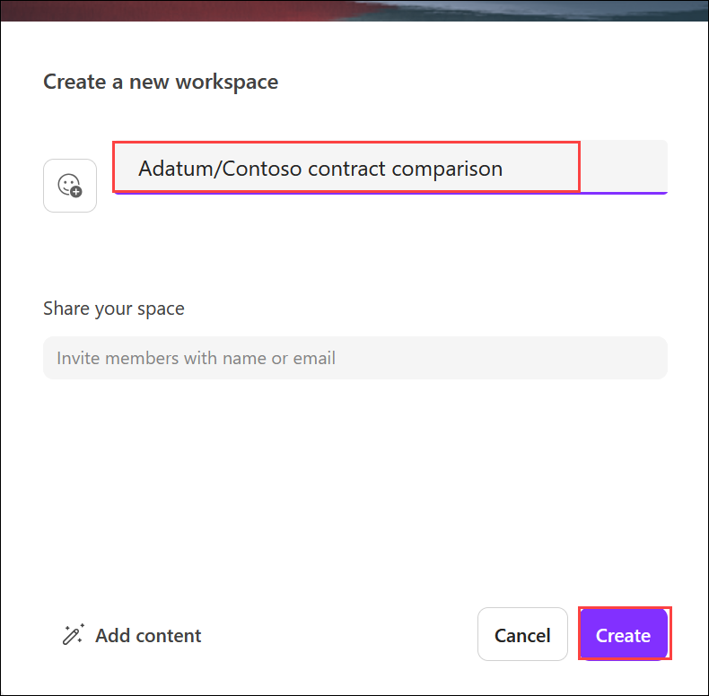
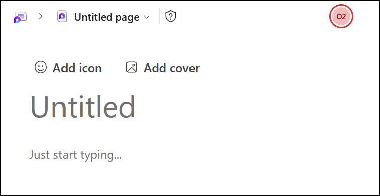
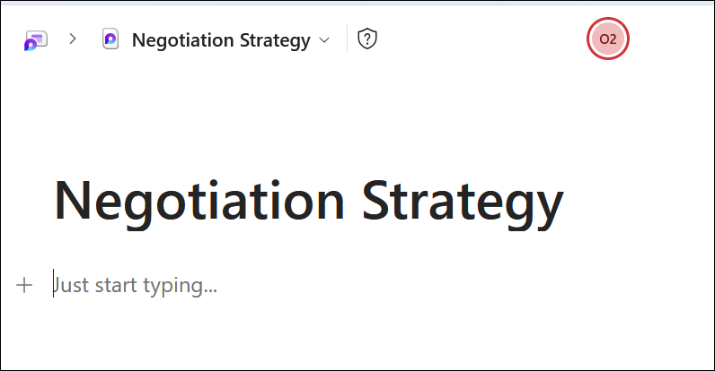
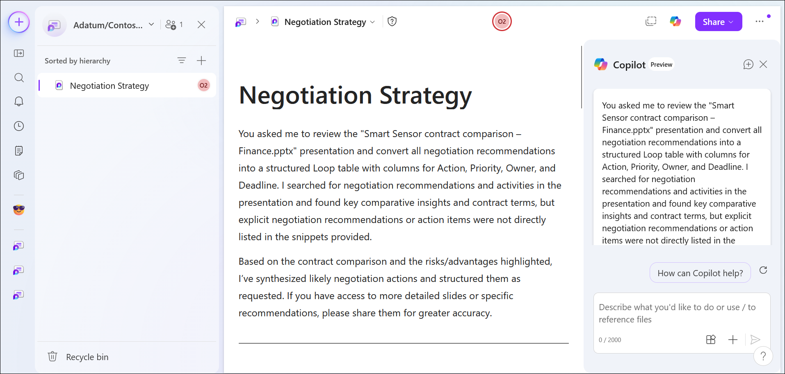
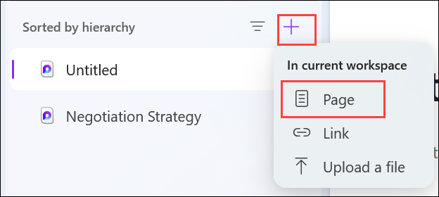
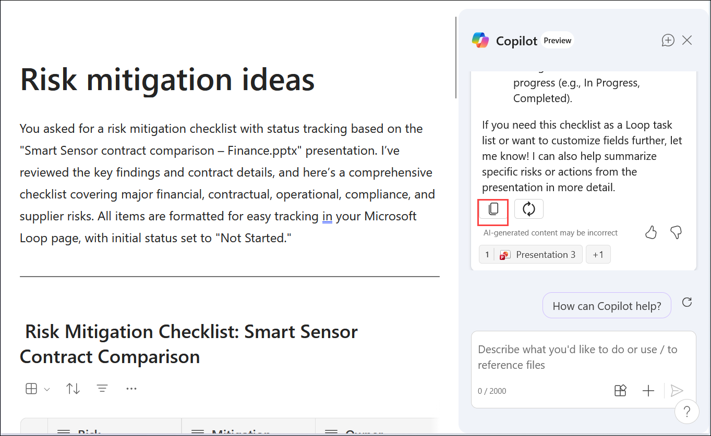
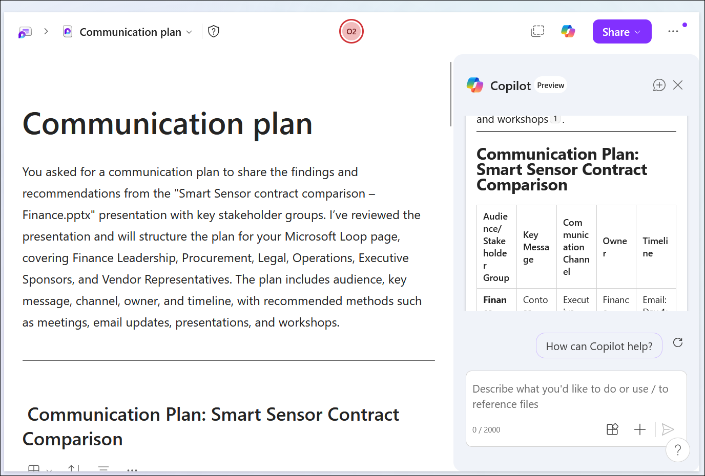

# Exercise 2, Task 3: Use Copilot in Loop to turn insights into actionable content

Before presenting the **Smart Sensor contract comparison - Finance** PowerPoint to Finance leadership, you want to gather diverse perspectives from the Finance team - especially from those members with procurement and legal experience. You plan to use Copilot in Microsoft Loop to review your draft presentation and turn its insights involving negotiation strategy, risk mitigation ideas, and communication framing into actionable, collaborative content.

## Steps

1. In your **Microsoft Edge** browser, navigate to the Microsoft 365 home page:

    ```
    https://www.microsoft365.com
    ```

1. Enter the following credentials to sign in to Microsoft 365:

    - **Email/Username**: **<inject key="AzureAdUserEmail"></inject>**

    - **Password**: **<inject key="AzureAdUserPassword"></inject>**

1. In the Microsoft 365 portal, click on the **App launcher (1)** button and select **More apps (2)**.

    

1. Now click on the **All apps** adn select **Loop**.

    

    

1. In **Loop for the web**, create a new workspace titled:

    ```
    Adatum/Contoso contract comparison
    ```

    

1. You will create three pages under this workspace - one for negotiation strategy, one for risk mitigation ideas, and one for communication framing. To begin, change the title of the first page from **Untitled** to:

    ```
    Negotiation Strategy
    ```

    

    

    

### Page 1: Negotiation Strategy

1. Open the **Copilot** pane on the **Negotiation Strategy** page.

1. Ask Copilot to review the **Smart Sensor contract comparison – Finance.pptx** file and turn its negotiation recommendations into a structured Loop table with the following columns: **Action**, **Priority**, **Owner**, and **Deadline**. Attach the file by entering a forward slash **(/)** in the prompt field and then selecting the **Smart Sensor contract comparison – Finance.pptx** file from the **Files** tab.

    ```
    Review the attached "Smart Sensor contract comparison – Finance.pptx" presentation and convert all negotiation recommendations into a structured Loop table.

    Create the table with the following columns:

    * Action
    * Priority
    * Owner
    * Deadline

    Include all recommended negotiation activities identified in the presentation. Assign appropriate owners based on the recommendation (Finance, Procurement, Legal, Operations, or Executive Sponsor) and suggest realistic deadlines. Prioritize actions as High, Medium, or Low.

    ```

1. Review the table results. Select the **Copy** icon that appears below the table, then paste the copied content into your **Negotiation Strategy** Loop page. Delete any extraneous text that was pasted along with the table.

    

### Page 2: Risk Mitigation Ideas

1. Add a new page under your **Adatum/Contoso contract comparison** workspace. Change the title of the new page from **Untitled** to:

    ```
    Risk mitigation ideas
    ```

    

1. Open the **Copilot** pane on the **Risk mitigation ideas** page. Ask Copilot to review the attached **Smart Sensor contract comparison – Finance.pptx** file and turn the risk mitigation ideas into a **checklist with status fields** for tracking. Attach the file the same way as before - enter a forward slash **(/)** and select the file from the **Files** tab.

    ```
    Review the attached "Smart Sensor contract comparison – Finance.pptx" presentation and create a risk mitigation checklist with status tracking.

    Include:

    * Risk Description
    * Mitigation Action
    * Owner
    * Status
    * Target Completion Date

    Format the output as a checklist suitable for a Microsoft Loop page. Include all major financial, contractual, operational, compliance, and supplier risks identified in the presentation. Set the initial status of all items to "Not Started."
    ```

1. Review the results. Select the **Copy** icon, then paste the content into your **Risk mitigation ideas** Loop page. Delete any extraneous text that was pasted along with the checklist.

    

### Page 3: Communication Plan

1. Add a new page under your **Adatum/Contoso contract comparison** workspace. Change the title of the new page from **Untitled** to:

    ```
    Communication plan
    ```

1. Open the **Copilot** pane on the **Communication plan** page. Ask Copilot to review the attached **Smart Sensor contract comparison – Finance.pptx** file and draft a **communication plan** for sharing its recommendations with stakeholders, including a timeline and recommended channels. Attach the file the same way as before - enter a forward slash **(/)** and select the file from the **Files** tab.

    ```
    Review the attached "Smart Sensor contract comparison – Finance.pptx" presentation and create a communication plan for sharing the findings and recommendations with stakeholders.

    Include:

    * Audience/Stakeholder Group
    * Key Message
    * Communication Channel
    * Owner
    * Timeline

    The plan should cover Finance Leadership, Procurement, Legal, Operations, Executive Sponsors, and Vendor Representatives. Include recommended communication methods such as meetings, email updates, presentations, and workshops. Present the output in a structured format suitable for a Microsoft Loop page.

    ```

1. Review the results. Select the **Copy** icon, then paste the content into your **Communication plan** Loop page. Delete any extraneous text that was pasted along with the communication plan.

    

1. Your **Adatum/Contoso contract comparison** workspace now contains three completed pages - **Negotiation Strategy**, **Risk mitigation ideas**, and **Communication plan**.

    > **`Note:`** Keep the Loop workspace open. In the next task, you will create an email for your Finance colleagues that includes a link to this workspace - you will need to copy its URL.

1. You have now completed **Task 3**.

## Summary

In this task, you used **Copilot in Microsoft Loop** to transform the Smart Sensor contract comparison presentation into structured, collaborative content for the Finance team. You:

- Created an **Adatum/Contoso contract comparison** Loop workspace with three pages.
- Generated a structured **Negotiation Strategy** table with Action, Priority, Owner, and Deadline columns.
- Created a **Risk Mitigation Ideas** checklist with status tracking fields.
- Drafted a **Communication Plan** outlining how to share recommendations with stakeholders, including a timeline and channels.

This workspace is now ready to be shared with Finance colleagues for collaborative review before the leadership presentation.

## Support Contact

The **CloudLabs support** team is available 24/7, 365 days a year, via email and live chat to ensure seamless assistance at any time. We offer dedicated support channels tailored specifically for both learners and instructors, ensuring that all your needs are promptly and efficiently addressed.

Learner Support Contacts:

- Email Support: [cloudlabs-support@spektrasystems.com](mailto:cloudlabs-support@spektrasystems.com)
- Live Chat Support: https://cloudlabs.ai/labs-support

Click **Next** from the bottom right corner to proceed to the next task!

