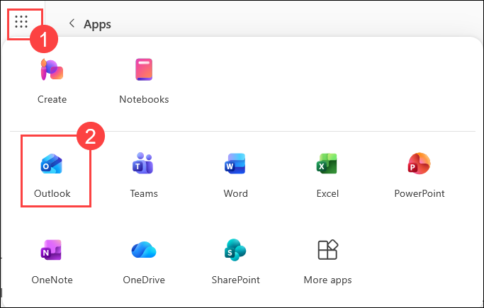
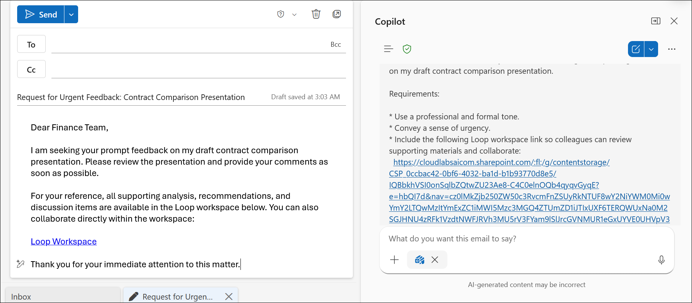
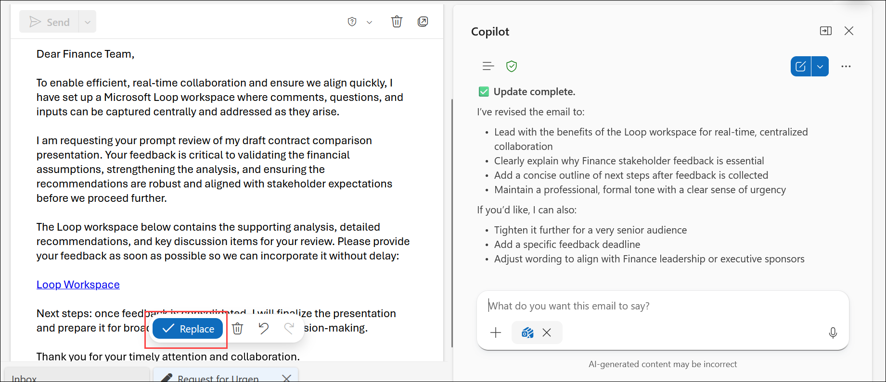
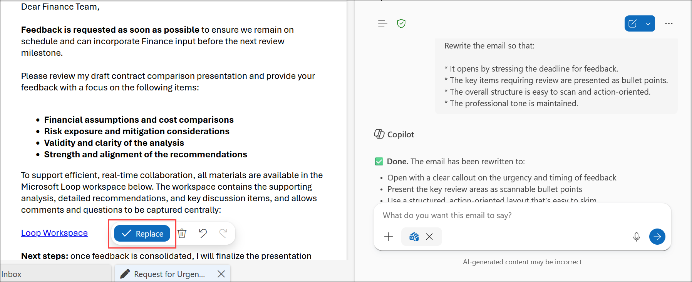
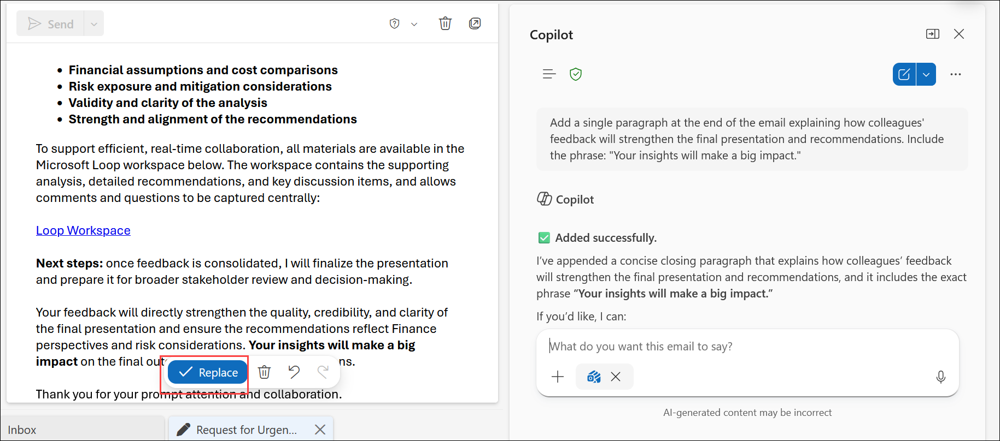
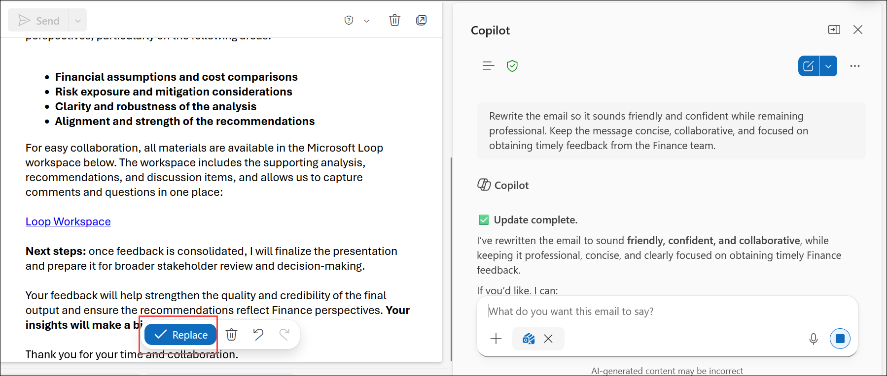

# Exercise 2, Task 4: Use Copilot in Outlook to create an email that requests feedback

You're finalizing your materials and need quick feedback from your Finance colleagues. To do so, you plan to use Copilot in Outlook to create a short, polished email that motivates timely collaboration and streamlines the review process. You want the email to sound professional and urgent but remain collaborative and positive. It should solicit feedback on your presentation, embed the Loop component that you created in the prior task for collaboration, and strike a direct, concise tone while conveying urgency.

This task helps you become familiar with Copilot's draft process in Outlook by generating multiple email versions. You learn how to create, review, and compare different drafts so you can select the one that best fits your tone and purpose.

## Steps

1. In your **Microsoft Edge** browser, navigate to the Microsoft 365 home page:

    ```
    https://www.microsoft365.com
    ```

1. Enter the following credentials to sign in to Microsoft 365:

    - **Email/Username**: **<inject key="AzureAdUserEmail"></inject>**

    - **Password**: **<inject key="AzureAdUserPassword"></inject>**

1. In the Microsoft 365 portal, click on the **App launcher (1)** button and select **Outlook (2)**.

    

1. In **Outlook on the web**, select **New mail** to create a new email.

1. In the body of the new email, select the **Open Copilot** icon to open the Copilot draft window.

1. In the Copilot prompt field, enter a prompt asking Copilot to write a short, direct email to your Finance team colleagues requesting feedback on your draft contract comparison presentation. Include the following in your prompt:

    - Paste in the **link to your Loop workspace** from the previous task for collaboration purposes
    - Ask Copilot to include the link so colleagues can access the Loop workspace
    - Use a **professional, formal tone** and convey **urgency**

    ```
    Write a short, direct email to my Finance team colleagues requesting feedback on my draft contract comparison presentation.

    Requirements:

    * Use a professional and formal tone.
    * Convey a sense of urgency.
    * Include the following Loop workspace link so colleagues can review supporting materials and collaborate:
      <LOOP_WORKSPACE_LINK>
    * Ask colleagues to review the presentation and provide feedback as soon as possible.
    * Clearly explain that the Loop workspace contains the supporting analysis, recommendations, and discussion items.
    * Keep the email concise and action-oriented.
    ```

    

1. Review the email draft that Copilot generates. You decide that a different approach would work better. In the Copilot window below the message, enter a follow-up prompt asking Copilot to:

    - Start the email by **highlighting the benefits of using the Loop component** for real-time collaboration
    - Explain in greater detail **why feedback is important**
    - Outline the **next steps**

    ```
    Revise the email to:

    * Start by highlighting the benefits of using the Loop workspace for real-time collaboration.
    * Explain in greater detail why stakeholder feedback is important.
    * Include a brief outline of the next steps after feedback is collected.
    * Maintain a professional tone and sense of urgency.

    ```

    

1. Review the updated email. Notice that Copilot generated a new version - **draft 2 of 2**. You can select the **back arrow** to view draft 1, which was the original version. Select the **forward arrow** to return to draft 2 and continue working with the latest version.

    > **`Note:`** For each request you make, Copilot generates a new draft of the email. You can navigate to a prior draft and keep it, or ask Copilot to modify that draft instead of the latest one. By default, each new request is applied to the draft you're currently viewing.

    ```
    Rewrite the email so that:

    * It opens by stressing the deadline for feedback.
    * The key items requiring review are presented as bullet points.
    * The overall structure is easy to scan and action-oriented.
    * The professional tone is maintained.
    ```

    

1. While you like the content of draft 2, you feel a different structure would work better. Ask Copilot to rewrite the email so that:

    - Key points for review are listed in **bullet format**
    - The email opens by **stressing the deadline for feedback**

1. Review the updated email - this is now **draft 3 of 3**. You decide to add one final paragraph. Ask Copilot to add a single paragraph at the end of the email that explains how your colleagues' input will improve the final deliverable. Include a motivating phrase such as:

    ```
    Rewrite the email so that:

    * It opens by stressing the deadline for feedback.
    * The key items requiring review are presented as bullet points.
    * The overall structure is easy to scan and action-oriented.
    * The professional tone is maintained.

    ```

    ```
    Your insights will make a big impact.
    ```

1. Review the results. After re-reading the email, you aren't fully satisfied with the tone. In the Copilot menu, scroll down and select **Change Tone**, then choose one of the tone options from the menu.

1. Review the new draft. You're still not completely satisfied, so enter a prompt directly asking Copilot to adjust the tone to sound **friendly and confident but still professional**.

    ```
    Add a single paragraph at the end of the email explaining how colleagues' feedback will strengthen the final presentation and recommendations. Include the phrase: "Your insights will make a big impact."
    ```

    

1. Review the final result. Once you're satisfied with the email, select **Keep it** in the Copilot window. This takes you out of Copilot draft mode and into the actual email.

    ```
    Rewrite the email so it sounds friendly and confident while remaining professional. Keep the message concise, collaborative, and focused on obtaining timely feedback from the Finance team.
    ```

    

1. You have now completed **Task 4** and **Exercise 2**.

## Summary

In this task, you used **Copilot in Outlook** to craft a professional, collaborative email requesting feedback from the Finance team on the Smart Sensor contract comparison materials. You:

- Generated an initial formal and urgent email draft using Copilot.
- Refined the email to highlight Loop collaboration benefits, explain the importance of feedback, and outline next steps.
- Restructured the email using bullet points and a deadline-first opening.
- Added a motivating closing paragraph encouraging colleague participation.
- Adjusted the email tone using Copilot's **Change Tone** feature and a custom tone prompt.
- Finalized and kept the best version of the email for distribution.

## Exercise 2 Summary

Across this exercise, you used Microsoft 365 Copilot to streamline the full contract analysis and negotiation workflow at Fabrikam. You:

- **Evaluated vendor contracts** using Copilot Chat to compare Adatum Corporation and Contoso, Ltd. side by side, identify risks, and generate negotiation points.
- **Built an executive presentation** using Copilot in PowerPoint to visualize contract findings for Finance leadership.
- **Created a collaborative Loop workspace** with structured negotiation strategy, risk mitigation, and communication plan pages.
- **Drafted a professional feedback email** using Copilot in Outlook, iterating through multiple drafts to find the right tone and structure.

Together, these tasks demonstrate how Copilot can accelerate the entire contract lifecycle - from analysis to decision-making to stakeholder communication - helping Finance professionals work smarter and faster.

## Support Contact

The **CloudLabs support** team is available 24/7, 365 days a year, via email and live chat to ensure seamless assistance at any time. We offer dedicated support channels tailored specifically for both learners and instructors, ensuring that all your needs are promptly and efficiently addressed.

Learner Support Contacts:

- Email Support: [cloudlabs-support@spektrasystems.com](mailto:cloudlabs-support@spektrasystems.com)
- Live Chat Support: https://cloudlabs.ai/labs-support

Click **Next** from the bottom right corner to complete the lab!

