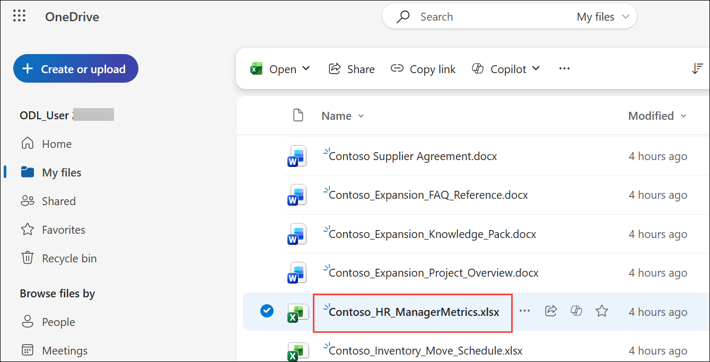
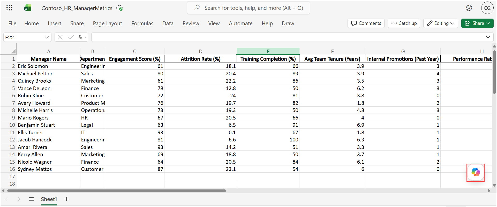
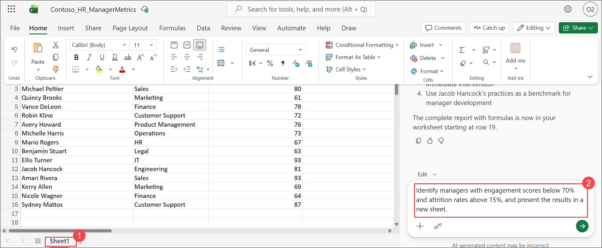
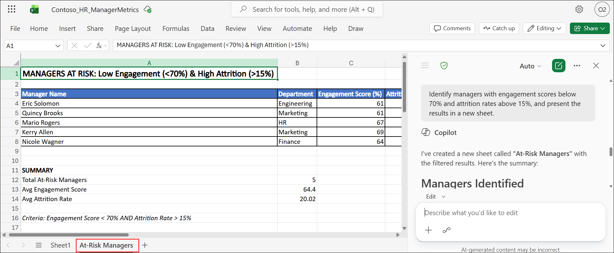
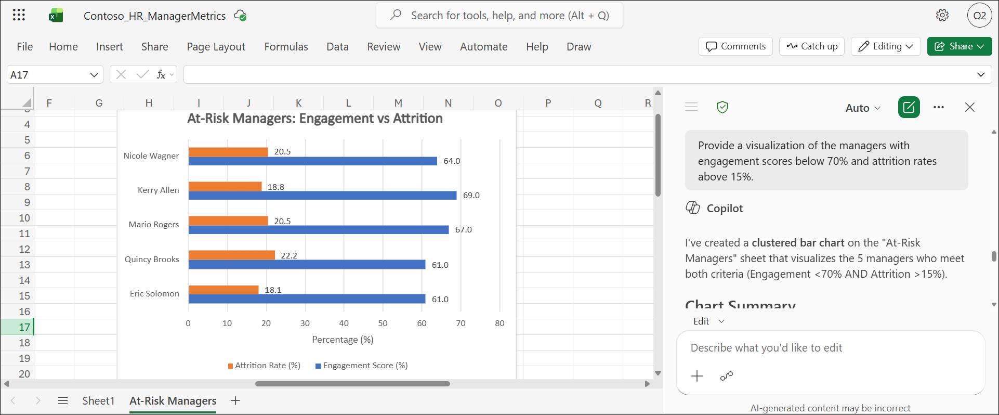
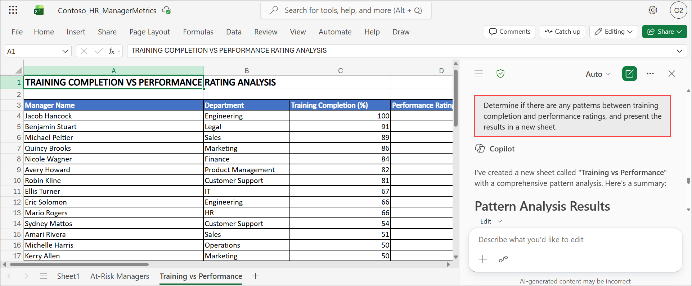

# Exercise 1, Task 1: Use Copilot in Excel to identify key manager metrics

## Scenario

Contoso's Chief People Officer, Holly Dickson, provided you with a spreadsheet containing manager-level performance and engagement metrics. Holly then asked you to identify which metrics best indicate manager strengths and which might reveal opportunities for development, such as high attrition or low training completion. You plan to use Microsoft 365 Copilot in Excel to explore and summarize key HR metrics that provide insights into manager effectiveness.

These key HR metrics are stored in the file titled **Contoso_HR_ManagerMetrics.xlsx**. This dataset includes:

- Manager Name
- Department
- Engagement Score (%)
- Attrition Rate (%)
- Training Completion (%)
- Average Team Tenure (Years)
- Internal Promotions (Past Year)
- Performance Rating (1–5)

## Lab Overview

In this hands-on lab, you will use Copilot in Excel to analyze manager performance and engagement metrics across Contoso. You will identify indicators of manager effectiveness, uncover trends related to engagement, attrition, training, and performance, and generate visualizations that highlight key workforce insights. The analysis will help HR leaders identify strengths, development opportunities, and overall team health.

## Task 1: Use Copilot in Excel to identify key manager metrics

In this task, you will use Copilot in Excel to explore manager-level HR data and identify patterns that influence team performance and engagement. You will generate summaries, rankings, and visualizations that support data-driven HR decision making.

1. In **OneDrive**, locate the **Contoso_HR_ManagerMetrics.xlsx** file that was uploaded, and then open the file in **Excel for the web**.

    

4. From the Excel workbook, select **Copilot** icon located at the bottom-right corner of the screen to open the Copilot pane. In the Copilot pane, leave the response mode selector set to **Auto**. Then verify the **Allow editing** icon appears in the prompt field next to the plus (+) sign. 

    

1. In the **Copilot** pane, enter the provided prompt, and then submit it to generate a summary of the dataset and identify the HR metrics that most strongly indicate manager effectiveness.

   ```
   Summarize the dataset in Contoso_HR_ManagerMetrics.xlsx and identify which HR metrics most strongly indicate manager effectiveness. This task is part of an HR review at Contoso to evaluate manager strengths and development opportunities, such as high attrition or low training completion. Use the columns provided in the file (Engagement Score, Attrition Rate, Training Completion, Average Team Tenure, Internal Promotions, Performance Rating). Create the analysis in a new worksheet and present the results in a clear, concise table with actionable insights that can be included in a report.
   ```

6. Review the results in the new sheet.

7. When working in Excel, Copilot uses the currently selected workbook and worksheet context. In this case, select **Sheet1 (1)** to continue working with the spreadsheet data. To identify trends in the data, enter the provided prompt in the Copilot prompt box **(2)**:

   ```
   Identify managers with engagement scores below 70% and attrition rates above 15%, and present the results in a new sheet.
   ```

    

1. Review the analysis generated by Copilot.

    

1. To create a visualization for the new sheet, remain in the worksheet and place the cursor in the cell immediately after the last line of information. Enter the provided prompt in the Copilot prompt box.

    ```
    Provide a visualization of the managers with engagement scores below 70% and  attrition rates above 15%.
    ```

1. Review the visualization generated by Copilot.

    

1. Return to **Sheet1**, and in the **Copilot** prompt box, enter the provided prompt.

   ```
   Determine if there are any patterns between training completion and performance ratings, and present the results in a new sheet.
   ```

1. Review the patterns identified by Copilot in the newly created worksheet. 

   

1. Return to **Sheet1**, and in the **Copilot** prompt box, enter the provided prompt.

   ```
   Create a table that ranks managers by overall team health. Consider engagement, attrition, and training, and present the results in a new sheet.
   ```

1. Review the manager ranking table generated by Copilot in the newly created worksheet.

1. Return to **Sheet1**, and in the **Copilot** prompt box, enter the provided prompt.

   ```
   Create a bar chart that shows attrition rate versus engagement score by department, and present the results in a new sheet.
   ```

12. Review the results.

13. Keep the tab open in your Microsoft Edge browser containing the **Contoso_HR_ManagerMetrics.xlsx** file for the next task.

## Summary

In this exercise, you used Copilot in Excel to analyze manager performance metrics and evaluate key indicators of team health. You identified trends related to engagement, attrition, training completion, and performance ratings, while generating visualizations and rankings to highlight areas of success and improvement. The resulting insights provide HR leaders with a stronger understanding of manager effectiveness and workforce performance.

## You have successfully completed the task. Click on Next >> to proceed with the next exercise.

