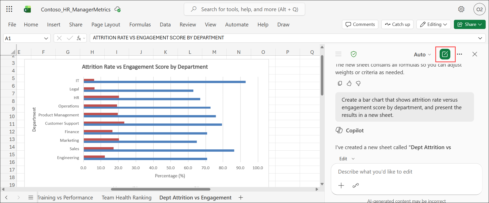
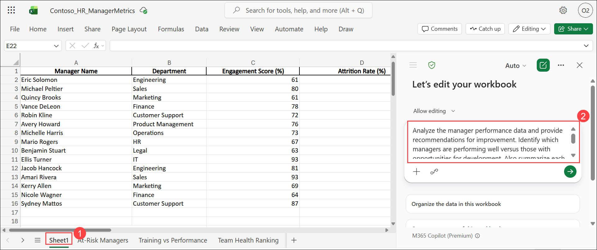
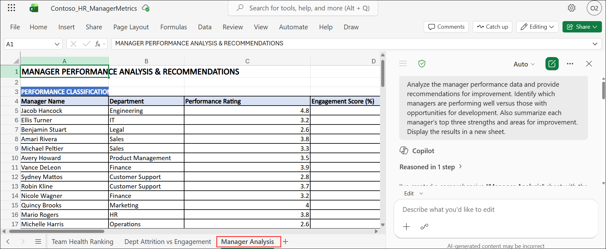
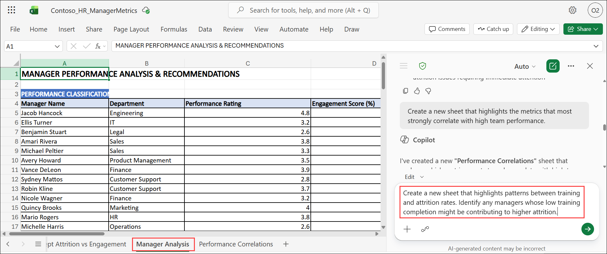
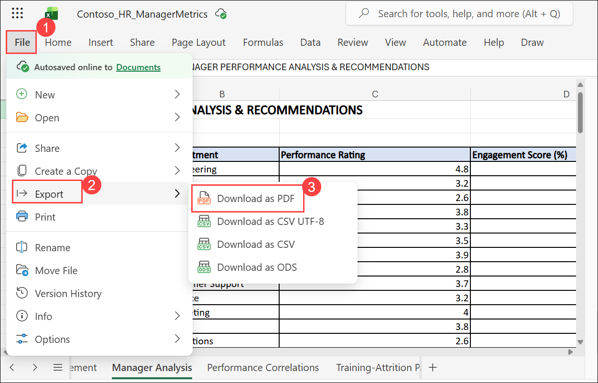
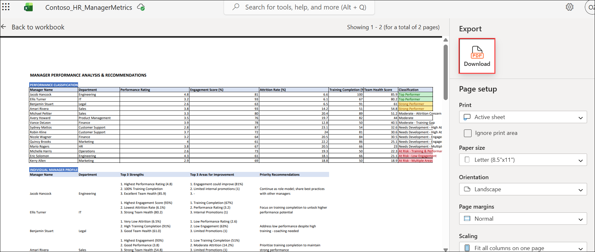

# Exercise 1, Task 2: Use Copilot in Excel to generate a Manager Summary report

## Scenario

You analyzed the **Contoso_HR_ManagerMetrics.xlsx** spreadsheet in Task 1 and identified trends in engagement, attrition, and training. You now want to perform a deeper analysis to generate actionable insights for each manager. This information should be captured in a Manager Summary report. Use Microsoft 365 Copilot in Excel to interpret the manager metrics from the provided dataset, summarize key findings, and identify opportunities for development in the Manager Summary report.

## Lab Overview

In this hands-on lab, you will use Copilot in Excel to perform a deeper analysis of manager performance data and generate a Manager Summary report. You will identify manager strengths, development opportunities, and performance trends, while exploring correlations between key HR metrics such as training, attrition, and team performance. The resulting insights will support leadership decision-making and workforce development planning.

## Task 2: Use Copilot in Excel to generate a Manager Summary report

In this task, you will use Copilot in Excel to analyze manager performance metrics and generate individualized recommendations. You will create summary reports, identify performance correlations, and prepare the findings for sharing with leadership.

1. The **Contoso_HR_ManagerMetrics.xlsx** file that you updated in Task 1 should still be open in **Excel for the web**. If the file is still open, then select the **Starts a new chat** icon at the top of the Copilot pane to start a new chat. If you closed the file at the end of the previous task, then open it again along with the Copilot pane.

   

1. Select **Sheet1 (1)**, and in the **Copilot** prompt box, enter the provided prompt **(2)**.

   ```
   Analyze the manager performance data and provide recommendations for improvement. Identify which managers are performing well versus those with opportunities for development. Also summarize each manager’s top three strengths and areas for improvement. Display the results in a new sheet.
   ```

   

1. Review the manager performance analysis generated by Copilot in the newly created worksheet.

   

1. In the current worksheet, enter the provided prompt in the **Copilot** prompt box.

   ```
   Create a new sheet that highlights the metrics that most strongly correlate with high team performance.
   ```

1. Review the correlation analysis generated by Copilot in the newly created worksheet.

1. Return to the **manager performance worksheet created earlier**, and then enter the provided prompt in the **Copilot** prompt box.

   ```
   Create a new sheet that highlights patterns between training and attrition rates. Identify any managers whose low training completion might be contributing to higher attrition.
   ```

   

1. Review the training and attrition analysis generated by Copilot in the newly created worksheet.

5. Return to the manager performance sheet that Copilot created earlier. Export this worksheet as a PDF file for use in Task 3 and Task 4. To export this data sheet, select **File (1) > Export (2) > Download as PDF (3)** (or it might say **Create PDF/XPS Document)**. 

   

1. If you selected **Download as PDF** in your version of Excel, Copilot displays the PDF in the existing tab in your Microsoft Edge browser. In the **Export** pane that appears, select the **Download** button. Copilot downloads a PDF file containing the table from the Manager Performance sheet.

      

1. The file is stored in your PC’s **Downloads** folder. **Upload** this file from the **Downloads** folder to **OneDrive**. 

## Summary

In this exercise, you used Copilot in Excel to generate a comprehensive Manager Summary report based on HR performance data. You identified top-performing managers, highlighted areas for development, and analyzed relationships between training, attrition, and team performance. You then exported the results for use in leadership reviews and future workforce planning activities.

## You have successfully completed the task. Click on Next >> to proceed with the next exercise.


