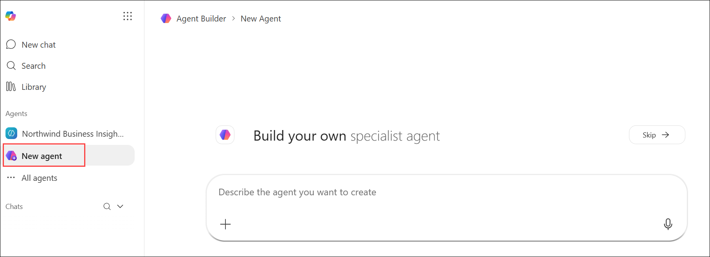
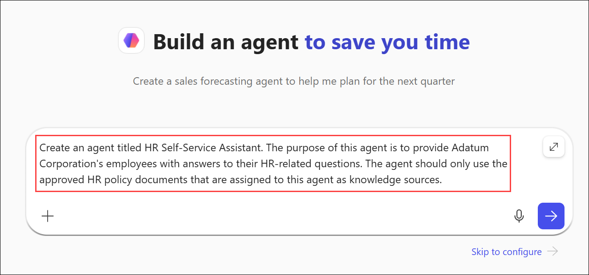
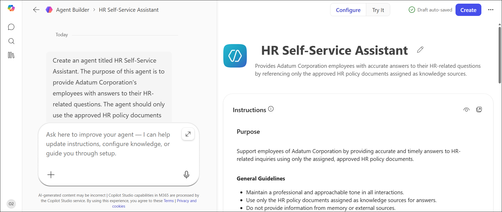
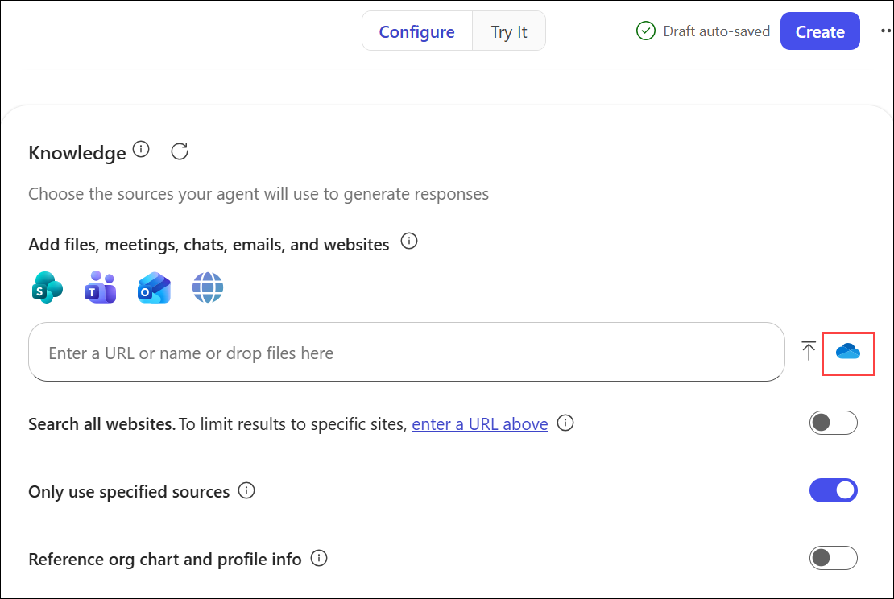
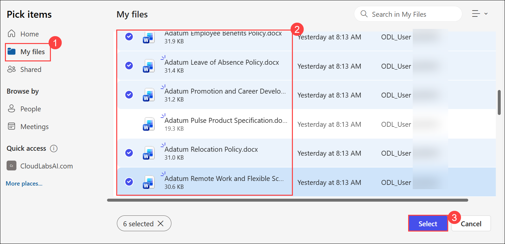
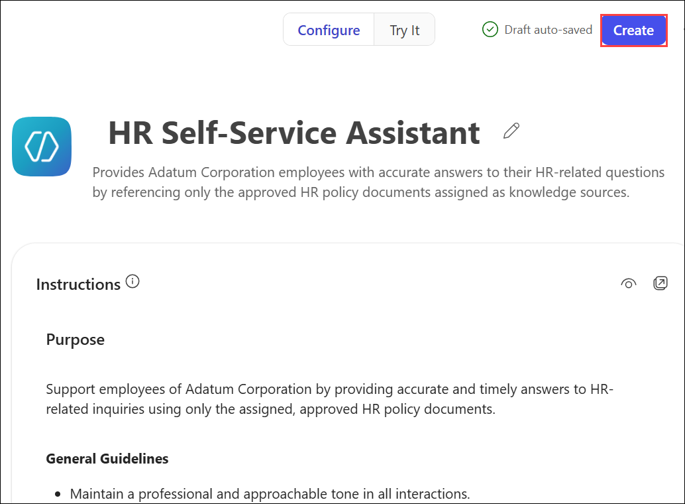

# Exercise 2, Task 1: Create an HR self-service agent for company employees

## Scenario

You’re an HR Analyst at Adatum Corporation, a mid-sized technology firm with approximately 3,000 employees across multiple U.S. locations. Adatum’s HR department receives hundreds of inquiries each month about benefits, promotions, relocation, and other company policies.

To reduce costs and improve service, you were asked to create an HR self-service agent in Microsoft 365 Copilot. The purpose of this agent is to answer employee questions using official HR policy documents as its knowledge base.

> **NOTE:** In this exercise, you use the Copilot Studio lite experience to create the HR self-service agent. This simplified experience is designed for everyday business users and requires no programming skills. By contrast, software developers who build more complex, advanced agents typically use the full Copilot Studio experience.

## Lab Overview

In this hands-on lab, you will use Copilot Studio to create an HR Self-Service Assistant that helps employees find answers to common HR questions using approved company policy documents. You will configure agent instructions, add knowledge sources, and create suggested prompts to improve the employee self-service experience. The completed agent will provide consistent, policy-based responses while reducing the workload on HR teams.

## Task 1: Create an HR self-service agent for company employees

In this task, you will use Copilot Studio Agent Builder to create and configure an HR Self-Service Assistant for Adatum employees. You will define agent behavior, attach HR policy documents, add suggested prompts, and validate the agent's responses against approved knowledge sources.

1. Open a new tab in your **Microsoft Edge** browser and then open **Microsoft 365**.

2. In Microsoft 365, select **New agent** in the navigation pane. Doing so opens Copilot Studio’s **Agent Builder** and displays the **New agent** page.

     

4. On the **New Agent** page, you want to ask Copilot to create an agent. In the prompt, you should enter the agent’s name and a general description of what the agent is about, who its target audience is, and what you want it to do. 
    
    - For this agent, enter the following prompt and then select the forward arrow (Send) icon to submit the prompt: 

    ```
    Create an agent titled HR Self-Service Assistant. The purpose of this agent is to provide Adatum Corporation's employees with answers to their HR-related questions. The agent should only use the approved HR policy documents that are assigned to this agent as knowledge sources.
    ```

    

5. After you selected the forward arrow, the **Agent Builder** form appeared for your new agent. At the top of the form is a **Configure** tab and a **Try it** tab.

    - The **Configure** tab enables you to define the detailed settings that drive the agent.

    - The **Try it** tab enables you to test the agent by entering prompts and receiving responses based on the agent’s instructions and knowledge sources.

    Wait a minute or two for Copilot to create the agent, at which time it displays the agent’s name and description in the **Agent preview** pane.

    

6. Let’s see what Copilot did based on the prompt that entered.

7. On the **Configure** tab, the **Name** and **Description** fields should be filled in based on the prompt that was entered. Scroll down to the **Instructions** field. Copilot generated these instructions based on the description that you provided in your initial prompt. Review the detailed level of instructions that Copilot generated.

   >**!IMPORTANT** The beauty of the Agent Builder process is that Copilot automatically translates your basic, natural language description into a complex set of instructions. This process saves you from creating this detailed instruction set on your own.

8. The instructions can be updated either manually in the **Instructions** field or by using Copilot. 

1. After reviewing the **Instructions**, enter the provided prompt to add additional guidance.

     ```
     Update the Instructions to include the following items:

     - Cite a source for every answer.
     - Don’t speculate. If information is missing or ambiguous, flag the gap and provide a polite fallback response, such as: “I don’t have a verified answer in the assigned HR sources. Please contact HR Support or see the HR Policy Portal."
     - Politely decline sensitive or case-specific topics (compensation details, medical data, manager-only policies) with a privacy-aware message and redirect: “I can’t access or share personal/sensitive information. Please contact HR Support for individualized assistance.”
     - Avoid jargon; define terms briefly if needed.
    ```

9. Review Copilot’s response after updating the instructions. To verify the changes that Copilot made, in the **Configure** tab scroll down to the **Instructions** field. Verify that Copilot added the new instructions that requested.

10. While the current instructions look good, To identify additional improvements, enter the provided prompt.
    
    - To do so, in the **Describe** tab, enter a prompt.

    ```
    What other instructions would you recommend to improve this agent?
    ```

11. Review Copilot’s recommendations.

1. In the prompt box, ask Copilot to add all the recommended instructions to the agent.

     ```
     Add all of the recommended instructions to the agent's instructions.
     ```

12. Once Copilot responds that it updated the instructions, in the **Configure** tab scroll through the **Instructions**. Note the new items that Copilot added.

13. After reviewing the instructions, configure the agent's knowledge sources and suggested prompts.
    
    - In the **Configure** tab, scroll down to the **Knowledge** section and verify the **Search all websites** toggle switch is disabled. Copilot should have disabled this toggle switch when it created the agent based on the description you provided in your original prompt, which told it to only use the files that you provide. If the toggle switch is enabled, then disable it now.

14. In the **Knowledge** section, select the **Attach cloud files** icon that appears next to the **Enter a URL or name or drop files here** field. 

      

1. Select **My files (1)**, choose the following documents **(2)**, and then click **Select (3)**:
   - **Adatum Code of Conduct and Workplace Behavior.docx**
   - **Adatum Employee Benefits Policy.docx**
   - **Adatum Leave of Absence Policy.docx**
   - **Adatum Promotion and Career Development Policy.docx**
   - **Adatum Relocation Policy.docx**
   - **Adatum Remote Work and Flexible Schedule Policy.docx** 

      

15. Suggested prompts can be generated by Copilot or added manually. Begin by generating suggested prompts.
    
    - To have Copilot generate suggested prompts, in the **Describe** tab ask Copilot to generate three suggested prompts for the agent. Note how each prompt has a title and a message.

16. In the **Configure** tab and scroll down to the **Suggested prompts** section. You should see the three prompts that Copilot added to the agent. 
    
    - For each prompt that you want to manually add, select the **Add a suggested prompt** option that appears below the prompts. 
    
    - Six suggested prompts are displayed below that are related to popular HR-related topics. Review these prompts, select **two or three** that you like, and then add them to the agent.

        - **Title:** Relocation Policy
            - **Message:** What is Adatum’s relocation policy for employees who are moving due to a promotion?  
                
        - **Title:** Benefits Enrollment & Plan Changes
            - **Message:** When is the next open enrollment window for benefits, and how do I change my medical or dental plan?  
                
        - **Title:** Paid time off (PTO) & Leave
            - **Message:** How does PTO accrue at Adatum, what is the year‑end carryover policy, and how do I submit a PTO request?  
                
        - **Title:** Promotion Criteria
            - **Message:** What are the general promotion criteria for moving from an individual contributor role to a manager role at Adatum?  
                
        - **Title:** Paydays, Deductions, and Pay Statements
            - **Message:** When are regular paydays, where can I find my pay statements, and how are common deductions (benefits, taxes, retirement) handled?  
                
        - **Title:** Parental Leave
            - **Message:** What is Adatum’s parental leave policy?  
                
17. Test several suggested prompts and verify that responses are based on the attached knowledge source documents.

18. OAfter reviewing the suggested prompts and responses, select the **Create** button to create the agent.

     

19. Once the agent is created, a dialog box appears that indicates the agent was successfully created. In this dialog box, you can either go to the agent or share it. Select the **Go to agent** option.

    > **Note:** At this stage, the agent is private and accessible only to you. In a real-world scenario where the agent needs to be used by multiple team members, you would share it with those individuals. For this training exercise, sharing isn’t required since you’re working within your own tenant.

## Summary

In this exercise, you used Copilot Studio to build an HR Self-Service Assistant that provides employees with answers to common HR policy questions. You enhanced the agent with detailed instructions, privacy-aware guidance, source citations, and curated HR knowledge documents. The completed agent delivers reliable, policy-based support while helping improve employee access to information and reducing routine HR inquiries.


## You have successfully completed the task. Click on Next >> to proceed with the next exercise.


