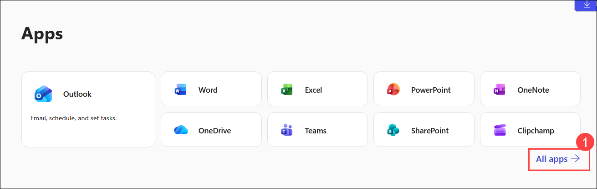
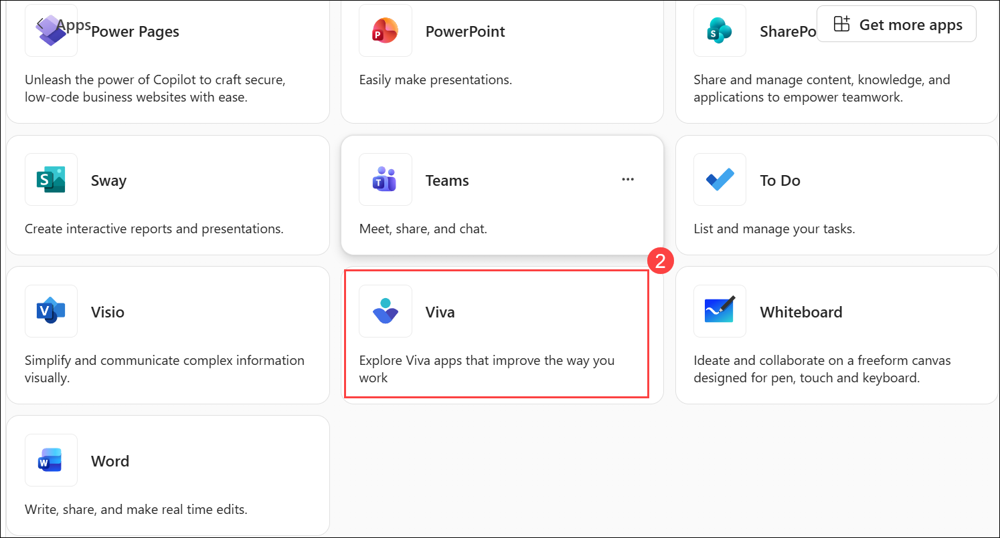
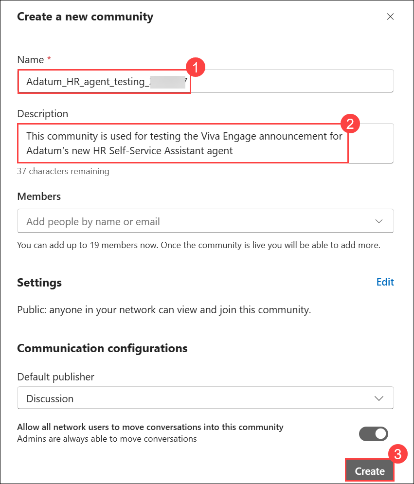
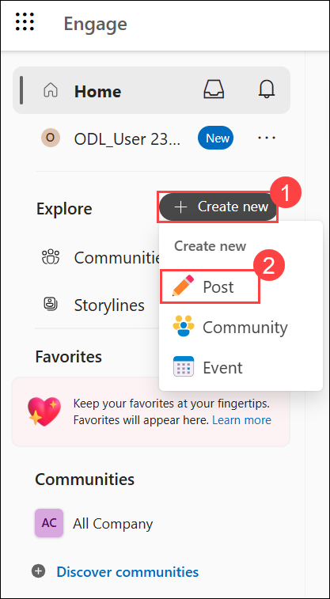
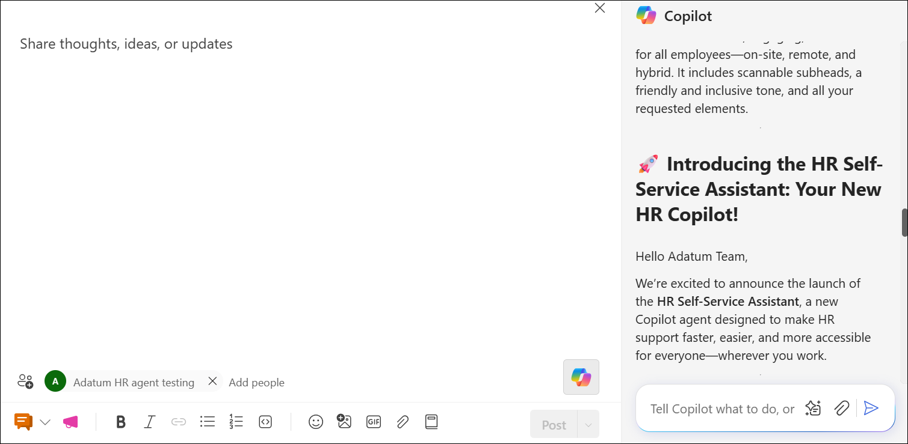
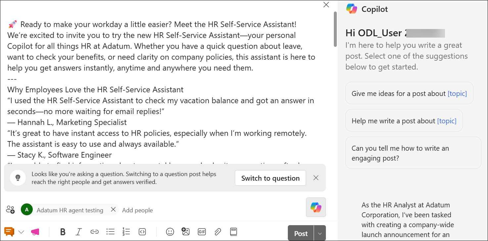
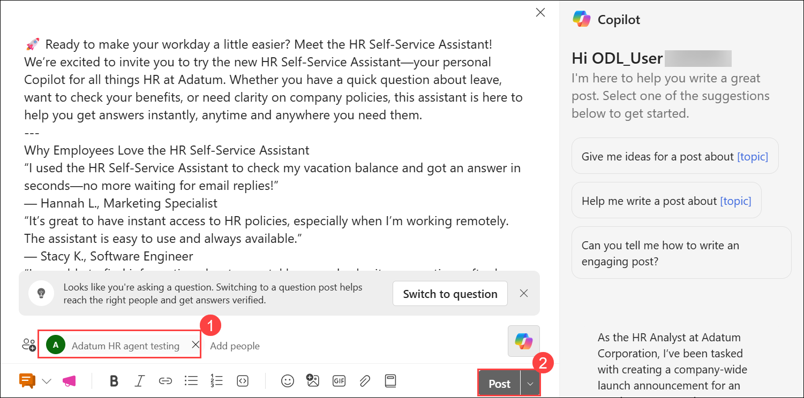

# Exercise 2, Task 2: Use Viva Engage to announce the new HR self-service agent

## Scenario

Adatum is rolling out its new **HR Self-Service Assistant** agent, designed to empower employees to get instant answers to common HR questions—such as benefits, leave policies, and onboarding—directly within Microsoft 365. In your role as an HR Analyst, you completed building and testing the agent (Task 1). Now, you must ensure employees are aware of this new resource and feel confident using it.

Adatum's Chief People Officer asked you to create a company-wide announcement in Viva Engage. The goal is to introduce the HR self-service agent, highlight its benefits, and encourage employees to try it out and share feedback. You want to post this announcement in testing community to ensure it meets all requirements. Once you’re satisfied with the results, you then plan to post it in Adatum’s company community so that it reaches all staff.

## Lab Overview

In this hands-on lab, you will use Viva Engage and Copilot to create an engaging company-wide announcement for the new HR Self-Service Assistant. You will draft, refine, and personalize the communication to explain the agent’s benefits, encourage adoption, and gather employee feedback. The final announcement will help drive awareness and increase employee engagement with the new HR support resource.

## Task 2: Use Viva Engage to announce the new HR self-service agent

In this task, you will use Copilot in Viva Engage to create and enhance an announcement introducing the HR Self-Service Assistant to employees. You will refine the messaging, incorporate employee testimonials, and prepare the post for publication in a community environment.

1. In Microsoft Edge browser, navigate to the **Microsoft 365** home page, select **App launcher (1)** in the navigation pane, and then select **More apps (2)**.

     

1. In the **Apps** menu that appears, select **All apps (1)**.

     

1. In the **All apps** window, scroll down and select **Viva (2)**.

     

2. On the **Viva** home page, select **Engage** in the navigation pane.

    

3. In **Viva Engage**, select **+ Create new (1)** at the top of the **Viva Engage** navigation pane, and then select **Community (2)** in the drop-down menu that appears.

     

4. In the **Create a new community** window, enter **Adatum_HR_agent_testing_<inject key="DeploymentID" enableCopy="false"/> (1)** in the **Name** field, and enter **This community is used for testing the Viva Engage announcement for Adatum’s new HR Self-Service Assistant agent (2)** in the **Description** field. Select the **Create (3)** button.

     

5. In **Viva Engage**, select **+ Create new (1)** at the top of the navigation pane, and then select **Post (2)** in the drop-down menu that appears.

     

6. In the **Post** window, select the **Copilot** icon to open the Copilot pane.

7. Copy and paste the following prompt that asks Copilot to draft a Viva Engage announcement highlighting the rollout of TR-Pulse:

    ``` 
    As the HR Analyst at Adatum Corporation, I’ve been tasked with creating a company-wide launch announcement for an employee community post. Adatum is introducing the HR Self-Service Assistant, a new Copilot agent designed to help employees get instant answers to HR questions about company policies, benefits, leave, and more—anytime, anywhere.
     
    I plan to publish the announcement in Viva Engage to maximize awareness and encourage engagement across our diverse workforce. Can you draft this announcement for me? It should be a clear, engaging Viva Engage post that:**
    
    - Explains the purpose of the HR Self-Service Assistant and why it’s valuable now
    - Describes what employees can expect from the assistant (for example, types of questions it can answer, how it improves access to HR information, and privacy assurances)
    - Provides simple steps on how employees can access and use the assistant (where to find it, how to start a conversation, and tips for getting the best answers)
    - Invites early engagement through reactions and comments, and encourages employees to share feedback or tag colleagues who might benefit

    The announcement should include the following expectations and constraints:

    - Audience: all employees (on-site, remote, and hybrid) across departments and locations
    - Tone: friendly, supportive, inclusive, and aligned with Adatum’s values
    - Style: short paragraphs; scannable subheads; 1–2 links/placeholders to resources or help guides; a clear call to action
    - Add 3–4 relevant hashtags (for example, #AdatumHR #SelfService #EmployeeSupport #AskHR) and mention the HR community
    - Avoid jargon; prioritize clarity and accessibility

    We’re excited to kick off this initiative and make HR support easier for everyone. The announcement should encourage employees to try the assistant, share their experiences, and help us improve the tool for all.
    ```

8. Review the generated announcement. In the next steps, you edit the announcement before posting it.

   > **Note:** In Viva Engage, Copilot is strongest before and during composition (drafting, rewriting, tone/length coaching, conversation starters, and so on) and around the post (suggesting where/what to post, summarizing context, prompting engagement). After an announcement is published, Copilot can’t directly edit the live post that’s in place. Instead, you must make changes by manually editing the post content yourself. Copilot can still help by suggesting improved wording or generating assets you then paste or insert.

9. In the Copilot pane, review the opening sentences of the announcement. Copilot often starts with something generic like **We’re excited to announce…**. While that type of opening is fine, Viva Engage is most effective when posts open with a clear, human explanation of why something matters to employees.

    

1. In the **Copilot** prompt box, ask Copilot to revise the opening sentences to make them more personal and conversational.

     ```
     Reword the first 1–2 sentences to address employees directly, emphasize why this agent matters to them, and set a conversational tone. Shift the message from a corporate announcement to a personal invitation.
     ```

10. Review the revised opening. To make the announcement more personal and relatable, add employee testimonials from the pilot project.

1. In the **Copilot** prompt box, enter the provided prompt.

     ```
     Add the following quotes from pilot users about the benefits of using the HR Self-Service Assistant:

     “I used the HR Self-Service Assistant to check my vacation balance and got an answer in seconds—no more waiting for email replies!”
     — Hannah L., Marketing Specialist

     “It’s great to have instant access to HR policies, especially when I’m working remotely. The assistant is easy to use and always available.”
     — Stacy K., Software Engineer

     “I was able to find information about parental leave and submit my questions after hours. The agent made the process simple and stress-free.”
     — Emily T., Customer Support Lead

     “The assistant helped me understand our new benefits package without having to schedule a meeting. It was a real time-saver!”
     — Abby B., Financial Analyst

     “I was concerned about the agent divulging personal information, such as my salary, my pay level, and so on. I thoroughly tested it to see if it would share any confidential details, and it didn't provide any personal information at all. I felt a whole lot better about using the agent after running those tests.”
     — Chet F., Operations Coordinator
    ```

1. Review the employee testimonials added by Copilot.

1. In the **Copilot** prompt box, ask Copilot to rewrite the announcement using the revised opening and employee testimonials.

     ```
     Rewrite the entire announcement using the revised opening and employee testimonials.
     ```

1. Review the updated announcement generated by Copilot.

1. If Copilot rewrote the opening and testimonials instead of using the previous versions, ask Copilot to rewrite the announcement using its original revisions.

     ```
     Rewrite the announcement using the original revised opening and employee testimonials that you previously generated.
     ```

13. After reviewing the announcement, select the **+ Add to post** option that appears at the end of the results in the Copilot pane.

14. Review the announcement that appears in the post window. Delete any of the extraneous Copilot chat text that appears at the start and end of the post, such as “You asked for a…”.

    

15. Before posting the announcement, select a community or storyline. However, created the **Adatum HR agent testing** community at the start of this task, and since that community was displayed in Viva Engage when created this post, the announcement should appear at the bottom of the post window, above the menu bar **(1)**. If a **Select a community or storyline** option appears at the bottom of the Viva Engage post instead, then select it and select the **Adatum HR agent testing** community from the menu that appears.

16. Select the **Post (2)** button.

     

17. In the **Adatum HR agent testing** community, should see the post that Copilot just created.

    - In an actual rollout, you would post your announcement in the testing community, review feedback, and make any necessary revisions before sharing the finalized announcement in a company-wide Viva Engage community. For this training exercise, we stop short of that final step, as Viva Engage operates across your entire tenant.

## Summary

In this exercise, you used Copilot in Viva Engage to create a compelling announcement for the rollout of the HR Self-Service Assistant. You improved the message with a conversational tone, added employee testimonials, and emphasized the value of the new HR support experience. The completed announcement helps promote awareness, encourage adoption, and invite employee feedback to support continuous improvement of the assistant.

## You have successfully completed the task. Click on Next >> to proceed with the next exercise.

