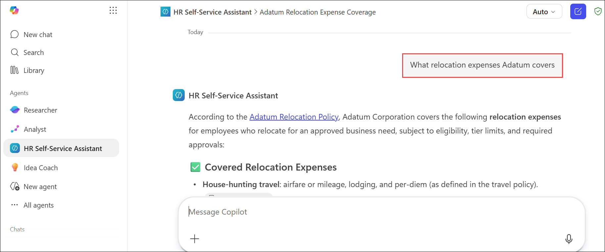

# Exercise 2, Task 3: Ask the HR self-service agent questions about HR policies

## Scenario

In this task, you take on the role of an Adatum employee who was to a management position that requires relocating to Fargo, North Dakota. Before finalizing the move, you want to understand what relocation benefits Adatum provides.

Adatum just announced the release of its new HR Self-Service Assistant in the company’s Viva Engage community page. You decide to take advantage of this new agent by seeing if it can answer your questions about company policies related to your promotion, relocation, and remote work schedule, plus any other topics that interest you.

## Lab Overview

In this hands-on lab, you will interact with the HR Self-Service Assistant to explore company policies related to relocation, promotions, benefits, leave, and remote work. You will evaluate how effectively the agent retrieves information from approved HR documents and assess the quality of its responses. The exercise also demonstrates how the agent handles questions that fall outside its knowledge sources.

## Task 3: Ask the HR self-service agent questions about HR policies

In this task, you will use the HR Self-Service Assistant to ask questions about HR policies and employee benefits. You will review the agent’s responses, verify source-based answers, and assess its behavior when responding to unsupported or sensitive inquiries.

1. The **HR Self-Service Assistant** agent should still be open from the prior task. If not, then select the agent on the Microsoft 365 home page.

2. Start a conversation with your HR Self-Service Assistant. Ask questions about the following topics related to relocation, such as:

   ```
   What relocation expenses Adatum covers
   ```
   
   ```
   Does Adatum provide temporary housing during relocation?
   ```
   
   ```
   Are there any repayment requirements if an employee leaves the company within a year of relocation?
   ```

   

1. Review the responses generated by the HR Self-Service Assistant.

4. Ask questions related to one or more of the following topic areas:

    - Criteria and process for promotions
    - Details of Adatum’s 401(k) matching program
    - Procedures for requesting personal or family leave
    - Educational or certification reimbursement opportunities
    - Disciplinary process or consequences for violating the Code of Conduct
    - Eligibility and expectations for remote or hybrid work arrangements

      <details>
      <summary><strong>Sample Prompts</strong></summary>
      
      ```
      What are the criteria and process for promotions at Adatum?
      ```

      ```
      What are the details of Adatum's 401(k) matching program?
      ```
      
      ```
      How do I request personal or family leave?
      ```

      ```
      What are the eligibility requirements and expectations for remote or hybrid work arrangements?
      ```
      </details>
  
5. Observe how the agent’s responses cite or summarize information from the policy files. Evaluate the completeness and clarity of the agent’s answers. Note any policies that Adatum might need to update for better self-service accuracy.

6. Ask the HR Self-Service Assistant one or more questions about topics that aren't covered in the knowledge sources. For example:

    ```
    What is the salary range for my role at Adatum, and how are annual merit increases determined?
    ```

    ```
    How does Adatum’s annual performance review process work, and what performance rating scale does the company use?
    ```

7. Evaluate how the agent responds to questions that aren’t covered in the knowledge source files.

## Summary

In this exercise, you used the HR Self-Service Assistant to obtain information about company policies, employee benefits, relocation assistance, and workplace programs. You evaluated the agent’s ability to provide accurate, source-based responses while identifying potential gaps in the available knowledge sources. You also tested how the agent handled unsupported or sensitive questions, demonstrating the importance of clear boundaries and reliable policy guidance in employee self-service solutions.
