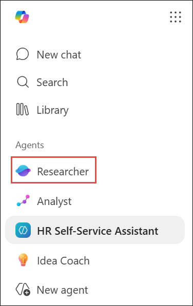
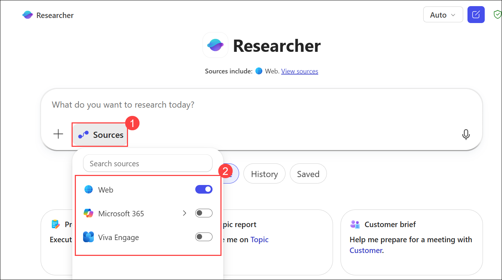
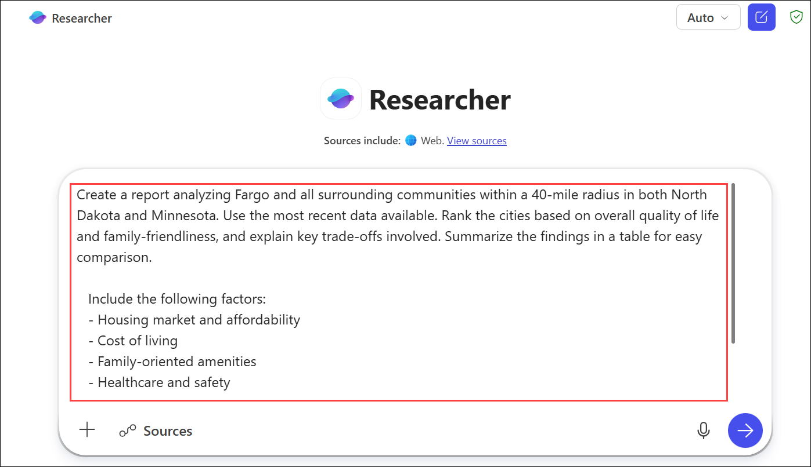
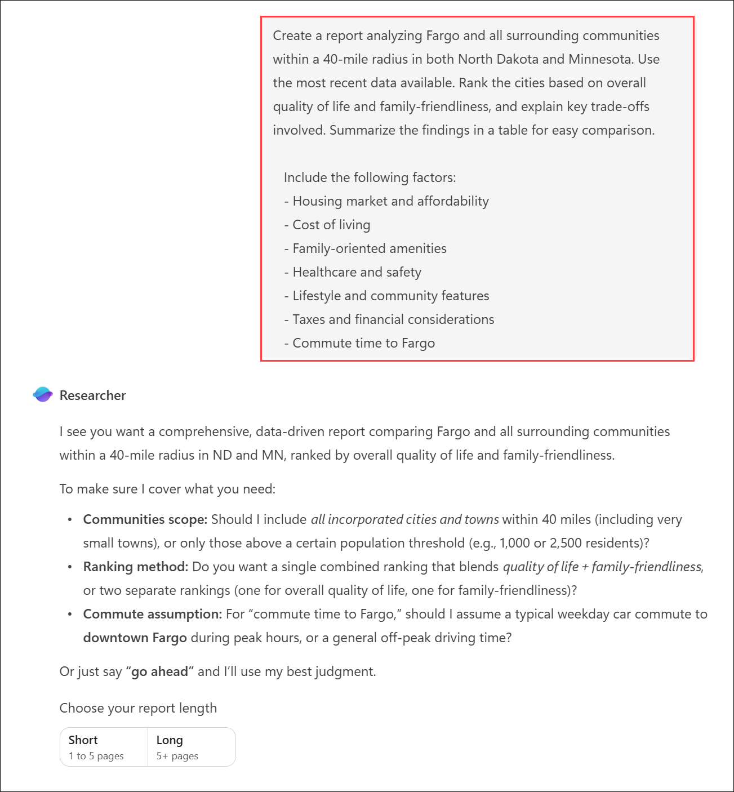
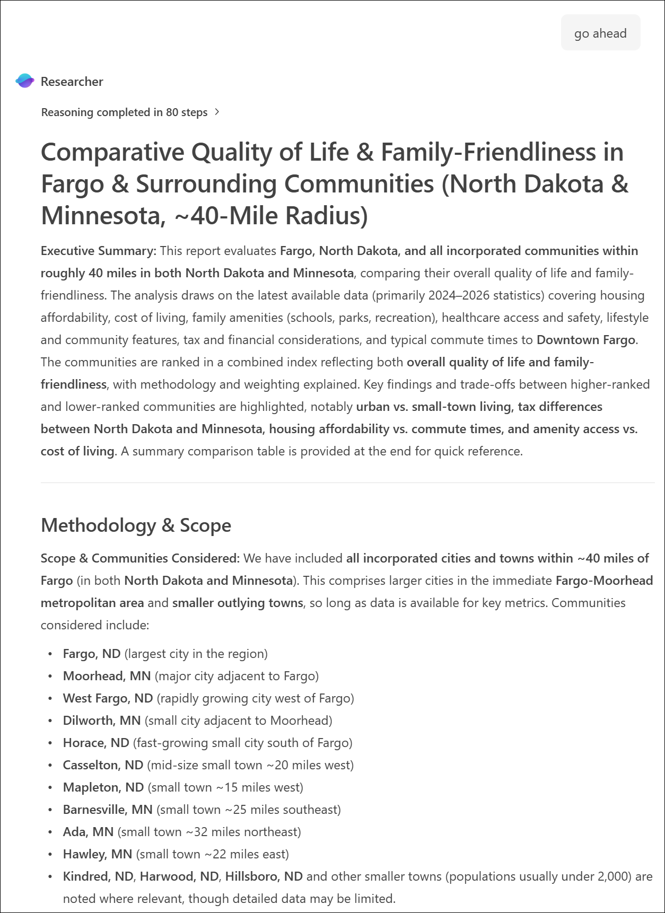

# Exercise 2, Task 4: Use the Researcher agent to gather employee relocation insights

## Scenario

As part of your relocation to the Adatum office in Fargo, North Dakota, you want to explore what it’s like to live in Fargo and nearby communities in both North Dakota and Minnesota. You plan to use this information to help decide where your family settles. Key considerations include quality of life, housing options, commute times, recreational opportunities, community amenities, and access to strong educational programs for your children.

You then ask Researcher to analyze the cities in which these communities are located and provide a ranking of the top areas to consider based on a combination of these factors.

## Lab Overview

In this hands-on lab, you will use the Researcher agent to analyze relocation options around Fargo, North Dakota, and evaluate communities based on quality of life, affordability, family amenities, education, and commute considerations. You will also research and compare local high schools, then combine both analyses to identify the most suitable communities for families. The resulting reports will support informed relocation and lifestyle decisions.

## Task 4: Use the Researcher agent to gather employee relocation insights

In this task, you will use the Researcher agent to compare communities and schools within the Fargo metropolitan area using current web-based information. You will evaluate key factors, rank options, and generate structured reports to support relocation planning.

1. In Microsoft Edge browser, you should still be in the **HR Self-Service Assistant** agent. In the list of agents in the navigation pane, select the **Researcher** agent.

    

1. Select **Sources (1)**, disable **Microsoft 365** and **Viva Engage**, and verify that only **Web (2)** remains enabled.

    

1. In the **Researcher** prompt box, enter the provided prompt.

   ```
   Create a report analyzing Fargo and all surrounding communities within a 40-mile radius in both North Dakota and Minnesota. Use the most recent data available. Rank the cities based on overall quality of life and family-friendliness, and explain key trade-offs involved. Summarize the findings in a table for easy comparison.
   
   Include the following factors:
   - Housing market and affordability
   - Cost of living
   - Family-oriented amenities
   - Healthcare and safety
   - Lifestyle and community features
   - Taxes and financial considerations
   - Commute time to Fargo
   ```

   

4. Review Researcher’s analysis of your request. If everything looks OK, tell it to **Go ahead**.

   

    > **NOTEL** Researcher may take 10–15 minutes to complete its analysis, depending on the complexity of the request. Wait for the analysis to finish.

   **Expected Output:**

   

1. In the **Researcher** prompt box, enter the provided prompt.

   ```
   Create a report about public and private high schools in Fargo and the surrounding communities within a 40-mile radius. Use the most recent data available. Rank every school, treating all criteria equally in ranking. Summarize the findings in a table for easy comparison.

   Include the following factors:
   - Competitive athletic programs
   - Access to IB (International Baccalaureate) and AP (Advanced Placement) courses
   - College placement outcomes
   - Breadth of extracurricular activities
   - Student-teacher ratios
   - Graduation rates
   ```
   
6. Review Researcher’s analysis of your request. If everything looks OK, tell it to **Go ahead**.

1. In the **Researcher** prompt box, enter the provided prompt.

    ```
    Create a table that compares the top five ranked cities from your community analysis with the top five ranked schools from your school analysis.
    
    Include the following columns:
    - City name
    - School name
    - City ranking
    - School ranking
    - Key highlights (affordability, amenities, academic strengths)
    ```

8. Review the results. As this task showed, Researcher can take even a short prompt and deliver a thorough, structured analysis using up‑to‑date web data. You can use this same capability to explore, compare, and evaluate almost any topic where research, comparison, or decision support is needed.

## Summary

In this exercise, you used the Researcher agent to gather and analyze information about communities and schools in and around Fargo, North Dakota. You compared locations based on quality of life, affordability, amenities, education, and commuting considerations, and then evaluated local schools using academic and extracurricular criteria. The resulting analysis provided a data-driven framework for making informed relocation and family planning decisions.