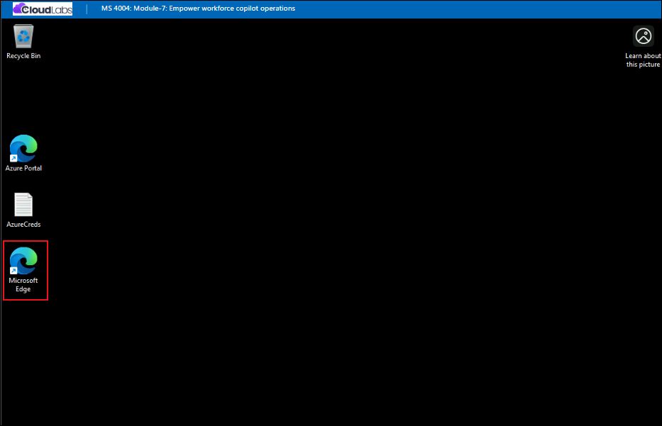

# Module 7: Empower workforce copilot operations

## Lab Overview

Operations teams are the backbone of every organization. They coordinate people, processes, facilities, and technology to keep the business running smoothly—often while juggling tight timelines, complex logistics, and constant change. In this environment, the ability to make fast, informed decisions is critical.

Microsoft 365 Copilot is designed to help Operations professionals meet this challenge. By combining AI‑powered reasoning with the tools Operations teams already use every day, Copilot enhances productivity, reduces manual work, and enables teams to focus on higher‑value tasks such as risk mitigation, strategic planning, and cross‑functional collaboration.

Across industries, Operations teams face similar pressures: maintaining safe and efficient facilities, coordinating multi‑team efforts, responding to unplanned disruptions, and keeping stakeholders aligned. Copilot strengthens these capabilities by helping teams:

- **Streamline planning and execution**. Copilot accelerates project planning by generating structured ideas, organizing tasks, and transforming complex information into clear outputs.

- **Automate the repeatable and eliminate the tedious**. High‑volume, repetitive tasks—status updates, routine questions, review cycles, vendor communications—often consume Operations capacity. Copilot reduces that burden by automating routine communications, compiling data, and creating no‑code agents that provide consistent answers

- **Keep complex projects on track**. Large initiatives such as facility expansions involve multiple phases, teams, timelines, and dependencies. Copilot helps visualize milestones, monitor risks, and maintain alignment. Copilot also assists with drafting communications, updating safety documentation, and generating summaries that Operations staff can act on immediately

- **Power data‑driven decisions**. Operations leaders rely on timely, accurate insights to guide actions and mitigate risks. Copilot quickly synthesizes information from documents, emails, and project notes to support informed choices.

- **Strengthen communication and stakeholder alignment**. Whether briefing executives, updating frontline teams, or coordinating with vendors, clear communication is essential. Copilot helps craft concise messages, generate presentations, and compile insights from attached files.  

This training module is built around realistic, scenario‑driven exercises that reflect the responsibilities of modern Operations teams. These exercises reflect what Operations teams do daily—coordinating people, projects, safety, and change. Copilot strengthens these essential functions by reducing friction, speeding execution, and ensuring that information is accurate, consistent, and actionable.

## Copilot prompting

One of the primary keys to effectively using Copilot is the quality of your Copilot prompts. A good Copilot prompt is built around the following four key elements that make your request clear, actionable, and tailored for the best results:

- **Goal**. Clearly state what you want Copilot to do. For example: “Generate three to five bullet points summarizing the latest project updates.”

- **Context**. Provide background information so Copilot understands why you need this request and who or what is involved. For example: “Prepare these bullet points for a meeting with Client X about their ‘Phase 3+’ brand campaign.”

- **Sources**. Specify where Copilot should look for information (documents, emails, Teams chats, and so on). For example: “Focus on emails and Teams chats since June.”

- **Expectations**. Define how you want the response delivered—tone, style, or level of detail. For example: “Use simple language so I can get up to speed quickly” or “Explain it as if I were a pirate.”

## Prerequisites

To get the most out of this module, you should have:

- A basic understanding of Microsoft 365 applications such as Teams, Word, Excel, and Planner.
- Familiarity with business reporting, project management, and executive decision-making processes.
- Access to a Microsoft 365 tenant with Microsoft 365 Copilot enabled.

## Getting Started with the lab

We've prepared a seamless environment for you to explore and learn about **Module 7: Empower Workforce with Microsoft 365 Copilot for Operations**. Let's begin by making the most of this experience!

## Accessing Your Lab Environment
 
Once the lab environment is ready, the virtual machine displayed on the left will be your primary workspace for completing the exercises, while the **Guide** on the right side provides step-by-step instructions for each task.

## Exploring Your Lab Resources
 
To get a better understanding of your lab resources and credentials, navigate to the **Environment** tab.
 


## Utilizing the Split Window Feature
 
For convenience, you can open the lab guide in a separate window by selecting the **Split Window** button from the Top right corner.


## Managing Your Virtual Machine
 
Feel free to **Start, Stop, or Restart (2)** your virtual machine as needed from the **Resources (1)** tab. Your experience is in your hands!


## Lab Setup

In this module, we'll create prompts for Microsoft 365 Copilot that reference files. First, let’s upload all required files to OneDrive to ensure they're accessible throughout the lab.

### Uploading Files to OneDrive

Follow the steps below to upload all files needed to **OneDrive**:

1. In the LabVM, open the **Microsoft Edge** browser from the from Desktop.

    

1. In the address bar, enter the following URL to navigate to Microsoft 365:

    ```
    https://www.microsoft365.com
    ```
1. Enter the following credentials to sign in to Microsoft 365:

    - **Email/Username**: **<inject key="AzureAdUserEmail"></inject>**

    - **Password**: **<inject key="AzureAdUserPassword"></inject>**

1. If prompted to **Stay signed in**, select **Don't show this again** and then **Yes**.

1. In the Microsoft 365 portal, click on the **App launcher  (1)**button and select **OneDrive (2)**.

    

1. In **OneDrive**, in the top-left corner, select **+ Create or upload (1)** > **Files upload (2)**.

    

1. In **File Explorer**, navigate to **`C:\AllFiles` (1)** location and select all the files **(2)** from the folder and click **Open (3)**.

    

1. When the upload is complete, you should see **Uploaded 93 items to My files** in the bottom center of the screen.

    

1. Leave **Edge** open and move on to the next task.

### Referencing Files in Copilot

When using Copilot, you may find that some files aren’t immediately available in the suggestions. This occurs because certain Copilot experiences only reference files from the **Most Recently Used (MRU)** list, while others let you browse **OneDrive** directly. To ensure a file appears in the **MRU** list, simply open it in the relevant Microsoft 365 app, and it will be added automatically.

> **`!IMPORTANT:`** Microsoft 365 Copilot can only work with files saved to **OneDrive**. Files stored locally on your PC will need to be moved to **OneDrive** for Copilot to access them.

## Support Contact
 
The **CloudLabs support** team is available 24/7, 365 days a year, via email and live chat to ensure seamless assistance at any time. We offer dedicated support channels tailored specifically for both learners and instructors, ensuring that all your needs are promptly and efficiently addressed.
 
Learner Support Contacts:
 
- Email Support: [cloudlabs-support@spektrasystems.com](mailto:cloudlabs-support@spektrasystems.com)
- Live Chat Support: https://cloudlabs.ai/labs-support
 
Click **Next** from the bottom right corner to embark on your Lab journey!

  
