# Exercise 1: Use Copilot in Whiteboard to Brainstorm Project Plan Ideas

## Scenario

As the Operations Manager at Adatum Corporation, you're planning to install a new boiler into your building's heating system. Before beginning the installation process, you want to use Copilot in Whiteboard to brainstorm the steps involved, identify potential risks, and organize the project into meaningful planning categories.

Rather than holding a traditional sticky-note brainstorming session with multiple participants, you'll use Microsoft Copilot in Whiteboard to generate ideas, expand the discussion, group related concepts, and summarize the session. This task shows how Copilot can help Operations teams move from unstructured planning to a more organized project approach.

## Lab Overview

In this hands-on lab, you will use **Microsoft Whiteboard** and **Microsoft 365 Copilot** to brainstorm and organize a boiler installation project. You will:

- Generate project steps using Copilot's Suggest feature.
- Add risk mitigation ideas and downtime reduction recommendations.
- Organize sticky notes into meaningful categories.
- Regenerate category groupings until you find a useful structure.
- Create a summary of the brainstorming session.

By the end of this exercise, you will have a structured Whiteboard containing categorized project planning ideas that can serve as the foundation for a formal project plan.

## Task 1: Use Copilot in Whiteboard to brainstorm project plan ideas

In this task, you will use Microsoft 365 Copilot in Whiteboard to generate and organize ideas for a boiler installation project. You will create a new Whiteboard, use Copilot to suggest project planning activities, and build a foundation for project brainstorming.

1. In your **Microsoft Edge** browser, navigate to the Microsoft 365 home page:

    ```
    https://www.microsoft365.com
    ```

1. Enter the following credentials to sign in to Microsoft 365:

    - **Email/Username**: **<inject key="AzureAdUserEmail"></inject>**

    - **Password**: **<inject key="AzureAdUserPassword"></inject>**

1. In the Microsoft 365 portal, click on the **App launcher (1)** button and select **More apps (2)**.

    

1. Under the top section of apps in the **Apps** window, select **All apps→ (1)**. In the **All apps** window, scroll down and select **Whiteboard (2)**.

   

   

1. In **Whiteboard for the web**, select **Create new Whiteboard**.

1. Select the default board name **Whiteboard (1)** at the top of the page and rename it to **(2)**:

    ```
    Boiler installation project plan
    ```

    

### Task 1.1 Generate Project Planning Ideas

In this task, you will use Copilot's Suggest feature to generate project planning ideas for installing a new boiler system. You will review, expand, and insert the generated ideas as sticky notes on the Whiteboard.

1. Select the **Copilot (1)** icon from the bottom toolbar, then select **Suggest (2)**.

    

1. In the **Suggest content with Copilot** window, enter the following prompt and select **Generate**:

    ```
    I'm the Operations Manager at Adatum Corporation. Our 50-year-old office building has a failing boiler, and I need to evaluate options for repair or replacement. Before starting the installation project, please suggest the steps we should follow to install a new boiler system in the building. Return the output as a practical set of planning ideas for a project brainstorming session.
    ```

    > **`Note:`** For this first prompt, the text has been provided so you can see what an effective prompt looks like when it includes the four key elements discussed in the Introduction unit - **Goal**, **Context**, **Sources**, and **Expectations**.

    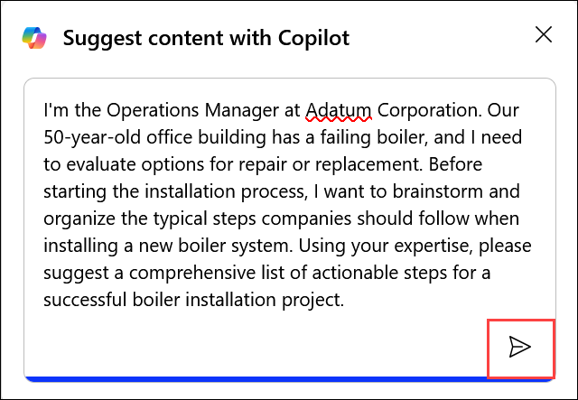

    > **`Tip:`** If Copilot returns an error such as **"Something went wrong. Please try again."** or **"Copilot couldn't process this prompt. Please rephrase it."**, try one of the following simplified prompts:
    >
    > **Option 1:**
    > ```
    > I'm the Operations Manager for Adatum Corporation. We're installing a new boiler in our company's heating system. Please suggest the steps we should follow to install the new boiler.
    > ```
    >
    > **Option 2:**
    > ```
    > Create a list of the steps that a company should take to install a new boiler heating system.
    > ```
    >
    > Sometimes Copilot works best with direct, single-action prompts. Once you receive a response, you can continue building on it with follow-up prompts.

1. Review the first **six ideas** generated by Copilot. Then select **Generate more** so Copilot produces six additional ideas.

1. Select **Insert (12)** to add the ideas to your Whiteboard canvas.

    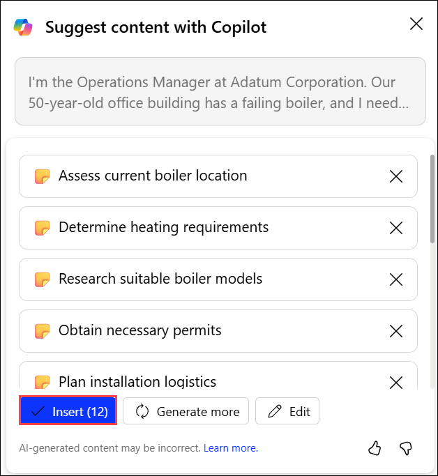

1. Review the inserted sticky notes. Select any note to explore available options such as editing the text, changing formatting, locking the note, or deleting it.

### Task 1.2 Add Risk Mitigation Ideas

In this task, you will use Copilot to identify potential risks associated with the boiler installation project and generate mitigation strategies. The resulting ideas will be added to the Whiteboard to support project planning and risk management.

1. Select the **Copilot (1)** icon again and choose **Suggest (2)**.

    

1. In the **Suggest content with Copilot** window, enter the following prompt and select **Generate**:

    ```
    Suggest ways to mitigate the risks of installing a new boiler into a commercial office building heating system.
    ```

1. Generate more ideas until you have more **12** risk mitigation suggestions, then select **Insert (12)**.

    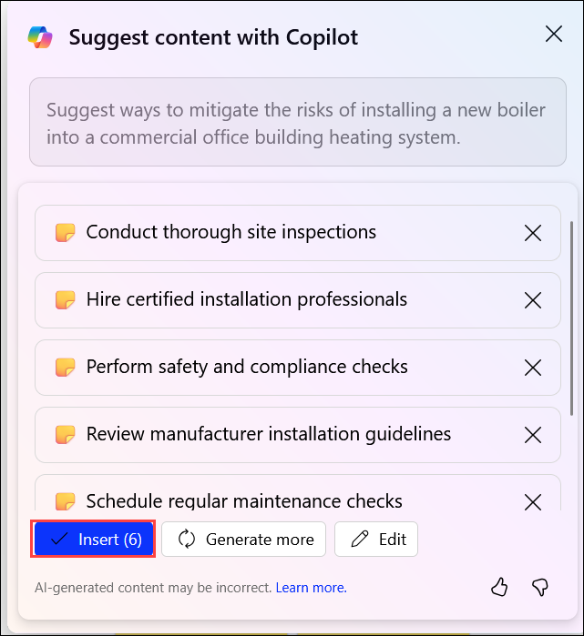

1. If the newly inserted note grid overlaps existing notes, drag it to an open area on the Whiteboard.

1. If any notes fall outside the visible canvas, select **Fit to Screen** in the lower-right corner of the page.

    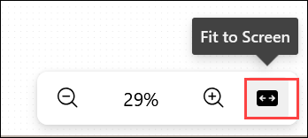

    > **`Note:`** You may need to select **Fit to Screen** more than once until all content is visible.

1. Review the new risk mitigation ideas and make any edits you want. At this stage, you should have about **12 brainstorming notes** on the canvas.

### Task 1.3 Categorize the Notes

In this task, you will use Copilot's Categorize feature to automatically group brainstorming notes into meaningful categories. You will review and refine the generated groupings to improve organization and visibility of project themes.

1. Press **Ctrl + A** to select all notes on the canvas. Verify that all sticky notes are selected, including any that were previously outside the visible area.

    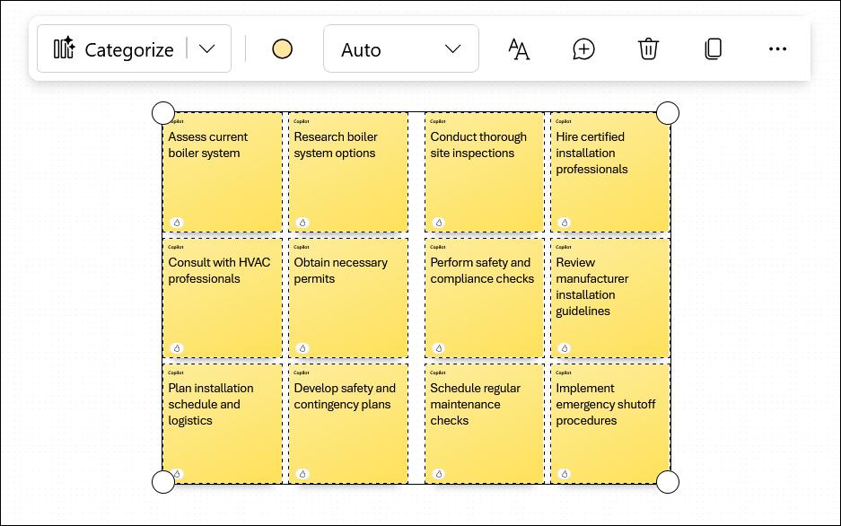

    > **`Warning:`** When you choose the categorize option, Whiteboard may automatically select only the notes currently visible on the canvas. Notes outside the visible view might not be included. Using **Ctrl + A** helps ensure every note is selected before categorizing.

1. Select the **Copilot** icon, then choose **Categorize**. In the **Categorize selected notes** window, select **Categorize**.

    

1. Review the generated categories. Notice how Copilot groups related ideas together, creates category names automatically, and applies different colors to each category.

1. If the categorized notes are difficult to read, select **Fit to Screen**.

1. Select **Regenerate** to produce alternative categorizations. Repeat this several times and observe how the groupings, labels, and category counts change.

    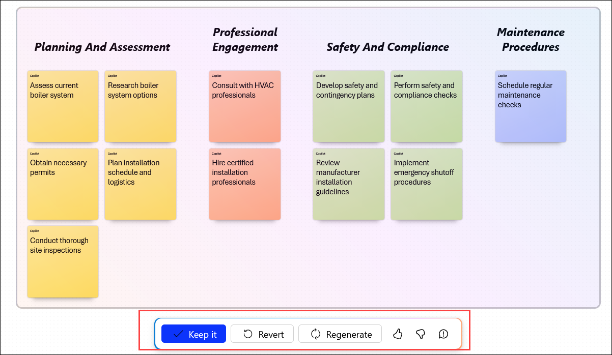

1. If you want to return to the original uncategorized sticky notes, select **Revert**.

1. When you're ready to continue, repeat the categorization process and regenerate the categories until you're satisfied with the organization.

### Task 1.4 Add Downtime Reduction Ideas

In this task, you will use Copilot to generate recommendations for minimizing heating system downtime during the boiler installation. These ideas will be added to the existing brainstorming session to help reduce operational disruption.

1. Select a note that is no longer useful. Open the **More options (...)** menu and select **Delete**.

    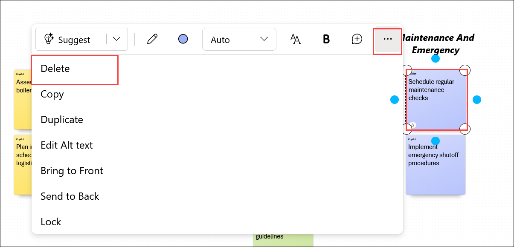

1. Select the **Copilot** icon and choose **Suggest** again.

1. In the **Suggest content with Copilot** window, enter the following prompt and select **Generate**:

    ```
    Suggest ways to limit heating system downtime when installing a new boiler.
    ```

    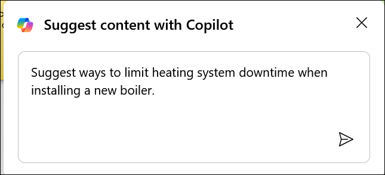

1. Review the six ideas that Copilot generates, then select **Insert (6)**.

    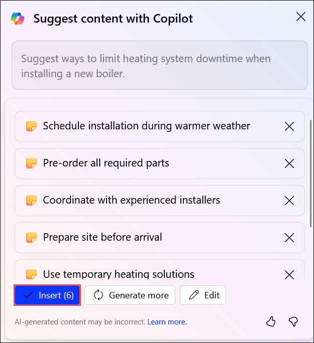

1. Move the new note grid if it overlaps existing content. If needed, select **Fit to Screen** so all notes remain visible.

### Task 1.5 Final Categorization and Summary

In this task, you will perform a final categorization of all brainstorming notes and use Copilot to generate a summary of the session. The resulting Whiteboard will provide a structured overview of project plans, risks, and operational considerations.

1. Press **Ctrl + A** to select all notes again. Then select **Copilot** > **Categorize** > **Categorize**.

1. Review the results. Select **Regenerate** as needed until you're satisfied with the note organization, then select **Keep it**.

    

1. To generate a summary of the brainstorming session, select the **Copilot** icon and then select **Summarize**.

    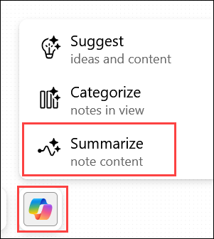

    > **`Note:`** During testing, Copilot sometimes generated a concise summary of the brainstorming session and other times was unable to generate one. Results may vary.

1. If a summary is generated and meets your expectations, select **Keep it**.

    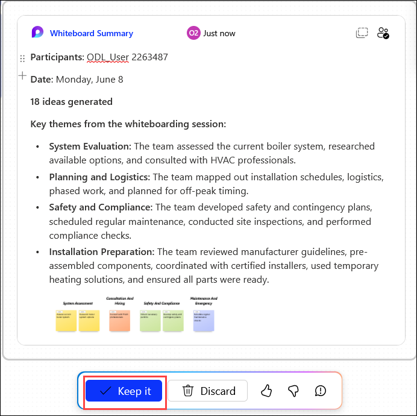

1. You have now completed **Task 1**. Click **Next** to proceed to the next task.

## Summary

In this task, you used **Microsoft 365 Copilot in Whiteboard** to plan a boiler installation project at Adatum Corporation. You:

- Generated project planning ideas using Copilot's Suggest feature.
- Added risk mitigation strategies for the boiler installation project.
- Added downtime reduction recommendations to minimize business disruption.
- Organized brainstorming notes into meaningful categories using Copilot's Categorize feature.
- Refined the categorization results by regenerating alternatives.
- Generated a session summary to capture the key outcomes of the brainstorming exercise.

The Whiteboard you created can now serve as the foundation for a more formal implementation plan and future stakeholder discussions.

## You have successfully completed the exercise. Click on Next >> to proceed with the next exercise.

