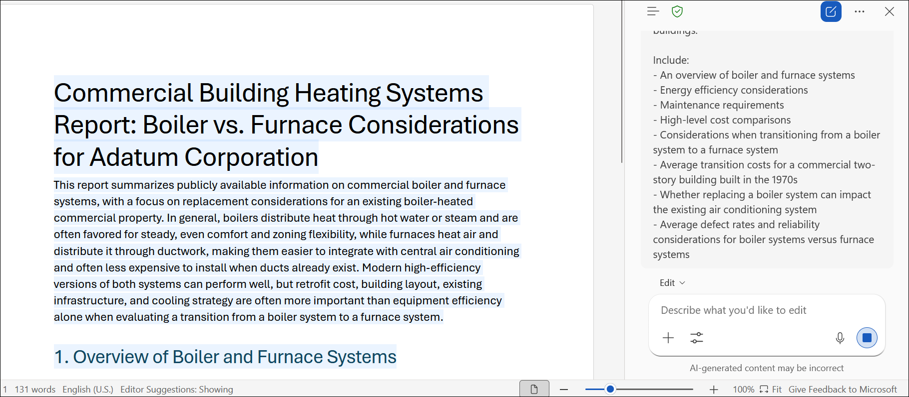
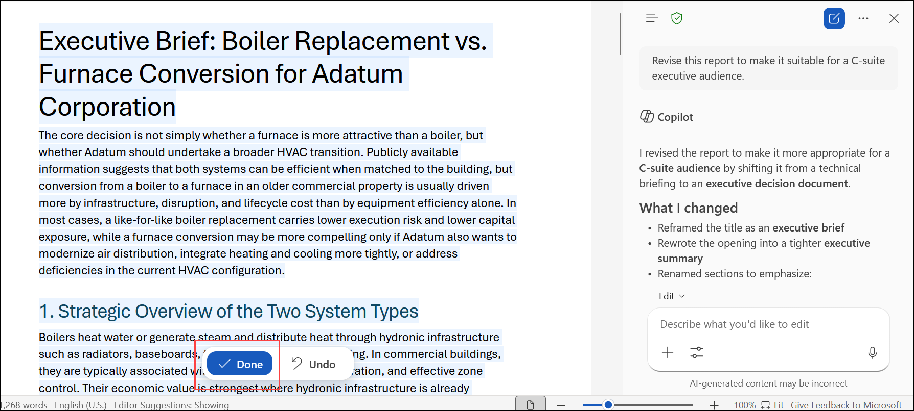
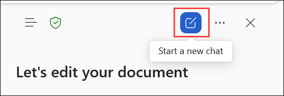
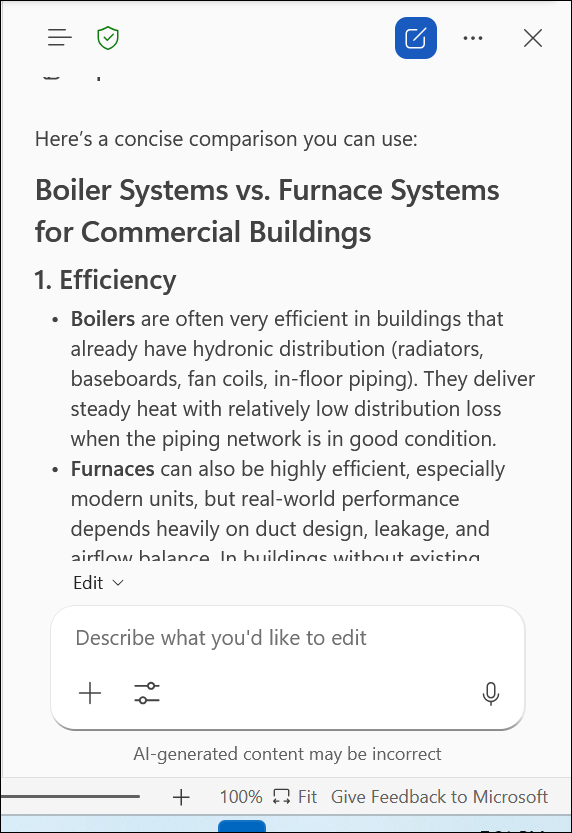
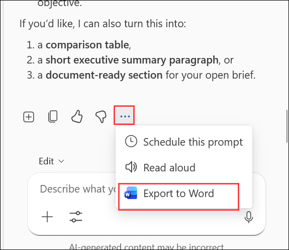
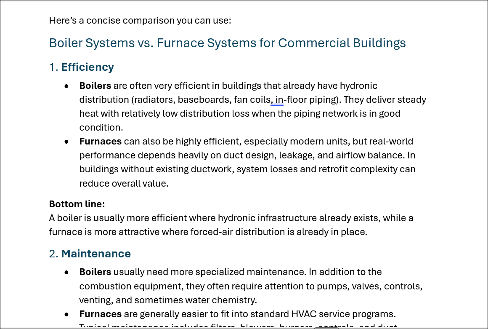

# Exercise 1, Task 2: Use Copilot in Word to Compare Operational Reports

## Scenario

As the Operations Manager at Adatum Corporation, you discovered that the current boiler system used to heat the company's 50-year-old office building requires significant repair and may need to be replaced entirely. Given the age of the building and the potential investment involved, you want to evaluate whether transitioning from the existing boiler system to a more energy-efficient furnace system would be beneficial.

To support your recommendation to management, you need to create a report that compares boiler and furnace systems using publicly available information. Rather than manually researching and drafting the report, you will use Microsoft 365 Copilot in Word to generate, refine, and summarize the information.

This task also demonstrates the difference between using **Edit with Copilot** and using Copilot in chat mode, helping you understand when Copilot can directly modify a document and when it acts as a research assistant.

## Lab Overview

In this hands-on lab, you will use **Microsoft 365 Copilot in Word** to generate a report comparing commercial boiler and furnace systems. You will explore how Copilot can:

- Create a document from a detailed prompt.
- Revise content for a specific audience.
- Summarize key findings in chat mode.
- Export Copilot responses to a new Word document.

By the end of this task, you will understand how to use both document-editing and chat-based Copilot experiences within Word.

## Task 2: Use Copilot in Word to Compare Operational Reports

1. In your **Microsoft Edge** browser, navigate to the Microsoft 365 home page:

    ```
    https://www.microsoft365.com
    ```

1. Enter the following credentials to sign in to Microsoft 365:

    - **Email/Username**: **<inject key="AzureAdUserEmail"></inject>**

    - **Password**: **<inject key="AzureAdUserPassword"></inject>**

1. In the Microsoft 365 portal, click on the **App launcher** button and select **Word**.

1. In **Word for the web**, select **Blank document**.

1. Select **Copilot** on the ribbon to open the Copilot pane on the right side of the document.

### Task 2.1 Generate the Boiler vs. Furnace Report

1. In the Copilot prompt field, enter the following prompt and select **Submit**:

    ```
    I'm the Operations Manager for Adatum Corporation and I'm evaluating whether to replace our existing boiler system with a furnace system. Generate a report based on publicly available information describing the types of heating systems commonly used in commercial buildings.

    Include:
    - An overview of boiler and furnace systems
    - Energy efficiency considerations
    - Maintenance requirements
    - High-level cost comparisons
    - Considerations when transitioning from a boiler system to a furnace system
    - Average transition costs for a commercial two-story building built in the 1970s
    - Whether replacing a boiler system can impact the existing air conditioning system
    - Average defect rates and reliability considerations for boiler systems versus furnace systems
    ```

    

1. Wait while Copilot generates the report, then review the content inserted directly into the document. Verify that the report covers the following areas:

    - Heating system types and overview
    - Energy efficiency considerations
    - Maintenance requirements
    - Cost comparisons
    - System conversion considerations
    - HVAC and air conditioning dependencies
    - Reliability and defect rate information

### Task 2.2 Revise the Report for an Executive Audience

1. In the Copilot prompt field, enter the following prompt and select **Submit**:

    ```
    Revise this report to make it suitable for a C-suite executive audience.
    ```

    

1. Review the updated report. Observe how Copilot revised the document directly — no manual copy-and-paste was required. Note the key differences between the original and the revised version, such as:

    - Executive-focused language and tone
    - Simplified technical details
    - Strategic recommendations
    - Business-oriented summaries

### Task 2.3 Switch to Chat Mode and Summarize

1. Select **New chat** icon in the prompt field. Verify that the icon disappears from the prompt field.

    

    > **`Note:`** When **Edit with Copilot** is disabled, Copilot functions in chat mode and no longer updates the document automatically. Instead, it responds in the Copilot pane as a research assistant.

1. In the Copilot prompt field, enter the following prompt and select **Submit**:

    ```
    Summarize the key differences between boiler systems and furnace systems for commercial buildings. Focus on efficiency, maintenance, lifespan, and typical use cases.
    ```

    

1. Review the response generated in the Copilot pane. Observe that the document itself remains **unchanged** — Copilot responded in the pane only, without modifying the document.

1. Save the file as **Heating System Comparison**, you will be using this file in upcoming labs.

### Task 2.4 Export the Summary to a New Word Document

1. Below the Copilot response, review the available action options, which may include **Add to doc**, **Copy response**, and **More actions (...)**.

1. Select the **More actions (...)** menu and choose **Export to Word**.

    

1. Click on **Open word**, observe that Word for the web opens the exported content in a **new browser tab**. Review the exported document.

    > **`Note:`** The exported document may include additional Copilot conversation text before or after the generated summary. Delete any unnecessary text that is not part of the report content.

    

1. Review the cleaned-up document and compare the exported summary with the original report generated using **Edit with Copilot**. Note how the two Copilot experiences — document editing and chat mode — each serve a different purpose in your workflow.

1. You have now completed **Task 2**.

## Summary

In this task, you used **Microsoft 365 Copilot in Word** to evaluate heating system options for Adatum Corporation's office building. You:

- Generated a comprehensive **boiler vs. furnace comparison report** using a detailed, structured prompt with **Edit with Copilot** enabled.
- Revised the report for a **C-suite executive audience**, with Copilot applying changes directly to the document.
- Switched to **chat mode** by disabling Edit with Copilot, and used Copilot as a research assistant to generate a focused summary.
- **Exported** the chat-mode summary to a new Word document for standalone use.
- Compared the two Copilot experiences to understand when each approach is most effective.

## You have successfully completed the exercise. Click on Next >> to proceed with the next exercise.

