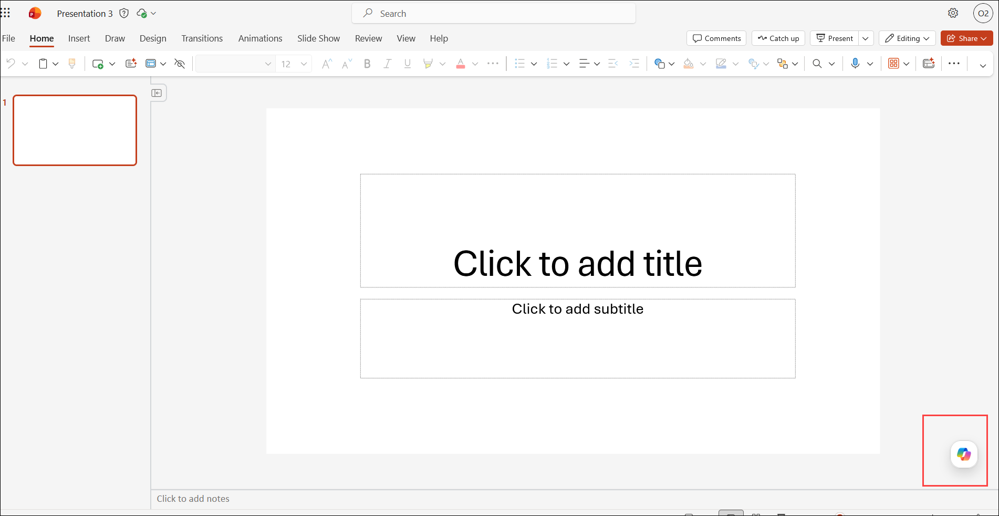
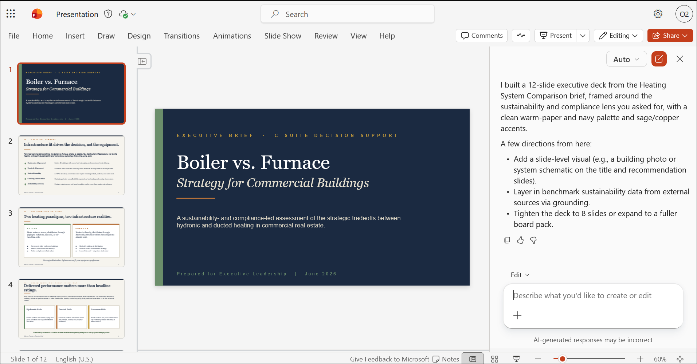
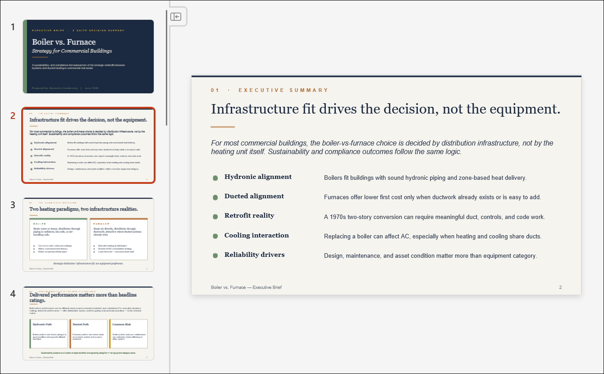
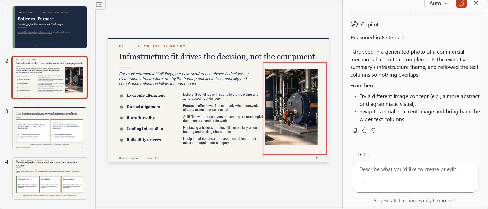
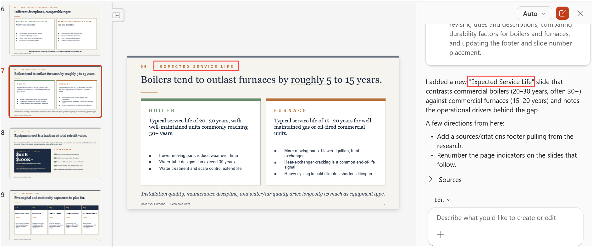
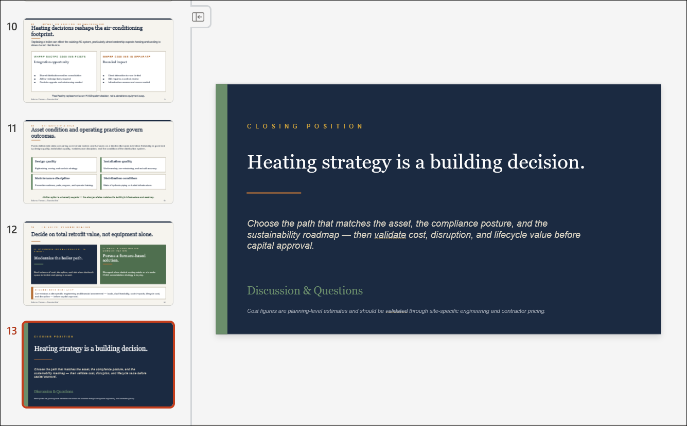
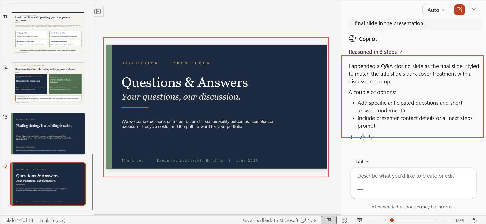

# Exercise 1, Task 3: Use Copilot in PowerPoint to create an executive presentation

In the previous task, you used Copilot in Word to create the **Heating System Comparison** report, which identified the differences between boiler and furnace heating systems. You now want to create an executive-level presentation that summarizes the findings and helps leadership make an informed decision.

To support this goal, you'll use Microsoft 365 Copilot in PowerPoint to generate a presentation from the report, add supporting visuals, insert an additional research slide, and create a closing Q&A slide. This task demonstrates how Copilot in PowerPoint can help transform written analysis into a leadership-ready presentation.

## Using Copilot in PowerPoint

PowerPoint provides two ways to use Copilot: standard Copilot prompts for quickly generating slide content or summaries, and **Edit with Copilot** in the Copilot pane for making direct, in-place changes to the presentation.

- You should use Copilot's standard prompts in PowerPoint when you want to draft slides quickly, summarize content, or generate speaker notes without changing the overall structure of the deck.

- You should use **Edit with Copilot** when you want Copilot to work directly in the presentation-such as reorganizing slides, refining slide text, improving layouts, or making iterative edits.

In summary, use chat-style Copilot for generating ideas and content suggestions; use **Edit with Copilot** for hands-on editing inside the file.

## Task 3: Use Copilot in PowerPoint to create an executive presentation

1. In your **Microsoft Edge** browser, navigate to the Microsoft 365 home page:

    ```
    https://www.microsoft365.com
    ```

1. Enter the following credentials to sign in to Microsoft 365:

    - **Email/Username**: **<inject key="AzureAdUserEmail"></inject>**

    - **Password**: **<inject key="AzureAdUserPassword"></inject>**

1. In the Microsoft 365 portal, click on the **App launcher (1)** button and select **PowerPoint (2)**.

    

1. In **PowerPoint for the web**, create a blank presentation.

    

1. Select **Copilot** to open the Copilot pane.

    

1. In the Copilot prompt field, ask Copilot to generate an executive leadership presentation based on the attached file.

   >Note: Upload the link of you word document if required.

    ```
    Create an executive leadership presentation based on the attached Heating System Comparison report.
    ```

1. If Copilot asks follow-up questions about the presentation, review and answer them as you prefer. Questions may relate to audience, style, deck length, or template selection. Once finished, select **Confirm**.

1. Wait while Copilot analyzes the report and generates the presentation.

    

    > **`Note:`** During testing, Copilot sometimes generated the slides automatically. In other cases, it first generated a slide outline and then asked for confirmation before creating the slides.

1. Review the generated presentation. Verify that it includes topics such as:

    - Boiler and furnace system overviews
    - Energy efficiency considerations
    - Cost comparisons
    - Maintenance requirements
    - System conversion considerations
    - Executive recommendations

1. Locate a slide that doesn't contain an image and select it.

    

1. In the Copilot pane, ask Copilot to generate an image related to the content on the selected slide and add it to the presentation.

    ```
    Generate an image related to the content on this slide and add it to the presentation.
    ```

1. Wait while Copilot generates and inserts the image.

1. Review the deck and identify where you want to insert a new slide about the expected lifespan of commercial boiler systems versus commercial furnace systems.

    

1. In the Copilot pane, ask Copilot to research the expected lifespan of commercial boiler systems versus commercial furnace systems and add the information to a new slide.

    ```
    Research the expected lifespan of commercial boiler systems versus commercial furnace systems and add the information to a new slide.
    ```

1. Verify that Copilot added the new slide at the intended location. If the slide appears in the wrong place, drag and drop it to the desired location.

    

1. Navigate to the end of the presentation and select the final slide.

    

1. In the Copilot pane, ask Copilot to add a **Question and Answer (Q&A)** slide after the final slide in the presentation.

    ```
    Add a Question and Answer (Q&A) slide after the final slide in the presentation.
    ```

1. Verify that the Q&A slide appears at the end of the deck. If needed, move it to the proper location.

    

1. Review the completed presentation and confirm it includes the following:

    - Executive summary and heating system comparisons
    - Cost and energy efficiency information
    - AI-generated visual
    - Lifespan comparison slide
    - Q&A slide at the end

1. You have now completed **Task 3**. Click **Next** to proceed to the next task.

## Summary

In this task, you used **Microsoft 365 Copilot in PowerPoint** to transform the Heating System Comparison report into a leadership-ready executive presentation for Adatum Corporation. You:

- Generated an executive slide deck from the Heating System Comparison report using **Edit with Copilot**.
- Responded to Copilot's follow-up questions to shape the presentation.
- Added an AI-generated image to a content slide.
- Created a new research-based slide comparing system lifespan.
- Added a Q&A slide to close the presentation.

You now have a presentation that can support executive review and decision-making regarding the building heating system.

## You have successfully completed the exercise. Click on Next >> to proceed with the next exercise.

