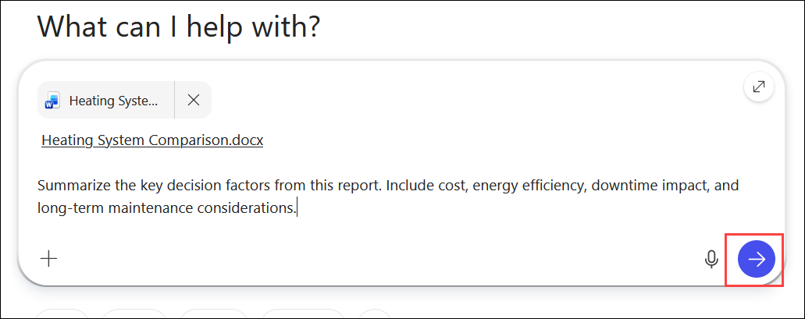
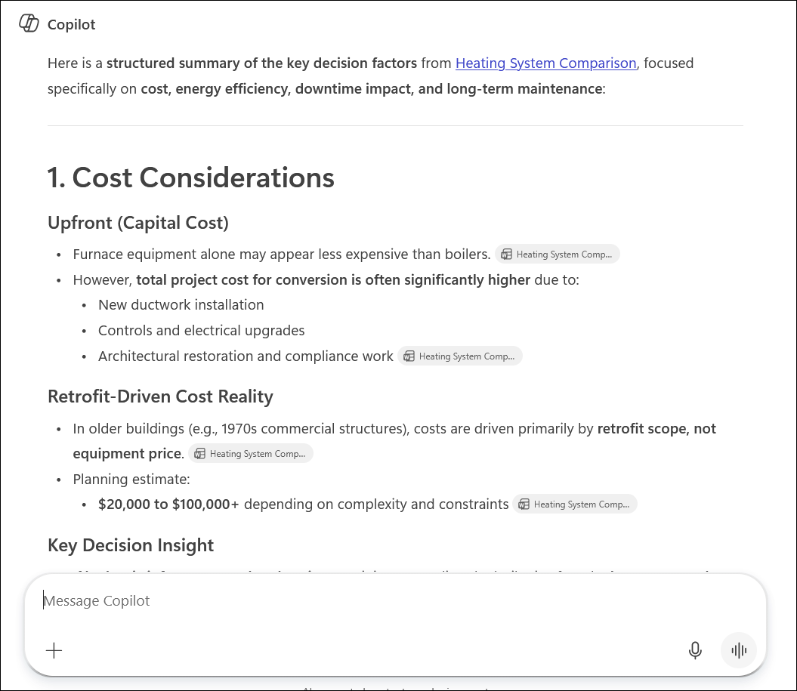
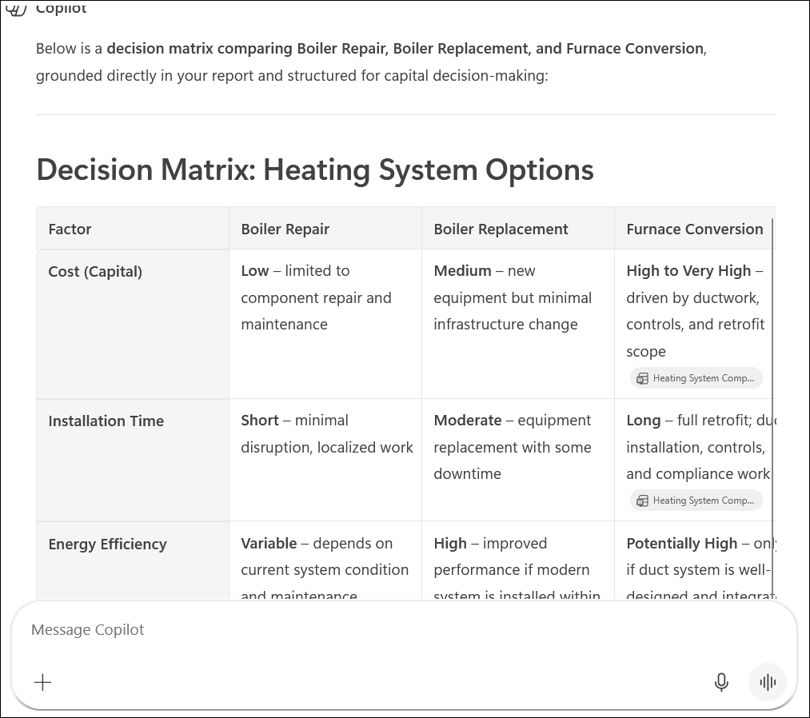
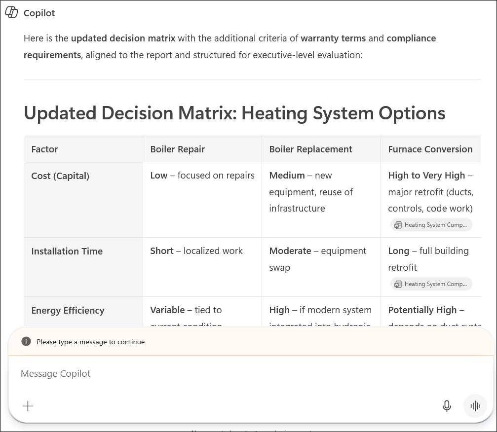
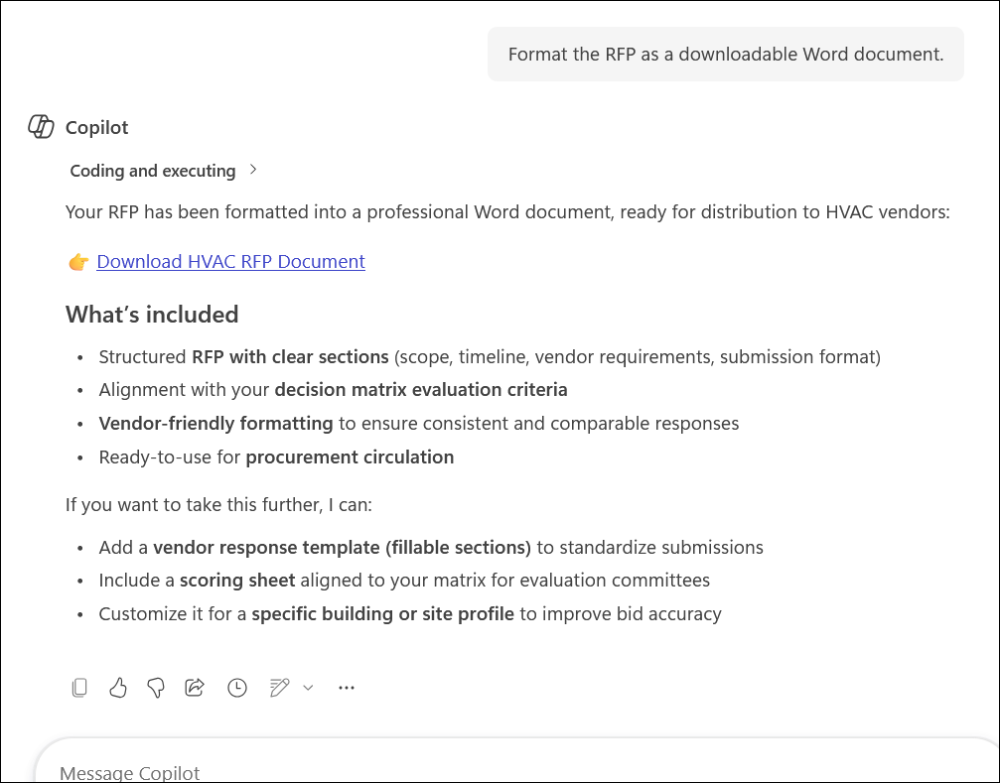

# Exercise 1, Task 4: Use Microsoft 365 Copilot Chat to prepare for vendor engagement

It's been quite a day thus far. With Copilot's help, you brainstormed in Whiteboard, researched in Word, and created an executive presentation in PowerPoint. It's now time to prepare for vendor engagement and turn your work into practical decision-making outputs.

For this final task in Exercise 1, you want to consolidate your previous work into actionable deliverables:

- A decision matrix comparing boiler repair, boiler replacement, and furnace conversion.
- A draft Request for Proposal (RFP) to send to HVAC vendors.
- An executive-ready summary that leadership can review before approving next steps.

You plan to use **Microsoft 365 Copilot Chat** to assist with this process. Copilot Chat can pull context from your previous artifacts and help you synthesize information into structured business outputs.

## Using Copilot Chat

In Copilot Chat on the web, the response mode selector lets you control how much time and reasoning Copilot uses when answering your prompt. You can leave it set to **Auto** unless a task specifically calls for a different mode.

When Copilot Chat opens in **Work** mode, the response mode selector may not be shown. In **Work** mode, Copilot is optimized for secure, work-context queries and can reference content stored in your Microsoft 365 environment, such as files in OneDrive.

This task uses **Work** mode because you're working with files created earlier in the lab.

## Task 4: Use Microsoft 365 Copilot Chat to prepare for vendor engagement

1. In your **Microsoft Edge** browser, navigate to the Microsoft 365 home page:

    ```
    https://www.microsoft365.com
    ```

1. Enter the following credentials to sign in to Microsoft 365:

    - **Email/Username**: **<inject key="AzureAdUserEmail"></inject>**

    - **Password**: **<inject key="AzureAdUserPassword"></inject>**

1. Open **Copilot Chat** and verify that **Work** mode is selected.

    

1. In the Copilot prompt field, attach the **Heating System Comparison** report from your **OneDrive**.

    

### Task 4.1 Create a Decision Matrix

1. Ask Copilot Chat to summarize the key decision factors from the attached report. The decision criteria should include cost, energy efficiency, downtime impact, and long-term maintenance considerations.

    ```
    Summarize the key decision factors from this report. Include cost, energy efficiency, downtime impact, and long-term maintenance considerations.
    ```

    

1. Review the decision criteria and refine it if needed. Submit any suggested prompts that help improve the criteria.

    

1. Ask Copilot to create a decision matrix that compares three options: boiler repair, boiler replacement, and convert to furnace. Include columns for cost, installation time, energy efficiency, expected lifespan, and risk level.

    ```
    Create a decision matrix that compares boiler repair, boiler replacement, and furnace conversion. Include columns for cost, installation time, energy efficiency, expected lifespan, and risk level.
    ```

   

1. Review the matrix. If needed, ask Copilot to add columns for warranty terms and compliance requirements.

    ```
    Update the decision matrix by adding warranty terms and compliance requirements as additional evaluation criteria.
    ```

   

1. Once the decision criteria are in place, ask Copilot to make the matrix more actionable by rating or scoring each option against the evaluation criteria.

    ```
    Assign High, Medium, or Low ratings for risk and provide comparative scoring for each option against the evaluation criteria.
    ```

    

1. Review the decision matrix and submit any suggested prompts that help improve it.

1. Ask Copilot to format the decision matrix as a downloadable Word document.

    ```
    Format this decision matrix as a downloadable Word report. Include a title, introduction, decision matrix table, and a usage guidance section explaining how leadership should use the matrix for decision-making.
    ```

1. Download the decision matrix document once Copilot provides the download link.

    

### Task 4. 2 Create the HVAC Vendor RFP

1. In Copilot Chat, attach the decision matrix document that you downloaded.

1. Ask Copilot to draft an RFP for HVAC vendors based on the decision matrix.

    ```
    Using the attached decision matrix, draft a Request for Proposal (RFP) for HVAC vendors. Include project scope, timeline, vendor requirements, proposal submission requirements, evaluation criteria, and next steps.
    ```

    

1. Review the RFP and submit any suggested prompts that help improve the draft.

    

1. Ask Copilot to format the RFP into a downloadable Word document and download it once the link is available.

    ```
    Format the RFP as a downloadable Word document.
    ```

    

### Task 4.3 Create the Executive Summary

1. Ask Copilot to create a one-page executive summary that references the decision matrix as the basis for its recommendations. The summary should:

    - Provide context about the failing boiler and why action is needed.
    - Explain the available options.
    - Pull highlights from the decision matrix.
    - Suggest a preferred option.
    - Recommend next steps.

    ```
    Create a one-page executive summary that:
    - Explains the current situation and why action is required
    - Describes the available options (repair, replace, or convert)
    - Highlights findings from the decision matrix
    - Recommends a preferred option
    - Identifies recommended next steps

    The summary should be concise, executive-focused, and decision-ready.
    ```

1. Review the executive summary and submit any suggested prompts that improve it.

    

1. Ask Copilot to format the executive summary into a downloadable Word document. Download the document once Copilot provides the link.

    ```
    Format this executive summary as a downloadable Word document.
    ```

    

1. You have now completed **Task 4** and **Exercise 1**. Click **Next** to continue.

## Summary

In this task, you used **Microsoft 365 Copilot Chat** in Work mode to transform the Heating System Comparison research into three business deliverables for Adatum Corporation. You:

- Summarized key decision factors from the Heating System Comparison report.
- Generated a decision matrix comparing boiler repair, boiler replacement, and furnace conversion.
- Created an HVAC vendor RFP.
- Produced a one-page executive summary with a recommended course of action and next steps.
- Downloaded all three deliverables as formatted Word documents.

These outputs can now support vendor engagement and leadership decision-making.

## You have successfully completed the task. Click on Next >> to proceed with the next exercise.

