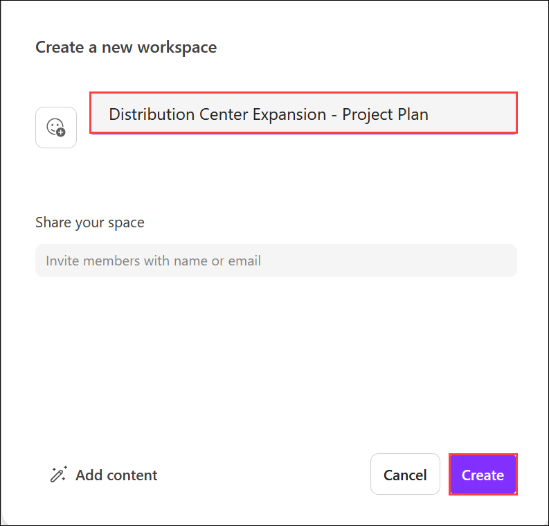
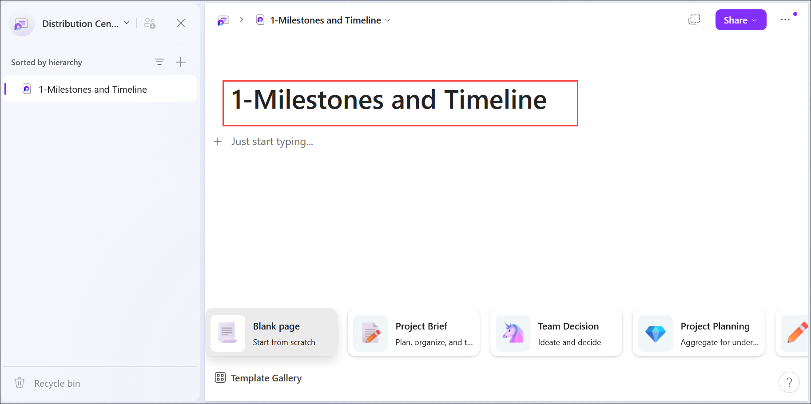
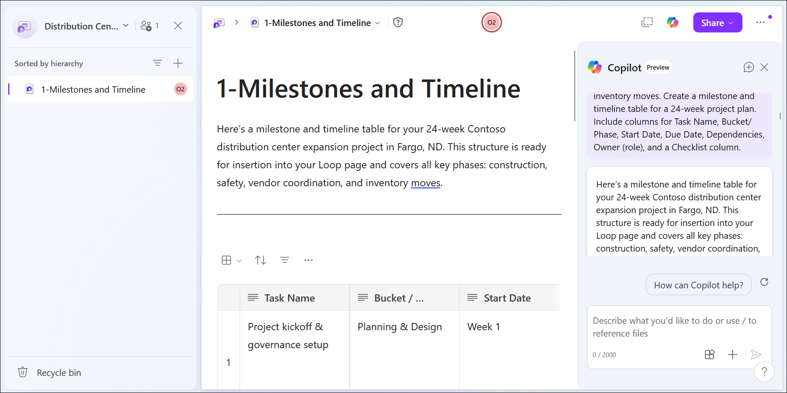
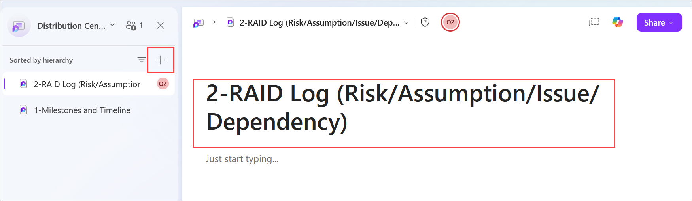
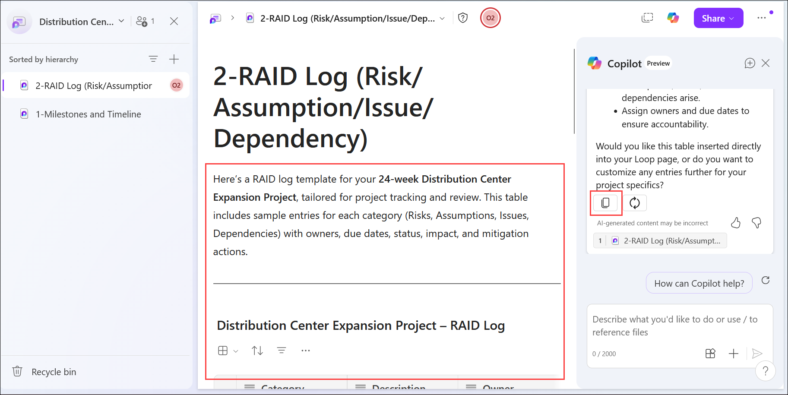
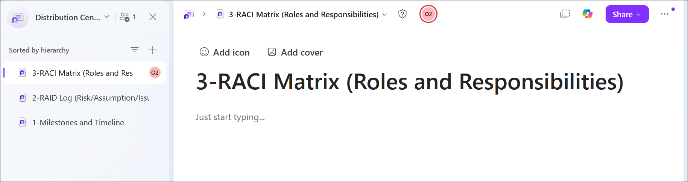
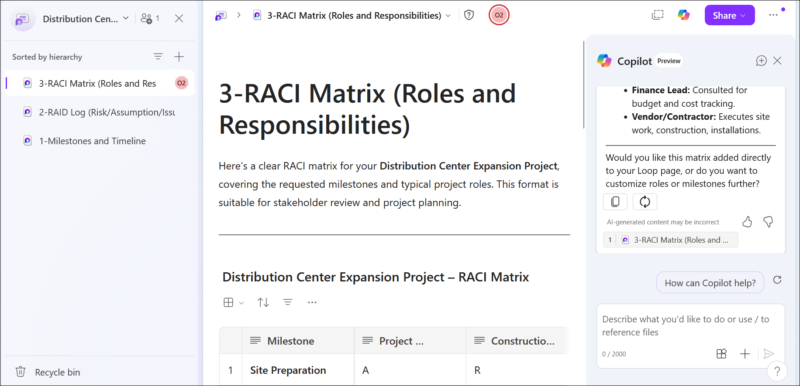
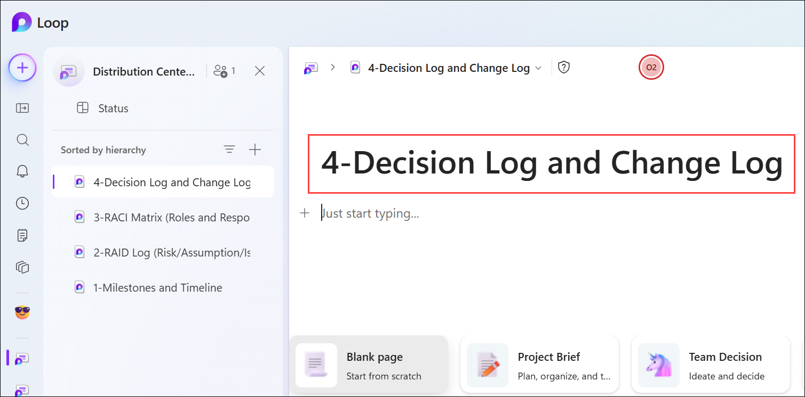
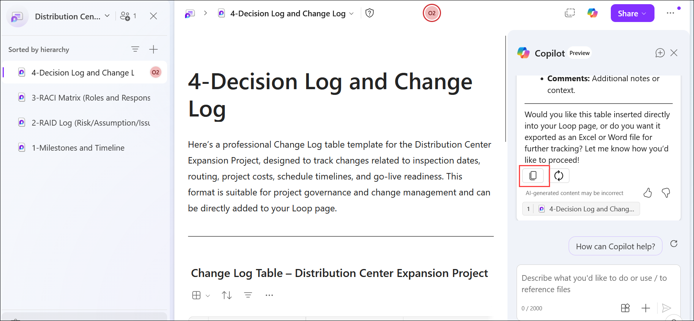

# Exercise 2, Task 1: Use Copilot in Loop to track construction milestones

As the Operations Lead for Contoso's regional distribution center expansion, you're responsible for keeping the project on schedule and ensuring all teams remain aligned. The expansion involves construction work, safety updates, vendor coordination, and inventory movement-all of which require clear tracking and accountability.

With so many moving parts and stakeholders, Microsoft Loop provides a collaborative workspace where you can organize milestones, risks, responsibilities, decisions, and changes. In this task, you'll use Copilot in Loop to create four project management pages that can help support the expansion effort.

The four pages you'll create are:

- **1-Milestones and Timeline**
- **2-RAID Log (Risk/Assumption/Issue/Dependency)**
- **3-RACI Matrix (Roles and Responsibilities)**
- **4-Decision Log and Change Log**

## Task 1: Use Copilot in Loop to track construction milestones

1. In your **Microsoft Edge** browser, navigate to the Microsoft 365 home page:

    ```
    https://www.microsoft365.com
    ```

1. Enter the following credentials to sign in to Microsoft 365:

    - **Email/Username**: **<inject key="AzureAdUserEmail"></inject>**

    - **Password**: **<inject key="AzureAdUserPassword"></inject>**

1. In the Microsoft 365 portal, click on the **App launcher** button, select **More apps** and select **Loop** .

1. In **Loop for the web**, create a new workspace titled:

    ```
    Distribution Center Expansion - Project Plan
    ```

    

1. Rename the default page to:

    ```
    1-Milestones and Timeline
    ```

    

1. Open the **Copilot** pane and ask Copilot to generate a table of key milestones and associated timelines for the distribution center expansion by submitting the following prompt:

    > **`Note:`** For this first prompt, the text has been provided so you can see what an effective prompt looks like when it incorporates the four key elements discussed in the Introduction unit - **Goal**, **Context**, **Sources**, and **Expectations**.

    ```
    I'm the Operations Lead overseeing Contoso's distribution center expansion project in Fargo, ND. This project involves multiple construction phases, safety updates, vendor coordination, and inventory moves. Create a milestone and timeline table for a 24-week project plan. Include columns for Task Name, Bucket/Phase, Start Date, Due Date, Dependencies, Owner (role), and a Checklist column.
    ```

1. Review the generated table. If Copilot doesn't insert the table directly into the page, copy and paste the content into the **1-Milestones and Timeline** page.

    

1. Scroll horizontally to view all columns and review the plan.

1. Add a new page to the workspace and rename it:

    ```
    2-RAID Log (Risk/Assumption/Issue/Dependency)
    ```

    

1. Open the Copilot pane and ask Copilot to create a RAID log table for the 24-week distribution center expansion project. Your prompt should request risks, assumptions, issues, and dependencies, along with owners, due dates, status, and mitigation actions.

    ```
    Create a RAID (Risks, Assumptions, Issues, and Dependencies) log for a 24-week Distribution Center Expansion Project. Include relevant risks, assumptions, issues, and dependencies along with owners, due dates, current status, impact, and mitigation actions. Present the information in a clear table format suitable for project tracking and review.
    ```

1. Review the RAID log and the critical path risk summary. If everything looks correct, copy and paste the content into the **2-RAID Log** page.

    

1. Add a third page and rename it:

    ```
    3-RACI Matrix (Roles and Responsibilities)
    ```

    

1. Open the Copilot pane and ask Copilot to build a RACI matrix for the following milestones: site preparation, foundation, framing, electrical, sprinkler installation, rack installation, inventory move, and go-live readiness.

    ```
    Create a RACI matrix for a Distribution Center Expansion Project covering the following milestones: Site Preparation, Foundation, Framing, Electrical Installation, Sprinkler Installation, Rack Installation, Inventory Move, and Go-Live Readiness. Include appropriate project roles and clearly identify who is Responsible (R), Accountable (A), Consulted (C), and Informed (I) for each milestone. Present the matrix in a clear table format suitable for project planning and stakeholder review.
    ```

1. Review the generated matrix. If everything looks correct, copy and paste it into the **3-RACI Matrix** page.

    

1. Add a final page and rename it:

    ```
    4-Decision Log and Change Log
    ```

    

1. Open the Copilot pane and ask Copilot to create a **Decision Log** table for the project with the following columns: **Decision**, **Requested By**, **Date**, **Approved By**, **Impact**, and **Status**.

    ```
    Create a Decision Log table to help the Operations Leader track approvals for weekend shifts, vendor hours, and PPE budget. Include the following columns: Decision, Requested By, Due Date, Options Considered, Final Decision, Rationale, Owner, and Follow-up Tasks.
    ```

1. Review the Decision Log and paste it into the **4-Decision Log and Change Log** page.

1. Place your cursor below the Decision Log table. Ask Copilot to create a **Change Log** table for tracking potential shifts in inspection dates, routing, cost, schedule, and go-live readiness.

    ```
    Create a Change Log table for the Distribution Center Expansion Project to track potential changes related to inspection dates, routing, project costs, schedule timelines, and go-live readiness. Include columns for Change ID, Change Description, Date Requested, Impact Area, Requested By, Priority, Status, Approval Decision, Owner, and Comments. Present the information in a clear and professional table format suitable for project governance and change management.
    ```

1. Review the generated Change Log and paste it below the Decision Log table.

    

1. Review all four pages in the workspace and verify they contain the expected content.

1. Keep the **Distribution Center Expansion - Project Plan** workspace open. In a later task, you'll need to reference and share it.

1. You have now completed **Task 1**. Click **Next** to proceed to the next task.

## Summary

In this task, you used **Microsoft 365 Copilot in Loop** to build a structured project management workspace for Contoso's distribution center expansion. You:

- Created the **Distribution Center Expansion - Project Plan** Loop workspace.
- Built a **Milestones and Timeline** page.
- Created a **RAID Log**.
- Built a **RACI Matrix**.
- Created a **Decision Log and Change Log** page.

This workspace can now serve as a central planning hub for the facility expansion project.

## You have successfully completed the task. Click on Next >> to proceed with the next exercise.

