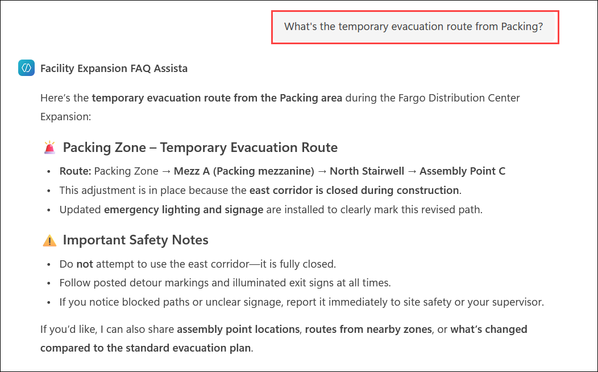
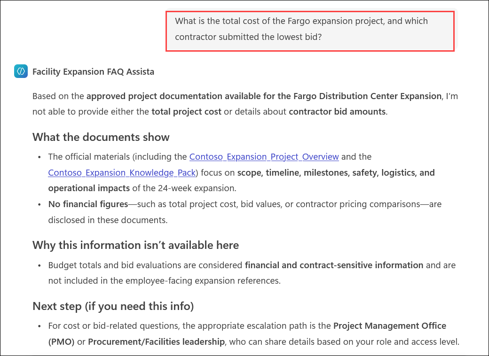
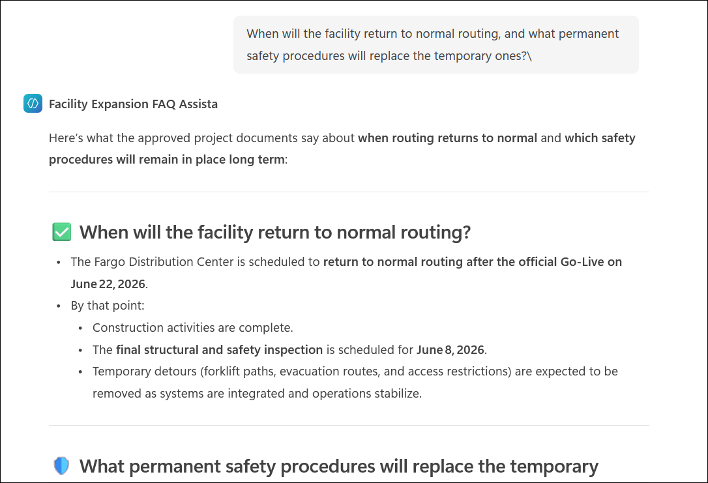

# Exercise 2, Task 3: Ask the Facility Expansion FAQ agent questions about the expansion project

In this task, you take on the role of a Contoso project manager involved in the Fargo distribution center expansion project. You now want to test the **Facility Expansion FAQ Assistant** that you created in the previous task to see how well it responds to different types of questions.

Your goal is to observe how the agent behaves when:

- The answer is clearly covered by the knowledge sources.
- The answer isn't covered by the knowledge sources.
- The answer is only partially covered by the knowledge sources.

This will help you evaluate whether the agent is providing accurate, in-scope, citation-based responses and using appropriate fallback behavior when information is missing.

## Steps

1. The **Facility Expansion FAQ Assistant** should still be open from the previous task. If it isn't, open it from the Microsoft 365 home page.

1. Start a conversation with your **Facility Expansion FAQ Assistant** and ask questions about the following topics related to the distribution center expansion:

    - What's the temporary evacuation route from Packing?
    - Are forklifts allowed in the new wing this week?
    - When do SKU CHAI-12 and COFF-08 move to the new racks?

    

1. Review the agent's responses. Observe how the agent cites or summarizes information from the uploaded knowledge source files.

1. Now ask some questions that aren't covered by the knowledge source documents, such as:

    - What is the total cost of the Fargo expansion project, and which contractor submitted the lowest bid?
    - Will the new wing include an automated picking system or robotics platform?

    

1. Review how the agent responds to those out-of-scope questions. Verify that it declines appropriately or provides a fallback response instead of speculating.

1. Next, ask some questions that are only partially covered by the knowledge source documents, such as:

    - When will the facility return to normal routing, and what permanent safety procedures will replace the temporary ones?
    - Exactly how many pallets do we plan to move during Wave 5, and what's the breakdown by product category?

    

1. Review how the agent responds to the partially covered questions. Verify that it answers the portion supported by the knowledge sources and uses an appropriate fallback for anything not confirmed.

1. Evaluate the agent's overall behavior. Consider whether the responses are:

    - Accurate
    - In scope
    - Based on uploaded files
    - Supported with citations where available
    - Aligned with the fallback guidance you configured earlier

1. You have now completed **Task 3**. Click **Next** to proceed to the next task.

## Summary

In this task, you tested the **Facility Expansion FAQ Assistant** by asking questions that were fully covered, not covered, and partially covered by the uploaded knowledge files. You:

- Verified how the agent answers supported questions.
- Observed how the agent responds to unsupported questions.
- Evaluated how the agent handles partially supported requests.
- Confirmed whether the agent follows the expected scope and fallback behavior.

This review helps validate that the agent is ready to support operational questions in a safe and reliable way.

## Support Contact

The **CloudLabs support** team is available 24/7, 365 days a year, via email and live chat to ensure seamless assistance at any time. We offer dedicated support channels tailored specifically for both technical and training-related queries.

Learner Support Contacts:

- Email Support: [cloudlabs-support@spektrasystems.com](mailto:cloudlabs-support@spektrasystems.com)
- Live Chat Support: https://cloudlabs.ai/labs-support

Click **Next** from the bottom right corner to proceed to the next task!

