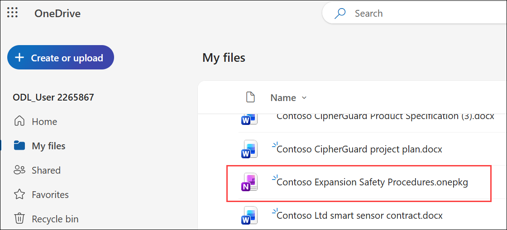
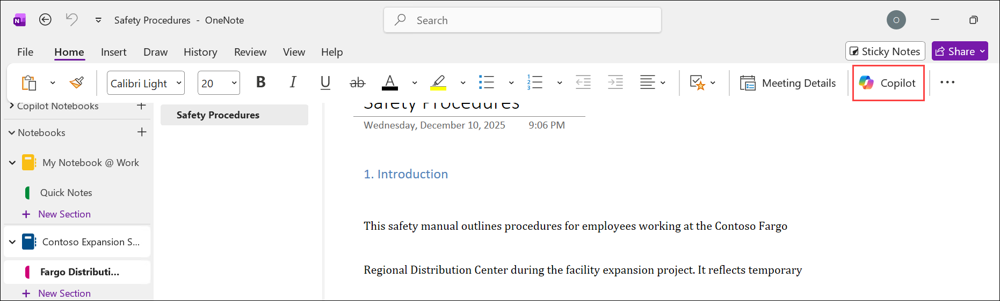
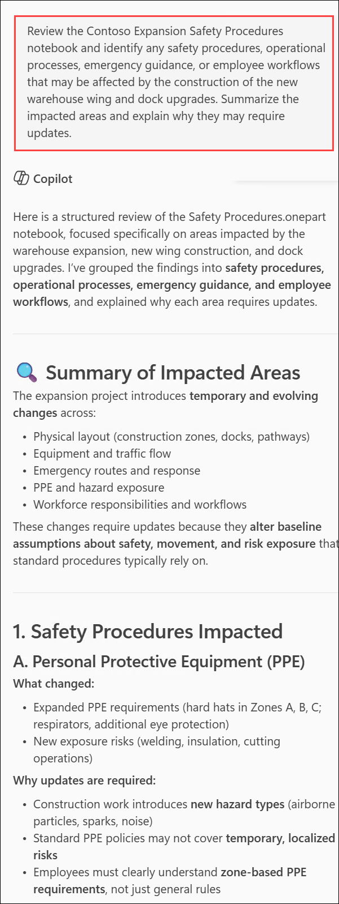
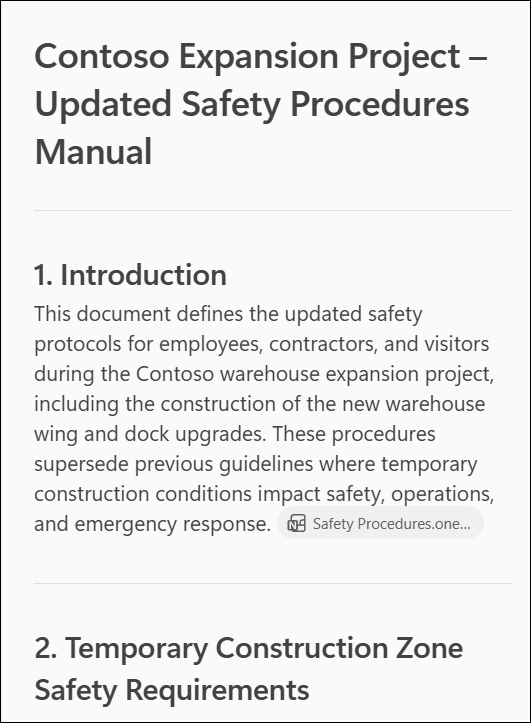
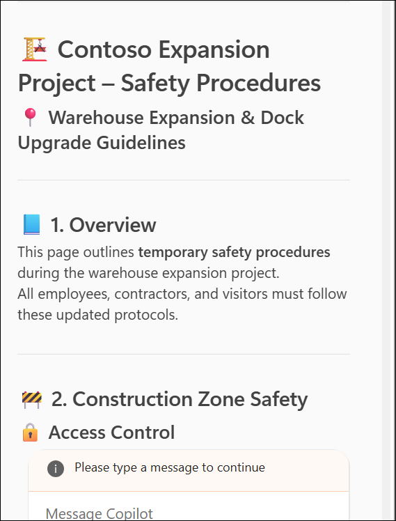
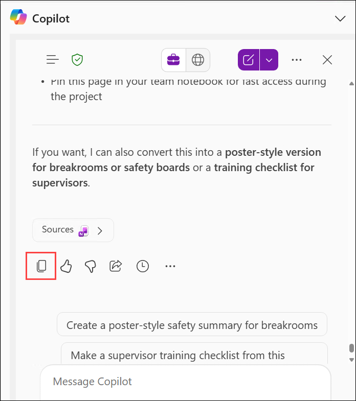
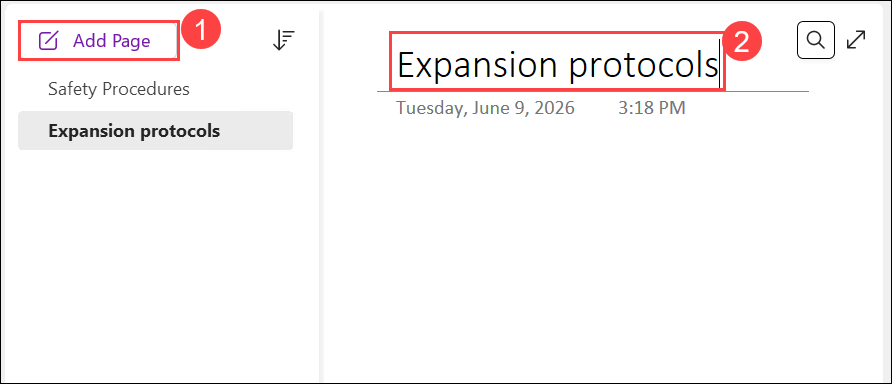
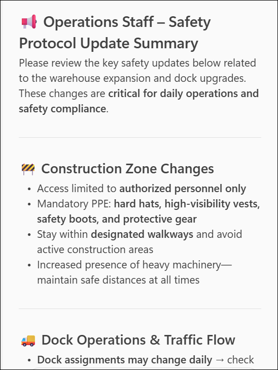
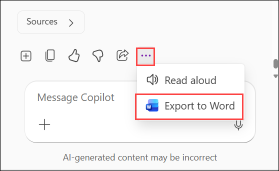
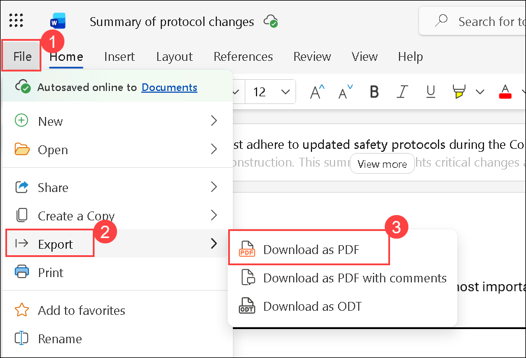

# Exercise 2, Task 4: Use Copilot in OneNote to update safety protocols

## Scenario

As the Operations Lead for Contoso's regional distribution center expansion, you discovered that several areas of the existing safety protocol manual are outdated. Temporary construction zones, revised dock procedures, equipment movement, and updated emergency routes all need to be reflected in the latest guidance.

You're tasked with revising the regional distribution center's safety protocols using Copilot in OneNote. Your goal is to review the current procedures, identify impacted areas, generate updated safety guidance, and prepare a summary that can be shared with Operations staff.

## Lab Overview

In this hands-on lab, you will use Microsoft Copilot in OneNote to review and update operational safety documentation for a distribution center expansion project. You will explore how Copilot can:

* Analyze existing safety procedures and identify impacted areas.
* Generate updated safety protocols based on construction and operational changes.
* Reformat content into structured, readable OneNote pages.
* Create concise summaries for operational communication.
* Export and share updated safety documentation in a portable format.

By the end of this task, you will understand how to use Copilot in OneNote to maintain accurate, up-to-date safety documentation and communicate critical operational changes effectively.

## Task 4: Use Copilot in OneNote to update safety protocols

In this task, you will use Microsoft Copilot in OneNote to review and update safety protocols for Contoso’s distribution center expansion. You will identify impacted procedures, generate revised safety guidance, organize content into structured pages, and prepare a summary for Operations staff.

1. In your **Microsoft Edge** browser, navigate to the Microsoft 365 home page:

    ```
    https://www.microsoft365.com
    ```

1. Enter the following credentials to sign in to Microsoft 365:

    - **Email/Username**: **<inject key="AzureAdUserEmail"></inject>**

    - **Password**: **<inject key="AzureAdUserPassword"></inject>**

1. In the Microsoft 365 portal, click on the **App launcher (1)** button and select **OneDrive (2)**.

     

1. In **OneDrive**, download the **Contoso Expansion Safety Procedures** notebook. Open it through the desktop app.

     

1. If its ask for the sign in, then provide email and password to complete the sign in procedure.

    - **Email/Username**: **<inject key="AzureAdUserEmail"></inject>**

    - **Password**: **<inject key="AzureAdUserPassword"></inject>**

1. On **Sign in to all apps, websites, and services on this device?** page, select **Yes**.

1. In the **Unpack Notebook** window, select **Create**.

1. Select **Copilot** to open the Copilot pane, on the **Home** tab . If announcements appear, select **Skip**.

    

1. Ask Copilot to review the safety procedures and identify any areas that might be affected by the construction of the new warehouse wing and dock upgrades.

    ```
    Review the Contoso Expansion Safety Procedures notebook and identify any safety procedures, operational processes, emergency guidance, or employee workflows that may be affected by the construction of the new warehouse wing and dock upgrades. Summarize the impacted areas and explain why they may require updates.
    ``` 

    

1. Review Copilot's analysis and note the impacted areas. If Copilot displays a suggested prompt related to mitigation recommendations, feel free to submit it.

1. Review any suggested prompts that Copilot provides and submit any that you find useful.

1. Ask Copilot to draft updated safety protocols that reflect temporary construction zones, new dock procedures, revised emergency exit guidance, and related operational changes.

    ```
    Based on the impacted areas you identified, draft updated safety protocols for the Contoso Expansion project. Include temporary construction zone requirements, revised dock operations and traffic flow procedures, updated emergency exits and evacuation guidance, contractor safety requirements, employee access restrictions, hazard communication procedures, and any other operational changes needed during construction. Format the content as a formal safety procedures document.
    ```

    

1. Review the draft that Copilot generates. Ask Copilot to format the content as a OneNote page with headings or icons.

    ```
    Reformat the updated safety protocols as a OneNote page using clear headings, subheadings, bullet points, and appropriate icons or visual markers. Organize the content so it is easy for employees and operations staff to read and follow.
    ```

    

1. Once the formatting is complete, select **Copy response** to copy the updated draft.

     

1. In your notebook, select **+ Add page (1)** and create a new page titled (2):

    ```
    Expansion protocols
    ```

    

1. Paste the copied content into the new page. Remove any extra conversational text if needed.

1. Ask Copilot to generate a concise summary of the safety protocol changes that can be shared with Operations staff.

    ```
    Create a concise summary of the updated safety protocol changes for Operations staff. Highlight the most important changes related to construction zones, dock procedures, emergency exits, employee access, and safety compliance. Keep the summary clear, professional, and easy to share with employees.
    ```

    

1. Review the summary. If needed, request any changes.

1. Click on the **(...)** dots and select **Export to Word**.

    

1. Now **Open Work** file and change the name as **Summary of protocol changes**.

1. Now click on the **File (1)** form the menu selcet **Export (2)** and download the file as pdf by selecting **Download as PDF (3)**.

    

1. Now upload the pdf file to **OneDrive**.

1. You have now completed **Task 4**. Click **Next** to proceed to the next task.

## Summary

In this task, you used **Copilot in OneNote** to review and update safety documentation for Contoso's regional distribution center expansion. You:

- Identified safety procedures impacted by the expansion.
- Generated updated safety guidance.
- Created a new OneNote page for the revised protocols.
- Created a second page summarizing the changes for Operations staff.
- Prepared the summary for sharing by saving it as a PDF.

These updates are now ready to support communication and awareness across the Operations team.

## You have successfully completed the task. Click on Next >> to proceed with the next exercise.

