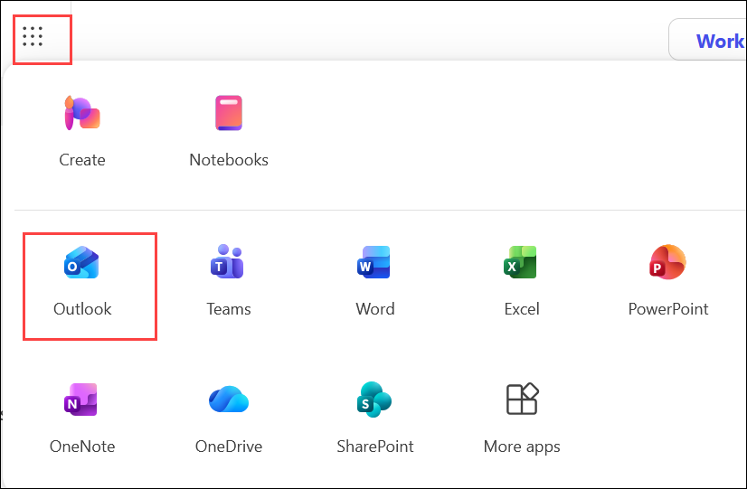
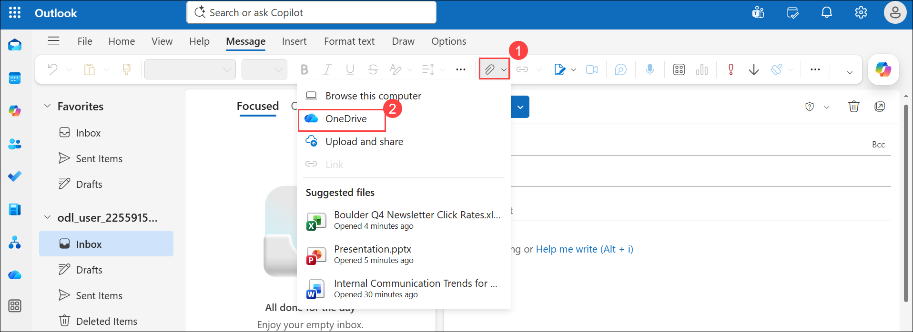
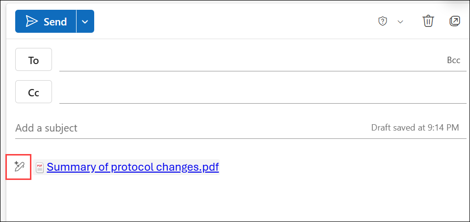
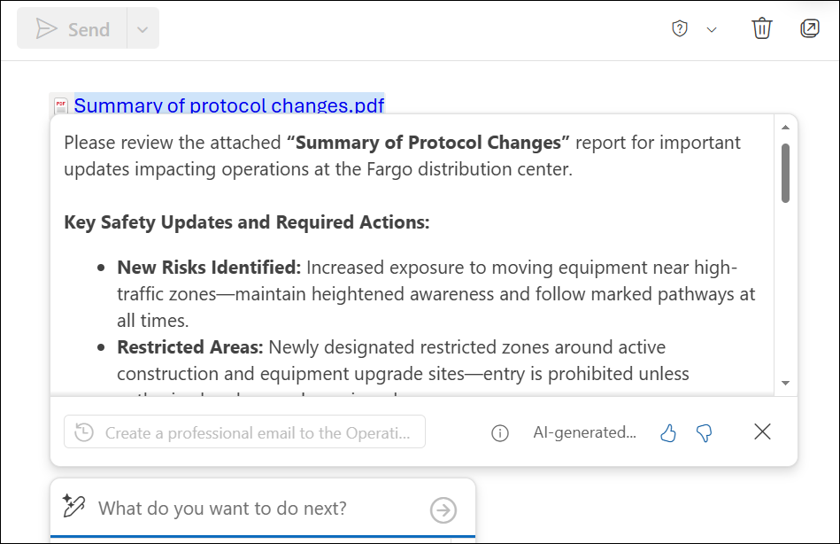
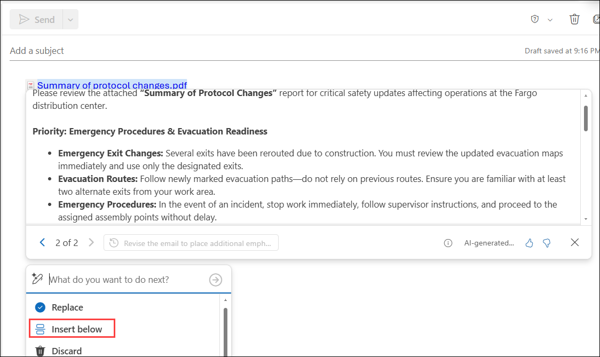
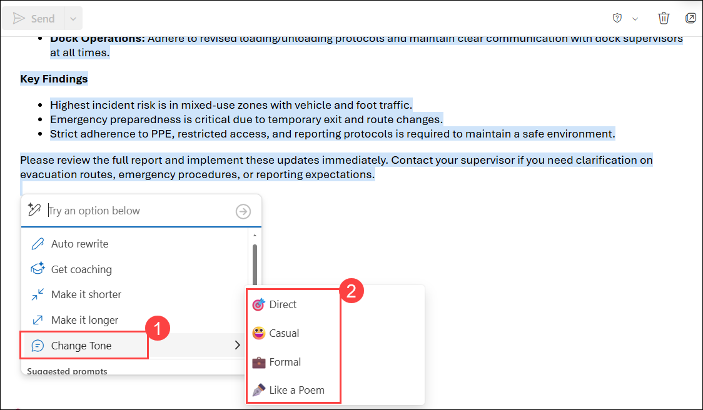
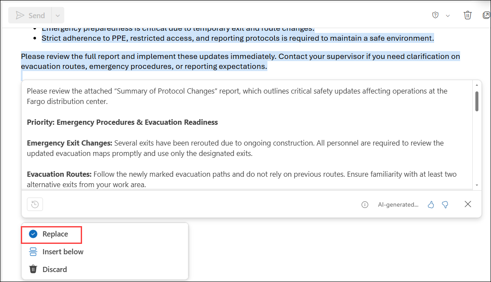

# Exercise 2, Task 5: Use Copilot in Outlook to email the safety procedure changes to Operations staff

With the updated safety procedures summarized in OneNote and saved as a PDF file, it's time to distribute the information to the Operations staff across the Fargo distribution center. Leadership wants employees to clearly understand the new risks, restricted areas, and emergency updates related to the facility expansion.

In this task, you'll use Copilot in Outlook to draft a professional, concise, and actionable email based on the safety procedures summary.

## Task 5: Use Copilot in Outlook to email the safety procedure changes to Operations staff

1. In your **Microsoft Edge** browser, navigate to the Microsoft 365 home page:
    
    ```
    https://www.microsoft365.com
    ```

1. Enter the following credentials to sign in to Microsoft 365:

    - **Email/Username**: **<inject key="AzureAdUserEmail"></inject>**

    - **Password**: **<inject key="AzureAdUserPassword"></inject>**

1. In the Microsoft 365 portal, click on the **App launcher** button and select **Outlook**.

    

2. In **Outlook on the web**, create a **new email**. Select **Attach (1)**, and then choose **OneDrive (2)** to browse and then attach the **Summary of protocol changes** PDF file that you created in the prior task.

     

3. In the body of the message, select the **Open Copilot** (pencil) icon that appears next to the attached file.

     

1. In the Copilot prompt field, ask Copilot to create an email to Contoso's Operations staff at the Fargo distribution center that:

    - Summarizes the safety protocol updates found in the attached PDF file.
    - Includes specific data points from the report, such as new risks and restricted areas.
    - Highlights key insights while keeping the message concise and actionable.

    ```
    Create a professional email to the Operations staff at Contoso's Fargo distribution center based on the attached PDF report. Summarize the safety protocol updates, including any new risks, restricted areas, revised operational procedures, emergency exit changes, construction zone requirements, and dock operation updates. Include specific data points and key findings from the report where applicable. Keep the message concise, actionable, and focused on what employees need to know and do.
    ```

1. Review the draft generated by Copilot. If needed, ask Copilot to include information on emergency updates.

    

1. Review the updated draft. Notice how Copilot creates a new draft version each time you refine the request.

    ```
    Revise the email to place additional emphasis on emergency procedures, evacuation routes, emergency exits, incident reporting requirements, and any temporary safety measures employees must follow during construction activities.
    ```

1. Review the updated email. Notice how Copilot generated a new version of the email, which is draft 2 (2 of 2). You can select the back arrow to go to draft 1 of 2, which was the original version of the email that Copilot generated. Since you prefer to keep working with the latest draft, select the forward arrow to return to draft 2 of 2.

1. When you're satisfied with the draft, select **Insert below** to insert the content into the actual email body.

    

13. Review the email, select all content, and then select the **Open Copilot** icon.

14. In the Copilot menu, scroll down and select **Change Tone (1)** and then select the tone that you want from the menu that’s displayed **(2)**.

    

1. Review the revised tone options. If you find a version you prefer, select **Replace**.

    

1. Once you're happy with the final email, send it to your personal email address for testing.

1. Verify that you received the email and were able to open the attached report.

1. You have now completed **Task 5** and **Exercise 2**.

## Summary

In this task, you used **Copilot in Outlook** to create and refine an email communicating safety procedure changes related to the Fargo distribution center expansion. You:

- Attached the safety summary PDF.
- Used Copilot to draft an email based on the attached document.
- Refined the content to include emergency updates.
- Tested different draft versions and tone options.
- Sent the final message and verified delivery.

You now have a professional communication ready to inform Operations staff about important safety changes.

## You have successfully completed the task.