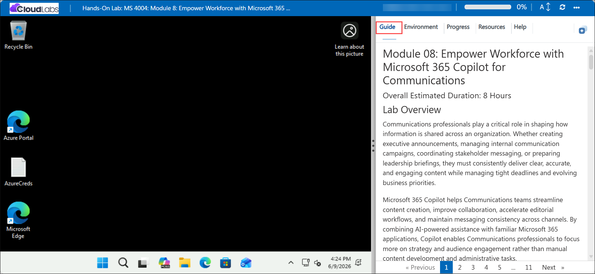

# Module 08: Empower Workforce with Microsoft 365 Copilot for Communications

### Overall Estimated Duration: 4 Hours

## Lab Overview

Communications professionals play a critical role in shaping how information is shared across an organization. Whether creating executive announcements, managing internal communication campaigns, coordinating stakeholder messaging, or preparing leadership briefings, they must consistently deliver clear, accurate, and engaging content while managing tight deadlines and evolving business priorities.

Microsoft 365 Copilot helps Communications teams streamline content creation, improve collaboration, accelerate editorial workflows, and maintain messaging consistency across channels. By combining AI-powered assistance with familiar Microsoft 365 applications, Copilot enables Communications professionals to focus more on strategy and audience engagement rather than manual content development and administrative tasks.

This module equips Communications professionals with the skills and knowledge needed to effectively use Microsoft 365 Copilot across Microsoft 365 applications. Through practical exercises, you'll learn how to create compelling communications, refine messaging, manage communication initiatives, and develop content that aligns with organizational objectives.

As a Communications professional, your ability to effectively communicate with Copilot and obtain accurate, relevant responses is essential for:

* **Streamlining content creation.** Copilot can help draft executive communications, internal announcements, employee newsletters, communication briefs, press releases, and campaign content while maintaining a consistent voice and messaging style.

* **Enhancing editorial workflows.** Copilot can summarize lengthy documents, refine messaging, improve readability, identify inconsistencies, and suggest revisions to strengthen communication effectiveness.

* **Improving stakeholder alignment.** Copilot can summarize meetings, emails, and collaboration discussions, helping ensure messaging remains aligned across departments and leadership teams.

* **Managing communication initiatives.** Copilot can assist with communication planning, campaign coordination, content scheduling, and project tracking, helping teams stay organized and aligned.

* **Creating audience-focused communications.** Copilot can adapt content for different audiences, ensuring the right message is delivered in the appropriate tone and format for executives, employees, partners, or customers.

## Copilot Prompting

One of the primary keys to effectively using Copilot is the quality of your prompts. A good Copilot prompt is built around the following four key elements that make your request clear, actionable, and tailored for the best results:

* **Goal.** Clearly state what you want Copilot to do. For example: *"Create a communication brief introducing our new employee engagement platform."*

* **Context.** Provide background information so Copilot understands the purpose and audience. For example: *"This brief is intended for Boulder Innovations' executive leadership team as part of a company-wide employee engagement initiative."*

* **Sources.** Specify where Copilot should look for information. For example: *"Use the attached AuroraHub Product Overview document as the primary source."*

* **Expectations.** Define how you want the response delivered. For example: *"Use a professional tone, organize the content with clear headings, and focus on strategic value rather than technical details."*

Keep these four elements front and center as you work through the exercises in this module. Effective prompting enables Copilot to generate more accurate, relevant, and impactful communications that support organizational goals.

## Prerequisites

To get the most out of this module, you should have:

* A basic understanding of Microsoft 365 applications such as Word, Outlook, PowerPoint, SharePoint, and Teams.
* Familiarity with communication planning, content development, and stakeholder engagement practices.
* Access to Microsoft 365 Copilot.

## Getting Started with the Lab

We've prepared a seamless environment for you to explore and learn about **Module 08 - Empower Workforce with Microsoft 365 Copilot for Communications**. Let's begin by making the most of this experience.

## Accessing Your Lab Environment
 
Once the lab environment is ready, the virtual machine displayed on the left will be your primary workspace for completing the exercises, while the **Guide** on the right side provides step-by-step instructions for each task.



## Exploring Your Lab Resources
 
To get a better understanding of your lab resources and credentials, navigate to the **Environment** tab.
 


## Utilizing the Split Window Feature
 
For convenience, you can open the lab guide in a separate window by selecting the **Split Window** button from the Top right corner.


## Managing Your Virtual Machine
 
Feel free to **Start, Stop, or Restart (2)** your virtual machine as needed from the **Resources (1)** tab. Your experience is in your hands!


## Lab Setup

In this module, we'll create prompts for Microsoft 365 Copilot that reference files. First, let’s upload all required files to OneDrive to ensure they're accessible throughout the lab.

### Uploading Files to OneDrive

Follow the steps below to upload all files needed to **OneDrive**:

1. In the LabVM, open the **Microsoft Edge** browser from the from Desktop.

    

1. In the address bar, enter the following URL to navigate to Microsoft 365:

    ```
    https://www.microsoft365.com
    ```
1. Enter the following credentials to sign in to Microsoft 365:

    - **Email/Username**: **<inject key="AzureAdUserEmail"></inject>**

    - **Password**: **<inject key="AzureAdUserPassword"></inject>**

1. If prompted to **Stay signed in**, select **Don't show this again** and then **Yes**.

1. In the Microsoft 365 portal, click on the **App launcher  (1)** button and select **OneDrive (2)**.

    

1. In **OneDrive**, in the top-left corner, select **+ Create or upload (1)** > **Files upload (2)**.

    

1. In **File Explorer**, navigate to **`C:\AllFiles` (1)** location and select all the files **(2)** from the folder and click **Open (3)**.

    

1. When the upload is complete, you should see **Uploaded 93 items to My files** in the bottom center of the screen.

    

1. Leave **Edge** open and move on to the next task.

### Referencing Files in Copilot

When using Copilot, you may find that some files aren’t immediately available in the suggestions. This occurs because certain Copilot experiences only reference files from the **Most Recently Used (MRU)** list, while others let you browse **OneDrive** directly. To ensure a file appears in the **MRU** list, simply open it in the relevant Microsoft 365 app, and it will be added automatically.

> **`Important:`** Microsoft 365 Copilot can only work with files saved to **OneDrive**. Files stored locally on your PC will need to be moved to **OneDrive** for Copilot to access them.

## Support Contact
 
The **CloudLabs support** team is available 24/7, 365 days a year, via email and live chat to ensure seamless assistance at any time. We offer dedicated support channels tailored specifically for both learners and instructors, ensuring that all your needs are promptly and efficiently addressed.
 
Learner Support Contacts:
 
- Email Support: [cloudlabs-support@spektrasystems.com](mailto:cloudlabs-support@spektrasystems.com)
- Live Chat Support: https://cloudlabs.ai/labs-support
 
Click **Next** from the bottom right corner to embark on your Lab journey!


